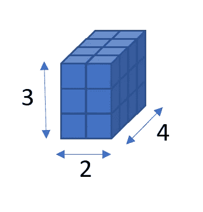
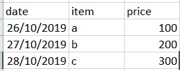
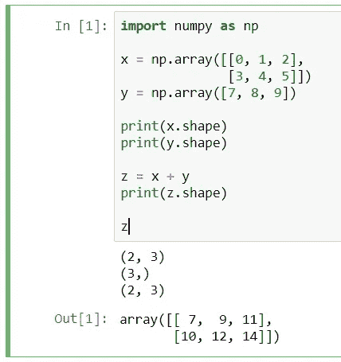
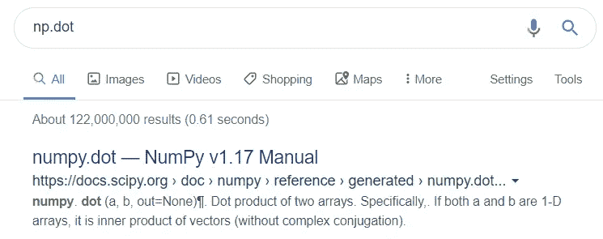
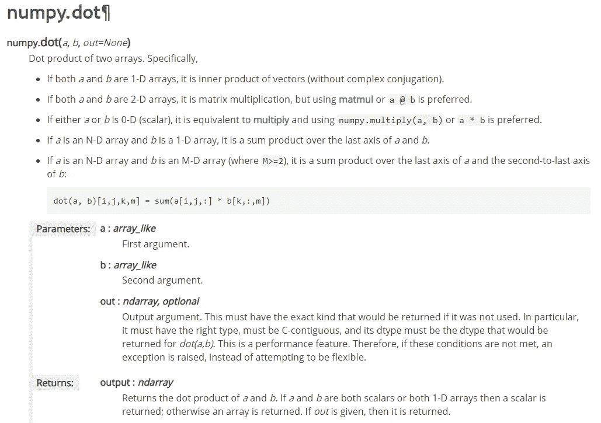
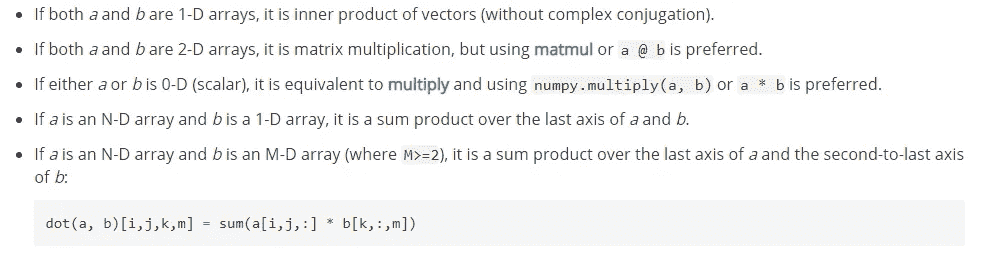
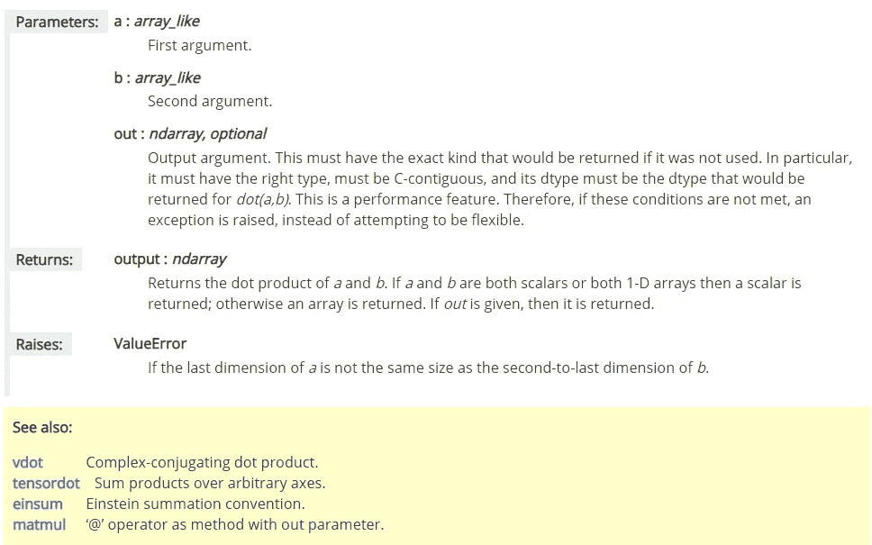
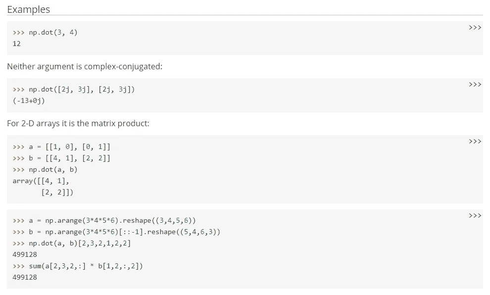

# 如何理解 Numpy 文档

> 原文：<https://towardsdatascience.com/how-to-understand-numpy-documentation-897d5307609b?source=collection_archive---------19----------------------->

当我们开始学习数据科学、机器学习、深度学习或任何将使用 Python 作为编程语言的激动人心的领域时，很可能我们所有人都会使用 **numpy** 。在这篇文章中，我将根据我使用 **numpy** 的经验，编写 numpy 基础知识以及如何正确阅读文档。在阅读我的帖子之前，如果你知道编程语言和 python 的基础知识是很好的。我将使用 python 3.6 作为例子。

# 什么是 Numpy

你可能想知道为什么所有的机器学习教程都将使用 **numpy** ，为什么其他库不用？在我们进入 **numpy 之前，请先让我说一下什么是 Python。**

Python 是一种编程语言，我们可以神奇地导入用 C++编写的库。C++是一种非常快速的语言，代码将被直接编译成机器代码，因此 C++中的库可以比纯 python 编写的库执行得更快。

> Numpy 很快！它是由互联网上许多伟大的程序员维护的。

Numpy 是一个用 C++编写的开源库，它是用 Python 实现科学计算的基础包。安装非常简单，如下所示:

```
pip install numpy
```

它包含许多工具和算法，用于大多数机器学习任务，例如

1.  强大的 N 维数组对象
2.  复杂的(广播)功能
3.  有用的线性代数、傅立叶变换和随机数功能

# numpy 中的常用技术术语

## 形状

> np.random.rand(d0，d1，…，dn)-给定形状中的随机值。
> np.full(shape，fill_value，dtype=None，order='C') —返回给定形状和类型的新数组，用 *fill_value* 填充。

每当描述中提到“形状”，它就意味着数组的大小，或者维度的大小。如果 numpy 数组的“shape”是[4，3，2]，这意味着它是一个 3d 数组，因为形状本身有 3 个值 4，3 和 2。让我们看看下面的图片。



An array with shape of [4, 3, 2]. 4 2d array with [3,2]. For each 2d array, it has 3 rows and 2 columns.

对于形状为 4d 的**数组**，可以认为该数组包含了**多个 3d 数组。**然后你就可以想象使用 3d 数组的数据如上图。

## 数量

当你在描述中看到“标量”时，它只是一个单一的值。比如 x = 1，y = 3.0。所有这些都被认为是“标量”。

## 数据类型

dtype 是数据类型，其中常见的数据类型有图像的 **uint8** (无符号 8 位整数，0–255)，标量的 **int32** (有符号 32 位整数，-对 1)，标量的 **float32** (有符号 32 位浮点)。大多数操作将使用 float32，因为机器学习数据中有很多小数。

可以读作**{有符号/无符号} _ { int/float } _ {位数，8，16，32，…}** 。

## 数组 _like

array_like 通常表示 **numpy 数组或 list** ，可以解释为 array。在库中，它将有助于转换为 numpy 数组。

## 恩达雷

输入必须是 numpy 数组，不能是列表，

# 强大的 N 维数组对象

在机器学习中，我们将永远与**【数据】**打交道。通俗地说，数据就是一个 excel 文件，存储着关于某个事物的信息。(例如公司的销售记录)



Illustration of a simple sales record

上面的例子是一个非常简单的销售记录，它有**日期**、**项目**名称和**价格**。

当我们想要将这个文件加载到 python 中时，我们很可能会使用 **numpy** 或 **pandas** (另一个基于 numpy 的库)来加载文件。加载后会变成**数组形状为(3，3)的 numpy 数组，意思是 3 行数据，3 列信息。**

为了更好地理解什么是 numpy 数组，或 N-d 数组，我们可以想象 1-d 数组是一个向量或一个项目列表，2-d 数组是一个矩阵，3-d 数组可以是矩阵列表。你可以参考上面的图片进行说明。

Numpy 会自动将数据转换成 N-d 数组，这样我们就可以执行更多像加法一样简单和像矩阵乘法一样复杂的运算。

# 复杂的(广播)功能

这可能解释起来有点复杂，当你在 numpy 中变得有经验时，你会理解什么是正确的**广播**。

广播更像是自动数组分配。在 Java 中，我们有 ArrayList，它会自动扩展数组的大小。广播更像是神奇地执行数组扩展来执行一些算术运算，比如加法。



Example on what is broadcasting

在上面的例子中，我们有一个形状为(2，3)的二维数组 **x** 和形状为(3)的一维数组 **y** 。x 是一个有 2 行的数组，每行有 3 列。第一行是[0，1，2]，第二行是[3，4，5]。

执行一个简单的加法运算，就是通过语法将 x 和 y 相加: **z = x + y** ，将结果存储到 **z.** 然而，你可能会想，它们两个具有不同的数组大小，为什么它可以像 **x + y** 一样简单地实现。这就是“广播”的工作方式。可以理解为**对于 x 的每一行，返回 x[i] + y.** 那么输出 **z** 会自动生成，形状为 **x (2，3)** ，存储 x + y 的结果。

# 如何阅读 numpy 文档

好了，终于说到正题了！每当你在 numpy 函数的使用上遇到问题，你不知道如何使用它，你可以用“np.dot”这样的关键字进行谷歌搜索。



how to search numpy function

通常第一个会是你想要的，进入页面会像下面这样



numpy.dot documentation page

当我第一次阅读文档时，我发现它很难，因为我不知道从哪里看，文本似乎复杂而混乱。但是熟悉 numpy 之后，我只搜索我想知道的东西，也就是输入输出。


numpy.dot documentation page highlight

首先，这是你想要的功能吗？例如，您想要对两个二维数组(也称为矩阵)执行点积，其中 C = AB。现在你看文档的第一行，它描述的是你想要的吗？嗯，“两个数组的点积”似乎是正确的。



numpy.dot documentation page more description

对于初学者来说，这似乎是一篇很长的文章。有时我会跳过这一部分，因为我觉得它对我没有帮助😂。在你熟悉 numpy 之后，我建议你阅读一下描述，也许会帮助你进一步理解它是如何工作的。但是，我会一直关注**参数**和**样本输入和输出。**



numpy.dot documentation parameter

每当我们看到 **array_like** ，就意味着函数输入是**一个 numpy 数组**，从点积的意思来看，你应该知道输入是一维或者二维数组(虽然也可以接受 N-d (N > 2)。几乎大多数 numpy 操作都有 **out** 作为参数，这是为了内存引用，可能是为了内存高效的程序，但是，我建议我们总是这样调用函数: **out = np.dot(a，b)** 而不是 **np.dot(a，b，out)** 。它与一些编程语言概念有关，我总是使用第一种方式，即 **out = np.dot(a，b)** 。

大多数 numpy 操作都返回一个 numpy 数组。只有一些操作会返回其他内容，比如元组或索引。



numpy.dot documentation output

我总是看例子来找出如何使用这个函数，但是有时你可能会弄不清看哪个。

在这种情况下，您应该尝试运行该示例，或者将任何值放入该示例中，以测试该函数是否能输出您期望的结果。

# TLDR；

1.  阅读描述的前几行，它与你想要的匹配。
2.  您可能会在文档页面中找到很多信息，只搜索参数。
3.  看例子。
4.  不断地试错。

**让我知道你在阅读 numpy 文档时遇到了什么问题**，这样我就可以继续撰写阅读 numpy 文档的好教程(或者任何常见的库文档，例如 pytorch)。