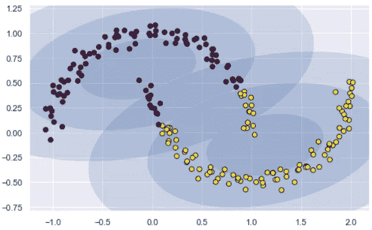

# 如何使用聚类技术生成合成数据

> 原文：<https://towardsdatascience.com/how-to-use-a-clustering-technique-for-synthetic-data-generation-7c84b6b678ea?source=collection_archive---------13----------------------->

## 我们展示了如何使用高斯混合模型(GMM)，一个强大的聚类算法，合成数据生成。

# 聚类和 k-均值

[对于利用数据科学的商业或科学企业来说，聚类是机器学习管道](/the-5-clustering-algorithms-data-scientists-need-to-know-a36d136ef68)的重要组成部分。顾名思义，它有助于识别数据块中密切相关(通过某种距离度量)的数据点的集合，否则很难理解。

[k-means 算法](https://en.wikipedia.org/wiki/K-means_clustering)在未标记的多维数据集中搜索预定数量的聚类。它使用最佳聚类的简单概念来实现这一点:

*   *“聚类中心”*是属于该聚类的所有点的算术平均值。
*   每个点离自己的聚类中心比离其他聚类中心更近。

它通过从随机分配聚类中心开始，然后分阶段迭代来完成聚类，其中，在每个阶段，它为每个聚类中心分配特定的点，然后根据这些点的算术平均值来重新计算聚类中心的位置。这里有一个很好的视频演示了这个过程。

# k 均值和高斯混合模型(GMM)的局限性

k-means 算法的一个关键优势是其简单性，这使得它成为快速处理大规模数据的流行选择。但是这种简单性也导致了一些关键的实际挑战。

特别是，k-means 的**非概率特性及其采用简单的径向距离度量来分配集群成员资格，导致许多现实情况下性能不佳。**

例如，想象以下数据点。在这里，它们由它们的标签来着色，但是在无监督的机器学习设置中，我们不会有类别标签。

如果我们运行一个简单的 k-means，我们很可能会得到下面的最终聚类排列，

两个中间的聚类看起来有重叠，即**我们可能对重叠区域中点的聚类分配没有完全的信心**。不幸的是， **k-means 模型没有对聚类分配的概率或不确定性**的内在度量。

> k-means 从设计上来说是非概率的。

此外，对于 k-means，当数据分布的形状是圆形时，它工作得最好。这是因为 k-means 没有考虑长方形或椭圆形簇的内置方法。因此，举例来说，如果我们获取相同的数据，并通过向一个方向拉伸来转换它，则聚类分配会变得次优。

k-means 不够灵活，无法解释这种“*拉长的数据*，并试图**将数据强行拟合到四个圆形聚类中，**这些聚类并不代表数据点的真实形状。

> k-means 在“非圆形”数据(即长方形或椭圆形聚类)上表现不佳

**G** 澳大利亚 **M** ixture **M** 模型(GMMs)，可以看作是 k-means 背后思想的延伸。GMM 试图将给定数据建模为多个多维高斯概率分布的混合物。

它基于 [**期望最大化(E-M)算法**](/inference-using-em-algorithm-d71cccb647bc) 工作，并从本质上处理生成数据的概率性质。

在最简单的情况下，GMM 可以像 k-means 一样用于寻找聚类。然而，它对于非圆形数据斑点执行得完美无缺，因为它可以用参数(std。dev 和 mean)适合于拟合数据的特定形状。

在本文中可以找到对这些模型的全面总结，

 [## 高斯混合模型解释

### 在机器学习领域，我们可以区分两个主要领域:监督学习和非监督学习。主要的…

towardsdatascience.com](/gaussian-mixture-models-explained-6986aaf5a95) 

# 作为生成模型的 GMM

GMM 最流行的分类是聚类算法。然而，从根本上说，它是一种用于 [**密度估计**](https://en.wikipedia.org/wiki/Density_estimation) 的算法，属于 [**生成模型**](https://stats.stackexchange.com/questions/12421/generative-vs-discriminative) 家族。

这意味着，当 GMM 适合某些数据时，生成的模型不仅仅是一组固定聚类的描述，而是描述数据真实分布的生成概率模型。

> GMM 是一种生成式建模技术，可以生成接近拟合数据分布的合成数据。

这里有一个关于生成模型的很好的介绍，

 [## 生成模型与判别模型

### 我想以一个故事开始这篇文章。

medium.com](https://medium.com/@mlengineer/generative-and-discriminative-models-af5637a66a3) 

# 使用 GMM 的合成数据生成

假设我们有一些数据点的月牙形聚类排列。这是一个流行的玩具例子，经常用来展示 k 均值的局限性。一种称为谱聚类的特殊聚类方法最适合这种类型的数据。

***有多少个自然集群？***

显然是两个。如果我们选择两个集群运行 GMM，我们将得到类似这样的结果。

印象不深，是吗？对于这种特殊形式的数据，它显示了与 k-means 相同的限制。

但是假设我们对聚类不感兴趣，但是**基于给定的数据样本**生成更多的合成数据。

为此，我们需要大量的高斯星团。看看当我们选择 4、8 和 16 个集群运行相同的 GMM 算法时会发生什么。

这些聚类似乎紧密地跟随数据的形状。GMM 的伟大之处在于我们有一种`sample`方法。这意味着它已经学会了数据的分布，而不仅仅是对数据进行聚类，并且可以从分布中生成任意数量的样本。

> GMM 的标准算法实现有一个生成数据的`sampling`方法。k-means 没有这样的方法。

看看当我在这些模型(4、8 和 16 集群模型)上调用`predict`方法时会发生什么。

**它能够生成新的数据，紧密跟随它所聚类的原始数据的形状！**

很明显，4 簇模型不太擅长模拟原始数据，但是 16 簇模型非常接近原始数据，不是吗？

当然，**这种能力并不局限于任何特定的形状或二维空间，而是通常扩展到多变量情况**。下面是一个 4 簇数据集的例子。

# 警告和含义

就像任何生成技术一样，这容易受到过度拟合和泛化能力差的影响。您可以无限制地增加高斯分量的数量，但这将开始适应噪声，而不是代表真实的分布。

一般来说，必须对高斯分量、初始化、容差和迭代次数的选择进行仔细的实验。

> 增加高斯分量的数量，直到开始获得足够接近的原始数据集表示，但不再增加。遵守[奥卡姆剃刀](https://www.teradata.com/Blogs/Occam%E2%80%99s-razor-and-machine-learning)的原则，并尝试**在足以满足您的应用**的最小复杂度处停止。

这种技术的一个潜在应用是直接用于商业分析和市场细分案例。通常，市场调查产生的数据点数量有限。如果您的内部聚类算法或其他数据处理技术需要更多的数据点，该怎么办？这是一种接近模拟真实数据集分布并为进一步处理生成相似聚类的潜在方法。

> 业务分析可以使用这种合成数据生成技术从有限的真实数据样本中创建人工聚类。

关于这个[的练习 Jupyter 笔记本可以在这里](https://github.com/tirthajyoti/Machine-Learning-with-Python/blob/master/Clustering-Dimensionality-Reduction/k-means_clustering_GMM.ipynb)找到。

如果您有任何问题或想法要分享，请通过[**tirthajyoti【AT】Gmail . com**](mailto:tirthajyoti@gmail.com)联系作者。此外，您可以查看作者的 [**GitHub**](https://github.com/tirthajyoti?tab=repositories) **资源库**，了解 Python、R 和机器学习资源中其他有趣的代码片段。如果你像我一样对机器学习/数据科学充满热情，请随时[在 LinkedIn 上添加我](https://www.linkedin.com/in/tirthajyoti-sarkar-2127aa7/)或[在 Twitter 上关注我。](https://twitter.com/tirthajyotiS)

 [## Tirthajyoti Sarkar - Sr .首席工程师-半导体、人工智能、机器学习- ON…

### 通过写作使数据科学/ML 概念易于理解:https://medium.com/@tirthajyoti 开源和有趣…

www.linkedin.com](https://www.linkedin.com/in/tirthajyoti-sarkar-2127aa7/)