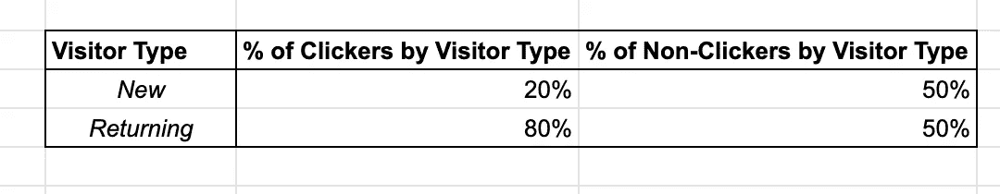

# 如何在日常分析工作中使用因果推理——第 1 部分，共 2 部分

> 原文：<https://towardsdatascience.com/how-to-use-causal-inference-in-day-to-day-analytical-work-part-1-of-2-b5efbdbf8ab0?source=collection_archive---------10----------------------->

商业世界中的分析师和数据科学家充斥着大量的观察数据。这是在业务运营过程中产生的数据。这与[的实验数据](https://www.iwh.on.ca/what-researchers-mean-by/observational-vs-experimental-studies)形成对比，在实验数据中，受试者被随机分配到不同的治疗组，结果被记录和分析(想想[随机临床试验](https://en.wikipedia.org/wiki/Randomized_controlled_trial)或 [AB 测试](https://en.wikipedia.org/wiki/A/B_testing))。

实验数据可能很昂贵，或者在某些情况下，不可能/不道德地收集(例如，将人们分为吸烟组和非吸烟组)。另一方面，观察数据非常便宜，因为它们是商业运作的副产品。

鉴于大量廉价的观测数据,“询问”这些数据是日常分析工作的主要内容也就不足为奇了。最常见的询问技巧之一是**在重要的指标上比较各组“主题”——客户、员工、产品等等。**

> 使用“50 美元以上订单免运费”优惠券的购物者比没有使用优惠券的购物者多花了 14%。
> 
> 商店前面的产品比商店后面的产品多被购买 12%
> 
> 从多个渠道购买的客户比从单一渠道购买的客户每年多花费 30%。
> 
> 西部地区的销售代表比东部地区的销售代表的人均预订量高出 9%。

Source: [http://bit.ly/2VtX2FV](http://bit.ly/2VtX2FV)

比较非常有用，可以让我们[深入了解系统(即业务、组织、客户群)*实际上*是如何工作的](/i-have-data-i-need-insights-where-do-i-start-7ddc935ab365)。

而这些见解反过来又建议我们可以做些什么——干预*——来改善我们关心的结果。*

> 从多个渠道购买的客户比从单一渠道购买的客户每年多花费 30%。

30%已经很多了！如果我们能吸引单一渠道的购物者下次从不同的渠道购买(也许是给他们一张只适用于那个新渠道的优惠券)，也许他们第二年会多花 30%的钱？

> 商店前面的产品比商店后面的产品多被购买 12%。

哇！所以如果我们把销量弱的产品从店铺后面移到前面，也许他们的销量会增加 12%？

如果计算原始比较的数据是实验性的*(例如，如果一个随机的产品子集被分配到商店的前面，我们将它们的性能与后面的进行比较)，这些干预可能会产生预期的效果。*

*但是如果我们的数据是*观察性的*——零售商出于商业原因选择了一些产品放在商店的前面；给定一组渠道，一些客户自己选择使用单个渠道，其他人使用多个渠道—您必须小心。*

*为什么？*

***因为从观测数据计算出来的比较*可能不真实。它们可能并不能反映你的业务是如何运作的，按照它们行事可能会给你带来麻烦。****

*在[因果推理](https://en.wikipedia.org/wiki/Causal_inference)领域中研究了如何从观察数据中回答‘干预性’问题的一般问题。有一些有用的文章([示例](https://medium.com/causal-data-science/causal-data-science-721ed63a4027)、[示例](https://medium.com/causal-data-science/causal-data-science-721ed63a4027))、书籍([因果推理](https://www.hsph.harvard.edu/miguel-hernan/causal-inference-book/)、[为什么的书](https://www.amazon.com/Book-Why-Science-Cause-Effect/dp/046509760X/ref=tmm_hrd_swatch_0))和课程([示例](https://www.edx.org/course/causal-diagrams-draw-your-assumptions-before-your-conclusions))教授关键概念，如因果关系与相关性、混杂、选择偏差、因果图、反向因果关系等。*

*虽然这种知识有趣且有价值，但还是有很多的。套用[查理·芒格](https://en.wikipedia.org/wiki/Charlie_Munger)“承担大部分运费”——我们可以在周一早上*例行应用**来测试一个暗示性的比较是否真实，这里面有什么基本的想法吗？**

**是的。当一个比较误导你的时候， ***混淆*** *往往就是这个原因(我们很快就会看到这样的例子)。***

**[*混杂*](https://en.wikipedia.org/wiki/Confounding) 发生在什么时候**

*   **受试者根据**非随机**因素**和**自行选择分组或被分配分组**
*   **这些因素影响着被比较的对象。**

**这些因素被称为*混杂因素*。把混杂因素想象成 ***共因*** 共因**既有**受试者如何在群体中结束**又有**群体在利益衡量标准中的表现。**

**我们来看几个例子。**

*   ***对比*:经常冥想的人比不冥想的人患心脏病的几率低 X%。*锻炼和饮食可能造成的混淆*:锻炼和遵循更健康饮食的人= >更可能在冥想组**和**更不容易患心脏病(*来源*:改编自[http://bit.ly/2TQjzus](http://bit.ly/2TQjzus))**
*   ***对比*:单身人士比已婚人士在脸书上活跃的可能性高 X%。*因年龄*而产生的可能混杂因素:更年轻的人= >更有可能属于单一群体**而**更有可能活跃在脸书上(*来源*:改编自[分类数据分析](https://www.amazon.com/Categorical-Data-Analysis-Alan-Agresti/dp/0470463635/ref=sr_1_1?crid=1W41T1QSU1DXN&keywords=categorical+data+analysis&qid=1553780839&s=books&sprefix=categorical%2Caps%2C189&sr=1-1)，第 2.1.8 章，第 43 页)。**
*   ***对比*:一家医院想要更换超声波设备，进行了一项测试，发现新设备比旧设备多花了 X%的时间。*因专业水平*而可能产生的混淆:新技术人员= >更有可能尝试新装置**和**可能需要更长时间在任何装置上做超声波检查(*来源*:改编自[http://bit.ly/2V0yfsZ](http://bit.ly/2V0yfsZ))。**

**学习混杂因素就像学习一个新单词。一旦你意识到他们的存在，你会发现他们无处不在。**

**对于混杂因素，我们能做些什么？**

**我们需要*为他们控制*。有大量关于如何做到这一点的文献([文章](https://linkinghub.elsevier.com/retrieve/pii/S0085253815529748)、[文章](https://www.ncbi.nlm.nih.gov/pmc/articles/PMC4017459/)、[文章](https://oem.bmj.com/content/62/7/500))，许多领域的研究人员——例如生物统计学和流行病学——已经这样做了几十年。当你在报纸上读到一篇文章“X 与 Y 的高风险有关，*在控制了*年龄、性别、身体质量指数、血压和身体活动水平后”，混杂因素正在得到控制。**

**控制混杂因素的一种简单且广泛使用的方法是*分层。***

*   **我们根据混杂值将受试者分组，并计算每个组的比较。**
*   ***根据定义，在每个时段内，混杂因素的值不会改变。* ***因此，该时段内结果指标的任何变化都不能归因于混杂因素的变化。*** *这就是为什么分层行得通的本质。***
*   **然后，我们通过计算每个桶的数字的加权平均值来计算新的总体比较。我们在这里使用的权重是关键，我们将在下面详细检查它们。**
*   **如果最初的比较和新的比较彼此非常不同，那么混淆就起作用了，我们不应该相信最初的比较。**

**让我们把这些想法汇总成一个清单，当你看到一个提示性的比较时使用。**

> ***1。首先，确认基础数据实际上是观察性的，也就是说，受试者是自我选择还是以某种非随机的方式结束分组？如果数据是实验性的，就不需要这个清单:-)***
> 
> ***2。想到潜在的* ***混杂因素*** *那影响* **既** *(a)哪个主体最终在哪个群体**(b)利益衡量标准？如果受试者自己选择分组，思考是什么因素导致他们有意识或无意识地选择一组而不是另一组。***
> 
> ***3。如果你发现的任何一个混杂因素都有数据，就按照上面的描述进行分层分析。***

**让我们将清单应用到几个例子中。**

**几个月前，您在您的电子商务网站的一个部分介绍了产品推荐，并想知道它是否“有效”。你可以做的一个最简单的比较就是比较点击了一个推荐的访问者和没有点击的访问者的花费。**

**这是你发现的。**

> **点击产品推荐的网站访客比没有点击的访客多花了 18%的钱。**

****

**这种比较应该相信吗？**

**如果你这样做了，你可以决定在网站的所有部分显示推荐，以增加购物者点击推荐的机会。对于这样做的购物者，他们可能会平均多花 18%的钱？**

**让我们应用清单。**

1.  ****观测数据？**是的。虽然 A/B 测试在电子商务中无处不在，并且由于其使用了随机化，是可靠比较的来源，但像上面这样的比较不太可能来自随机测试，因为你不能*强迫*访问者点击产品推荐。*参观者必须自选*。**
2.  **潜在的混杂因素。显而易见的是来访者的既往病史。如果他们是一个忠实的客户，他们可能会经常访问网站，更多地浏览网站，点击产品推荐，在购买时花费更多等等。因此，忠诚度可以影响他们点击推荐的倾向和他们的花费。**
3.  ****分层分析。****

****步骤 1:定义混杂变量桶**。如果我们认为忠诚度是一个混淆因素，也许我们可以做的最简单的事情就是定义两个桶，新访客和回访访客，作为访客忠诚度的近似衡量标准。**

****第二步:计算每个混杂因素的数量。**我们分别计算新访客和回头客的人均消费数字。这将扩展原始表…**

****

**…到这**

****

**等一下！点击产品推荐对任何一种访问者类型都没有**影响——0.70 美元保持为 0.70 美元，1.30 美元保持为 1.30 美元——然而，总体影响是 18%！这怎么可能？****

**为了深入了解这是如何发生的，让我们从桶级别数字开始，自下而上*计算总数——1.18 美元和 1.00 美元。***

**我们将首先计算样本中新访客和回头客的总体百分比:**

****

**然后，我们计算每种访问者类型点击推荐的百分比:**

****

**虽然 83%的回头客会点击产品推荐，但只有 55%的新访客会这样做。**

**有了这两个表，我们可以计算点击者和非点击者组中新的和返回的*的百分比(即在每一列中)。例如，新访问者的点击者百分比= 27% * 55% / (27% * 55% + 73% * 83%) = 20%，返回的点击者百分比为 100% — 20% = 80%。完整的表格是:***

****

**现在，总体数字只是新的和返回的支出数字的平均值，加上上面计算的数字…**

> **$0.70 * 20% + $1.30 * 80% = $1.18**
> 
> **$0.70 * 50% + $1.30 * 50% = $1.00**

**从图像上看，**

****

**…导致**

****

**我们现在可以看到它的危害有多严重。**

****每组(即列)中新老员工的比例*因组而异*。****

****

**如果组合不完全相同，可能会出现奇怪的事情——例如，*的总人数可能会减少，而* ***的每一个*** *阶层人数都会增加！* ( [辛普森悖论](https://en.wikipedia.org/wiki/Simpson%27s_paradox))。**

**为什么两列中的混合物不一样？**

**因为回头客比新访客更有可能点击推荐。**

**需要注意的是，这种现象与你的数据样本中新访客和回头客的组合无关。关键因素是点击推荐的新访客的百分比与点击推荐的回头客的百分比。**

****

***如果这两个百分比相同，混合将是相同的。如果这两个百分比不同，混合将是不同的。***

**(顺便说一句，这就是随机分配如何防止混淆。如果我们以某种方式**随机**将访问者分配到“点击”和“未点击”组，点击推荐的新访问者的百分比将与点击推荐的回访访问者的百分比相同。因此,“点击”组和“未点击”组中的新信息和返回信息的混合应该是相同的，防止了我们上面看到的失真)**

****第三步:计算调整后的总比较数**。**

**我们通过在两列中使用**相同的权重来“取消发现”。**哪些砝码？新客户和回头客的百分比。**

**正如我们之前看到的，新访客和回头客的总体比例分别为 27%和 73% …**

****

**…我们将它们作为权重来计算调整后的比较。**

****

**你现在可以看到，每种游客类型的 0%的消费差异也反映在调整后的总人数中。差异已经消失。**

**混杂因素扭曲了这些权重，因此每一列的权重都不同。通过对每根柱子使用相同的重量，我们消除了损害。**

**概括一下:使用数据中混杂组的受试者组合作为两组的权重，计算组级数字的加权平均值，以得出调整后的总体数字。**

****第四步:比较比较:-)****

****

**由于原始比较和调整后的比较大相径庭，因此原始比较不可信。**

**(旁白:评估产品推荐效果的一个更好的方法是将网站访问者随机分配到 A 组和 B 组*，A 组的推荐*在*而 B 组的*在*关闭，并测量这两组在特定时间段内的每次点击收入、转换率等)。***

**警告:这种“控制混杂因素”的方法远非万无一失。**

*   **可能还有其他你没有想到的混淆因素。关于如何识别一整套混杂因素(例如[后门标准](http://bayes.cs.ucla.edu/BOOK-2K/ch3-3.pdf))，有一个高度发展的理论，我鼓励你去阅读。我的希望是，这里提倡的尝试非正式地(基于你对业务的了解)识别混杂因素的方法足以让你开始。**
*   **你可能想到了其他混杂因素，但是你没有关于它们的数据，所以你无法控制它们。**
*   **你发现的混杂因素并不是真正的混杂因素。**
*   **你的控制方法不够好，例如，在上面的例子中，我们将游客分为两个桶，但也许这些桶太大了，以至于混淆在每个桶的内继续*(在文献中称为*剩余混淆*)。***
*   *另一方面，如果您创建了太多的存储桶，这些存储桶中的一些可能有太少的主题，这将导致度量的不可靠的估计。*
*   *…*

*尽管有这些警告，当你看到一个有趣的比较，并想付诸行动时，还是值得使用这个清单。*

*这可能不会让你成为工作中的摇滚明星，但至少在某些时候会让你避免得出错误的结论。*

*在[第 2 部分](/how-to-use-causal-inference-in-day-to-day-analytical-work-part-2-of-2-1824e7024cd2?source=email-28748480e8bd-1592500349168-layerCake.autoLayerCakeWriterNotification-------------------------8dc0bb9a_a055_436a_b2c5_2d00088caef1&sk=f8f285fb652956d252d26f88129c35a4)中，我们看了更多的例子，并解决了混杂因素太多导致分层变得混乱的情况。*

*(如果您觉得这篇文章有帮助，您可能会发现这些感兴趣的内容)*