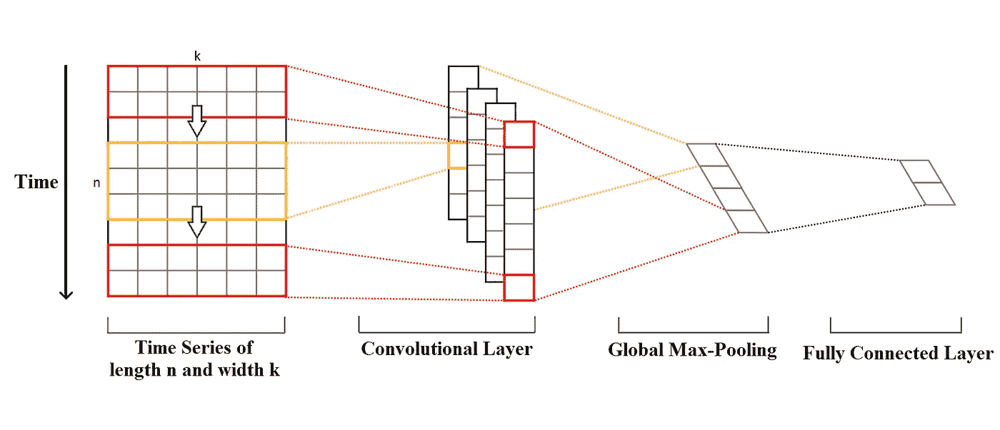
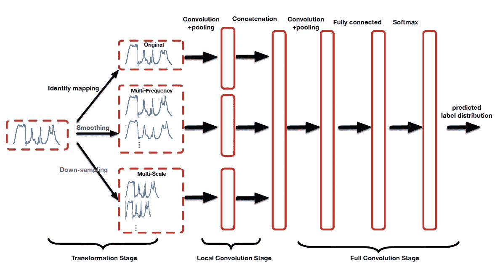

# 如何使用卷积神经网络进行时间序列分类

> 原文：<https://towardsdatascience.com/how-to-use-convolutional-neural-networks-for-time-series-classification-56b1b0a07a57?source=collection_archive---------1----------------------->

## 一个温和的介绍，最先进的模型概述，和一个动手的例子。


Photo by [Christin Hume](https://unsplash.com/@christinhumephoto) on [Unsplash](https://unsplash.com/photos/hBuwVLcYTnA).

# 介绍

大量数据以时间序列的形式存储:股票指数、气候测量、医学测试等。时间序列分类有着广泛的应用:从股票市场异常的识别到心脑疾病的自动检测。

时间序列分类有多种方法。大多数方法包括两个主要阶段:在第一阶段，你要么使用某种算法来测量你想要分类的时间序列之间的差异(动态时间弯曲是一种众所周知的方法)，要么使用你可以使用的任何工具(简单的统计学，先进的数学方法等)。)将您的时间序列表示为特征向量。在第二阶段，你使用某种算法对你的数据进行分类。它可以是从 k-最近邻和 SVM 到深度神经网络模型的任何东西。但是有一点将这些方法统一起来:它们都需要某种特征工程作为分类执行前的一个单独阶段。

幸运的是，有些模型不仅将特征工程整合到一个框架中，还消除了任何手动操作的需要:它们能够自动提取特征并创建时间序列的信息表示。这些模型是递归和卷积神经网络(CNN)。

研究表明，与其他方法相比，使用 CNN 进行时间序列分类有几个重要的优势。它们是高度抗噪声的模型，并且它们能够提取与时间无关的非常有用的深层特征。在本文中，我们将详细研究一维卷积如何对时间序列进行运算。然后，我将概述一个由圣路易斯华盛顿大学的研究人员提出的更复杂的模型。最后，我们将查看一个简化的多尺度 CNN 代码示例。

# 时间序列的一维卷积

想象一个长度为 *n* 宽度为 *k* 的时间序列。长度是时间步长的数量，宽度是多元时间序列中变量的数量。例如，对于脑电图，它是通道的数量(人头部的节点)，对于天气时间序列，它可以是温度、压力、湿度等变量。

卷积核始终具有与时间序列相同的宽度，而它们的长度可以变化。通过这种方式，内核从一个时间序列的起点向终点沿一个方向移动，执行卷积。它不会像通常的 2-D 卷积应用于图像时那样向左或向右移动。



1-D Convolution for Time Series. Source: [2] (modified).

核的元素乘以它们在给定点覆盖的时间序列的相应元素。然后将乘法的结果加在一起，并将非线性激活函数应用于该值。结果值成为新的“过滤”单变量时间序列的元素，然后内核沿着时间序列向前移动以产生下一个值。新的“过滤”时间序列的数量与卷积核的数量相同。根据核的长度，初始时间序列的不同方面、属性、“特征”在每个新的过滤序列中被捕获。

下一步是对每个过滤的时间序列向量应用全局最大池:从每个向量中取最大值。从这些值形成一个新的向量，并且这个最大值的向量是最终的特征向量，其可以被用作常规全连接层的输入。整个过程如上图所示。

# 让我们把它带到另一个水平

记住这个简单的例子，让我们检查用于时间序列分类的多尺度卷积神经网络的模型[1]。

该模型的多重可伸缩性在于其架构:在第一卷积层中，卷积在 3 个并行的独立分支上执行。每个分支从数据中提取不同性质的特征，以不同的时间和频率尺度进行操作。

这个网络的框架由 3 个连续的阶段组成:变换、局部卷积和全卷积。



Multi-Scale Convolutional Neural Network Architecture [1].

## 转换

在这一阶段，不同的变换应用于 3 个独立分支上的原始时间序列。第一个分支转换是身份映射，这意味着原始时间序列保持不变。

第二个分支转换是用不同窗口大小的移动平均值平滑原始时间序列。通过这种方式，创建了几个具有不同平滑度的新时间序列。这背后的想法是，每个新的时间序列都整合了来自原始数据的不同频率的信息。

最后，第三个分支变换是用不同的下采样系数对原始时间序列进行下采样。系数越小，新的时间序列就越详细，因此，它会在更小的时间范围内整合有关时间序列特征的信息。系数较大的下采样会产生不太详细的新时间序列，这些序列捕捉并强调原始数据在较大时间尺度上表现出来的特征。

## 局部卷积

在这个阶段，我们前面讨论的具有不同滤波器大小的 1-D 卷积被应用于时间序列。每个卷积层之后是最大池层。在前面更简单的例子中，使用了全局最大池。这里，最大池不是全局的，但池内核的大小仍然非常大，比您在处理图像数据时习惯的大小要大得多。更具体地说，池内核大小由公式 *n/p* 确定，其中 *n* 是时间序列的长度，而 *p* 是池因子，通常在值 *{2，3，5}* 之间选择。这个阶段称为局部卷积，因为每个分支都是独立处理的。

## 全卷积

在这一级，来自所有 3 个分支的局部卷积级的所有输出被连接。然后再增加几个卷积层和最大池层。在所有的变换和卷积之后，您只剩下一个具有深度、复杂特征的平面向量，这些特征在广泛的频率和时间尺度域中捕获关于原始时间序列的信息。然后，该向量被用作最后一层上具有 Softmax 函数的完全连接层的输入。

# Keras 示例

```
from keras.layers import Conv1D, Dense, Dropout, Input, Concatenate, GlobalMaxPooling1D
from keras.models import Model#this base model is one branch of the main model
#it takes a time series as an input, performs 1-D convolution, and returns it as an output ready for concatenationdef get_base_model(input_len, fsize):
#the input is a time series of length n and width 19
input_seq = Input(shape=(input_len, 19))
#choose the number of convolution filters
nb_filters = 10
#1-D convolution and global max-pooling
convolved = Conv1D(nb_filters, fsize, padding="same", activation="tanh")(input_seq)
processed = GlobalMaxPooling1D()(convolved)
#dense layer with dropout regularization
compressed = Dense(50, activation="tanh")(processed)
compressed = Dropout(0.3)(compressed)
model = Model(inputs=input_seq, outputs=compressed)
return model#this is the main model
#it takes the original time series and its down-sampled versions as an input, and returns the result of classification as an outputdef main_model(inputs_lens = [512, 1024, 3480], fsizes = [8,16,24]):
#the inputs to the branches are the original time series, and its down-sampled versions
input_smallseq = Input(shape=(inputs_lens[0], 19))
input_medseq = Input(shape=(inputs_lens[1] , 19))
input_origseq = Input(shape=(inputs_lens[2], 19))#the more down-sampled the time series, the shorter the corresponding filter
base_net_small = get_base_model(inputs_lens[0], fsizes[0])
base_net_med = get_base_model(inputs_lens[1], fsizes[1])
base_net_original = get_base_model(inputs_lens[2], fsizes[2])embedding_small = base_net_small(input_smallseq)
embedding_med = base_net_med(input_medseq)
embedding_original = base_net_original(input_origseq)#concatenate all the outputs
merged = Concatenate()([embedding_small, embedding_med, embedding_original])
out = Dense(1, activation='sigmoid')(merged)model = Model(inputs=[input_smallseq, input_medseq, input_origseq], outputs=out)
return model
```

该模型是多尺度卷积神经网络的更简单版本。

它将原始时间序列及其 2 个下采样版本(中等长度和小长度)作为输入。模型的第一个分支处理长度为 3480、宽度为 19 的原始时间序列。相应的卷积滤波器长度是 24。第二个分支处理时间序列的中等长度(1024 时间步长)下采样版本，这里使用的滤波器长度为 16。第三个分支处理时间序列的最短版本(512 个时间步长)，滤波器长度为 8。这样，每个分支提取不同时间尺度的特征。

在卷积和全局最大池层之后，添加了丢弃正则化，并且所有输出被连接。最后一个全连通层返回分类结果。

# 结论

在这篇文章中，我试图解释深度卷积神经网络如何用于时间序列分类。值得一提的是，提出的方法并不是唯一存在的方法。有多种方法可以将时间序列以图像的形式呈现出来(例如，使用它们的光谱图)，可以对其应用常规的二维卷积。

非常感谢您阅读这篇文章。我希望它对你有帮助，我真的很感谢你的反馈。

**参考文献:**

[1]崔，陈，陈.多尺度卷积神经网络用于时间序列分类(2016)，。

[2] Y. Kim，卷积神经网络用于句子分类(2014)，[https://arxiv.org/abs/1408.5882](https://arxiv.org/abs/1408.5882)。