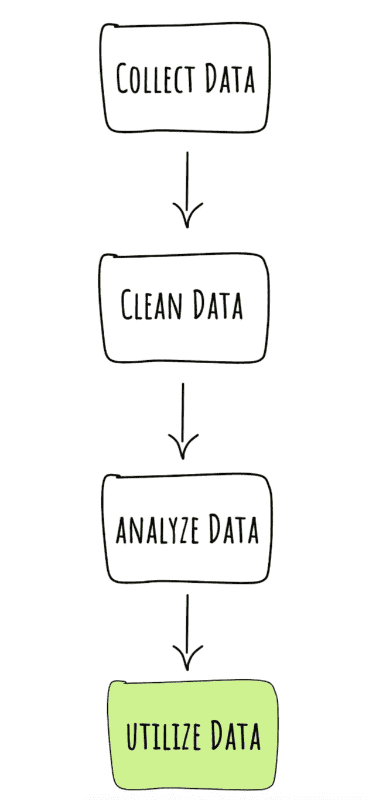
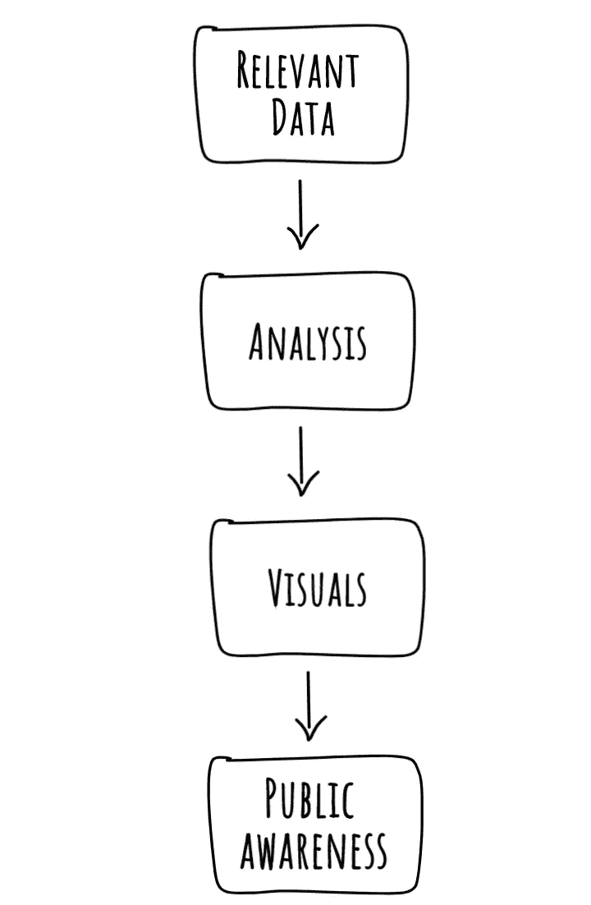
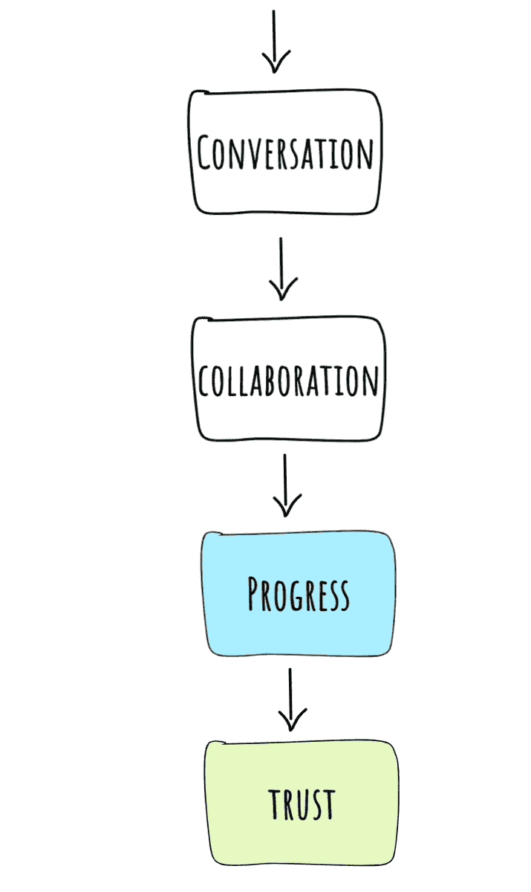
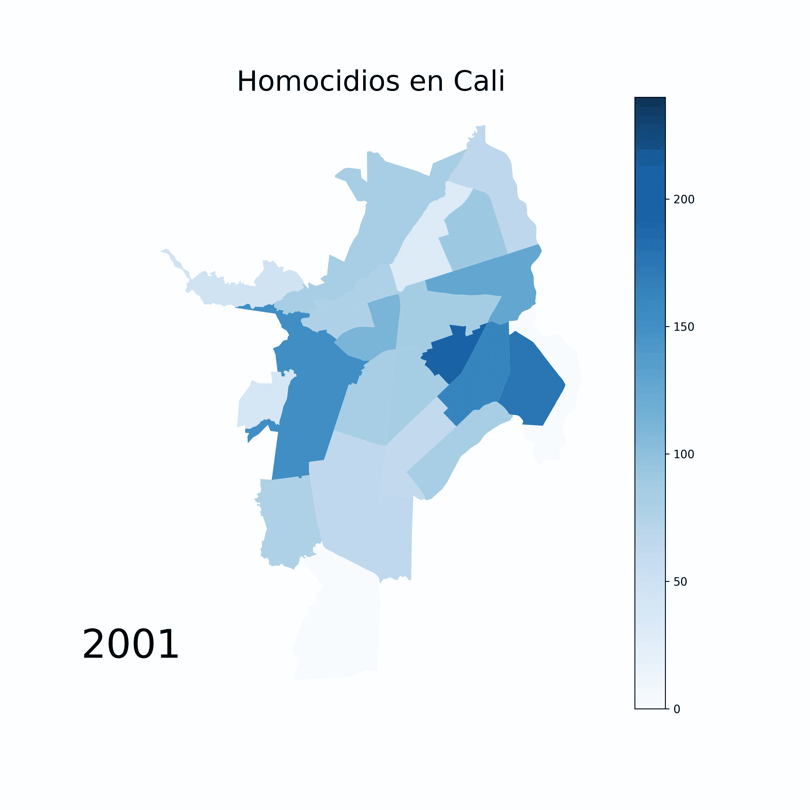
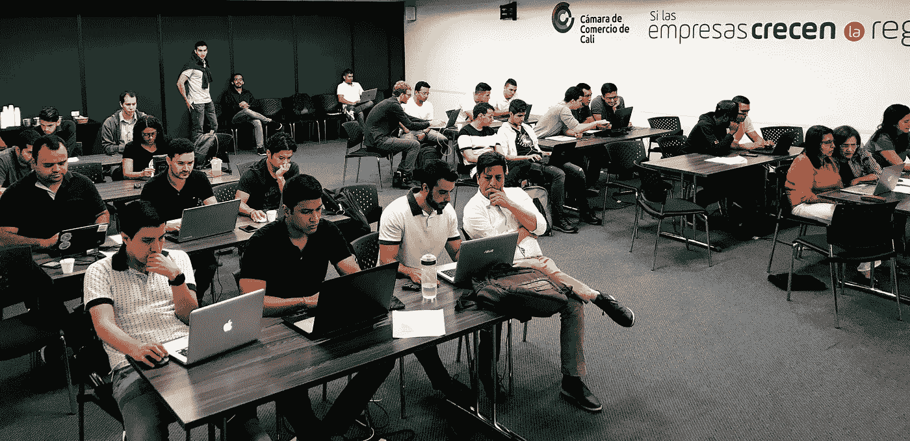

# 如何利用数据科学产生社会影响

> 原文：<https://towardsdatascience.com/how-to-use-data-science-for-social-impact-e9b272b1a4b3?source=collection_archive---------19----------------------->

Photo by [Arjunsyah](https://unsplash.com/@arjunsyah_?utm_source=medium&utm_medium=referral) on [Unsplash](https://unsplash.com?utm_source=medium&utm_medium=referral)

## 透明度腐败协作信任

数据科学是一个真正的跨学科领域。

数学家、统计学家、计算机科学家、社会科学家、数据库管理员、数据工程师、图形设计师、用户界面专家、记者、说书人、研究人员和企业管理人员都参与了这个过程。

随着机器学习和人工智能的不断发展，哲学家和伦理学家也有望被纳入这一过程。

**数据科学强大**。如果使用正确，它将授予对以下内容的访问权限:

1.  *客观理解*世界的能力。
2.  T4 利用这种理解来创造进步的能力。

故事是这样的:

Figure 1

*利用数据*以多种形式出现。网飞利用数据科学向顾客推荐电影和电视节目。脸书利用数据科学来制作有针对性的广告。谷歌使用数据科学来优化搜索结果。亚马逊使用数据科学与 Alexa 进行对话。微软利用数据科学创造虚拟现实。

但是等等，还有更多。

Kaggle 正在使用数据科学来预测贫困水平，以确定哪里最需要社会福利援助。Code for Africa 正在使用数据科学来创建一个工具，帮助肯尼亚公民出现在投票箱前[了解情况并准备投票](https://github.com/CodeForAfrica/GotToVote)。DataKind 正在使用数据科学来创造更多简化的摆脱无家可归的途径。

这两组数据科学用户之间存在明显的差异。前者利用数据获得*收入*。后者利用数据进行*社会影响*。

我们如何继续利用数据科学产生社会影响？

关键:**公开数据**。

# 什么是开放数据？

由[开放知识基础](http://opendatahandbook.org/guide/en/what-is-open-data/)定义:

> “开放数据是指任何人都可以自由使用、重用和重新分发的数据。”

很明显，数据科学首先依赖于数据收集。没有*数据*就没有*数据*清理*，数据*分析*，*或*数据*利用率。来自 Kaggle，Code for Africa 和 DataKind 的社会影响项目非常棒，但是如果没有数据，这些项目是不可能实现的。

如果 IDB 没有给他们家庭收入数据，Kaggle 不可能开始预测贫困。如果[独立选举&边界委员会](https://www.iebc.or.ke/)没有发布他们在选民登记中心的位置数据,“非洲代码”不可能创造出任何工具。

这正是为什么开放数据是通过数据科学创造社会影响的关键。可用的数据越多，利用它的机会就越多。

我承认，当谈到开放数据时，有一点二分法。这是透明度和安全性之间的一种不稳定的平衡。

我已经分享了[我对数据隐私需求的想法](https://medium.com/predict/the-problem-s-with-facebooks-targeted-advertising-465f29739e39)。在达到不可逆转的地步之前，解决开放数据的潜在滥用是很重要的。剑桥分析公司(Cambridge analytic a)、 [Strava](https://www.theguardian.com/world/2018/jan/28/fitness-tracking-app-gives-away-location-of-secret-us-army-bases) 和 [Equifax](https://www.managementstudyguide.com/equifax-data-breach-scandal.htm) 丑闻清楚地概述了为什么公开数据可能是糟糕的。

这就是为什么它必须被正确地做。

# 如何正确做开放数据

对脸书来说，突然向公众开放他们的数据库并不是一个好主意。对谷歌来说，分享他们所有的私人用户信息也是一个同样糟糕的主意。需要明确的是，开放数据并不意味着适用于所有平台。

公开数据的最佳用途是在政府和人民之间。

故事是这样的:

Figure 2

## 开放数据开启对话

布宜诺斯艾利斯利用他们的开放数据平台告知公众政府正在做什么。他们用[数据可视化](https://data.buenosaires.gob.ar/historias-con-datos)制作了有趣的报告，向他们的公民展示重要信息。他们甚至创造了一个互动工具来帮助公众了解政府如何为季度预算分配资金。

> “预算反映了国家如何利用从全体公民那里获得的资源。重要的是要传达这些资金是如何用于刺激参与、优化控制和提高公众讨论水平的。”-布宜诺斯艾利斯城

## 开放数据打击犯罪

在哥伦比亚的卡利，[开放数据平台](http://datos.cali.gov.co/)已经允许像 [DataPico](https://datapico.com/) 这样的公司创建[工具](https://public.tableau.com/profile/david.toeo#!/vizhome/Gender-basedviolenceinCaliColombia/Dataviz)，告知公众他们城市的犯罪分布情况。

当我住在卡利时，我甚至使用开放数据平台告诉公众在他们的城市哪里最有可能发生凶杀案。

This visual was created using [data](http://datos.cali.gov.co/dataset/homicidios-comunes-en-el-municipio-de-santiago-de-cali-segun-comuna-del-hecho-2001-2017/resource/670f2cd8-3b5f-4657-a136-577afefc38be) provided by [Cali’s open data platform](http://datos.cali.gov.co/)

预测性警务是数据如何用于打击犯罪的一个很好的例子。虽然在政府采用这一系统之前，预测性警务还有一些重要问题需要解决，但哥伦比亚波哥大的国立大学已经在制定一项为期三年的计划，以利用数据更有效地管理城市。目标是减少犯罪。

## 开放数据对抗暴力

当数据公开时，就更容易与大量受众分享严酷的现实。Vox 是通过数据可视化向公众提供信息的平台的一个很好的例子。[在这个故事](https://www.vox.com/policy-and-politics/2017/10/2/16399418/us-gun-violence-statistics-maps-charts)中，Vox 使用来自美国实体的数据来提高人们对枪支暴力的认识。

请记住，数据科学提供了一种“客观理解世界的能力”。新闻媒体倾向于主观地向公众展示数据分析。公开数据的美妙之处在于原始数据是客观的。开放数据为公众提供了获取信息的途径，这使得每个人都可以得出自己的结论。

这个工具是一个很好的例子，展示了暴力是如何在卡利市被客观地可视化的。数据可视化提高了公众意识。

## 开放数据对抗腐败

当政府被迫公开数据时，隐藏腐败变得更加困难。这方面的一些例子:

*   布宜诺斯艾利斯政府向公众提供他们的预算分配，要求他们负责准确使用预算。
*   被要求在执勤时佩戴人体照相机的美国警察被要求在法庭上保持诚实。
*   在墨西哥，使用公开数据来识别[腐败合同](https://imco.org.mx/articulo_es/indice-riesgos-corrupcion-sistema-mexicano-contrataciones-publicas/)让政府有责任停止将贿赂作为商业交易。

图 2 概述了这一过程。当公众意识到这一点时，政府和公众之间的对话就开始了。对话导致合作。合作使政府能够与其公民一起创造进步。

**进步在人民和政府之间建立信任**。

对于有腐败历史的国家来说，信任非常重要。一个国家的腐败感知指数(CPI)是一个每年收集的指数，用于衡量腐败公民对其政府的看法。CPI 与人均 GDP 直接相关。

当公民相信他们的政府不那么腐败时，GDP 就会上升。仅仅一个单位的 CPI 增长就被证明可以使人均 GDP 年均增长 1.7%。对腐败的看法在发展中国家有很大影响。

TLDR:在政府和公民之间建立信任非常重要。开放数据有助于做到这一点。

## 是什么在挡路？

开放数据的主要障碍是它只有在每个人都参与的情况下才能发挥作用。我将在本文中进一步讨论这个问题[。](/the-truth-about-open-data-6a98a04723e8)

# 我们建设未来

像 DataKind、Code for Africa 或 Kaggle 这样的组织面临的严峻现实是，大多数社会影响项目都依赖于志愿者工作。不幸的是，很难将有所作为的项目货币化。

好消息是变革的工具就在我们的指尖。[开放式数据平台正在增长](https://www.freecodecamp.org/news/https-medium-freecodecamp-org-best-free-open-data-sources-anyone-can-use-a65b514b0f2d/)。许多编码课程可以在[免费在线](https://www.codecademy.com/)获得。社会影响似乎触手可及。如果你有一台电脑和互联网，你就和其他人一样有资格开始做一些项目来改变你的社区。

数据是我们的历史。数据科学是我们的*未来*。我们要做的就是建造它。

## **结语* *

这篇文章的灵感来自我和我哥哥在哥伦比亚卡利共同举办的主题为“如何编码和实现社会影响”的编码研讨会

The workshop filled up in just a few days!

在研讨会上，我们讨论了开放数据平台如何帮助经济增长、打击腐败和犯罪、建立信任社区以及在政府和公民之间架起桥梁。

为了在 Cali 推广开放数据平台，我们创建并发布了 Datos Profundos。

 [## jesmith14/DatosProfundos

### 欢迎来到 Datos Profundos！这是一个为英语和西班牙语使用者开放的资源仓库，他们对…

github.com](https://github.com/jesmith14/DatosProfundos) 

Datos Profundos 是一个开源存储库，为具有任何编码能力的个人提供讲座和教程，以理解数据科学。这些教程使用 Cali 的开放数据平台来推动创建社会影响视觉效果和工具，就像在布宜诺斯艾利斯和肯尼亚那样。

讲西班牙语和英语的人都可以访问该平台。

感谢阅读！感觉有动力？我和我哥哥正在哥伦比亚发起一项运动，旨在提供无障碍编码教育，同时利用技术产生积极的社会影响。如果你有兴趣参与，请联系我们！

 [## 杰西·史密斯-数据科学实习生- datapico | LinkedIn

### 数据伦理*技术*社会影响*透明度*真实性*教育我喜欢学习和与人交流。我…

www.linkedin.com](https://www.linkedin.com/in/jessiejsmith/)