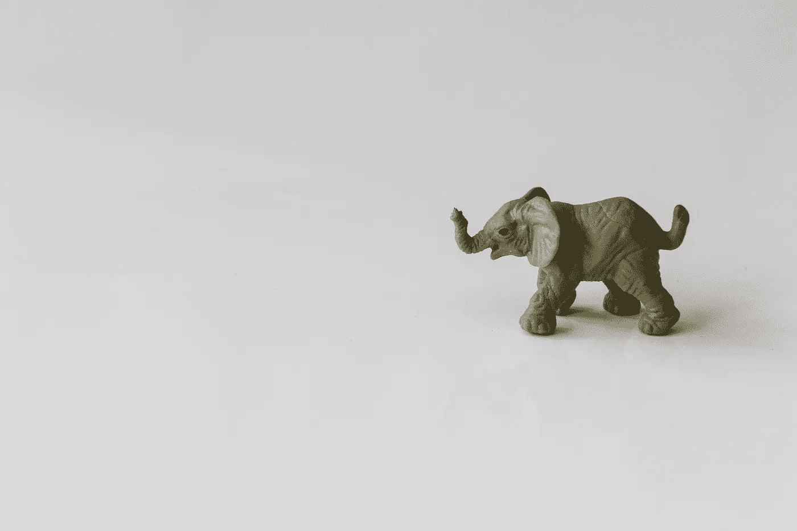
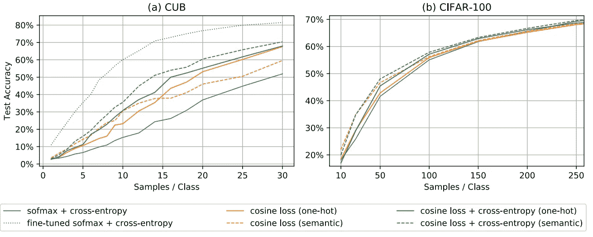

# 如何使用深度学习，即使是小数据

> 原文：<https://towardsdatascience.com/how-to-use-deep-learning-even-with-small-data-e7f34b673987?source=collection_archive---------2----------------------->

## 以及为什么它如此重要

你已经听说了这个消息——深度学习是自切片面包以来最热门的东西。它承诺以极小的代价解决大量数据中最复杂的问题。唯一的问题是，你既不是在谷歌也不是在脸书工作，数据很少。那你打算怎么办？你还能利用深度学习的力量吗？还是你运气不好？让我们来看看**你如何能够利用深度学习，即使数据有限**，以及为什么我认为这可能是未来研究中最令人兴奋的领域之一。

# 从简单开始

在我们讨论利用深度学习处理有限数据的方法之前，请从神经网络后退一步，建立一个简单的基线。通常不需要很长时间就可以试验一些传统的模型，比如随机森林。这将帮助你衡量深度学习的任何潜在提升，并为你的问题提供深度学习与其他方法之间的权衡的大量见解。

# 获取更多数据

这听起来可能很荒谬，但是你真的考虑过你是否能收集更多的数据吗？我惊讶地发现，我经常向公司提出这样的建议，他们看着我，好像我疯了一样。**是的——投入时间和金钱来收集更多的数据是可以的。**事实上，这通常是你的最佳选择。例如，也许你正在尝试对稀有鸟类进行分类，但数据非常有限。几乎可以肯定的是，只要标注更多的数据，解决这个问题会更容易。不确定需要收集多少数据？尝试绘制[学习曲线](https://www.dataquest.io/blog/learning-curves-machine-learning/)，添加额外的数据并观察模型性能的变化。

# **微调**

Photo by [Drew Patrick Miller](https://unsplash.com/@drewpatrickmiller?utm_source=medium&utm_medium=referral) on [Unsplash](https://unsplash.com?utm_source=medium&utm_medium=referral)

好吧。让我们假设您现在有一个简单的基线模型，并且收集更多的数据要么是不可能的，要么太昂贵。在这一点上，最可靠的方法是利用预先训练好的模型，然后针对您的问题对它们进行微调。

微调的基本思想是获取一个非常大的数据集，希望它与您的领域有些相似，训练一个神经网络，然后用较小的数据集微调这个预训练的网络。你可以在这篇[文章](https://flyyufelix.github.io/2016/10/03/fine-tuning-in-keras-part1.html)中了解更多。

对于图像分类问题，要去的数据集是 [ImageNet](https://machinelearningmastery.com/introduction-to-the-imagenet-large-scale-visual-recognition-challenge-ilsvrc/) 。该数据集包含跨越许多对象类别的数百万幅图像，因此可用于许多类型的图像问题。它甚至包括动物，因此可能有助于珍稀鸟类的分类。

要开始微调一些代码，请查看 Pytorch 的伟大的[教程](https://pytorch.org/tutorials/beginner/finetuning_torchvision_models_tutorial.html)。

# 数据扩充

如果您无法获得更多数据，并且在大型数据集上的微调没有任何成功，那么数据扩充通常是您的下一个最佳选择。它也可以与微调结合使用。

数据扩充背后的想法很简单:**以提供新数据的方式改变输入，同时不改变标签值。**

例如，如果你有一张猫的图片，旋转图像，它仍然是一张猫的图片。因此，这将是很好的数据扩充。另一方面，如果你有一张道路的照片，并希望预测合适的转向角度(自动驾驶汽车)，旋转图像会改变合适的转向角度。这是不行的，除非你也适当地调整转向角度。

数据扩充是最常见的图像分类问题，你可以在这里找到技术。

你可以经常想到创造性的方法来增加其他领域的数据，如 NLP(参见这里的一些例子)，人们也在尝试用 [GANs](https://medium.com/reality-engines/gans-for-data-augmentation-21a69de6c60b) 来生成新数据。如果对 GAN 方法感兴趣，我会看看 [DADA](https://github.com/SchafferZhang/DADA) :深度对抗数据增强。

# 余弦损失

最近的一篇[论文](https://arxiv.org/pdf/1901.09054.pdf)，在没有使用余弦损失进行预训练的情况下对小数据集进行深度学习，发现当将损失函数从分类交叉熵损失切换到分类问题的余弦损失时，小数据集的准确性提高了 30%。余弦损失简单来说就是 1 — [余弦相似度](https://en.wikipedia.org/wiki/Cosine_similarity)。

在上面的图表中，您可以看到性能如何根据每个类的样本数量而变化，以及微调如何对一些小数据集(CUB)非常有价值，而对其他数据集(CIFAR-100)没有价值。

# 深入

在 NIPs [的一篇论文](https://papers.nips.cc/paper/7620-modern-neural-networks-generalize-on-small-data-sets.pdf)中，现代神经网络对小数据集进行归纳，他们将深度神经网络视为整体。具体来说，“不是每一层都呈现出不断增加的特征层次，而是最终层提供了一个整体机制。”

我对此的看法是，对于小数据，确保你建立了深厚的人际网络，以利用这种整体效应。

# 自动编码器

已经有一些[成功](https://www.sciencedirect.com/science/article/pii/S0264127518308682)使用堆叠式自动编码器用更优的起始权重来预训练网络。这可以让你避免局部优化和其他不好的初始化陷阱。不过，安德烈·卡帕西[建议](http://karpathy.github.io/2019/04/25/recipe/)不要对无人监督的预训过于兴奋。

如果你需要温习自动编码器，你可以查看斯坦福深度学习教程。基本想法是建立一个预测输入的神经网络。

# 先验知识

Photo by [Glen Noble](https://unsplash.com/@glennoble?utm_source=medium&utm_medium=referral) on [Unsplash](https://unsplash.com?utm_source=medium&utm_medium=referral)

最后，但同样重要的是，尝试并找到整合特定领域知识的方法来指导学习过程。例如，在[通过概率程序归纳的人类级概念学习](https://science.sciencemag.org/content/350/6266/1332)中，作者构建了一个模型，该模型通过利用过程中的先验知识从零件构建概念。这导致了人类水平的性能，并超过了当时的深度学习方法。

您还可以使用领域知识来限制网络的输入，以减少维数或将网络架构调整得更小。

我把这作为最后一个选项，因为整合先前的知识可能具有挑战性，并且通常是最耗时的选项。

# **再次制造小爽**

希望这篇文章给了你一些关于如何利用深度学习技术的想法，即使数据有限。我个人发现，这个问题目前没有得到应有的讨论，但它有着非常令人兴奋的影响。

有大量的问题只有非常有限的数据，而获取更多的数据是非常昂贵或不可能的。比如检测罕见病或者教育成果。找到将我们的一些最佳技术(如深度学习)应用于这些问题的方法是非常令人兴奋的！甚至吴恩达也同意:

这个故事也可以在[这里](https://learningwithdata.com/posts/tylerfolkman/how-to-use-deep-learning-even-with-small-data-e7f34b673987/)找到。