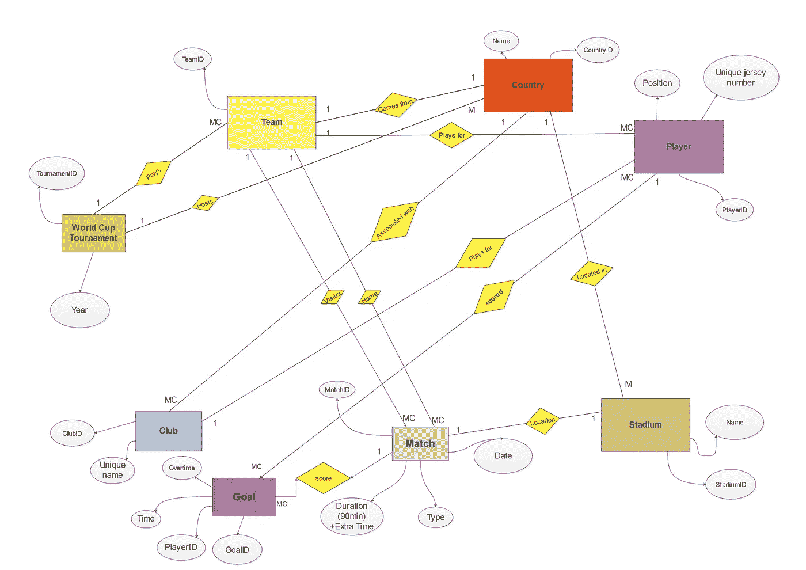
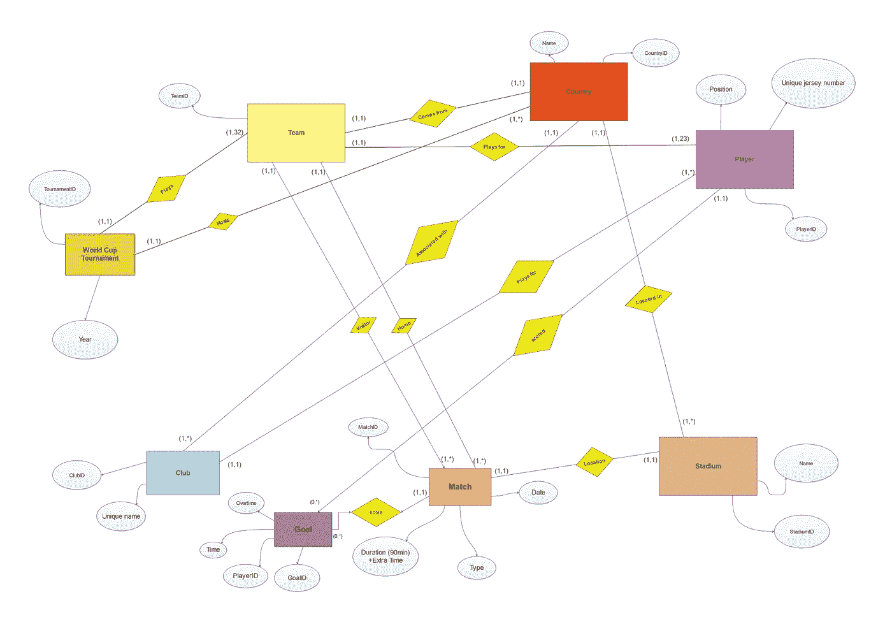
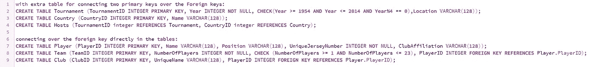
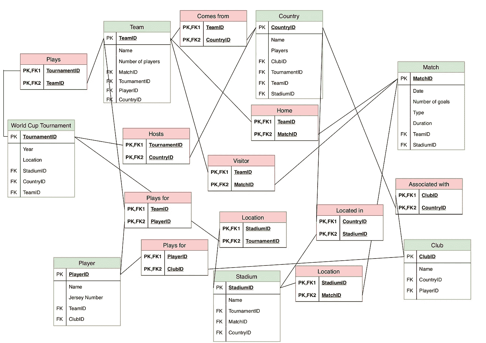

# 如何使用不同的数据模型和数据库的可视化表示

> 原文：<https://towardsdatascience.com/how-to-use-different-data-models-and-visual-representation-of-databases-e2d41c940532?source=collection_archive---------20----------------------->

## **数据库和 SQL 初级课程**

当您进入数据库和数据科学领域时，您必须掌握的第一件事是数据库中实体之间的关系。这很重要，因为您使用的数据必须对其进一步的实现绝对有效。

Photo by [JESHOOTS.COM](https://unsplash.com/@jeshoots?utm_source=unsplash&utm_medium=referral&utm_content=creditCopyText) on [Unsplash](https://unsplash.com/search/photos/data-models?utm_source=unsplash&utm_medium=referral&utm_content=creditCopyText)

让我们马上看看如何最好地概述数据并准备它。
举个例子，我将使用一个基于 1954-2014 年 FIFA 世界杯的数据库。

在这个数据库中，我们有多个实体，它们代表了数据库中最重要的部分，并且应该是相互连接的。这是这种关系的可视化表示:

当连接实体时，您还必须添加符号，以便更容易识别实体之间的关系。对于这个数据库，我准备用[修改陈的符号](https://www.conceptdraw.com/examples/what-is-chen-notation)。Chen 的实体关系建模符号使用矩形表示实体集，菱形表示适合一级对象的关系:它们可以有自己的属性和关系。如果实体集参与关系集，它们用一条线连接起来。

这看起来是这样的:

> 1:1 — [1]到[1]
> 1:C — [1]到[0 或 1]
> 1:M — [1]到[至少 1]
> 1:MC — [1]到[任意多]
> C:C — [0 或 1]到[0 或 1]见陈
> C:M — [0 或 1]到[至少 1]见 1

C ("choice"/"can ")到模型 0 或 1，而 1 恰好表示 1，M 至少表示 1

对关系建模有多种表示方式，这意味着实体之间的符号可以不同。

例如，您可以使用(min，max)符号，对于同一个数据库，该符号如下所示:

这是一个 SQL 脚本，它将表创建为上面的实体:

下图显示了用关系表(红色)连接实体(绿色)的过程:

这就是数据的可视化表示。就不同的符号和关系而言，还有很多方法可以做到这一点。

## **激励的遗言**

当开始使用数据库时，尽量精确处理数据和数据中实体之间的关系。掌握数据科学的每一步都有其特殊之处，正确开始非常重要！坚持学习编程！

# **感谢阅读！**