# 如何设计最快的汽车

> 原文：<https://towardsdatascience.com/how-to-use-doe-to-design-the-fastest-car-8ddafba905ab?source=collection_archive---------25----------------------->

## 从有限数量的乐高积木中研究实验设计(DOE)

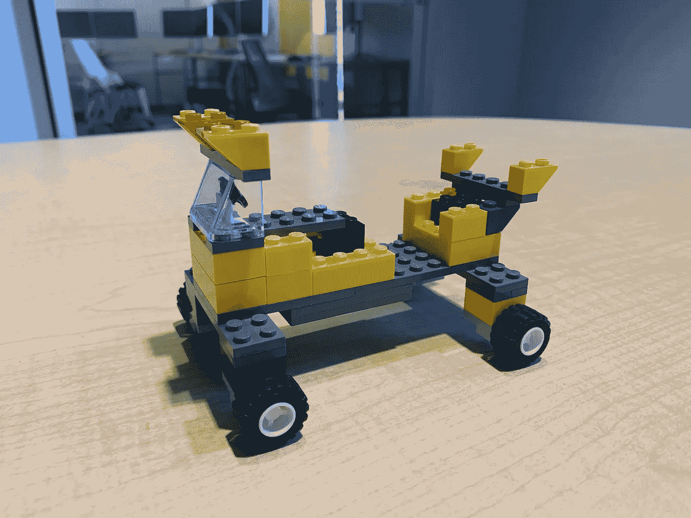

ZEUS — The Mighty Truck

# 项目目标和目的

这个“实验设计”项目的目的是最大限度地增加乐高赛车在走下预先建造的坡道后可以行驶的距离。这辆赛车是由数量有限的乐高积木组装而成的。通过建造这款赛车，我们对距离进行了细致的比较，以找到最佳型号。

# 描述你的实验装置

首先，当实验进行时，所有的观察都是在同一天进行的。如前所述，这个模型有两个不同的复制，四个因素(将在下一节介绍)。这个斜坡与墙壁的夹角为 24 度，斜坡的尺寸为 28 英寸(长)x 12.5 英寸(高)。为了测试的目的，汽车从这个稳定的斜坡的顶部被释放，并在房间内行驶一段距离。每一个测试的变化，关于模型，举行了不同的因素组合，以发现最好的赛车。

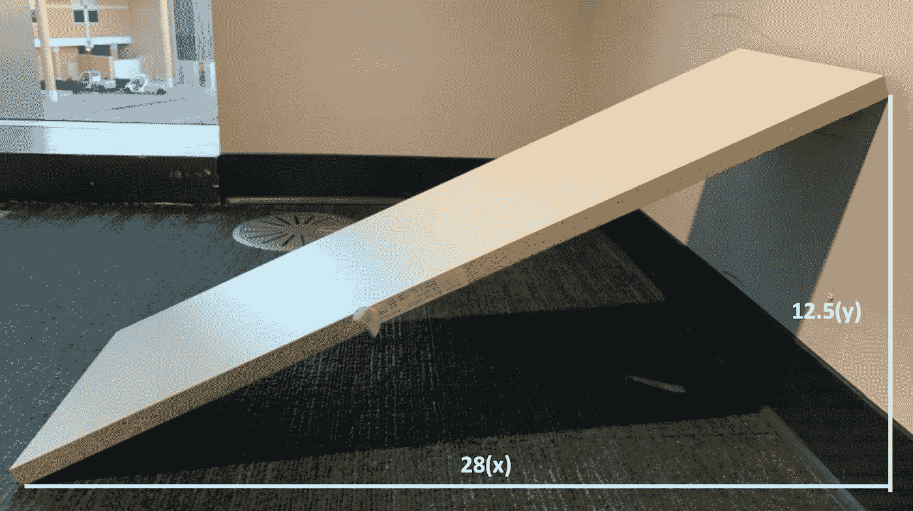

# 选择的因素

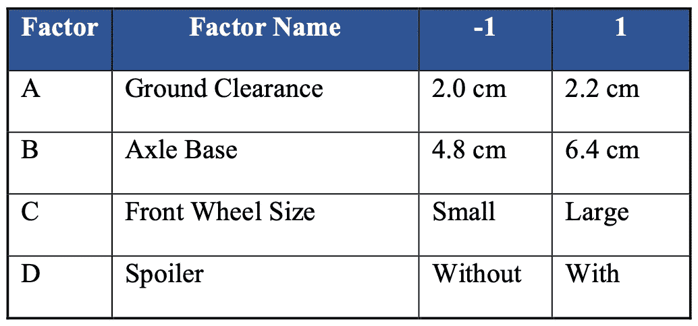

Factors

为项目选择的第一个因素是 ***【离地间隙(A)*** ，它描述了模型底部离地面的高度，单位为厘米。为了了解离地间隙是否重要，选择了 2 厘米作为“-1”因子等级，另一方面，2.2 厘米低于因子等级“1”。在这个项目中选择的第二个因素是模型的***【B】***，这与汽车前后轴基的宽度有关。为了了解这一因素是否重要，因子级别“-1”选择了 4.8 厘米，因子级别“1”选择了 6.4 厘米。为该项目挑选的第三个因素是 ***【前轮尺寸(C)*** ，它描述了可以安装到模型上的不同车轮组。同样，小车轮尺寸将由因子等级“-1”表示，大车轮尺寸将由因子等级“1”表示。第四个也是最后一个因素是模型的***(D)***，这是模型背面的迷你翼形机构。要查看结果是否有实际变化，因子级别“-1”将用于复制没有扰流板的车型，而“1”将用于复制有扰流板的车型。

# 响应变量测量

用卷尺测量离坡道末端的距离。在本项目中，响应变量(y)是从匝道终点测量的水平距离。对于每一次观察，都要测量离斜坡底部中心的距离。就赛车而言，测量是从模型的左后轮进行的，以便在所有观察中获得更好的准确性。通过这个实验设置，收集了包含所有 32 个观察值的完整数据表。

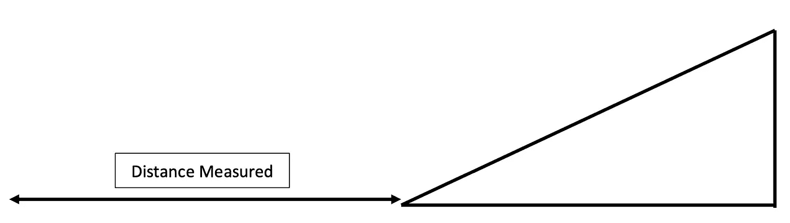

# 实验设计和方法

该实验的设计包括不断测试具有相同基础模型的乐高赛车，同时还实施四个因素和两个复制。为了减少该模型中的变化，我们选择了前面提到的在测试期间进行快速调整的因素。这使得在存在不同因素组合的情况下，可以通过观察模型的比较来做出比较决策。为了避免任何噪音，该实验再次运行两次，以避免和阻止这些罕见情况下的任何噪音参数。在这个项目的方法中，遵循了两个约束条件，以确保汽车的性能不会受到任何外部因素的影响。第一个限制是给定的乐高积木是 DOE 项目中唯一使用的积木。第二个约束包括确保所有测试的模型都有乐高套装中提供的挡风玻璃和方向盘。

# 数据分析和模型充分性检查

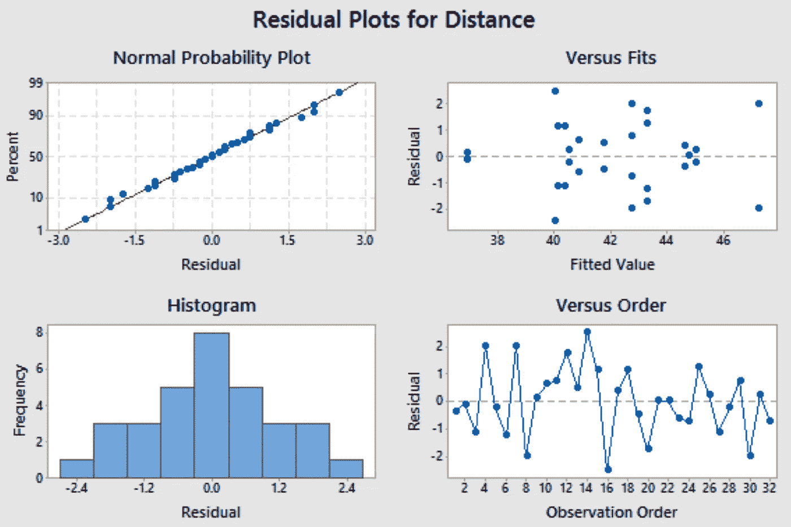

下图中的 ***“残差与拟合”*** 表明所有残差围绕 0 的中线随机分离。这种模式支持回归的假设，即关系是线性的，并表明残差具有恒定的方差，同时也指出没有异常值。通过图表中各种各样的点可以进一步看出这一点。图中没有任何危险信号或趋势表明数据中存在问题。现在， ***“残差对顺序”*** 图也显示了所有残差随机围绕 0 的中间线，其结果与前面提到的图非常相似。因此，这两个图表明残差是独立的，并且彼此不相关。看 ***【正态概率图】*** 时，点呈正态分布，有很强的线性关系，表示正态。 ***【直方图】*** 图也讲述了一个类似的故事，因为残差的频率显示了一组非常正态分布的数据。

# 结果

## 观察

*   `Normal Plot and Pareto Chart`

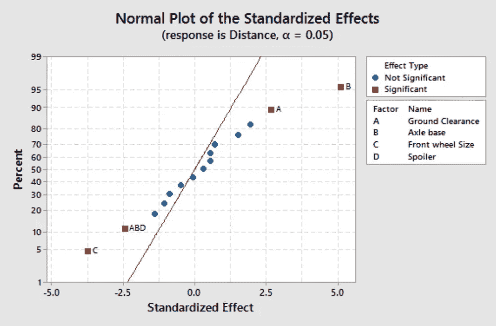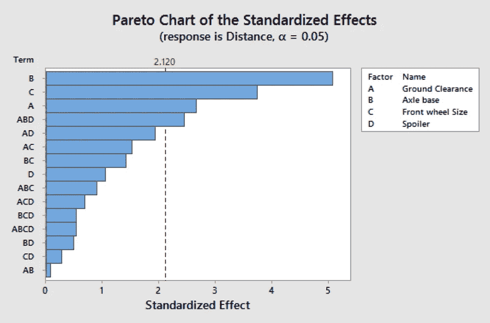

`Normal Plot and Pareto Chart`

如上图所示，通过来自数据集的四个组合可以看出重要因素。第一个重要因素是轴距。第二个重要因素是赛车底座到地板的离地间隙。第三个重要因素是汽车前部的车轮尺寸。最后也是最有趣的因素是离地间隙、轴距和扰流板的组合。首先，这一点包括 D，它本身并不是一个重要因素。另一方面，这种特殊的因素组合产生了数据差异，与前面提到的其他重要因素不相上下。

*   `Main Effects Plot`

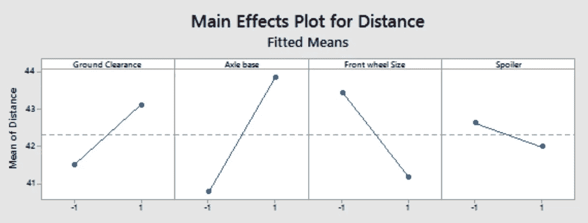

`Main Effects Plot`

此处的“主效应”图显示，与 d 相比，因素 A、B、C 的影响更大。原因是线更陡，这表明存在强烈的主效应。其中最陡的大约是轴距，因为这个因素有非常重要和积极的影响。虽然可能有轻微的主效应，但关于扰流器，该线更接近于水平，这将表明这实际上不太重要。

*   `Interaction Plot`

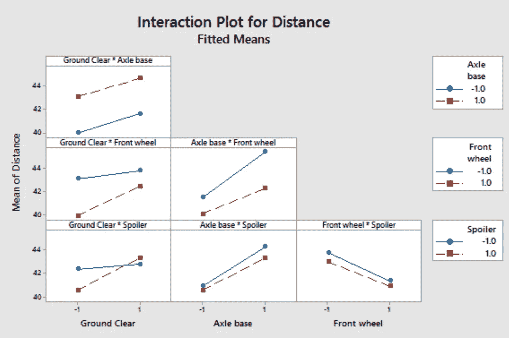

`Interaction Plot`

上面的“距离相互作用图”显示了数据中可能存在的各种相互作用。这里每一个接近平行的图，比如左上角的 A*B，都没有数据中存在的相互作用。另一方面，A*D 有一个相互作用，即“离地间隙*扰流器”，因为两条线相互交叉，因此表明存在一种关系。此外，由于这种情况，这两个因素 A*D 相互影响。

*   `Cube Plot`

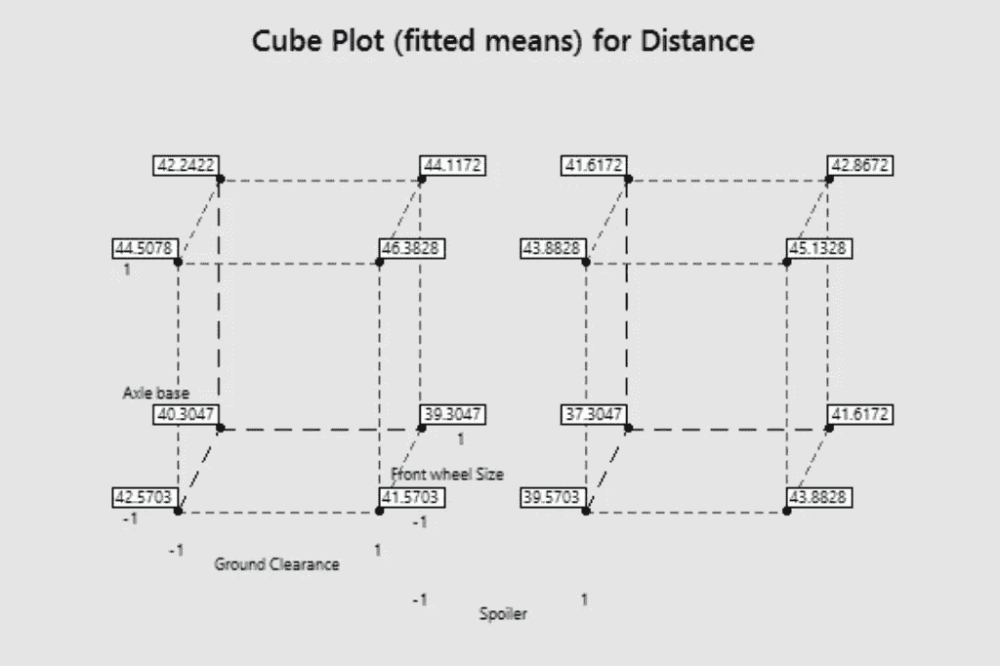

`Cube Plot`

上面显示的“立方体图”显示了与实验测试结果和数据集相关的拟合平均值。这些值中的最大值是左立方体右上角的 46.3828。这表明 A*B 关系产生了一个大值，如图所示。此外，与另一个立方体相比，左边的立方体具有更高的拟合平均值。

## 因子回归

*   `Analysis of Variance`

下面的 ANOVA 表表明，所有 4 个因素(A、B、C 和 ABD)分别是显著的。这可以通过 P 值 0.017、0.000、0.002 和 0.026 看出。由于这些值都小于 0.05，所以它们在统计上是显著的，并显示出它们在数据中的差异。此外，它们还具有较高的 F 值，这表明在大多数情况下具有统计学意义。

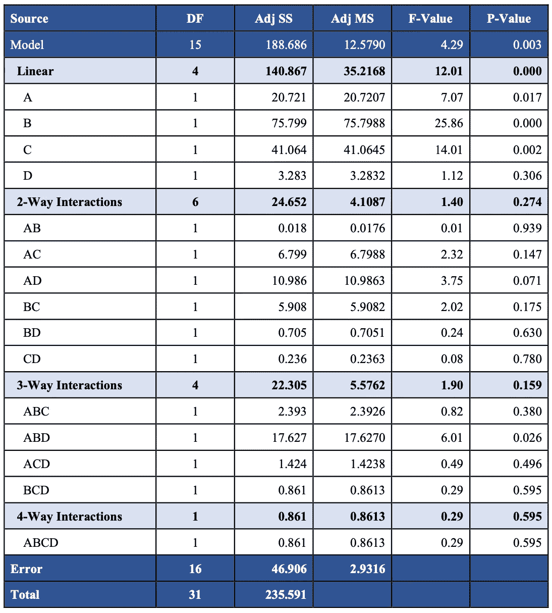

`Analysis of Variance`

*   `Model Summary`

80.09%的高 R2 值表明拟合值非常接近实际观察值。

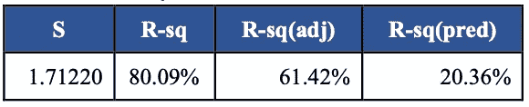

`Model Summary`

*   `Coded Coefficients`

下面的编码系数表显示所有 VIF 值均为 1，这表明这些因子没有多重共线性。

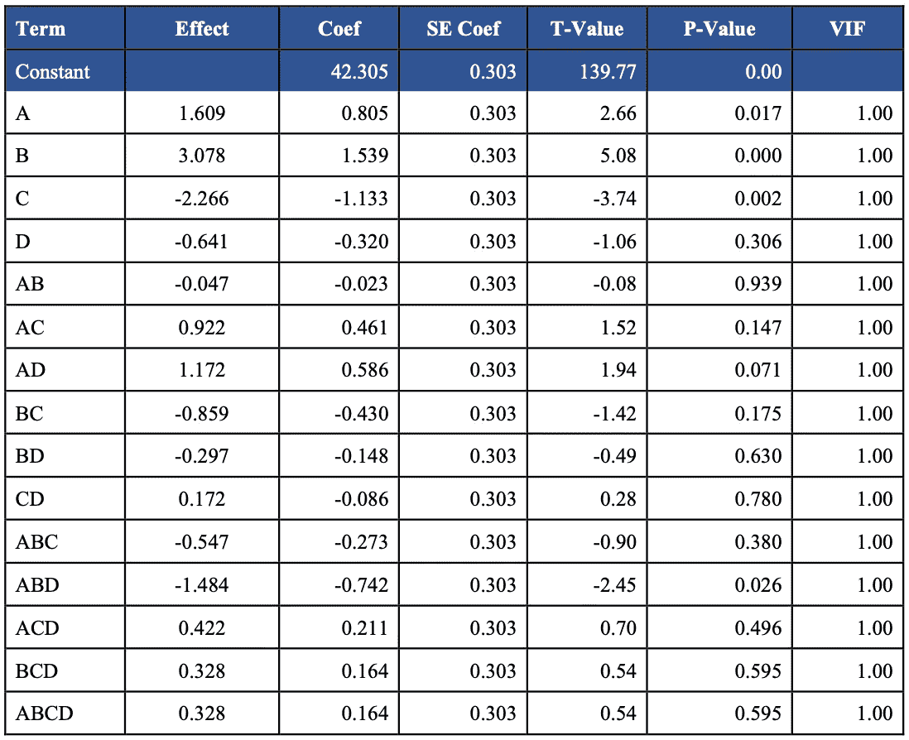

`Coded Coefficients`

# 结论

总之，在 DOE 项目中发现的最重要的因素是离地间隙和轴距。这些部件对乐高赛车的距离和速度都有很大的影响。在财务分析中选择的最好的汽车是“AB”型，它有更宽的轴距，更高的离地间隙，小前轮，没有扰流板。与其他型号相比，这辆车达到了最大的平均行驶距离。就推荐而言，轴距大、离地间隙高、前轮小、没有扰流板的车型是最佳的赛车。现在，就 DOE 项目期间经历的其他事情而言，建议任何型号都采用更宽的轴距。总的来说，找到的性价比高的模型显示了最佳距离，并将成为“比赛日”比赛的竞争者。

# 关于我

非常感谢您阅读我的文章！大家好，我是雪莉，目前在亚利桑那州立大学攻读商业分析硕士学位。特别感谢我的队友 Divya，Raghu 和 Andrew 的贡献。如果您有任何问题，请随时联系我！

```
Email me at ***kchen122@asu.edu***and feel free to connect me on [**LinkedIn**](https://www.linkedin.com/in/kuanyinchen-shirley/)!
```