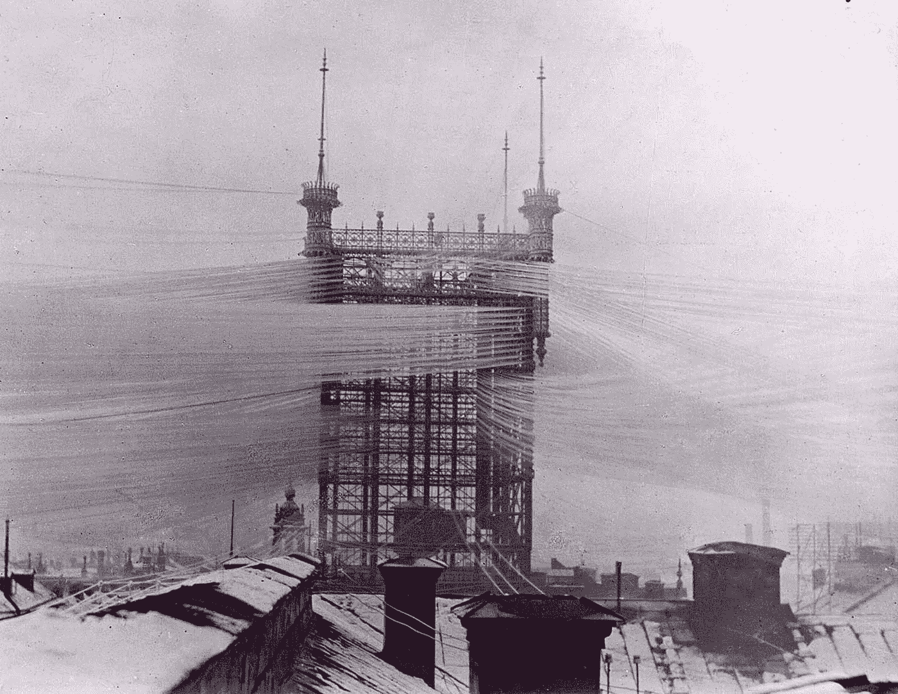
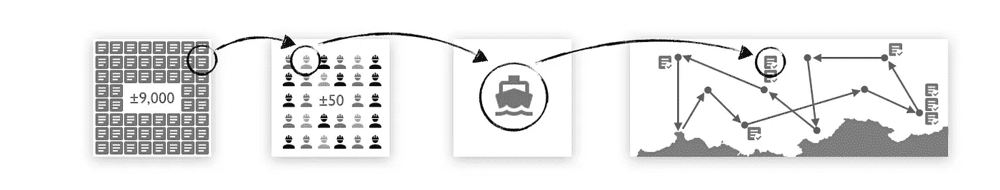
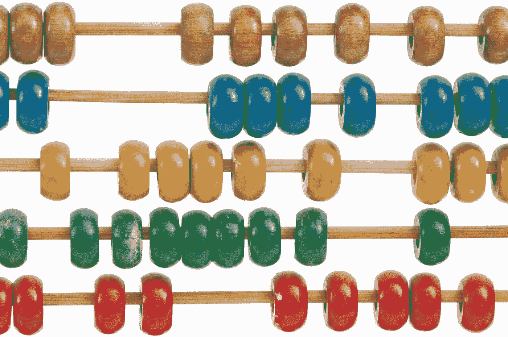
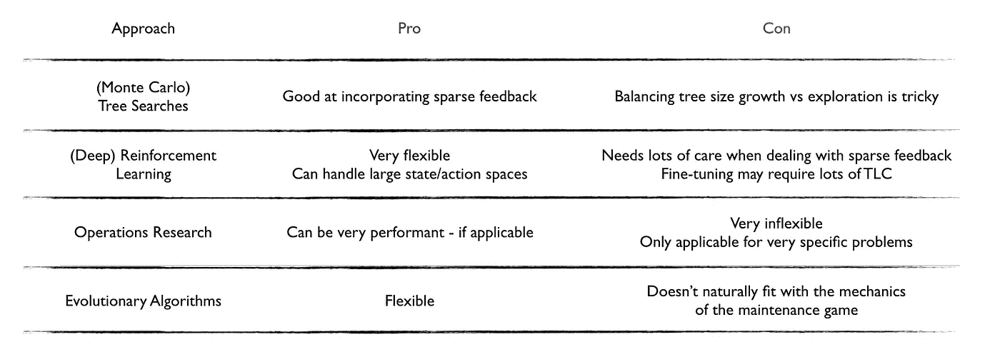

# 如何使用改变游戏规则的人工智能来提高决策质量(案例研究 1)

> 原文：<https://towardsdatascience.com/how-to-use-game-changing-ai-to-boost-decision-quality-case-study-1-6bc4d9c7a897?source=collection_archive---------28----------------------->

source: [rarehistoricalphotos.com](http://rarehistoricalphotos.com)

*注:本文由* [*诺贝特·多勒*](https://medium.com/u/6af5933f6920?source=post_page-----6bc4d9c7a897--------------------------------) *合著。*

*免责声明:精选照片显示的是加利福尼亚州斯德哥尔摩的旧电话塔。1890.它连接了大约 5500 条电话线。如果你完全接受它的复杂性，那你就看错了文章。然而，如果它让你想起你自己的事业，并且你相信总有更好的方法——这篇文章就是为你准备的。*

在本系列的[介绍](/how-to-use-game-changing-ai-to-boost-decision-quality-d7f6c1b28ba2)中，我们讨论了游戏人工智能对于商业应用的潜力。企业通过其决策的质量创造价值。通常，这些决策非常复杂。有数以百万计的选择、冲突的驱动因素、不确定性、隐藏的偏见等等。这些复杂性加在一起，使得人类很难做出好的决策。与人类不同，游戏人工智能是为处理这种复杂性而设计的。它擅长支持复杂的决策。

为了说明游戏人工智能如何帮助增强决策能力，我们发布了一系列案例研究。这些例子展示了游戏 AI 在现实世界行业应用中的优势。

本文讨论了我们想要涉及的第一个案例:*维护计划。*我们将关注能源行业，但这是一个跨许多行业的高风险问题。

Photo by [Nicholas Doherty](https://unsplash.com/@nrdoherty?utm_source=unsplash&utm_medium=referral&utm_content=creditCopyText) on [Unsplash](https://unsplash.com/search/photos/offshore?utm_source=unsplash&utm_medium=referral&utm_content=creditCopyText)

我们将逐步介绍我们的方法:

1.  将业务问题转化为游戏
2.  开发正确的游戏人工智能代理来控制游戏
3.  分析人工智能的制胜策略——从而解决业务问题

但是，在我们进入游戏、人工智能和获胜策略之前，让我们后退一步，从基础开始。*什么是维修规划*，更重要的是:*为什么是这么复杂的问题*？

> “行业局外人可能会对(……)运营商经常忽视或忽略详细的活动规划感到惊讶，这要么是因为更紧迫的中断修复问题优先考虑，要么是因为在一个专注于激动人心的发现和新产品的行业中，它似乎不那么有趣。”([贝恩&公司](https://www.bain.com/insights/integrated-planning-the-key-to-upstream-operational-excellence)

## 维护规划—它是什么，为什么复杂？

想象一家能源公司的离岸资产。它有十个无人平台需要维护。资产面临着维护范围的巨大工作量，大约有 9，000 个活动需要执行。

这些活动在*硬性指标*方面有很大不同，例如:

*   所需工人(员工)总数
*   工人的技能(如焊工、架子工和技术员)
*   执行工程的材料要求
*   工作地点
*   工程持续时间

此外，活动在*软指标*方面有所不同，例如

*   相对重要性
*   相对紧迫性

最后，更糟糕的是，执行能力受到约束。只有一艘工作船将维护人员运送到平台上。那艘船的载客量是固定的，限制了每天和每个地点可用的工人数量。

资产面临的问题是:*计划活动的“最佳”策略是什么？*

Photo by [Hans-Peter Gauster](https://unsplash.com/@sloppyperfectionist?utm_source=unsplash&utm_medium=referral&utm_content=creditCopyText) on [Unsplash](https://unsplash.com/search/photos/chaos?utm_source=unsplash&utm_medium=referral&utm_content=creditCopyText)

这个问题在很多方面都很复杂。

首先是*规模*的问题。有 9000 件作品，可能的计划选项的数量绝对是巨大的。

第二，有*约束*。工作船在任何给定的行程中只能承载这么多的工人。每个船员都有特殊的技能，需要相应的计划。活动可能是相互依赖的，有些活动取决于其他活动的时间安排。一些活动可以并行执行，而另一些则不能。

第三，更软的指标通常由*意见驱动*。意见往往没有量化，有偏差。优先级是由“谁喊得最响”驱动的。不同的利益相关者有不同的看法。而这些意见都在争夺同样的资源。

最后，*条件一直在变*。检测结果、生产混乱或泄漏经常会改变产品组合。因此，除了非常大、受约束和意见驱动之外，工作范围也一直在变化。

因此，公平地说，资产正面临着驱动因素、约束、意见和数学的复杂局面。找到规划工作的“最佳”策略一点也不简单。

source: [gratisography](https://www.pexels.com/@gratisography) on [pexels](https://www.pexels.com/photo/food-man-person-eating-2261/)

处理这一挑战的现有*流程基于手工作业。计划是通过优秀、经验和直觉的结合而产生的。结果是维护人员的效率远远低于预期。计划不稳定，维护积压逐年增加。这种积压影响了资产的安全和生产性能。*

> 想象一个星期五晚上下班后在任何一个石油城镇，从阿伯丁到卡尔加里或珀斯。钻井工人和维修工程师讲述了本周的小胜利——其中不少包括吹嘘需要长时间加班才能解决意外问题的英勇努力，或支付溢价将零件和人员紧急送往急需的地方——所有这些都是石油和天然气行业闻名的“能行”精神的一部分。
> 
> 虽然这些都是好故事，但这绝不是经营企业的方式。“([贝恩&公司](https://www.bain.com/insights/integrated-planning-the-key-to-upstream-operational-excellence))

换言之，提高规划效率是一个需要解决的关键问题。而目前的流程并不能解决这个问题。

幸运的是，还有一个选择:制作一个游戏。

## 游戏人工智能——步骤 1:将问题转化为游戏

我们的第一步是把手头的业务问题变成一个游戏。为了让游戏人工智能有效，这种翻译的准确性是至关重要的。在实践中，这一步需要对问题有深入的业务理解。

像现实生活中的游戏一样，所有的商业游戏都有相同的关键元素来定义它们。有一个目标，球员，动作和规则，以及一个得分系统。让我们来看看维护游戏中的这些元素。

Photo by [Robert Collins](https://unsplash.com/@robbie36?utm_source=medium&utm_medium=referral) on [Unsplash](https://unsplash.com?utm_source=medium&utm_medium=referral)

*比赛目标*

游戏的*目标*是以可能的最佳方式及时分配资源给任务。*资源*是工作船和船上的维修人员。*任务*是从(不断变化的)工作范围组合中提取的活动。

*选手，招式&规则*

维护计划是一个单人游戏，人工智能代理与自己竞争。代理人做出的*移动*代表规划决策。它们是:

1.  船会去哪些地方，按什么顺序？
2.  船将在每个地点停留多长时间？
3.  船上有什么船员？每次访问期间，剧组会完成哪些活动？

The AI Agent assigns work to workers, workers to a boat, and a boat to a specific location at a specific time.

这些决策需要遵守各种*规则*，例如

*   这艘工作船最多只能运送 50 名工人。
*   工作船需要每两周返回岸边更换一次船员。
*   工作船每天只能支持一个平台
*   夏季平台的工作时间为上午 8 点到下午 6 点，冬季为上午 9 点到下午 5 点。

*评分系统*

有了规则，我们就有了一个可以在计划游戏中合法行动的玩家。将动作串在一起对应一个维护计划。掌握这个游戏意味着学习如何做出*获胜的*招式。一系列获胜的棋步产生一个*优化的计划*。

为了确定如何获胜，我们需要引入一个*评分系统*。计分系统反映了玩家每一步棋的价值。也就是说，每一个计划好的维护活动——一次游戏移动——都会为玩家赢得点数。点数反映了在给定时间执行维护活动的价值。

Photo by [Crissy Jarvis](https://unsplash.com/@crissyjarvis?utm_source=medium&utm_medium=referral) on [Unsplash](https://unsplash.com?utm_source=medium&utm_medium=referral)

当然，对于这个估值会有意见分歧。也就是说，不同的意见会产生不同的评分系统。例如，假设生产经理优先考虑最高生产平台上的工作。我们可以通过在这些平台上工作赚取额外积分的选项来适应这一点。或者，让我们说维护经理优先减少积压。我们可以通过奖励积压工作来解决这个问题。每一套观点对应一套分数，和一个要玩的游戏。每一个被掌握的游戏都对应着一个为驱动它的观点而优化的计划。

在此阶段，维护游戏的所有主要组件都已就绪。接下来，让我们解释我们如何开发人工智能来掌握它。

## 第二步:开发正确的人工智能代理来控制游戏

游戏人工智能作为一个研究课题最近有了巨大的发展。有大量关于前沿求解器架构的论文。也有相当多的开源代码被 [DeepMind、](https://deepmind.com/research) [OpenAI](https://github.com/openai/baselines) 和其他人共享。这很棒，但这并不意味着为一个新游戏开发一个 AI 代理——像维护游戏——是微不足道的。用最好的算法来匹配一个游戏会变得非常棘手。开发通常是迭代的，游戏和求解器是并行调整的。

Photo by [Lenin Estrada](https://unsplash.com/@lenin33?utm_source=medium&utm_medium=referral) on [Unsplash](https://unsplash.com?utm_source=medium&utm_medium=referral)

一般来说，我们结合使用

*   深度强化学习(DRL)，
*   树搜索，有时是随机的，
*   运筹学方法，以及
*   进化算法

这个列表并不详尽，但让我们对我们所研究的体系结构的广度有所了解。在开发我们的人工智能时，有几件事对我们很重要:

*   *表现*——做决策有多好？
*   *速度* —它学习的速度有多快？
*   *可扩展性* —它能处理多少选项？
*   *易用性* —需要调多少音才能让它学会？
*   *鲁棒性* —它有多敏感？
*   *配合游戏* —够简单吗？我们不想拿出一把大锤来砸坚果。

在维护游戏中，我们观察到以下情况:

*   树搜索有潜力，但我们的选择空间太大，不能单独使用它们。
*   或者方法在小范围内非常有效，但在我们感兴趣的范围内就失效了。
*   深度强化学习是灵活的，但需要仔细调整以刺激学习。
*   进化算法不太适合这种排序游戏。

Non-exhaustive list of thoughts on solver architectures for a maintenance game

像普通游戏一样，*商业*游戏在设置和复杂程度上有很大的差异。因此，游戏人工智能代理往往也非常不同。一刀切的求解器架构方法是行不通的。

因此，我们使用许多架构的元素来构建我们的 AI 代理。就像 [AlphaZero](https://deepmind.com/blog/article/alphazero-shedding-new-light-grand-games-chess-shogi-and-go) 结合强化学习和树搜索来掌握围棋一样。

对于这个案例研究，我们也开发了一种混合方法。在*顶层，*我们使用了树搜索和深度强化学习。这些方法擅长于做大规模的决策(例如，我把船送到哪里，多长时间？).在*的底层，*我们建立了一个运筹学引擎。它擅长于专门的排序(例如，我在任何给定的地点和持续时间执行什么工作？).这种组合架构速度快、灵活且高性能。通过结合其构建模块的优势，我们的解决方案优于单引擎解算器。

## 第三步:分析人工智能的制胜策略——并解决业务问题

质量决策需要对所有可行的备选方案进行全面的概述。以及对这些选择之间的权衡的理解。通过我们的游戏设置，很容易将不同的意见转化为可供选择的计划。

Photo by [StartupStockPhotos](https://pixabay.com/users/StartupStockPhotos-690514/?utm_source=link-attribution&utm_medium=referral&utm_campaign=image&utm_content=593313) on [Pixabay](https://pixabay.com/?utm_source=link-attribution&utm_medium=referral&utm_campaign=image&utm_content=593313)

例如，有人可能会说在某些平台上每天 24 小时工作是可能的。(这是一个*观点*)这将极大地提高生产力。然后我们可以更新游戏规则*，*让 AI 机器人掌握这个新游戏，并审查由此产生的优化计划。

另一个例子:维护经理可能对他的积压工作感觉强烈。他可能会争辩说(另一个观点)减少积压是最重要的。我们可以在评分系统中反映这一点，让 AI 智能体再次进行比赛并掌握比赛。这就产生了另一个可供选择的优化方案。

游戏人工智能方法的美妙之处在于，任何数量的观点都可以使用相同的基础和衡量标准进行比较。对于每一组规则，人工智能代理都会产生一个优化的计划。比较优化的计划就是比较苹果和苹果。

那么，我们如何比较这些备选方案呢？

首先，我们与业务利益相关者一起定义*关键指标*。这些反映了对他们很重要的指标，并推动决策制定。有时这些是现有的指标，有时我们定义新的指标。

在本案例研究中，我们使用了以下指标:

*   安全关键范围完成的百分比
*   年底积压工作的规模(工作范围的数量)
*   产量面临风险
*   已执行的工作范围总数

其次，我们定义需要评估的*场景的*。这些代表要玩的优化游戏的集合——根据需要，可以多达数千个。

场景和它们的度量标准充分洞察了意见和结果计划之间的权衡。这使得最终决策者能够做出明智的质量决策。

> 在本案例研究中，我们发现与现有的规划理念相比，可以规划多达 *30%* 的工作。正常的业务改进计划很少会带来两位数的改进。此外，在能源行业，两位数代表巨大的货币价值。

30%的改进对 T2 来说是一个巨大的进步，可以扭转积压订单逐年增加的趋势。但是，30%是一个惊喜吗？不，当你想到团队用来玩如此复杂游戏的过时工具集时，就不会了。我们的改进至少部分是由当前的低标准推动的。但是这个标准是真实的——它是规划者每天都要面对的。他们不应该这么做。

## 更换过时的工具集，并重新设计流程

在我们的[简介](/how-to-use-game-changing-ai-to-boost-decision-quality-d7f6c1b28ba2)中，我们建议把你复杂的商业问题带到绘图板上。我们力劝您用 21 世纪的工具取代陈旧的 Excel 规划表。挑战自我，重新设计和改进工作流程和方式。并围绕最新技术重新设计它们。

我们希望这个案例研究是变革的动力。大多数复杂的商业决策都是基于有缺陷或不完整的分析。如果你看着自己的企业，不知道如何改进，那么我们希望这篇文章能激发你的灵感。

Photo by [Ben White](https://unsplash.com/@benwhitephotography?utm_source=medium&utm_medium=referral) on [Unsplash](https://unsplash.com?utm_source=medium&utm_medium=referral)

我们很想听听你的看法。请随时联系 info@whitespaceenergy.eu 或在 LinkedIn 上发表评论。