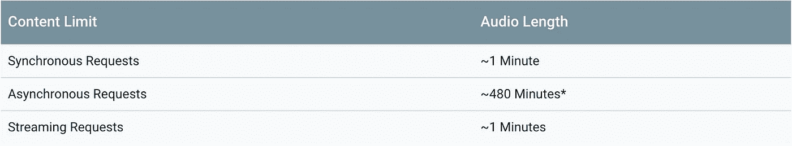
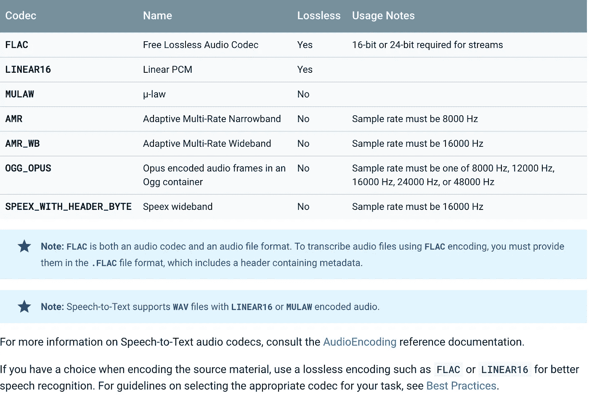

# 如何使用 Google 语音转文本 API 转录长音频文件？

> 原文：<https://towardsdatascience.com/how-to-use-google-speech-to-text-api-to-transcribe-long-audio-files-1c886f4eb3e9?source=collection_archive---------0----------------------->


Credit: [Pixabay](https://pixabay.com/illustrations/speech-icon-voice-talking-audio-2797263/)

语音识别是一项有趣的任务。现在市场上有很多 API 资源，这使得用户更容易选择其中一个。然而，当涉及到音频文件，尤其是呼叫中心数据时，这项任务就变得没什么挑战性了。让我们假设一次呼叫中心的谈话大约需要 10 分钟。对于这种场景，市场上只有少数可用的 API 资源可以处理这种类型的数据([谷歌](https://cloud.google.com/speech-to-text/)、[亚马逊](https://aws.amazon.com/transcribe/)、 [IBM](https://www.ibm.com/watson/services/speech-to-text/) 、[微软](https://azure.microsoft.com/en-us/services/cognitive-services/speech-to-text/)、 [Nuance](https://www.nuance.com/dragon.html) 、 [Rev.ai](https://www.rev.ai/?utm_source=&opti_ca=1560528125&opti_ag=58644408709&opti_ad=294939557240&opti_key=kwd-335642178190&gclid=Cj0KCQiAh9njBRCYARIsALJhQkEaDxwiABjAC8u8qdug5ZVvNjN_wHxDlfaZsrmV2WXSM4fWs0F8iO8aAqU9EALw_wcB) 、[开源 Wavenet](https://github.com/buriburisuri/speech-to-text-wavenet) 、[开源 CMU Sphinx](https://cmusphinx.github.io/) )。在本文中，我们将详细讨论 Google 语音转文本 API。

## 谷歌语音转文本 API

Google 语音转文本有三种基于音频内容的 API 请求。



Credit: [GCP](https://cloud.google.com/speech-to-text/quotas)

> 同步请求

音频文件内容应该大约为 1 分钟，以便进行同步请求。在这种类型的请求中，用户不必将数据上传到 Google cloud。这为用户提供了将音频文件存储在他们的本地计算机或服务器中并引用 API 来获取文本的灵活性。

> 异步请求

音频文件内容应该约为 480 分钟(8 小时)。在这种类型的请求，用户必须上传他们的数据到谷歌云。这正是我们将在本文中讨论的内容。

> 流式请求

它适用于用户直接对着麦克风说话并需要转录的流数据。这种类型的请求适合聊天机器人。同样，对于这种类型的请求，流数据应该大约是一分钟。

## 初始设置

在开始之前，您需要做一些初始设置。请点击下面的链接完成设置。

 [## 快速入门:使用客户端库|云语音转文本 API | Google Cloud

### setvar launch _ type % } API { % endsetvar % } { % setvar launch _ name % }云语音转文本 API {% setvar…

cloud.google.com](https://cloud.google.com/speech-to-text/docs/quickstart-client-libraries) 

我还写了一篇文章详细解释了第一步。

[](https://medium.com/@sundarstyles89/create-your-own-google-assistant-voice-based-assistant-using-python-94b577d724f9) [## 使用 Python 创建自己的基于语音的应用程序

### 基于语音的设备/应用正在大量增长。今天，有谷歌助手，Alexa 把我们的声音作为…

medium.com](https://medium.com/@sundarstyles89/create-your-own-google-assistant-voice-based-assistant-using-python-94b577d724f9) 

一旦创建了 API 客户机，下一步就是创建一个存储桶。您可以使用下面的链接创建一个存储桶。对于这个项目，我将这个桶命名为“callsaudiofiles”。

[](https://console.cloud.google.com/storage/) [## 谷歌云平台

### Google 云平台让您可以在同一基础设施上构建、部署和扩展应用程序、网站和服务…

console.cloud.google.com](https://console.cloud.google.com/storage/) 

## 让我们把一些语音转换成文本

> 步骤 1:导入必要的包

这里的**‘file path’**变量包含了音频文件在你的*本地计算机*中的位置。因此，您可以在路径中存储多个音频文件，它仍然会工作。在**‘输出文件路径’**中，所有由谷歌云创建的文本都将被存储在你的*本地计算机*中。此外，在**‘bucket name’**变量中提供上一步中创建的存储桶名称。你不需要把你的文件上传到谷歌存储器。我们将在后面的部分讨论如何上传到 Google storage。

> 步骤 2:音频文件编码

谷歌语音到文本处理一些特定类型的音频编码。你可以在下面的链接中详细阅读。

 [## 音频编码简介|云语音转文本 API | Google Cloud

### 谷歌云提供安全、开放、智能和变革性的工具，帮助企业实现现代化，以适应当今的…

cloud.google.com](https://cloud.google.com/speech-to-text/docs/encoding) 

Credit: [GCP](https://cloud.google.com/speech-to-text/docs/encoding)

这限制了我们在使用 Google 语音转文本 API 之前转换不同格式的音频文件。

我在下面提供了一个将 mp3 文件转换成 wav 文件的示例代码。

> 步骤 3:音频文件规格

另一个限制是 API 不支持立体声音频文件。因此，用户需要在使用 API 之前将立体声文件转换为单声道文件。此外，用户必须提供文件的音频帧速率。下面的代码可以帮助你找出任何的**。wav'** 音频文件。

> 第四步:上传文件到谷歌存储

正如我们之前讨论的，为了执行异步请求，文件应该上传到 google cloud。下面的代码将完成同样的任务。

> 第五步:删除谷歌存储中的文件

语音转文本操作完成后，文件就可以从 Google cloud 中删除了。下面的代码可以用来从谷歌云中删除文件。

> 第六步:转录

最后，下面的转录函数执行所有必要的操作来获得最终的抄本。它调用前面步骤中描述的其他函数，并将抄本存储在变量**‘抄本’**中。

这里需要注意的一点是**超时**选项。这是转录功能将主动转录当前音频文件的秒数。如果音频文件秒数大于此处提供的数字，您可以将此设置调整为一个较大的数字。

> 第七步:写成绩单

语音到文本的操作完成后，您需要将最终的文本存储在一个文件中，下面的代码可以用来执行同样的操作。

> 第八步:执行你的代码。等着看笔录吧

下面的代码开始执行。在**文件路径中可以有多个音频文件。**它按顺序执行每个文件。

生成的最终文本如下所示。

```
I was on the other roommate had to leave before I got half of them by him. I guess no way to get a hold back to you. Alright. Yeah, kinda I mean like what? What are you I have to I have to play with the other guys. So yeah, go ahead and I with me I can let my people like the one that you were calling me, but I go ahead and do it cuz I'm sure he's not work for lunch, but they just had them or is it 10 o'clock? I want to go ahead and get out with me. Call me. I understand. They probably to talk about Mom and I need to call back or maybe I can just figured after taxes advertises. It's 110 feet in so I guess alright. Well shoot let me know and then maybe I'll just minus the weather. Okay. Well so much for your help. Like I said, no problem. Alright, you have a good day. Okay. Bye.
```

## 如果我需要在我的成绩单中分开发言者，该怎么办？

说话人二进制化是在音频文件中区分说话人的过程。事实证明，你可以使用谷歌语音到文本 API 来执行说话人二进制化。Google 在扬声器二进制化后生成的最终文本如下所示。

```
speaker 1: I was on the other roommate had to leave before I got half of them by him I guess no way to get a hold back to you alright
speaker 2: yeah kinda I mean like what what are you I
speaker 1: have to I have to play with the other guys so yeah go ahead and I with me I can let my people like the one that you were calling me but I go ahead and do it cuz I'm sure he's not work for lunch but they just had them or is it 10 o'clock I want to go ahead and get out with me
speaker 2: call me I understand
speaker 1: they probably to talk about Mom and I need to call back or maybe I can just figured after taxes
speaker 2: advertises it's 110 feet in so I
speaker 1: guess alright well shoot let me know and then maybe I'll just minus the weather okay well so much for your help like I said no problem alright you have a good day okay bye
```

为此，您需要对前面描述的代码进行一些更改。让我们从包导入开始。

现在，我们来谈谈转录部分的变化。

这两个项目的完整代码可以在 [Github](https://github.com/Sundar0989/Speech-to-text) 链接中找到。

玩得开心！