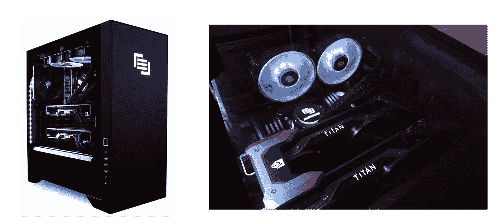

# 如何通过 Maingear 的新数据科学 PC 使用 NVIDIA GPUs 进行机器学习

> 原文：<https://towardsdatascience.com/how-to-use-gpus-for-machine-learning-with-the-new-nvidia-data-science-workstation-64ef37460fa0?source=collection_archive---------3----------------------->

## 是的，你没看错:是机器学习，不是深度学习


深度学习使我们能够执行许多类似人类的任务，但是如果你是一名数据科学家，并且你不在 T2 的 FAANG T3 公司工作(或者如果你没有开发下一个人工智能初创公司)，你很可能仍然使用好的和旧的(好的，也许不是 T4 的 T5 旧的)T6 机器学习 T7 来执行你的日常任务。

深度学习的一个特点是计算量非常大，所以所有主要的 DL 库都利用 GPU 来提高处理速度。但是，如果你曾经因为不从事深度学习而感到被排除在派对之外，那种日子已经过去了:现在有了 [RAPIDS](https://developer.nvidia.com/rapids) 库套件，我们可以完全在 GPU 上运行我们的数据科学和分析管道**。**

在本文中，我们将讨论其中的一些 RAPIDS 库，并进一步了解 Maingear 的新型**数据科学 PC。**

# 为什么人们会使用 GPU 呢？

一般来说，GPU 速度很快，因为它们有**高带宽存储器**和执行**浮点运算**的硬件，其速度明显高于传统 CPUs】。GPU 的主要任务是执行渲染 3D 计算机图形所需的计算。

但是在 2007 年，NVIDIA 创造了 CUDA。CUDA 是一个**并行计算平台**，为开发者提供 API，允许他们构建能够利用 GPU 进行**通用处理**的工具。

> GPU 已经发展成为高度并行的多核系统，可以非常高效地处理大块数据。在并行处理大块数据的情况下，这种设计比通用中央处理器(CPU)更有效

处理大块数据基本上是机器学习做的事情，所以 GPU 对于 ML 任务来说就派上用场了。TensorFlow 和 Pytorch 是已经使用 GPU 的库的例子。现在有了 RAPIDS 库套件，我们还可以**操纵数据帧，并在 GPU 上运行机器学习算法**。

# 湍流

RAPIDS 是一套**开源库**，其中**集成了流行的数据科学库和工作流**来加速机器学习【3】。

一些 RAPIDS 项目包括 [cuDF](https://github.com/rapidsai/cudf) ，一个类似**熊猫的**数据帧操作库； [cuML](https://github.com/rapidsai/cuml) ，一个机器学习库的集合，将提供 **sciKit-learn** 中可用算法的 GPU 版本；cuGraph，一个类似 NetworkX 的加速图形分析库[4]。

Pandas 和 sciKit-learn 是两个主要的数据科学库，所以让我们了解更多关于 **cuDF** 和 **cuML** 的知识。

## cuDF:数据帧操作

cuDF 为数据帧操作提供了一个类似 pandas 的 API，所以如果你知道如何使用 pandas，你就已经知道如何使用 cuDF。如果你想在多个 GPU 上分布你的工作流，还有 Dask-cuDF 库。

我们可以像熊猫一样创造系列和数据框架:

```
import numpy as np
**import cudf**s = **cudf.Series(**[1,2,3,None,4]**)**df = **cudf.DataFrame(**[('a', list(range(20))),
                     ('b', list(reversed(range(20)))),
                     ('c', list(range(20)))]**)**
```

也可以**将 pandas 数据帧转换成 cuDF 数据帧**(但是*不建议这样做*):

```
import pandas as pd
**import cudf**df = pd.DataFrame({'a': [0, 1, 2, 3],'b': [0.1, 0.2, None, 0.3]})
gdf = **cudf.DataFrame.from_pandas(**df**)**
```

我们也可以做相反的事情，将 cuDF 数据帧转换成 pandas 数据帧。

```
import cudfdf = **cudf.DataFrame(**[('a', list(range(20))),
                     ('b', list(reversed(range(20)))),
                     ('c', list(range(20)))]**)**pandas_df = df.head().**to_pandas()**
```

或者转换成 **numpy** 数组:

```
import cudfdf = cudf.DataFrame([('a', list(range(20))),
                     ('b', list(reversed(range(20)))),
                     ('c', list(range(20)))])df.**as_matrix()**df['a'].**to_array()**
```

我们对数据帧所做的其他事情(查看数据、排序、选择、处理缺失值、处理 csv 文件等等)都是一样的:

```
import cudfdf = **cudf.DataFrame**([('a', list(range(20))),
                     ('b', list(reversed(range(20)))),
                     ('c', list(range(20)))]**)**df.**head**(2)
df.**sort_values**(by='b')
df['a']
df.**loc**[2:5, ['a', 'b']]s = cudf.Series([1,2,3,None,4])s.fillna(999)df = cudf.**read_csv(**'example_output/foo.csv'**)** df.**to_csv(**'example_output/foo.csv', index=False**)**
```

关于性能，仅举一个例子，用熊猫加载一个 1gb 的 csv 文件需要 13 秒，用 cuDF 加载需要 2.53 秒。


Loading a 1gb csv 5X faster with cuDF

## cuML:机器学习算法

cuML 与其他 RAPIDS 项目集成实现了**机器学习算法**和**数学原语函数**。在大多数情况下，cuML 的 Python API 与来自 **sciKit-learn** 的 API 相匹配。该项目仍然有一些限制(例如，目前 cuML RandomForestClassifier 的实例不能被腌制)，但他们有一个短暂的 6 周发布时间表，所以他们总是添加新的功能。

除了其他工具之外，还有对[回归](https://rapidsai.github.io/projects/cuml/en/0.10.0/api.html#regression-and-classification)、[分类](https://rapidsai.github.io/projects/cuml/en/0.10.0/api.html#regression-and-classification)、[聚类](https://rapidsai.github.io/projects/cuml/en/0.10.0/api.html#clustering)和[维度缩减](https://rapidsai.github.io/projects/cuml/en/0.10.0/api.html#dimensionality-reduction-and-manifold-learning)算法的实现。该 API 确实与 sciKit API 非常一致:

```
import cudf
import numpy as npfrom **cuml.linear_model** import **LogisticRegression**

X = cudf.DataFrame()X['col1'] = np.array([1,1,2,2], dtype = np.float32)
X['col2'] = np.array([1,2,2,3], dtype = np.float32)y = cudf.Series( np.array([0.0, 0.0, 1.0, 1.0], dtype = np.float32) )# trainingreg = **LogisticRegression()**
reg.**fit(**X,y**)**

print("Coefficients:")
print(reg.coef_.copy_to_host())
print("Intercept:")
print(reg.intercept_.copy_to_host())# making predictionsX_new = cudf.DataFrame()X_new['col1'] = np.array([1,5], dtype = np.float32)
X_new['col2'] = np.array([2,5], dtype = np.float32)

preds = reg.**predict(**X_new**)**

print("Predictions:")
print(preds)
```

# Maingear 的数据科学电脑

这些都很棒，但是我们如何使用这些工具呢？嗯，首先你需要弄一个 **NVIDIA GPU 卡** [**兼容 RAPIDS**](https://rapids.ai/start.html#prerequisites) 。如果你不想花时间找出硬件规格的最佳选择，NVIDIA 将发布**数据科学 PC** 。

PC 自带软件栈，优化运行所有这些用于机器学习和深度学习的库。它带有 Ubuntu 18.04，你可以使用来自 [NVIDIA GPU Cloud](https://ngc.nvidia.com/catalog/all) 的 docker 容器，或者使用原生的 conda 环境。PC 最大的好处之一就是你可以完全安装所有的库和软件。如果你曾经不得不在 Linux 发行版上安装 NVIDIA 驱动程序，或者不得不从源代码安装 TensorFlow，你就会知道这有多梦幻。这些是系统规格:

*   **GPU**

配备 24 GB GPU 内存的 NVIDIA Titan RTX***或*** 双路 NVIDIA Titan RTX 通过 NVIDIA NVLink 连接，提供 48 GB GPU 内存

*   **CPU**

英特尔酷睿 i7 类 CPU ***或*** 更高

*   **系统内存**

最少 48 GB DDR4 系统内存用于**单 GPU 配置**和最少 48 GB DDR4 系统内存用于**双 GPU 配置**

*   **磁盘**

最少 1 TB 固态硬盘

[Maingear VYBE PRO 数据科学 PC](https://maingear.com/nvidiadatascience/) 配备了多达两个双 NVIDIA TITAN RTX 24GB 卡，每台 PC 都是手工组装的**。**



A [VYBE PRO PC from Maingear](https://maingear.com/nvidiadatascience/) with two NVIDIA TITAN RTX cards (this thing is so beautiful I was afraid to turn it on)

使用具有 4，000，000 行和 1000 列的数据集在 VYBER PRO PC 上训练 XGBoost 模型(此数据帧使用大约。15 GB 内存)在 CPU 上占用 **1min 46s(内存增量为**73325 MiB**)**在 GPU**上仅 **21.2s(内存增量为 **520 MiB** )。****


Training a XGBoost model 5X faster with GPUs

# 结论

对于数据科学，我们总是需要探索和尝试新事物。在使我们的工作流程变得困难的其他软件工程挑战中，计算我们的数据所需的大小和时间是两个瓶颈，它们阻止我们在运行我们的实验时达到*流状态*。拥有一台电脑和工具可以改善这一点，可以真正加快我们的工作，帮助我们更快地发现数据中有趣的模式。想象一下，获取一个 40 GB 的 csv 文件，然后简单地将其加载到内存中，看看它是关于什么的。

RAPIDS 工具为机器学习工程师带来了深度学习工程师已经熟悉的 GPU 处理速度提升。为了制造使用机器学习的产品，我们需要迭代并确保我们有可靠的端到端管道，使用 GPU 来执行它们将有望提高项目的输出。

# 参考

[1][https://graphics . Stanford . edu/papers/gpumatrixmult/gpumatrixmult . pdf](https://graphics.stanford.edu/papers/gpumatrixmult/gpumatrixmult.pdf)

[https://en.wikipedia.org/wiki/CUDA](https://en.wikipedia.org/wiki/CUDA)

[3][https://NVIDIA news . NVIDIA . com/news/NVIDIA-introduces-rapids-open-source-GPU-acceleration-platform-for-large-scale-data-analytics-and-machine-learning](https://nvidianews.nvidia.com/news/nvidia-introduces-rapids-open-source-gpu-acceleration-platform-for-large-scale-data-analytics-and-machine-learning)

[https://rapids.ai/about.html](https://rapids.ai/about.html)

[5][https://rapidsai . github . io/projects/cuDF/en/0 . 10 . 0/10min . html # When-to-use-cuDF-and-Dask-cuDF](https://rapidsai.github.io/projects/cudf/en/0.10.0/10min.html#When-to-use-cuDF-and-Dask-cuDF)