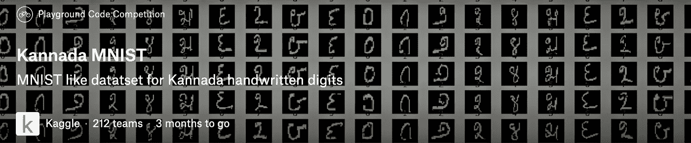
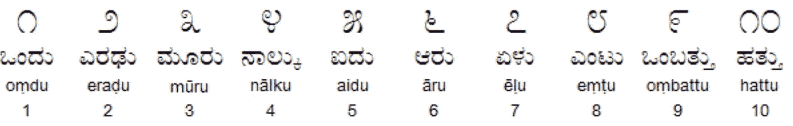
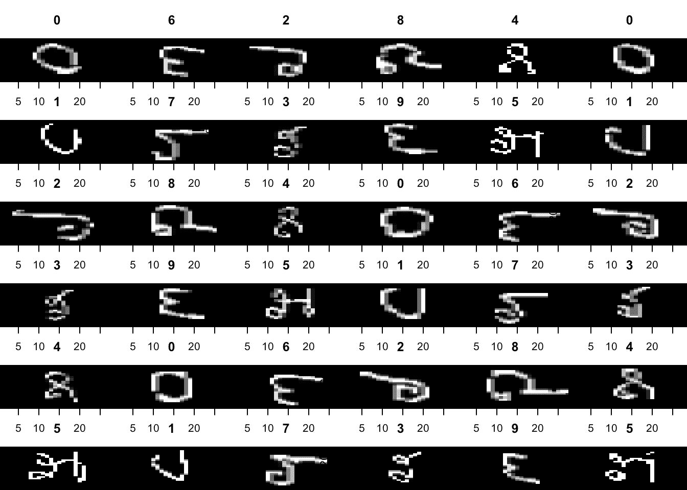

# 如何使用 H2O AutoML 进行卡纳达语 MNIST 数字分类

> 原文：<https://towardsdatascience.com/how-to-use-h2o-automl-for-kannada-mnist-digits-classification-c0bb21ee3774?source=collection_archive---------27----------------------->



Kaggle Kannada MNIST

卡纳达语 MNIST 数据集是另一个 MNIST 类型的卡纳达语(印度)的数字数据集。数据集管理的所有细节已在题为:“[卡纳达语-MNIST:一个新的卡纳达语手写数字数据集”的论文中捕获。](https://arxiv.org/abs/1908.01242)作者**维奈乌代帕布**。作者[的 github repo 可以在这里](https://github.com/vinayprabhu/Kannada_MNIST)找到。



这篇文章的目的是演示如何使用`h2o.ai`的`automl`函数快速获得(更好的)基线。这也证明了一点，这些`automl`工具如何帮助机器学习模型构建过程民主化。

# [78%的数据营折扣](https://datacamp.pxf.io/c/2888696/1240322/13294?u=https%3A%2F%2Fpromo.datacamp.com)


# 加载所需的库

*   `h2o` -用于机器学习
*   `tidyverse` -用于数据操作

```
library(h2o)
library(tidyverse)
```

# 正在初始化 H2O 集群

```
h2o::h2o.init()
```

# 读取输入文件(数据)

```
train <- read_csv("/Kannada-MNIST/train.csv")
test <- read_csv("/Kannada-MNIST/test.csv")
valid <- read_csv("/Kannada-MNIST/Dig-MNIST.csv")
submission <- read_csv("/Kannada-MNIST//sample_submission.csv")
```

# 检查数据框的形状/尺寸

```
dim(train)
```

784 个像素值+ 1 个表示数字的标签。

# 标签计数

```
train  %>% count(label)
```

# 可视化卡纳达语 MNIST 数字

```
# visualize the digits
par(mfcol=c(6,6))par(mar=c(0, 0, 3, 0), xaxs='i', yaxs='i')for (idx in 1:36) { im<-matrix((train[idx,2:ncol(train)]), nrow=28, ncol=28)im_numbers <- apply(im, 2, as.numeric)image(1:28, 1:28, im_numbers, col=gray((0:255)/255), main=paste(train$label[idx]))
}
```



# 将 R 数据帧转换成 H2O 函数所需的 H2O 对象

```
train_h <- as.h2o(train)
test_h <- as.h2o(test)
valid_h <- as.h2o(valid)
```

# 将我们的数字目标变量转换为算法执行分类的因子

```
train_h$label <- as.factor(train_h$label)
valid_h$label <- as.factor(valid_h$label)
```

# 解释变量和响应变量

```
x <- names(train)[-1]
y <- 'label'
```

# 行动中的汽车

```
aml <- h2o::h2o.automl(x = x, 
                       y = y,
                       training_frame = train_h,
                       nfolds = 3,
                       leaderboard_frame = valid_h,
                       max_runtime_secs = 1000)
```

`nfolds`表示交叉验证的折叠次数，而`max_runtime_secs`表示 AutoML 过程可以持续的最大时间。

# AutoML 排行榜

排行榜是 AutoML 列出表现最佳车型的地方。

```
aml@leaderboard
```

# 预测和提交

```
pred <- h2o.predict(aml, test_h) submission$label <- as.vector(pred$predict)#write_csv(submission, "submission_automl.csv")
```

# 提交(为 Kaggle)

```
write_csv(submission, "submission_automl.csv")
```

这是目前 Kaggle 上的一个游乐场比赛。所以，这个提交文件可以提交给这个比赛。根据上述参数，提交的内容在公共排行榜上的得分为`0.90720`。`0.90`在 MNIST 分类中得分接近于零，但我希望这段代码片段可以作为任何试图开始使用 AutoML 的人的快速入门模板。

# 参考

*   [卡纳达 MNIST H2O 汽车在 R-Kaggle 笔记本](https://www.kaggle.com/nulldata/kannada-mnist-h2o-automl-in-r)
*   [卡纳达语-MNIST 卡格尔语比赛](https://www.kaggle.com/c/Kannada-MNIST)
*   [H2O 汽车文件](http://docs.h2o.ai/h2o/latest-stable/h2o-docs/automl.html)

***此文最初发表于***[](https://www.programmingwithr.com/kannada-mnist-prediction-classification-using-h2o-automl-in-r/)

****如果你喜欢这个，请订阅我的*** [***语言无关的数据科学时事通讯***](https://nulldata.substack.com/) ***并分享给你的朋友！****