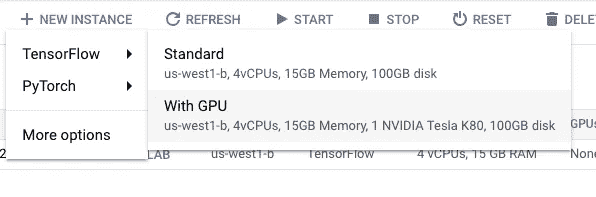
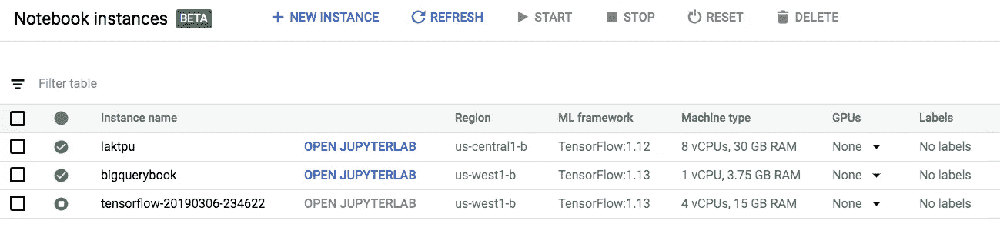
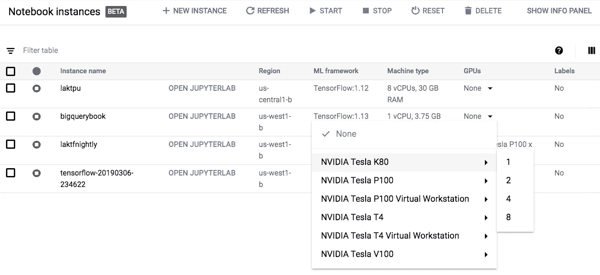
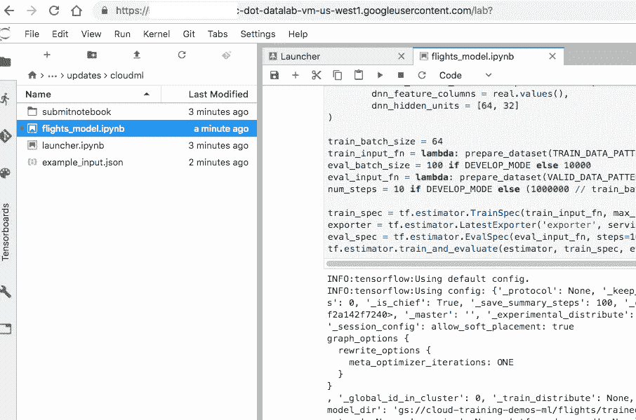

# 如何在谷歌云虚拟机上使用 Jupyter

> 原文：<https://towardsdatascience.com/how-to-use-jupyter-on-a-google-cloud-vm-5ba1b473f4c2?source=collection_archive---------8----------------------->

## 谷歌云平台上 AI 平台笔记本的菜谱

注意:本文中的方法仍然有效，但是我建议您现在使用笔记本 API。做:

*gcloud beta 笔记本-帮助*

在 GCP 上启动笔记本最简单的方法是从 GCP 控制台浏览工作流程。进入 AI 平台，点击笔记本实例。您可以从用户界面创建新实例:



Create a new notebook instance from the UI

实例启动后，您可以单击一个链接来打开 JupyterLab:



Click on the blue link to open Jupyter Lab. Once you are done working for the day, Stop the VM. Then, restart. I tend to have different notebook instances for different projects.

当实例启动时，它有一个持久磁盘。那个磁盘可以装你的笔记本。您可以停止并重新启动虚拟机(从 GCP web 控制台)，而不会丢失这些笔记本。

请注意，您可以从用户界面将 GPU 附加到笔记本实例:



Attaching a GPU to a notebook instance

尽情享受吧！

本文收集了我使用笔记本实例的一些“诀窍”。

# A.如何编写创建笔记本实例的脚本

该实例是一个计算引擎映像，因此如果您想要编写脚本、定制机器、更改防火墙规则等。您可以使用计算引擎功能。笔记本实例是一个[深度学习虚拟机](https://cloud.google.com/deep-learning-vm/docs/how-to)，这是一系列图像，提供了一种在谷歌云上启动带有/不带有 GPU 的虚拟机的便捷方式。它已经安装了 Jupyter Lab，你不需要代理或者 ssh 就可以访问它。

## A1。使用 gcloud 启动深度学习虚拟机

最简单的方法是指定一个图像族(参见[文档](https://cloud.google.com/deep-learning-vm/docs/images)了解可用的图像族)。例如，您可以使用以下方式获取 tensorflow-gpu 系列中附加了 P100 GPU 的最新图像:

```
IMAGE=**--image-family=tf-latest-gpu**
INSTANCE_NAME=dlvm
GCP_[LOGIN_NAME=**google-cloud-customer@gmail.com**](mailto:MAIL=google-cloud-customer@gmail.com)  # CHANGE THISgcloud config set compute/zone **us-central1-a**  # CHANGE THISgcloud compute instances create ${INSTANCE_NAME} \
      --machine-type=**n1-standard-8** \
      --scopes=[https://www.googleapis.com/auth/cloud-platform,https://www.googleapis.com/auth/userinfo.email](https://www.googleapis.com/auth/cloud-platform,https://www.googleapis.com/auth/userinfo.email) \
      --min-cpu-platform="Intel Skylake" \
      ${IMAGE} \
      --image-project=deeplearning-platform-release \
      --boot-disk-size=100GB \
      --boot-disk-type=pd-ssd \ 
      --accelerator=**type=nvidia-tesla-p100**,count=1 \
      --boot-disk-device-name=${INSTANCE_NAME} \
      --maintenance-policy=TERMINATE --restart-on-failure \
      --metadata="proxy-user-mail=${GCP_LOGIN_NAME}**,install-nvidia-driver=True**"
```

## A2。获取 Jupyter 实验室的网址

用于访问 Jupyter Lab 的 URL 是您刚刚启动的虚拟机的元数据的一部分。您可以通过以下方式获得:

```
gcloud compute instances describe ${INSTANCE_NAME} | grep dot-datalab-vm
```

下面是一个脚本，它将执行第 1 步和第 2 步，一直等到 Jupyter 笔记本服务器启动:

```
#!/bin/bashIMAGE=--image-family=tf-latest-cpu
INSTANCE_NAME=dlvm
GCP_[LOGIN_NAME](mailto:MAIL=google-cloud-customer@gmail.com)[=google-cloud-customer@gmail.com](mailto:MAIL=vlakshmanan@google.com)  # CHANGE THISgcloud config set compute/zone **us-central1-a**  # CHANGE THISecho "Launching $INSTANCE_NAME"
gcloud compute instances create ${INSTANCE_NAME} \
      --machine-type=n1-standard-2 \
      --scopes=[https://www.googleapis.com/auth/cloud-platform,https://www.googleapis.com/auth/userinfo.email](https://www.googleapis.com/auth/cloud-platform,https://www.googleapis.com/auth/userinfo.email) \
      ${IMAGE} \
      --image-project=deeplearning-platform-release \
      --boot-disk-device-name=${INSTANCE_NAME} \
      --metadata="proxy-user-mail=${GCP_[LOGIN_NAME](mailto:MAIL=google-cloud-customer@gmail.com)}"echo "Looking for Jupyter URL on $INSTANCE_NAME"
while true; do
   proxy=$(gcloud compute instances describe ${INSTANCE_NAME} 2> /dev/null | grep dot-datalab-vm)
   if [ -z "$proxy" ]
   then
      echo -n "."
      sleep 1
   else
      echo "done!"
      echo "$proxy"
      break
   fi
done
```

## A3。在 web 浏览器中访问 URL

只需导航到那个网址，你就会进入 JupyterLab。

# B.如何在笔记本实例上使用 Git

## B1。Git 交互式克隆存储库

单击左侧窗格中图标带的最后一个图标，您将能够 git 克隆一个存储库。用我书里的那个:

[https://github.com/GoogleCloudPlatform/data-science-on-gcp](https://github.com/GoogleCloudPlatform/data-science-on-gcp)



Running a Jupyter notebook on a cloud VM without any ssh tunnels or proxies

导航到 updates/cloudml 并打开 flights_model.ipynb。您应该能够浏览笔记本。

你也可以打开一个终端，使用 git 克隆、git 检验、git 推送等等。我倾向于发现它比使用内置的 Git UI 更容易。但是您的里程可能会有所不同！

# C.如何指定启动脚本

您可以指定一组在 Jupyter 启动后运行的操作。这些将以 root 用户身份运行。

```
IMAGE=**--image-family=tf-latest-gpu**
INSTANCE_NAME=dlvm
GCP_[LOGIN_NAME=**google-cloud-customer@gmail.com**](mailto:MAIL=google-cloud-customer@gmail.com)  # CHANGE THIS
STARTUP_SCRIPT="git clone [https://github.com/GoogleCloudPlatform/data-science-on-gcp](https://github.com/GoogleCloudPlatform/data-science-on-gcp)"gcloud config set compute/zone **us-central1-a**  # CHANGE THISgcloud compute instances create ${INSTANCE_NAME} \
      --machine-type=**n1-standard-8** \
      --scopes=[https://www.googleapis.com/auth/cloud-platform,https://www.googleapis.com/auth/userinfo.email](https://www.googleapis.com/auth/cloud-platform,https://www.googleapis.com/auth/userinfo.email) \
      --min-cpu-platform="Intel Skylake" \
      ${IMAGE} \
      --image-project=deeplearning-platform-release \
      --boot-disk-size=100GB \
      --boot-disk-type=pd-ssd \ 
      --accelerator=type=nvidia-tesla-p100,count=1 \
      --boot-disk-device-name=${INSTANCE_NAME} \
      --maintenance-policy=TERMINATE --restart-on-failure \
      --metadata="proxy-user-mail=${GCP_LOGIN_NAME}**,**install-nvidia-driver=True,**startup-script=${STARTUP_SCRIPT}**"
```

# D.如何安排笔记本

## D1。转移到生产时，使用映像，而不是映像系列

一般来说，使用映像系列方法进行开发(这样您就可以一直使用最新的东西进行开发)，但是一旦您将产品化，就要使用特定的映像。您希望在产品中固定一个特定映像的原因是，您希望在一个已经实际测试过代码的版本上运行。

获取图像列表并找到您正在使用的图像(您在上面指定的图像系列中的最新图像):

```
gcloud compute images list \
   --project deeplearning-platform-release \
   --no-standard-images
```

然后，在创建深度学习虚拟机时指定它(您可能想要更改的行以粗体显示):

```
IMAGE=--image=**tf-latest-cpu-20190125b2** # CHANGE
INSTANCE_NAME=**dlvm**
GCP_[LOGIN_NAME](mailto:MAIL=google-cloud-customer@gmail.com)[=**google-cloud-customer@gmail.com**](mailto:MAIL=vlakshmanan@google.com)  # CHANGE THIS
ZONE="us-central1-b"  # CHANGEgcloud compute instances create ${INSTANCE_NAME} \
      --machine-type=**n1-standard-8 \** --zone=$ZONE \
      --scopes=[https://www.googleapis.com/auth/cloud-platform,https://www.googleapis.com/auth/userinfo.email](https://www.googleapis.com/auth/cloud-platform,https://www.googleapis.com/auth/userinfo.email) \
      --min-cpu-platform="Intel Skylake" \
      ${IMAGE} \
      --image-project=deeplearning-platform-release \
      --boot-disk-size=**100GB \**
      --boot-disk-type=pd-ssd \
      --boot-disk-device-name=${INSTANCE_NAME} \
      --metadata="proxy-user-mail=${GCP_[LOGIN_NAME](mailto:MAIL=google-cloud-customer@gmail.com)}"
```

## D2。使用 papermill 提交计划执行的笔记本

这里的关键点是使用启动脚本启动 papermill，并在 papermill 完成后使用 TERMINATE 退出笔记本虚拟机，而不需要在出现故障时重启。然后，删除该虚拟机。更多详情见这篇[博文](https://cloud.google.com/blog/products/ai-machine-learning/let-deep-learning-vms-and-jupyter-notebooks-to-burn-the-midnight-oil-for-you-robust-and-automated-training-with-papermill)。

```
# Compute Engine Instance parameters
IMAGE=--image=tf-latest-gpu-20190125b2 # CHANGE
INSTANCE_NAME=dlvm
ZONE="us-central1-b"  # CHANGE
INSTANCE_TYPE="n1-standard-4"  #CHANGE
# Notebook parameters
GCS_INPUT_NOTEBOOK="gs://my-bucket/input.ipynb"
GCS_OUTPUT_NOTEBOOK="gs://my-bucket/output.ipynb"
GCS_INPUT_PARAMS="gs://my-bucket/params.yaml" # Optional
**export STARTUP_SCRIPT="**[https://raw.githubusercontent.com/GoogleCloudPlatform/ml-on-gcp/master/dlvm/tools/scripts/notebook_executor.sh](https://raw.githubusercontent.com/GoogleCloudPlatform/ml-on-gcp/master/dlvm/tools/scripts/notebook_executor.sh)**"**

gcloud compute instances create $INSTANCE_NAME \
        --zone=$ZONE \
        --image=$IMAGE \
        --image-project=deeplearning-platform-release \
       ** --maintenance-policy=TERMINATE** \
        --accelerator='type=nvidia-tesla-t4,count=2' \
        --machine-type=$INSTANCE_TYPE \
        --boot-disk-size=100GB \
        --scopes=https://www.googleapis.com/auth/cloud-platform \
        --metadata="input_notebook_path=${GCS_INPUT_NOTEBOOK},output_notebook_path=${GCS_OUTPUT_NOTEBOOK},parameters_file=${GCS_INPUT_PARAMS},startup-script-url=$LAUNCHER_SCRIPT,**startup-script=${STARTUP_SCRIPT}**"

gcloud --quiet compute instances delete $INSTANCE_NAME --zone $ZONE
```

# E.如何使用 Jupyter 的 TPU

要创建附加到 TPU 的深度学习虚拟机，首先创建深度学习虚拟机，然后创建具有相同 TensorFlow 版本的 TPU:

```
INSTANCE_NAME=**laktpu**   # CHANGE THIS
GCP_[LOGIN_NAME](mailto:MAIL=google-cloud-customer@gmail.com)[=**google-cloud-customer@gmail.com**](mailto:MAIL=vlakshmanan@google.com)  # CHANGE THISgcloud config set compute/zone **us-central1-a**  # CHANGE THISTPU_NAME=$INSTANCE_NAME
gcloud compute instances create $INSTANCE_NAME \
--machine-type n1-standard-8 \
--image-project deeplearning-platform-release \
--image-family **tf-1-12-cpu** \
--scopes cloud-platform \
--metadata proxy-user-mail="${GCP_[LOGIN_NAME](mailto:MAIL=google-cloud-customer@gmail.com)}",\
startup-script="echo export TPU_NAME=$TPU_NAME > /etc/profile.d/tpu-env.sh"gcloud compute tpus create $TPU_NAME \
  --network default \
  --range 10.240.1.0 \
  --version **1.12**
```

创建深度学习虚拟机时唯一的区别是，您在启动脚本中指定了 TPU 名称。

# F.如何在笔记本电脑中使用最终用户凭据

如果你创建了一个深度学习虚拟机，并且你指定了一个 GCP 登录名(除了生产虚拟机之外，我上面的所有例子都是这样做的)，那么只有你(和项目管理员)能够通过 ssh 进入虚拟机。

所有 Jupyter 笔记本都将在一个服务帐户下运行。在大多数情况下，这没问题，但是如果您需要运行服务帐户没有权限执行的操作，您可以通过执行以下操作让 Jupyter 中的代码以您的身份运行:

*   在启动菜单中，打开一个终端
*   在终端中，键入:

```
gcloud auth application-default login
```

*   按照提示执行 OAuth2
*   如有必要，重启 Jupyter 内核

**注意**:不要使用最终用户凭证，除非您在“单用户模式”下启动机器。

# G.如何创建 TF-nightly 虚拟机

在 tf-latest 系列中创建映像使用最新的稳定 TensorFlow 版本。要使用 TF-nightly(例如，这就是如何获得 TensorFlow 2.0-alpha)，请使用:

```
INSTANCE_NAME=**tfnightly**   # CHANGE THIS
GCP_[LOGIN_NAME](mailto:MAIL=google-cloud-customer@gmail.com)[=**google-cloud-customer@gmail.com**](mailto:MAIL=vlakshmanan@google.com)  # CHANGE THIS
ZONE="us-west1-b" # CHANGE THIS
INSTANCE_TYPE="n1-standard-4" # CHANGE THISgcloud compute instances create ${INSTANCE_NAME} \
      --machine-type=$INSTANCE_TYPE \
      --zone=$ZONE \
      --scopes=[https://www.googleapis.com/auth/cloud-platform,https://www.googleapis.com/auth/userinfo.email](https://www.googleapis.com/auth/cloud-platform,https://www.googleapis.com/auth/userinfo.email) \
      --min-cpu-platform="Intel Skylake" \
      --image-family="**tf-latest-gpu-experimental**" \
      --image-project=deeplearning-platform-release \
      --boot-disk-size=100GB \
      --boot-disk-type=pd-ssd \
      --accelerator=type=nvidia-tesla-p100,count=1 \
      --boot-disk-device-name=${INSTANCE_NAME} \
      --maintenance-policy=TERMINATE --restart-on-failure \
      --metadata="proxy-user-mail=${GCP_LOGIN_NAME},install-nvidia-driver=True"
```

# H.Jupyter 故障排除

**重启 Jupyter:** 通常你需要做的就是点击笔记本菜单里的图标重启内核。但是偶尔，你可能会彻底破坏环境，想要重启 Jupyter。为此，转到 GCP 控制台的计算实例部分，并单击与您的笔记本实例对应的 SSH 按钮。在 SSH 窗口中，键入:

```
sudo service jupyter restart
```

**启动日志:**如果 Jupyter 启动失败，或者你没有得到笔记本链接，你可能要查看完整的日志(包括启动日志)。使用以下方式完成:

```
gcloud compute instances \
    get-serial-port-output --zone $ZONE $INSTANCE_NAME
```

# 一.使用 conda

张量流图像使用 pip，但 PyTorch 图像使用 conda。所以，如果你想使用 conda，PyTorch 图像是一个更好的起点。

## J.如何在本地运行笔记本实例

如果您想在本地机器上使用深度学习 VM 容器映像进行开发，可以使用 Docker:

```
IMAGE_NAME="gcr.io/deeplearning-platform-release/tf-latest-cpu"
docker pull "${IMAGE_NAME}"
docker run -p 127.0.0.1:8080:8080/tcp -v "${HOME}:/home" \
            "${IMAGE_NAME}"
```

如果您的本地机器上有一个 GPU，请将映像名称从 tf-latest-cpu 更改为 tf-latest-cu100。

__________________________________________________

我对这些食谱很感兴趣。如果您对我应该添加的问题/答案有任何建议，请联系我。为了方便起见，这里有一个包含所有代码的[要点](https://gist.github.com/lakshmanok/f3f91d2965299c7c7a043824622c5890)。