# 如何使用 Jupyter 进行健康科学的初步数据分析

> 原文：<https://towardsdatascience.com/how-to-use-jupyter-to-conduct-preliminary-data-analysis-for-health-sciences-r-tidyverse-edition-8c3260976cf2?source=collection_archive---------16----------------------->

在本教程中，我将讲述一个可以用于 Jupyter 笔记本/Jupyter 实验室进行数据分析的工作流程。我将讨论

*   建立一个基于网络的 Jupyter 环境来完成你的工作，并且
*   如何使用 R 来处理 Jupyter 笔记本或 Jupyter lab

以下是 Jupyter 笔记本的外观:


Jupyter notebook (code and text are woven here)

Jupyter 笔记本(和 Jupyter lab)是一种“笔记本”,可以在网络浏览器上运行，它的组件可以让你在一页纸的空间内做数据科学的事情，统计数据分析，写笔记，论文，生成图表。从他们的网站上阅读更多关于 Jupyter 笔记本的信息，点击这里:[**【https://jupyter.org/】**](https://jupyter.org/)

在他们的网站上，您可以了解到:

*   如何下载 Jupyter 笔记本(免费开源，就像免费啤酒一样免费，像自由一样免费)，
*   如何在您的特定操作系统上安装它们。
*   你甚至可以在[***tryjupyter.org***](https://jupyter.org/try)上测试 Jupyter 笔记本。

能有多简单？*我建议您在安装 Jupyter Notebooks(或 Jupyter lab)后，或访问 Jupyter notebook 或 Jupyter Lab 的托管实例后，务必阅读《走向数据科学》中的以下两个教程*:

[**为数据科学带来 Jupyter 笔记本电脑的最佳性能**](/bringing-the-best-out-of-jupyter-notebooks-for-data-science-f0871519ca29)

[**朱庇特实验室:朱庇特笔记本的进化**](/jupyter-lab-evolution-of-the-jupyter-notebook-5297cacde6b)

您将掌握如何使用 Jupyter 笔记本电脑以及如何使用它们的实用知识。

## 本教程的目的

在本教程中，*我将向您展示如何使用 Jupyter Notebooks/Jupyter Lab，使用 R (tidyverse)* 从头开始进行真实世界的数据分析。我就写一下用 ***R (tidyverse 和 ggplot)*** 做数据分析。在以后的文章中，我将向您展示如何使用 Python (pandas、matplotlib、statsmodel 和 seaborn)进行数据分析和创建图形。因为这些都是开源和免费的(免费的啤酒和免费的言论)工具。(点击下面的图片听理查德·斯托尔曼的采访是什么意思，:-):

[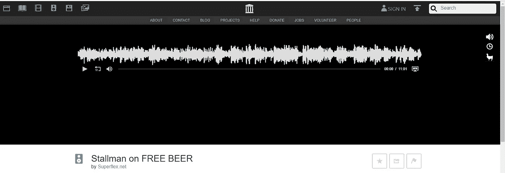](https://archive.org/details/Richard_Stallman_on_FREE_BEER)

因此，学习如何使用这些工具进行数据分析和写作，将使您能够轻松直观地完成数据分析项目，并与所有人分享。

## 完成本教程需要什么？

*   R 的实用知识
*   网络浏览器和安装了 Jupyter notebook 或 Jupyter Lab 的计算机。然而，如果你不需要在你的电脑上安装 Jupyter notebook/Jupyter Lab。你也可以在这些网站上创建免费账户。几乎任何浏览器都可以工作。如果有任何浏览器不支持这些，请在评论中告诉我。
*   如何在 markdown 中写作

## 我说的“R 的工作知识”是什么意思？

如果你以前没有用过 R，现在是个好时机。R 是一个统计编程环境(这意味着您不仅可以进行统计数据分析，还可以开发“例程”或程序，您可以使用 R 与他人共享，这是一件好事)。您可以从以下网站了解更多关于 R 的信息(什么是 R，如何获取和安装 R):

*   r 首页:[https://www.r-project.org/](https://www.r-project.org/)
*   从以下网站下载 R:【https://cran.r-project.org/ 
*   学习如何在工作中采用 R 的一系列页面:【https://cran.r-project.org/web/views/】T4
*   在本教程中，我将使用“tidyverse ”,这是一套 R 语言的包，可以用于数据科学；下面是链接:[https://www.tidyverse.org/](https://www.tidyverse.org/)
*   我建议您熟悉以下由 Hadley Wickham 和 Garrett Grolmund 编写的关于 r 中的数据科学的在线文本。它是免费的，很容易理解:[https://r4ds.had.co.nz/](https://r4ds.had.co.nz/)

这些是让你开始的基本资源。在这里，我将介绍 R 的一些重要的关键组件，您可以使用它们来学习。在本教程中，我们将使用 R 和 tidyverse 读取一个数据集，对数据集进行“清洗和预处理”，然后在数据集中找到一些意义。我们将使用 R 中称为“gg plot 2”(Grammar of Graphics Plotting Version 2，基于 Leland 和 Wilkinson 的书[“Grammar of Graphics”](https://www.amazon.com/Grammar-Graphics-Statistics-Computing/dp/0387245448/ref=sr_1_1?keywords=grammar+of+graphics&qid=1554495579&s=gateway&sr=8-1))的包来创建简单的图形。

## 关于 R 和 markdown 快速烹饪之旅

让我们开始吧。我们将在 Cocalc.com 免费使用一个 jupyter 实验室实例(URL:[https://cocalc.com](https://cocalc.com))；如果你想使用它并跟随它，考虑在那里创建一个免费帐户并启动一个 jupyter 实验室服务器。当你游览 cocalc.com 时，它看起来是这样的:


Figure 1\. Cocalc online jupyter environment. You can sign in with your other social media sign-ons.

登录并打开 Jupyter 实验室环境后，它应该如下所示:

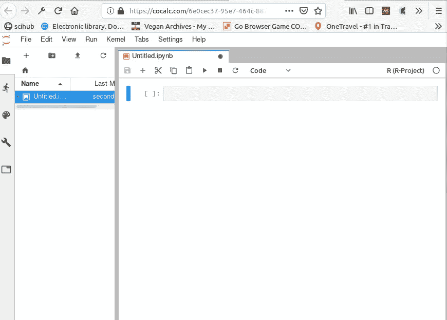

Figure 2\. Jupyter lab interface

我不会在这里进入 Jupyterlab 接口的细节，因为这已经在我上面分享的链接中很好地记录了，请阅读相关的文档，它写得真的很好。相反，让我们专注于手头最有趣的任务:

*   文件扩展名为“”。ipynb ':“交互式 ipython 笔记本”
*   我们将需要建立一个文件名，而不是“untitled.ipynb”，让我们称之为' first_analysis.ipynb '。您可以在第二个大的白色面板中右键单击文件名，然后更改文件名。
*   然后我们需要获取一些数据，编写代码和文本来开始工作。

但在此之前，我们需要触及另外两点:

1.  让我们学习一些关于 R 本身的知识，并整理数据
2.  让我们来介绍一下编写文本的 markdown 语法

## 关于 R 的最基本的信息

我在下面的“灰色”框中提供了一些带注释的代码，您可以复制并粘贴到 Jupyterlab 中的代码块中，当您准备好运行时，请按“Shift+Enter”

```
# Comments in R code blocks are written using 'hash' marks, and 
# you should use detailed comments on all your codes
x <- 1 
# '<- ' is an assignment operator. Here x is set to the value of 1
# This is same as x = 1
x == 1
# Here, we evaluate whether x is equal to 1; 
# Everything in R is an object and you can find out about objects
# using the function typeof()
typeof(x) # should put 'double'
# double tells you that x is a number as in 1.00
# you can and should write functions to accomplish repetitive 
# tasks in R
# The syntax of function is:
my_function = function(x){
          function statements
          }
# You can call functions anywhere in R using the function name and 
# by writing the function parameters within parentheses
# as in my_function(x)
# An example of a function where two numbers x, and y are 
# multipliedmultiply_fn = function(x, y){
 z = x * y
    return(z)
}
multiply_fn(2,3) # will produce 6
# You can see that a function can call within itself another 
# function
# Combination of data and functions are referred to as packages
# You can call packages using library() function
# You can install packages using install.packages() function
# You can find help in R using help("topic") function
# In our case we will use "tidyverse" package. 
# We will need to install this first if not already installed
```

在这个小练习的最后，在我们把这个库叫做“tidyverse”之后，它看起来是这样的:


Figure 3\. Our basic set up with tidyverse library ready to go

## 开始降价的基本要求

由于 html 是万维网的通用语言，它也相当复杂。约翰·格鲁伯发明了一种叫做 markdown 的语言，你可以用简单的装饰来书写文本的所有基本元素。可以写标题(我一般用两级标题)、链接、插码。你也可以使用 jupyter 笔记本上使用的 markdown 风格的表格和引用标记，所以你几乎可以在这里写你的整篇论文。在下面的框中，我提供了一个用 markdown 编写的短文版本和之后的渲染版本。希望这也能让你在 jupyter 笔记本上写作。

**这是我们在 Jupyter 笔记本的文本框中所写的内容**

```
# Purpose
This above was a first level header where we put one hash mark before the header. If we wanted to put a second level header, we would add another hash mark. Here, for example the goal is to demonstrate the principles of writing in markdown and conducting data analyses entirely on a web browser after installing jupyter notebook and optionally jupyter lab on the computer or the server.
## What we will do?
We will do the following:
- We will learn a little about R and markdown
- We will go grab some data sets
- After loading the data set in Jupyter, we will clean the data set
- We will run some tables and visualisations## So is it possible to add tables?
Yes, to add tables, do something like:| Task | Software |
|------|----------|
| Data analysis | Any statistical programme will do |
| Data analysis plus writing | An integrated solution will work |
| Examples of integrations | Rstudio, Jupyter, stata |## How do we add links?
If you wanted to add links to say sometihng like Google, you would insert the following code: [Name the URL should point, say Google]([http://www.google.com](http://www.google.com)), and it would put an underlined URL or name to your text.## Where can I learn more about markdown and its various "flavours"?
Try the following links:
- [Markdown]([https://daringfireball.net/projects/markdown/](https://daringfireball.net/projects/markdown/))
- [Github flavoured markdown]([https://github.github.com/gfm/](https://github.github.com/gfm/))
- [Academic markdown]([http://scholarlymarkdown.com/](http://scholarlymarkdown.com/))
```

**这是它看起来的样子(部分，你可以在 Jupyter 实验室或 Jupyter 笔记本上复制它)**

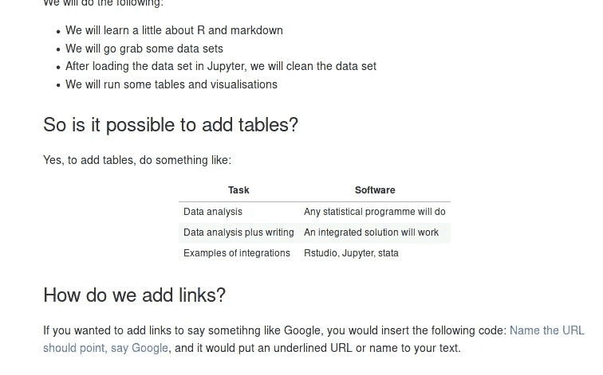

Screen output of a markdown rendered in a text block in Jupyter

## 让我们收集一些数据

现在我们已经:

*   了解了一点 R 并安装和加载了 tidyverse
*   学习如何在 markdown 中书写，以便我们可以描述我们的结果

是时候从网上抓取一些数据，并使用这些工具做一些分析了。现在，你将从哪里得到数据？数据无处不在，但有些网站让你更容易获取和使用它们。如何获取数据本身可以是另一个帖子，所以我不会进入细节，但一般来说:

*   你可以搜索数据(我们将使用两个这样的网站:Figshare 和 Google Data Explorer)
*   您可以使用应用程序编程接口(API)从网站上获取数据并使用它们。
*   有几个网站提供玩具数据或真实世界数据供您使用(例如，数据和故事库)
*   政府网站和卫生部门提供“一卡车”的数据供你分析和理解

这里的关键是学会如何理解这些数据。这就是数据科学的用武之地。具体来说，您可以:

*   免费下载数据
*   以对你理解它们的模式有意义的方式塑造它，并使它们成为“整齐的数据”
*   使用可用的工具运行可视化
*   使用不同的软件预处理数据(在本教程中，我们将使用 R 和 tidyverse，但是您也可以使用 Python 或其他专门的工具，如 OpenRefine 和电子表格)

出于本练习的目的，让我们访问 [Figshare](http://www.figshare.com) 并为我们的工作搜索数据。假设我们有兴趣确定工作场所健康问题的数据，并看看我们从 Figshare 获得了哪些数据来完成我们的工作。由于这是一个演示练习，我们将保持我们的数据集较小，这样我们就可以学习关于从网上抓取数据并分析它们的最基本的要点。使用 tidyverse 实现这一点实际上非常直观。

当我登录 Figshare 时，我的仪表盘看起来是这样的:

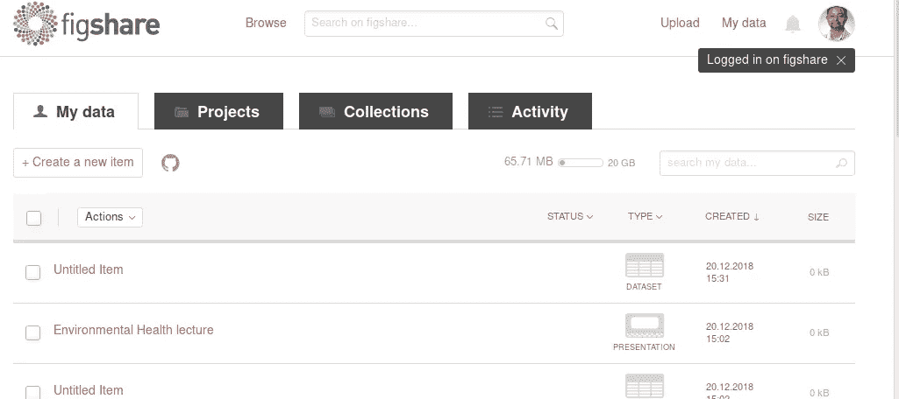

Figshare dashboard

我们搜索了基于“工作”和“健康”的数据，并确定了来自一项研究的原始数据集，研究人员在这项研究中研究了行为激活与抑郁和生活质量之间的关系。当我们搜索的时候，我们确保我们只想下载那些自由和公开共享的数据(有 CC-0 许可)，并且我们想要数据集。

数据取自以下出版物:

[](https://journals.plos.org/plosone/article?id=10.1371/journal.pone.0185221) [## 评估生活质量和行为激活之间的关系使用日本…

### 生活质量(QOL)是一个重要的健康相关的概念。确定影响 QOL 的因素可以帮助开发和…

journals.plos.org](https://journals.plos.org/plosone/article?id=10.1371/journal.pone.0185221) 

在描述这项研究时，论文作者在摘要中写道:

> 生活质量(QOL)是一个重要的健康相关的概念。确定影响 QOL 的因素有助于开发和改善健康促进干预措施。先前的研究表明，行为激活促进主观 QOL，包括幸福感。然而，行为激活改善 QOL 的机制尚不清楚。考虑到治疗后抑郁症状改善时 QOL 改善，并且行为激活是抑郁症的有效治疗，行为激活可能间接而非直接影响 QOL。为了阐明行为激活对 QOL 的影响机制，有必要检查与行为激活、抑郁症状和 QOL 相关的因素之间的关系。因此，我们试图研究这些因素之间的关系。参与者包括 221 名日本大学生，他们完成了关于行为激活、QOL 和抑郁症状的问卷调查:行为激活抑郁量表简表(BADS SF)、世卫组织生活质量 BREF 量表(WHOQOL-26)和流行病学研究中心抑郁量表(CES-D)的日本版本。BADS-SF 包括两个分量表，激活和回避，WHOQOL-26 测量总体 QOL 和四个领域，身体健康，心理健康，社会关系和环境。中介分析以 BADS-SF 激活和回避作为独立变量，CES-D 作为中介变量，每个世卫组织-QOL 作为结果变量。结果表明，抑郁完全中介了回避和 QOL 的关系，部分中介了激活和 QOL 的关系。此外，对 QOL 每个领域的分析表明，激活直接和间接积极影响 QOL 的所有方面，但回避主要通过抑郁对 QOL 的一部分产生负面影响。本研究提供了针对 QOL 增强的行为激活策略。

论文全文是开源的，您可以从以下网站下载并阅读论文:

[](https://journals.plos.org/plosone/article?id=10.1371/journal.pone.0185221) [## 评估生活质量和行为激活之间的关系使用日本…

### 生活质量(QOL)是一个重要的健康相关的概念。确定影响 QOL 的因素可以帮助开发和…

journals.plos.org](https://journals.plos.org/plosone/article?id=10.1371/journal.pone.0185221) 

您可以从这里直接下载数据:

[https://ndownloader.figshare.com/files/9446491](https://ndownloader.figshare.com/files/9446491)

数据显示如下:

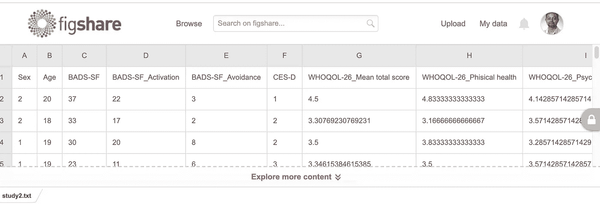

A look at how the data appears

在这里，我们将使用数据集并运行一个带注释的 jupyter 笔记本来展示以下不同步骤:

*   获取数据
*   将数据读入 R
*   清理数据集
*   问问题
*   回答问题

如果你愿意，你可以在作者提供的数据集上复制他们的论文，但我们不会在本教程中这样做。在本教程中，我们已经介绍了使用基于网络的工具，您可以使用 Jupyter 笔记本/Jupyter 实验室进行数据分析。我已经介绍了 Cocalc，但是还有其他类似的工具。一些例子:

*   微软 Azure 笔记本一系列语言全部免费，你可以使用 R 或 Python 或其他语言；免费的，你可以注册并马上开始工作
*   [谷歌合作实验室](https://colab.research.google.com/):来自谷歌，免费。您可以在 Python 笔记本上工作
*   [Tryjupyter](https://jupyter.org/try) :给你不同语言和不同设置的免费笔记本。

因此，我们可以在任何一台笔记本上开始和结束我们的分析，因为这些笔记本是可互操作的。您还可以在 github 和 binder 上托管笔记本，并与世界各地的人分享您的笔记本。

**第一步:下载数据** 你可以看到这是一个 Excel 电子表格文件。您可以在电子表格程序(如 Excel 或 OpenOffice Calc)中打开它，并将文件导出为逗号分隔值文件。或者，我们可以直接在 Jupyter 中读取文件。我们就在这里做。

为此，我们需要使用“readxl”包。所以我们做如下:

```
# first load the package
library(readxl)
# If you find that your Jupyter instance does not have "readxl" 
# package in itself, then you will need to install it. 
# Easiest, install.packages("readxl") and then do 
# library(readxl)
```

加载后，它看起来是这样的:


After loading a data set, this is how it looks like

嗯，什么都没发生！为什么？因为 read_excel 函数读取 excel 文件“S1 _ 数据集. xlsx”的内容，并存储在一个名为 mydata 的*对象中。*我们现在将使用这个对象 mydata 来检查它的内部内容。

**第二步:整理数据并进行预处理**

现在，我们已经阅读了数据集，让我们深入了解其中的内容。第一件事是找出标题信息。我们可以在 R 中使用`` head()``函数来实现。这是它的样子:

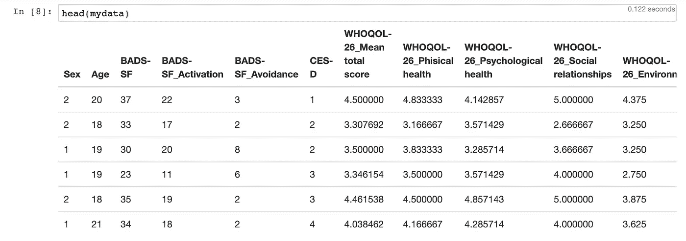

Output of head(mydata)

我们还想找出数据集中的变量列表，所以我们这样做:

```
names(mydata) # produces the list of variables'Sex' 'Age' 'BADS-SF' 'BADS-SF_Activation' 'BADS-SF_Avoidance' 'CES-D' 'WHOQOL-26_Mean total score' 'WHOQOL-26_Phisical health' 'WHOQOL-26_Psychological health' 'WHOQOL-26_Social relationships' 'WHOQOL-26_Environment' 'WHOQOL-26_Overall QOL'
```

如您所见，虽然该数据集包含 12 个具有“表达性”名称的变量。有些变量的名称中包含“空格”。我们将重命名这些变量，以便它们对我们有意义。“性别”和“年龄”等变量相对容易理解，但我们可能需要重命名其他变量。您将从主论文和 Figshare 中的[伴随数据描述中找到关于这些变量名的更多信息。](https://figshare.com/articles/RawData/5462593)

下表将变量名与其代表的概念和简短描述对应起来:

```
| Variable Name | What it stands for |
|---------------|--------------------|
| Sex           | 1 = Male, 2 = Female |
| Age           | Age in years          |
| BADS-SF       | Behavioral Activation for Depression Scale-Short Form |
| BADS-SF_Activation | BADS for activation |
| BADS-SF_Avoidance | BADS for avoidance |
| CES-D | Center for Epidemiologic Studies Depression Scale |
| WHOQOL-26_Mean total score | Japanese version of the WHO Quality of Life-BREF mean total score |
| WHOQOL-26_Phisical health | WHOQol-26 physical health |
| WHOQOL-26_Psychological health | WHOQoL-26 psychological health |
| WHOQOL-26_Social relationships | WHOQoL-26 social relationships |
| WHOQOL-26_Environment | WHOQoL-26 Environment |
| WHOQOL-26_Overall QOL | WHOQoL-26 Overall |
```

这些变量中的 QoL 是生活质量的简称。您可以在此通过相关网站了解更多关于世卫组织 QoL 的信息:[https://www . who . int/substance _ abuse/research _ tools/who QoL bref/en/](https://www.who.int/substance_abuse/research_tools/whoqolbref/en/)

我们不会在这里讨论细节，因为我们正在迈向下一步。在这个阶段，您可以看到:

*   变量名有点长，所以您可能希望缩短它们，但在您继续工作时要让它们易于理解
*   许多变量的名称中都有空格，因此需要小心处理(我们建议您使用下划线来表示空格)

## 我们如何重命名 tidyverse 中的变量？

这是我们的工作:


Renaming variables in the data set

需要注意几件事:

1.  我们将把重命名的变量存储在一个新的数据集中(否则我们的更改将不会持续到我们在代码中完成并立即执行的内容之外，所以请确保将它保存在一个不同的命名对象中)
2.  我们用一个符号“% > %”；这个符号被称为“管道”，读作“然后”。在这里，我们使用这个将许多不同的操作或命令链接在一起。如果你想了解更多这方面的知识以及如何使用它，请参考 [Hadley Wickham 与 R](https://r4ds.had.co.nz/transform.html) 合著的关于数据科学的优秀著作，他在书中写道，

> 在幕后，`x %>% f(y)`变成了`f(x, y)`,`x %>% f(y) %>% g(z)`变成了`g(f(x, y), z)`等等。您可以使用管道以从左到右、从上到下的方式重写多个操作。从现在起，我们将经常使用管道，因为它大大提高了代码的可读性

*   然后我们使用了“rename()”函数，在这里，我们做了如下操作:
*   “新变量名”是第一个元素，接下来是
*   一个“等号”，而“旧变量名”是第二个元素，表示
*   我们将旧的变量值存储在新的变量中
*   注意，在最后，一旦我们执行了它，我们得到了一个新的数据集，所有的值都保持不变，但是有了新的变量名。如果您不想转换某些变量的名称，请保持原样(就像我们对“年龄”和“性别”所做的那样)

## 让我们来了解一些争论数据的“语法”

当我们得到一个全新的数据集时，我们要做的第一件事就是“争论”这些数据。我们检查变量，我们绘制它们，我们重新编码它们以适应我们的目的，我们提出问题并试图回答它们。然后，一旦我们发现了一些我们认为可以深入研究的模式，我们就开始以各种方式对数据进行建模。在本教程中，我将仅限于写第一部分，我们如何做简单的表格和图形。同样，如果你正在与 R 和 tidyverse 合作(这是我推荐的)，你的主要文本是 Hadley Wickham 的书: [R for Data Science](https://r4ds.had.co.nz/) 。这本书是免费的；你可以用网上的免费软件来学习和练习，所以请试一试。正如您所看到的，您可以从不同的站点免费获取数据。我不会详细重复这本书里的所有内容，但我会指出五种语法，你会发现它们对处理数据很有帮助:

*   **选择*。*** —使用此选项从数据集中选择列。假设我们只想处理该总体的 BADS 和 CES D 变量，我们将必须选择要处理的列:


Using Select

***滤镜。*** —如果我们想要处理数据集中的某些“个人”，我们将根据我们在列上设置的一些标准来过滤行。比方说，我们想和女性(" Sex == 2 ")和青少年("年龄< 20 ")一起工作，看看我们会怎么做:


Grammar: filter()

请注意简单性:

*   我们使用“==”等价运算符来设置过滤条件
*   我们使用“，”(逗号)来分隔不同的条件

***排列*** 。—如果我们想按升序或降序查看数据集，我们使用动词“arrange()”来实现，如:


Grammar: arrange()

如您所见，数据集中最年轻的人只有 2 岁！您需要返回并纠正或测试这是否确实是值。这就是数据清理和预处理变得重要的地方。我们对此有何理解？

***变异。*** —您想要创建新的变量并将其存储在数据集中。您希望使用其他函数从现有变量中创建这些变量。假设，现在我们知道一个人的年龄被插入为 2 岁，可能是一个错误，我们不想丢失这个人的信息，我们想在 4 个组中减少年龄变量，我们该怎么做？我们使用变异动词，像这样:


Grammar: mutate

所以你看:

*   使用 mutate 将一个变量重新编码为另一个变量
*   使用 mutate 创建新变量
*   Mutate 使用新函数

让我们对 age_rec 变量进行计数，看看我们得到了什么:


Count of recoded age based on the Age

如你所见，如果你让计算机来决定，它可以创建我们不能使用的类别。因此，让我们对一个新的年龄组进行重新编码和变异，并将其保存到一个新的数据集，如下所示:

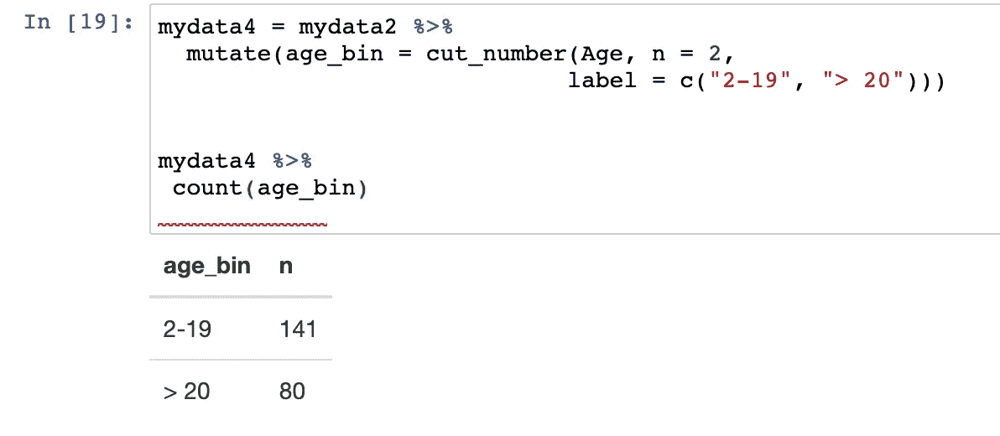

Binarised Age

你看到我们做了什么吗？

*   我们创建了一个新的数据集(mydata4)，并在其中创建了一个新的变量二进制年龄(“age_bin”)，其中我们有 20 岁及以上的青少年和受访者(实际上应该是≥ 20 岁)
*   你也可以分配你选择的标签(所以如果我们愿意，我们可以加上“青少年”和“二十岁以上”。

Mutate 是一个强大的动词，可以让您重新创建数据集和代码变量。你应该掌握这个。

***汇总和分组 _ 依据。***——选择、过滤、排列数据集、变异或改变变量，听起来可能是很多有用的事情，但你还需要更深入地了解数据，并学会如何从中找到意义。你需要找到汇总的摘要，以及那些连续变量的平均值，并把那些分类变量制成表格。通过这种方式，您可以深入了解数据。让我给你介绍一下“summarise()”和“group_by()”函数。

假设您有兴趣了解本次调查中受访者的平均年龄，然后想了解男性的平均年龄是否大于女性。你会怎么做？参见:

```
# What is the average age of the respondents?
average_age = mydata4 %>%
 summarise(average_age = mean(Age, na.rm = T))
average_age# Will return 19.36652
```

请注意，这是一个合并了所有个人的整个数据集的单一数字。这很好，你可以得到你发布的连续变量的平均值的完整列表。

然而，如果我们将 ***分割*** 数据集到不同的离散组(比如二进制年龄组，或者性别，就此而言)，然后计算其他变量的平均值，这将有助于识别模式的有趣显示。因此，基本上，在分割数据集之后，我们将 ***应用一些函数，在我们的情况下*** 表示**的意思，**然后我们 ***将结果组合回当前值，*** 这将有助于有趣地显示同样有意义的结果。要全面了解这个主题，请阅读下面的文章(下载 PDF 格式):

所以，让我们把这个付诸行动，看看是否:

*   在我们的数据中，男性比女性年龄大吗？
*   青少年在健康相关生活质量(平均 WHOQoL)上的平均得分较低吗？


The code and results for males vs. females

那么，你的收获是什么？

*   我们首先传递数据集，然后
*   我们要求 tidyverse 按照分类变量进行分组(首先这样做，因为这是您对数据的“分割”)，然后
*   我们要求总结我们想要的变量。

***聚散*** 。—让我们将这些概念付诸实践，并尝试回答这个问题，不同年龄组的男性和女性的生活质量得分有何不同？

*   我们先来看看平均分:

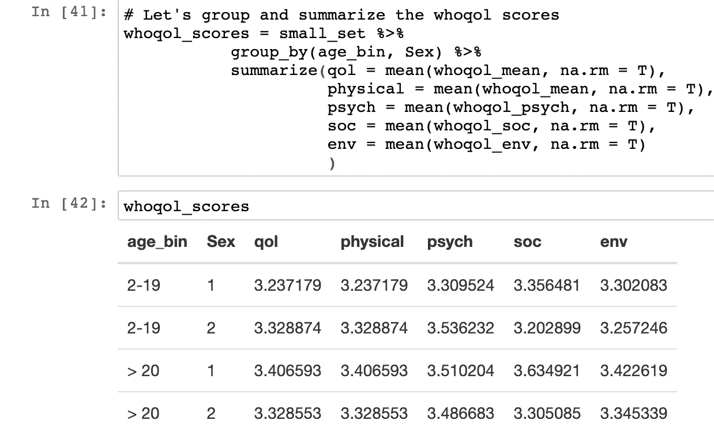

We summarised all quality of life scores

这很好，但是解释起来很复杂。我们必须先看第一行，然后找到男性(性别等于 1)的个人生活质量参数的分数，然后读取下一行，依此类推。如果我们有一个“生活质量”的变量，列出生活质量、身体、心理、足球、环境等，并把它们读下来，这会对我们有所帮助。也就是说，我们将不得不 ***收集这些不同的分数，并将它们放在一个变量下，比如“生活质量”，我们将在那里看到的所有分数放在旁边的另一个变量下，我们可以将该变量称为“所有平均值”(因为这些基本上是平均值)。*** 在 tidyverse 中，我们现在引入另一个名为“gather”的动词来做这件事:

*   使用一个“键”,在那里你可以收集你想要分组的变量的名字。例如，这里的“生活质量”
*   使用一个“值”,在这里您可以放置它们各自的值。你给什么名字，关键和价值是由你决定的。我只关心给它们起个有意义的名字。

因此，下面是供您检查的代码:

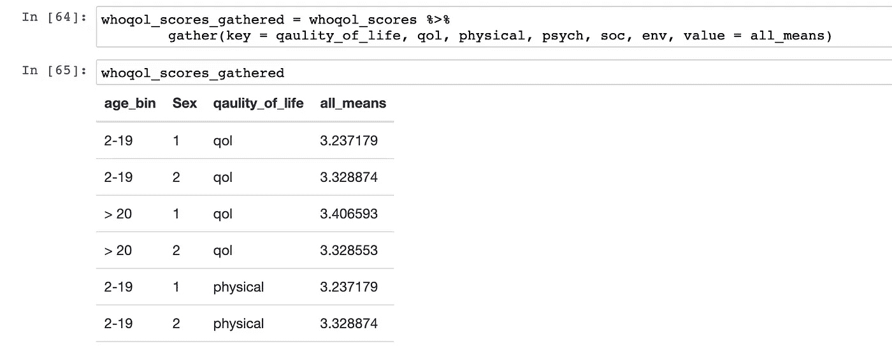

Code and results of “gather”

看到发生了什么吗？我们现在已经“收集”了所有年龄组和所有性别的生活质量分数(各种参数)。但这仍然相当复杂，因为存在性别重复和年龄组重复。如果我们想把 ***展开*** 出来，那么现在我们就会把“all_means”的 ***值*** 分展开在性(1 和 2)的*键下，我们就可以很直观地看到它们了。下面是代码:*

*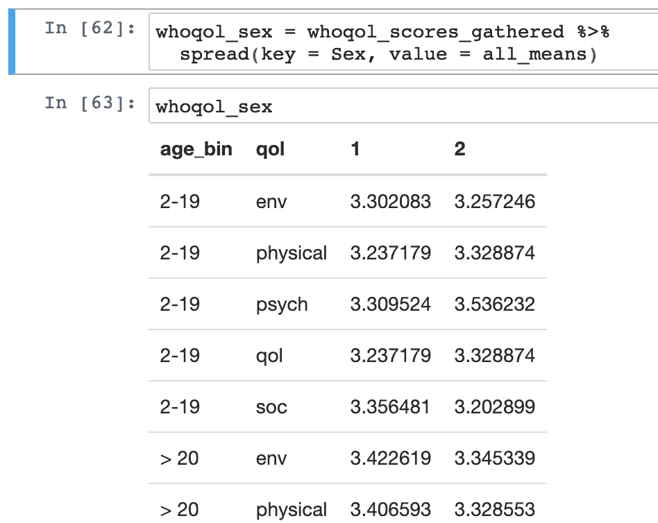*

*Code and results of spread*

*所以，现在你可以看到你可以阅读每个年龄组(根据每个年龄组分组)，每个分数，并可以比较男性和女性。这样你可以做一些有趣的比较。“spread”变得特别有用的一个领域是当您交叉表列变量时，例如在这个数据集中交叉表列二进制的年龄和性别。首先，看看你跑步时会发生什么*

```
*crosstab = mydata4 %>% 
            count(age_bin, Sex) # crosstabs binarised age and Sex*
```

**

*Counting binarised age and sex, code and result*

*好吧，但我们需要一个适当的交叉表格，其中性别出现在列中，二进制年龄出现在行中。所以，我们用“传播”来达到这个目的，明白吗*

*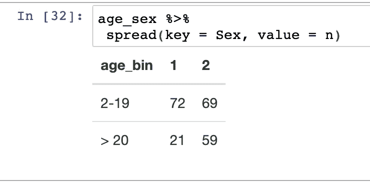*

*Cross-tabulation of Age with Sex*

*好多了。现在你可以看到二元年龄组是如何在性别 1 和性别 2 中分布的(记住 1 =男性，2 =女性)。另外，请注意，这是一个数据框，这意味着您可以使用 mutate()添加一列来找出每种性别青少年的行百分比。你怎么能这样做？*

**

*Code and results for finding out the male percentage in the binarised age*

*如你所见，男性在青少年群体中较高，在 20 岁以上年龄组中较低(26%)。所以，当你评估一些分数和性别之间的关系时，请记住年龄分布可能是一个混杂变量。*

## *第三步:可视化数据*

*在前两个步骤中，如何从各种来源(免费)获得数据，以及如何使用 Jupyter 等免费软件来编写和处理数据，使其适合于分析。但是准备表格和摘要以及清理数据是一半的乐趣。能够创建简单的图表来深入研究数据是令人满意的。所以在今天的第三步，也是最后一步，我们将学习如何在 tidyverse 中创建简单的图表。*

*我建议您使用“ggplot()”来创建图表。Ggplot()是一个很大的主题，网上有很多书可供你阅读。阅读以下资源开始学习:*

*   *[Tidyverse ggplot 文档](https://ggplot2.tidyverse.org/reference/)*
*   *[R 图形食谱](http://www.cookbook-r.com/Graphs/)*
*   *[数据科学 R 的数据可视化部分](https://r4ds.had.co.nz/data-visualisation.html)*

*除了上面的网站，我建议你阅读下面的文章来深入了解图的构造(至少是原理)，不管你是否使用 tidyverse:*

*为了绘制图形以显示数据，我们将在本教程中使用 ggplot()函数，我们将遵循一般方案:*

```
*ggplot([data]) +
   geom_[geometry](mappings = aes(x = [variable],
                                  y = [variable],
                                  stats = "<choices>") +
   facet_<wrap | grid>() +
   coord_<choices>() +
   labs("title of the plot) +
   xlab("label for x axis") +
   ylab("label for y axis")*
```

*要完全理解 ggplot()是如何工作的，请点击我上面列出的链接。在这里，当我们开始介绍并“尝试”时，我将只涉及基本的。记住一些规则:*

*   *这个函数是 ggplot()，数据是强制的(这就是我把它放在方括号中的原因)*
*   *然后有一个“+”号，这个“+”号必须在一行的末尾，不能在开头*
*   *加号表示“层”，来自“图形的分层语法”*
*   *您必须始终指定美学(“aes”)值，否则将无法构建图形*
*   *其余的选项都是可选的(我说“有点”，因为你会在继续使用它的过程中学习)*

*让我们从 mydata4 开始，看看它现在是如何显示的:*

**

*The mydata4 data frame*

*让我们用图表来探索:*

*   *年龄分布是什么样的？*
*   *男性和女性是什么样子的？*
*   *bads_sf 和 whoqol_mean 是什么关系？男女都差不多吗？*

*我们可以继续探索，但是用图形方式回答这些问题将为您提供一些思路，您可以用这些思路来探索这个数据集中您自己的问题，以及您可能想要处理的未来数据集中的问题。*

*年龄分布是什么样的？*

*首先，研究代码:*

```
*mydata4 %>%
  ggplot() +
  geom_bar(aes(x = Age)) +
  ggtitle("A bar plot of age") +
  xlab("Age in years") +
  ylab("Counts") +
  ggsave("age_bar.png")*
```

*   *我的数据 4 是包含我们想要绘制的所有变量的数据集*
*   *管道符号将关于 mydata4 的信息发送给 ggplot()函数*
*   *然后，我们开始了一个新的层，并添加了层+符号*
*   *我们需要一个条形图，因为年龄主要是数字，因此用条形表示。我们只需要指定一个 X 轴，ggplot 就会计算出原始计数。*
*   *我们用 ggtitle()为图表命名，并将标题插入引号中*
*   *我们使用 xlab()和 ylab()函数标记 x 和 y 轴*
*   *我们使用 ggsave()函数保存了该图*

*它看起来是这样的:*

*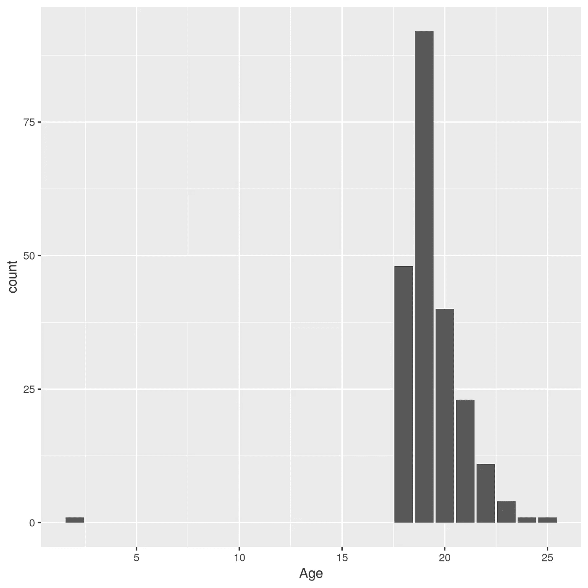*

*Bar plot of age*

*男性和女性的年龄分布柱状图看起来一样吗？*

*现在我们应该使用 facet 函数来绘制两个不同的图，或者我们可以拆分图形:*

*   *首先，看代码:*

```
*mydata4 %>%
  ggplot() +
  geom_bar(aes(x = Age)) +
  ***facet_wrap(~Sex) +***
  ggtitle("A bar plot of age by gender") +
  xlab("Age in years") +
  ylab("Counts") +
  ggsave("age_bar_sex.png")*
```

*请注意，我们添加了性别变量来将图形分成两部分，这样它就可以将图形分成两部分，如下图所示。你怎么想呢?男性和女性看起来相似吗？*

*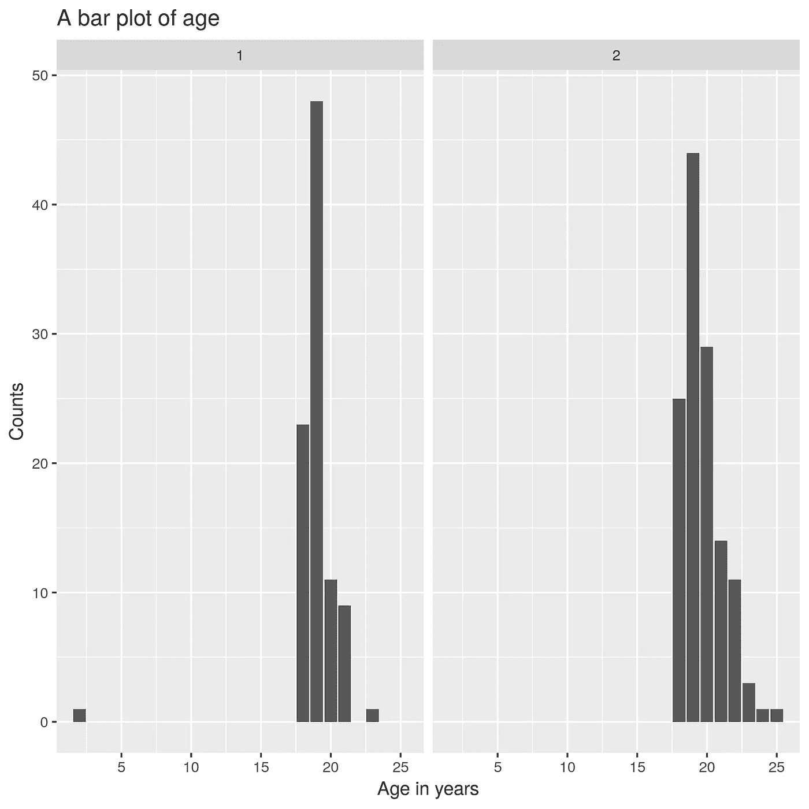*

*Plot of the Age distribution by gender*

## *bads_sf 和 whoqol_mean 是什么关系？男女都差不多吗？*

*这一次，我们将探讨两个变量之间的关联或关系。我们要画什么样的图，取决于我们要处理的变量的性质。下表将为您提供一些思路:*

```
*| X variable | Y variable | Type of graph | Geometry         |
|------------|------------|---------------|------------------|
| Continuous | Continuous | Scatterplot   | geom_point()     |
| Continuous | Categorical| Boxplot       | geom_boxplot()   | 
| Categorical| Continuous | Boxplot       | geom_boxplot()   |
| Categorical| None       | Barplot       | geom_bar()       |
| Continuous | None       | Histogram     | geom_histogram() |*
```

*因为 bads_sf 和 whoqol_mean 都是连续的，所以我们可以画一个散点图。但是还有什么能解释呢？如果我们认为 whoqol_mean 之间可能存在某种关系，因此如果 bads_sf 得分增加，那么 whoqol_mean 也会增加，我们可以使用散点图来测试这一点，并绘制线性回归来绘制它们之间的关系(线性回归或建模超出了本教程的范围，但我们将只显示图表，而不会在此写更多)。*

*代码如下:*

```
*mydata4 %>%
  ggplot() +
  ***geom_point(aes(x = bads_sf, y = whoqol_mean))*** +
  ggtitle("Association between bads_sf and whoqol") +
  xlab("BADS-SF score") +
  ylab("WHOQoL Score") +
  ggsave("bads_who.png")*
```

*这是关联图:*

**

*Association between BADS-F score and WHOQoL score, you see a positive association*

*现在我们需要进一步验证它，看看男性和女性之间的联系是否相似。因此，我们添加了一条回归线，并为男性和女性的点和线涂上不同的颜色:*

*首先是代码:*

```
*mydata4 %>%
  ***mutate(gender = as.factor(Sex)) %>%***
  ggplot() +
  geom_point(aes(x = bads_sf, y = whoqol_mean, ***colour = gender***)) +
  ***geom_smooth(aes(x = bads_sf, y = whoqol_mean, colour = gender), method = "lm")*** +
  ggtitle("Association between bads_sf and whoqol") +
  xlab("BADS-SF score") +
  ylab("WHOQoL Score") +
  ggsave("bads_who_lm.png")*
```

*然后是图:*

*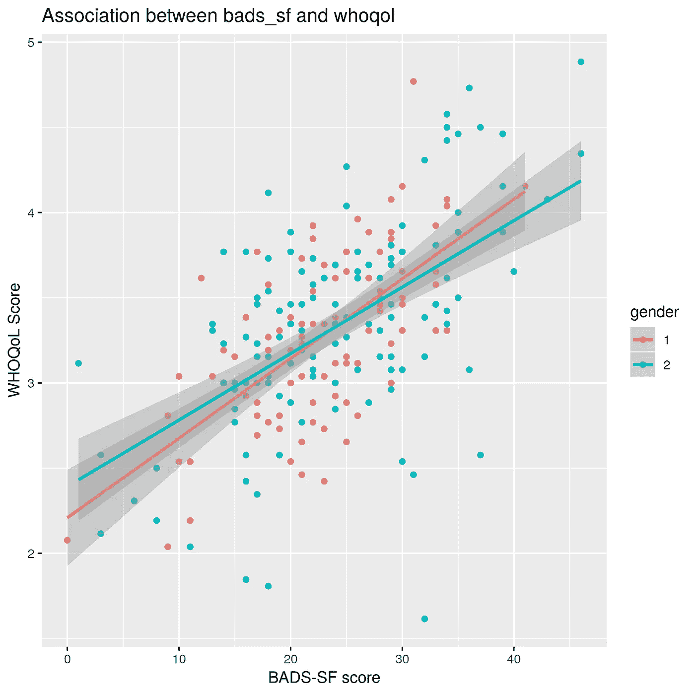*

*Association between BADS-SF and WHOQoL scores*

*这是怎么回事？*

*   *我们必须添加一个新的变量“性别”，从“性别”开始，所以使用 mutate 函数将其转换为因子变量，而不是字符变量。因子变量是一个分类变量，但是明确地具有根据字母或数字顺序排列的级别。这对于后续步骤是必要的，在这些步骤中，我们想要测试关系中的差异。*
*   *我们想测试这些点会有什么不同，所以我们用性别变量给它们涂上不同的颜色。请注意，我们将颜色参数放在了贴图的美学中。*
*   *类似地，我们想使用平滑函数，在我们的例子中，这是“线性模型”，因此选择“lm”作为方法。但这必须贴在美学参数之外的 ***。在平滑线条的美学中，我们需要指出，我们想要不同颜色的线条来表示性别变量的级别。****

*那么，你认为你在这段关系中看到了什么？性别差异大吗？我们可以继续探索更多的数据集，但我们需要在这里停下来，总结一下我们迄今为止所做的工作。*

## *结论*

*这是一个教程，我们涵盖了以下主题:*

*   *Jupyter notebooks 是免费的开源工具，使您能够进行数据科学工作，同时还允许您充分利用 R 和 Python(以及其他语言)的潜力来进行数据分析。*
*   *您可以进行二次数据分析和整理数据，而实际上无需使用任何其他工具(如电子表格)来清理和争论数据。*
*   *我们在网上找到了一个使用 CC-0 许可(creative commons licence，可以自由使用数据集)的数据集和一篇研究数据集的文章。*
*   *我们学习了如何使用 tidyverse 环境来检查、子集化、过滤和绘制数据。*

*我希望这能激励你去处理更多的数据集。记住，你练习得越多，你的技能就会越好。如果你需要更多的信息和问题，请在评论区发表。我希望它是一个快速的介绍，所以没有介绍一些关于整齐的数据和统计程序的其他概念；这将在随后的文章中讨论，你会在网上找到更多的信息。快乐分析！*

*这里有一个[到 jupyter 笔记本的链接，用于这个分析](https://cocalc.com/share/6e0cec37-95e7-464c-882a-11dd8e3ec26c/first_analysis.ipynb?viewer=share)*