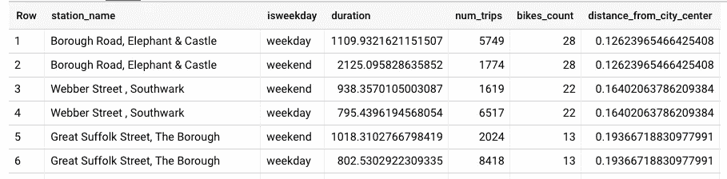
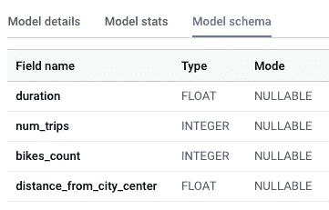
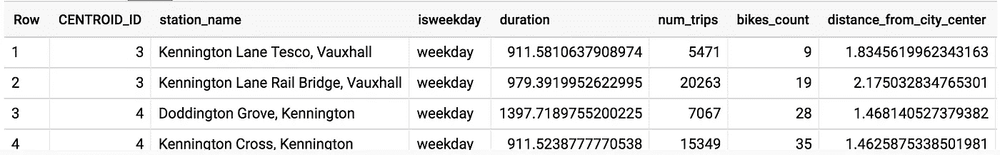
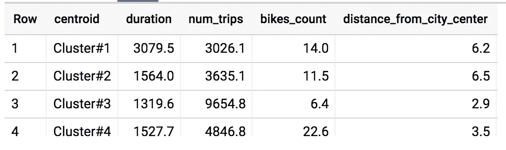
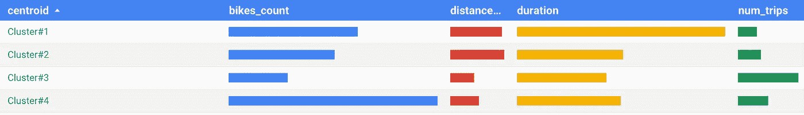

# 如何在 BigQuery ML 中使用 K-Means 聚类来更好地理解和描述数据

> 原文：<https://towardsdatascience.com/how-to-use-k-means-clustering-in-bigquery-ml-to-understand-and-describe-your-data-better-c972c6f5733b?source=collection_archive---------9----------------------->

## 谷歌云上仅使用 SQL 的无监督学习

BigQuery ML 现在支持无监督学习——您可以应用 K-Means 算法将您的数据分组到聚类中。与监督机器学习不同，监督机器学习是关于预测分析的，非监督学习是关于描述性分析的——它是关于理解你的数据，以便你可以做出数据驱动的决策。


K-Means clustering is an unsupervised learning algorithm that can help you understand your data and provide descriptive labels to your it. Photo by [Randy Fath](https://unsplash.com/photos/ZaLUzigr0mc?utm_source=unsplash&utm_medium=referral&utm_content=creditCopyText) on [Unsplash](https://unsplash.com/search/photos/peppers?utm_source=unsplash&utm_medium=referral&utm_content=creditCopyText)

## 你在聚集什么？

首先，确定什么是集群，为什么要集群。假设你是一个零售商，拥有客户交易的数据。有几种方法可以对该数据集进行聚类，这取决于您想要对聚类做什么。

*   你可以在你的顾客中找到自然群体。这叫做*客户细分*。用于客户细分的数据可能包括他们去过的商店、购买的商品、支付的金额等。你会试着去了解这些顾客群是什么样的(这些被称为*人物角色*)，这样你就可以设计出吸引这些顾客群成员的商品。
*   你可以在购买的物品中找到自然群体。这些被称为*产品组。*您可以根据购买者、购买时间、购买地点等对商品进行分类。你可以试着了解一个产品群的特征，这样你就可以学习如何减少*自相残杀*或者提高*交叉销售*。

在这两种情况下，你都在使用聚类作为一种启发式方法来帮助你做决定——设计个性化的产品或理解产品交互太难了，所以你为客户群或项目群设计。

请注意，对于产品推荐的特定用例(向客户推荐产品或针对某个产品的客户)，最好训练一个 ML 模型来做确切的事情，使用[一种协作方法，如 WALS](/how-to-build-a-collaborative-filtering-model-for-personalized-recommendations-using-tensorflow-and-b9a77dc1320) 。但是对于没有现成的预测分析方法的其他决策，聚类可能会给你一种方法来做出数据驱动的决策。

## 设置聚类问题

为了很好地使用集群，您需要做四件事:

1.  确定您正在聚类的字段。CustomerId？ItemId？然后，根据该字段的属性对数据进行聚类。
2.  查找给定客户/项目等的群。属于。
3.  了解集群的一些属性。
4.  利用这种理解来做决定。

在本文中，我将展示伦敦自行车共享数据的聚类方法。假设我们围绕自行车共享站的设计和库存做出了许多决策，我们希望了解我们系统中不同类型的站点，以便我们能够以数据驱动的方式做出这些决策。

我们需要做这四件事:

1.  集群自行车租赁站。我们需要聚类的字段是 station_name，为了这样做，我们需要找到一个站点的属性。
2.  找到每个站属于哪个集群。
3.  了解每个集群的特征。
4.  利用这种理解来做出数据驱动的决策。

但在这之前，我们首先要收集我们需要的数据。

## 0.收集数据

我们将使用的数据由伦敦的自行车租赁组成，它是欧盟地区的公共数据集，因此如果您想跟踪我的查询，请确保在欧盟地区创建一个名为 demos_eu 的数据集。

我们希望根据以下因素对电台进行分类:

*   租赁期限
*   每天的旅行次数
*   自行车架的数量
*   离市中心的距离

我们通常在工作日和周末做出不同的决定，例如储备加油站的自行车(即确保加油站有自行车出租)。因此，我们实际上要对其“主键”是 station_name 和 isweekday 组合的实例进行集群。

下面是一个将相关数据汇集在一起的查询:

```
WITH **hs** AS (
SELECT 
h.start_station_name as **station_name**,
IF(EXTRACT(DAYOFWEEK FROM h.start_date) = 1 OR
   EXTRACT(DAYOFWEEK FROM h.start_date) = 7, "weekend", "weekday") as **isweekday**,
h.**duration**,
s.**bikes_count**,
ST_DISTANCE(ST_GEOGPOINT(s.longitude, s.latitude), 
            ST_GEOGPOINT(-0.1, 51.5))/1000 as **distance_from_city_center**
FROM `bigquery-public-data.london_bicycles.**cycle_hire**` as h
JOIN `bigquery-public-data.london_bicycles.**cycle_stations**` as s
ON **h.start_station_id = s.id**
WHERE h.start_date BETWEEN CAST('2015-01-01 00:00:00' AS TIMESTAMP) AND CAST('2016-01-01 00:00:00' AS TIMESTAMP)
),**stationstats** AS (
SELECT 
station_name,
isweekday,
AVG(duration) as duration,
COUNT(duration) as num_trips,
MAX(bikes_count) as bikes_count,
MAX(distance_from_city_center) as distance_from_city_center
FROM hs
**GROUP BY station_name, isweekday**
)**SELECT * 
from stationstats
ORDER BY distance_from_city_center ASC**
```

我们正在提取 2015 年自行车租赁的数据(start_station_name，weekend/weekday，duration )(参见 WHERE 子句),并将其与车站信息(自行车数量，距市中心的距离)相结合。

然后，我们在 stationstats 中计算车站的属性(骑行的平均持续时间、出行次数)，并传递车站属性(自行车数、距市中心的距离)。我们的数据集看起来像这样:



Dataset that we will use for clustering; The primary key for our data is the combination of station_name and isweekday.

## 1.BigQuery ML 聚类

进行聚类只需要在上面的 SELECT 查询中添加一个 CREATE MODEL 语句，并删除数据中的“id”字段:

```
**CREATE OR REPLACE MODEL demos_eu.london_station_clusters
OPTIONS(model_type='kmeans', num_clusters=4,** standardize_features = true**) AS**WITH hs AS (
SELECT 
h.start_station_name as station_name,
IF(EXTRACT(DAYOFWEEK FROM h.start_date) = 1 OR
   EXTRACT(DAYOFWEEK FROM h.start_date) = 7, "weekend", "weekday") as isweekday,
h.duration,
s.bikes_count,
ST_DISTANCE(ST_GEOGPOINT(s.longitude, s.latitude), 
            ST_GEOGPOINT(-0.1, 51.5))/1000 as distance_from_city_center
FROM `bigquery-public-data.london_bicycles.cycle_hire` as h
JOIN `bigquery-public-data.london_bicycles.cycle_stations` as s
ON h.start_station_id = s.id
WHERE h.start_date BETWEEN CAST('2015-01-01 00:00:00' AS TIMESTAMP) AND CAST('2016-01-01 00:00:00' AS TIMESTAMP)
),
stationstats AS (
SELECT 
station_name,
isweekday,
AVG(duration) as duration,
COUNT(duration) as num_trips,
MAX(bikes_count) as bikes_count,
MAX(distance_from_city_center) as distance_from_city_center
FROM hs
GROUP BY station_name, isweekday
)**SELECT * except(station_name, isweekday)
from stationstats**
```

该查询处理了 1.2 GB 的数据，耗时 54 秒。模型模式列出了聚类中使用的 4 个因素:



The K-Means model schema

请注意，我们已经在我的创建模型中指定了所需的集群数量(num_clusters=4 ),并删除了我们不想在其上进行集群的因素(station_name 和 isweekday)。如果您的要素具有不同的动态范围，标准化要素是一个很好的选择(bikes_count 在 10–50 范围内，而 num_trips 在数千范围内，所以我正在这样做)。

如果我们忽略分类的数量，BigQuery ML 将根据训练数据集中的总行数选择一个合理的默认值。我们也可以做超参数调整来找到一个好的数字。本质上，我们将为 num_clusters 的不同值运行聚类，找到误差度量，并选择图形稳定的点。误差测量可通过下式获得:

```
SELECT davies_bouldin_index 
FROM ML.EVALUATE(MODEL demos_eu.london_station_clusters)
```

数字越小，聚类越好。

## 2.一个站属于哪个集群？

特定的站属于哪个集群？您可以使用 ML.PREDICT 获得该值。以下是查找名称中包含“Kennington”的每个电台的聚类的查询:

```
WITH hs AS ...,
stationstats AS ...,SELECT * except(nearest_centroids_distance) 
FROM **ML.PREDICT(MODEL demos_eu.london_station_clusters, 
(SELECT * FROM stationstats WHERE REGEXP_CONTAINS(station_name, 'Kennington')))**
```

这会产生:



Which cluster do the Kennington stations belong to?

## 3.检查集群

您可以查看聚类质心，即模型模式中 4 个因子的值，使用:

```
SELECT * FROM ML.CENTROIDS(MODEL demos_eu.london_station_clusters)
ORDER BY centroid_id
```

通过一点 SQL 操作，我们可以透视上表:

```
WITH T AS (
SELECT 
centroid_id,
ARRAY_AGG(STRUCT(feature AS name, ROUND(numerical_value,1) AS value) ORDER BY centroid_id) AS cluster
FROM ML.CENTROIDS(MODEL demos_eu.london_station_clusters)
GROUP BY centroid_id
)SELECT
CONCAT('Cluster#', CAST(centroid_id AS STRING)) AS centroid,
(SELECT value from unnest(cluster) WHERE name = 'duration') AS duration,
(SELECT value from unnest(cluster) WHERE name = 'num_trips') AS num_trips,
(SELECT value from unnest(cluster) WHERE name = 'bikes_count') AS bikes_count,
(SELECT value from unnest(cluster) WHERE name = 'distance_from_city_center') AS distance_from_city_center
FROM T
ORDER BY centroid_id ASC
```

这会产生:



Clusters’ attributes

要可视化该表，请单击“在 Data Studio 中浏览”并选择“带条形的表”。将质心列作为“维度”,其余列作为度量。然后你会得到:



Cluster attributes, visualized in Data Studio

这使我们能够解释集群。本质上，聚类#1 由人们长途乘车的郊区车站组成，聚类#2 由其他郊区车站组成，聚类#3 由繁忙的城市车站组成，聚类#4 由不那么繁忙的城市车站组成。

基于这些特征和对伦敦的一些了解，我们可以为这些集群想出描述性的名字。群组 1 可能是“一日游”，群组 2 可能是“卧室社区”，群组 3 可能是“旅游区”，群组 4 可能是“商业区”。

## 4.做出数据驱动的决策

让我们使用这些集群来做出不同的决定。

*   我们刚刚得到资金，可以扩大自行车架。我们应该在哪些车站增加额外的容量？如果我们没有聚类数据，我们会倾向于选择出行量大但自行车数量不足的站点，即聚类#3 中的站点。但是我们做了聚类，发现这组车站主要服务于游客。他们不投票，所以我们将把额外的容量放在集群#2(卧室社区)。
*   我们需要试验一种新型的锁。我们应该在哪一组站上做这个实验？商业区站似乎是合乎逻辑的，果然这些站有很多自行车，并且足够繁忙以支持 A/B 测试。
*   我们想在一些加油站储备赛车。哪些？第一组，为出城一日游的人服务的车站。

显然，我们可以通过每次进行定制数据分析来单独做出这些决定。但是把电视台聚集在一起，想出描述性的名字，并用这些名字来做决定要简单得多，也更容易解释。

你只用 SQL 就能做到这一切的事实？那很酷。