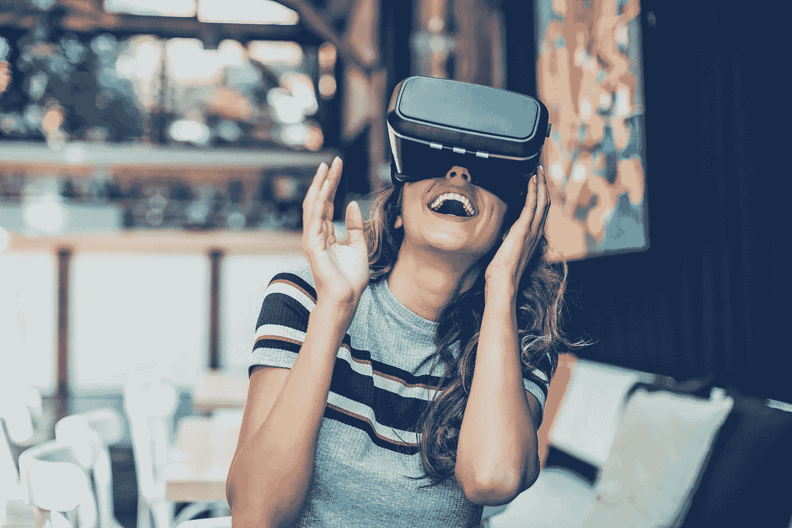

# 如何利用学习和发展培训来推动创新

> 原文：<https://towardsdatascience.com/how-to-use-learning-development-training-to-drive-innovation-793ec5b91ff?source=collection_archive---------22----------------------->

## L&D 对数据科学的优势和益处。

最近的研究揭示了各行各业的组织如何利用学习和发展(L & D)培训来最大化他们的创新潜力。实践培训专家已经确定了一些关键的策略，这些策略有助于将创新文化带入你的办公室。

在当今全球化的市场中经营企业的复杂现实往往意味着面临激烈的全球竞争，并不断更新您组织的目标，以跟上您所在行业的最新和最大的创新趋势。在以技术为基础的行业和数据科学功能中尤其如此，在这些行业中，新的创新和通往数字化的道路是每天的现实。

虽然竞争前景可能令人望而生畏，但职业发展培训是在你的工作场所文化中巩固创新的直接而有效的方式。

来自 findcourses.com 的 2019 年 L&D 报告基准测试了各行业和市场的公司如何利用 L&D 培训来保持其组织在各自领域的创新前沿。该报告发现了收入增长、学习和创新之间的持续关系。从在您的培训基础设施中构建敏捷性，到在培训环境中利用最新技术，培训专业人员展示了企业如何利用 L&D 培训来构建可持续的创新文化，从而在 21 世纪的市场中导航。

## 敏捷的培训基础设施孕育着灵活性

在数据科学部门或以技术为基础的行业工作时，您可能会觉得敏捷性已经成为您日常职责的一个固有方面。诚然，这些角色和行业通常需要相当大的灵活性，但问自己一些关键问题也是值得的:

贵组织的培训基础设施中融入了多少灵活性？此外，这种敏捷性可以转化为您的整体工作场所文化吗？

据 Wyndham Destinations 负责学习和发展的副总裁 Anthony Sandonato 称，为 110 多个国家的 25，000 多名员工实施敏捷培训基础设施是成功的核心战略。Sandonato 解释说，温德姆的“L&D 团队结构建立在灵活的框架之上，旨在保持敏捷并适应持续的组织变化，而不会影响我们人才发展战略的速度或质量。”

创建敏捷培训功能将有助于您将培训目标与组织目标的整体转变保持一致。这些目标可以随时改变，因为每个企业都试图跟上最新的创新和趋势。虽然数据科学是一个技术密集型领域，但如果你希望吸引和留住最优秀的人才，那么在评估技术的创新性之前，你应该接受这样一种心态，即[灵活和创造性的工作场所文化应该是你的优先事项](/the-mindset-for-innovation-with-data-science-fc51605a4867)。

该报告还发现，高管高度参与 L&D 事务的公司认为自己公司有创新文化的可能性是其他公司的 3 倍。在具有敏捷培训功能(由高层管理人员引入)的培训室中展示灵活心态的重要性，将有助于自下而上地带来
文化变革。

在来自英国的一份类似的研发报告中，41%的市场挑战者预测他们的研发预算会增加。L & D 有助于为员工创造空间，将适应性和敏捷性从理论领域带入实际应用。

敏捷数据科学并不总是所有团队的完美方法，但是根据 Eugene Yam 的说法，“数据科学团队在‘倾听数据’和研究方面有优势。应用创新来改善组织成果应该是他们使命的一部分。”[1]一旦您将敏捷性确立为贵组织培训职能的一个关键原则，在培训室学到的灵活技能和策略就可以扩大规模，以提高您数据科学职能的整体质量和能力。

## 从数据科学到培训室，技术无处不在

一旦你在你的培训职能和整个运营层级中建立了创新文化，重新评估技术在你的培训产品中的使用是使创新成为新的文化规范的合乎逻辑的下一步。

技术和数字化是商业世界中一条持续且不可避免的道路，在评估完成工作的最佳技术时，培训行业与数据科学没有什么不同。

报告发现，在所有被调查的公司中，高达 84%的公司在他们的 L&D 职能部门使用技术。从电子学习到微视频再到虚拟现实，创新技术彻底改变了培训行业。此外，该报告发现，收入增长的公司在其 L&D 产品中使用虚拟现实和基于游戏的学习等创新技术的可能性是其他公司的两倍。

在培训环境中利用这些创新技术，不仅会影响您培训基础设施的整体灵活性，还会强化理论培训原则，并将其引入您蓬勃发展的创新文化中。深度强化学习(DRL)通过[游戏化的人工智能训练策略](/new-game-theory-innovations-that-are-influencing-reinforcement-learning-24779f7e82b1)如平均场、随机和进化游戏都是利用技术力量并最大限度地发挥其训练潜力的创新方式。

虚拟现实(VR)通过你的培训功能提供了另一个保持创新文化的机会。数字教练公司 STRIVR 的首席战略官丹尼·贝尔彻(Danny Belch)表示:“由于虚拟现实的按需特性，只需点击一个按钮，就可以激发真实的生活体验。你现在可以练习这些情况。通过完整的端到端实践，您可以获得合法的逼真场景。这不是角色扮演。它是孤独的，赌注是免费的。你有这个美丽的自由空间去练习，去结结巴巴地说你的话。”

除了基于游戏的学习，通过虚拟现实创建真实生活场景来培训新员工或现有员工不仅是强化重要学习目标的好方法，还可以帮助您在测试中从员工那里获得即时而有价值的反馈，深入了解正在使用的技术的具体特性。

## 外卖

拜耳美国学习与人才发展主管凯伦·比金说:“当你生活在创新中时，你可以影响创新。”利用创新的 L&D 培训战略，开始构建基础设施，以支持您组织中的创新文化，并期待培训技术的力量进一步推动培训室的创新。推动创新不会在一夜之间带来变化，但 L&D 培训可以让每个参与者的旅程变得更加高效、富有成效和创造性。

引用资料来源:
[1] E. Yam。数据科学与敏捷(2019)，走向数据科学。