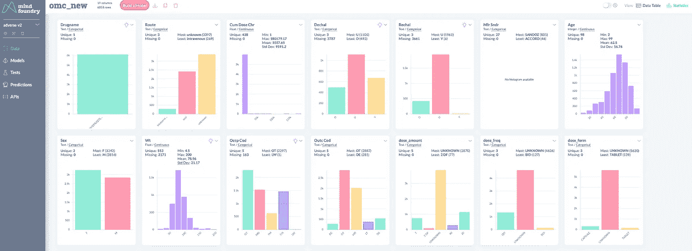
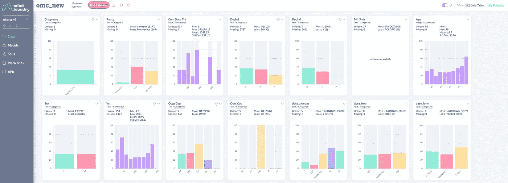
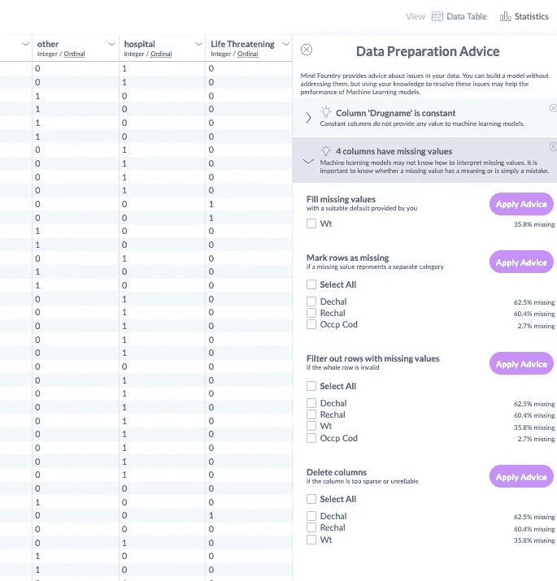
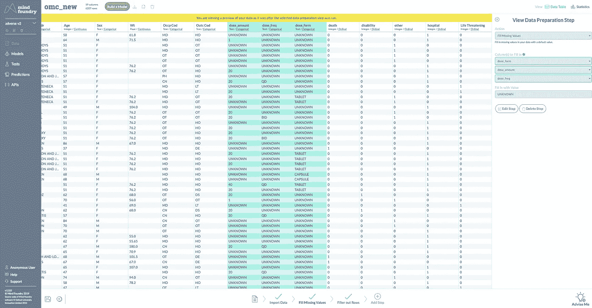
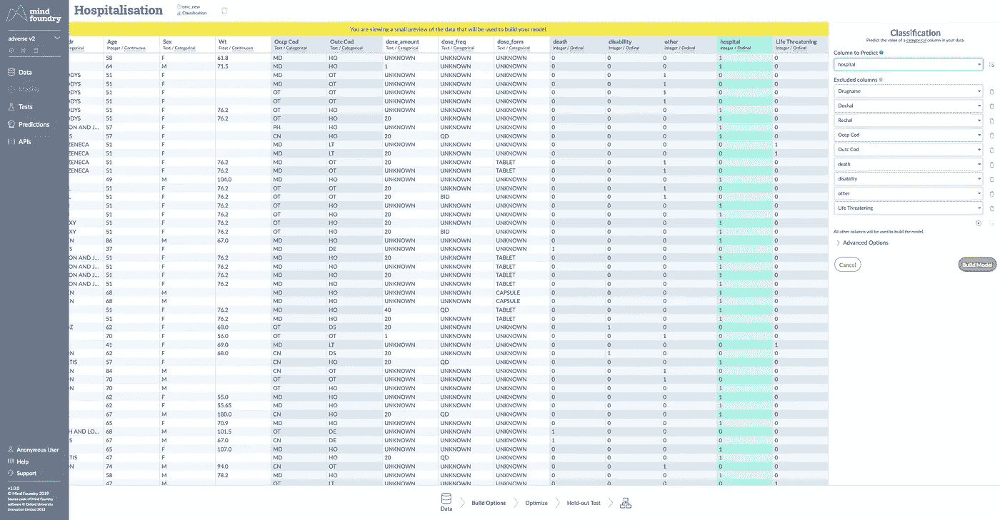
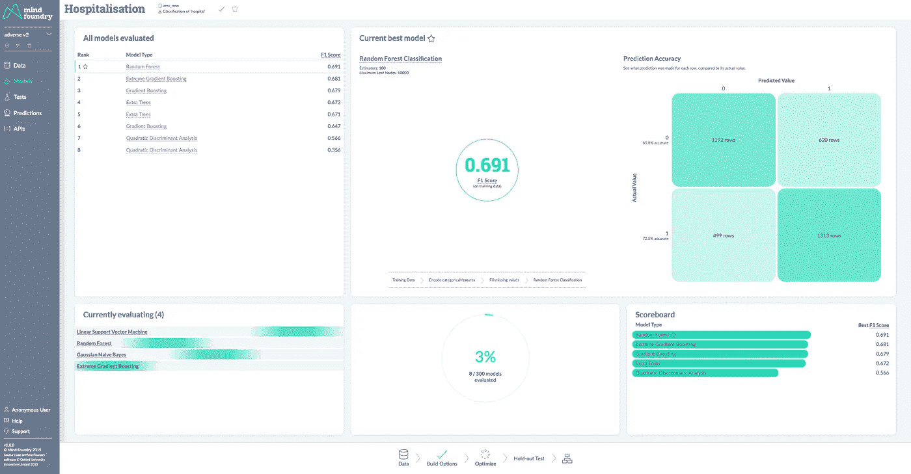
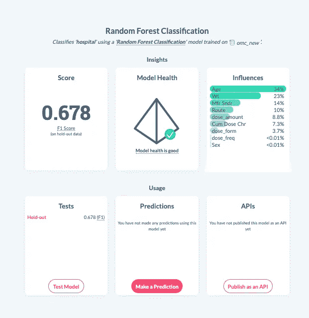
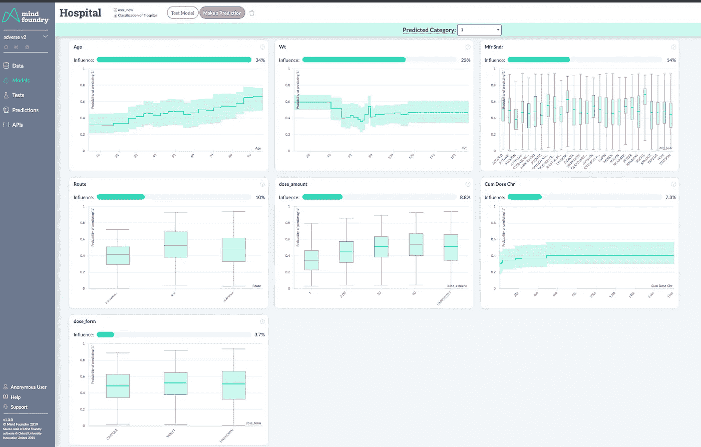
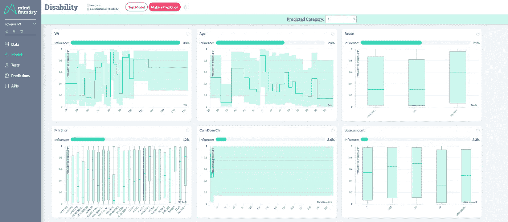

# 如何利用机器学习预测药物不良反应

> 原文：<https://towardsdatascience.com/how-to-use-machine-learning-to-forecast-adverse-drug-reactions-abc83ab91afd?source=collection_archive---------34----------------------->

## 利用机器学习改善患者结果

**更新**:我开了一家科技[公司](http://www.legislate.tech/)。你可以在这里找到更多

当病人对药物产生意外反应时，对个人来说是危险的，对社会来说也是昂贵的。然而，如果医疗专业人员可以使用机器学习来预测不良药物反应(ADRs)并最小化对患者的风险，会怎么样？

药品不良反应是医疗保健行业的一个大问题，直接占所有住院人数的大约[5%](https://www.sciencedirect.com/topics/medicine-and-dentistry/adverse-drug-reaction),估计是全球第六大死亡原因。[个性化药物已经是一个快速发展的趋势，](https://www.england.nhs.uk/healthcare-science/personalisedmedicine/)但是想象一下，如果医生能够在给病人开药之前预测出病人发生药物不良反应的可能性。

FDA 的不良事件报告系统( [FAERS](https://open.fda.gov/data/faers/) )收集全世界记录的每一个不良事件的信息。我们利用这些数据训练了一个机器学习模型来预测 ADRs，并探索[奥美拉唑](https://www.nhs.uk/medicines/omeprazole/)药物不良反应的原因。

# 1.将数据加载到 Mind Foundry

FAERs 数据集包含大量信息，但我们采取了额外的预防措施来排除那些预先假定存在 ADR 的变量，如去挑战/再挑战代码。

将数据加载到 Mind Foundry 后，我们能够看到遭受药物不良反应的患者的汇总统计数据。

特别是，我们可以看到每个 ADR(例如住院)在其他变量中的分布情况。

我们用来预测不良反应的因素是患者的:

*   性别、年龄和体重
*   剂量、形式、频率和途径
*   累积剂量
*   药品制造商

数据集中包括的 ADR 有:

*   死亡
*   危及生命的情况
*   残疾
*   住院治疗(= hospitalization)
*   其他严重

# 2.准备数据

Mind Foundry 会自动扫描数据以发现潜在问题，并就如何最好地为机器学习建模准备数据向用户提供建议。

基于我们对数据的理解，我们选择简单地将剂量、频率和形式中的缺失值标记为“未知”。然后，我们可以通过简单的点击来自动应用建议。

Mind Foundry 还对应用于数据的每个处理步骤进行完整的审计跟踪，然后可以编辑或导出新数据。

# 3.模拟不利住院

当我们准备好构建我们的模型时，我们需要做的就是告诉 Mind Foundry 我们希望预测哪一列。然后，它会自动处理数据到训练集和测试集的严格分割，所以它不会过度适应您的解决方案。

然后，Mind Foundry 将开始搜索最佳数据科学管道，并在搜索过程中提供一些性能统计数据。

# 4.验证和解释模型

一旦找到最佳解决方案，Mind Foundry 会通过指示其预测能力与随机模型相比是否显著来验证模型的健康状况。这些测试是在从训练中排除的原始数据集的 10%范围内执行的。

Mind Foundry 还指出了每个变量在模型决策中的相对权重，以及每个变量如何影响结果。

# 4.调查结果

Mind Foundry 指出，住院的机会随着患者年龄的增长而增加，但随着体重的增加而减少。

这可能看起来很奇怪，但考虑到超过一定体重后残疾的可能性会显著增加，因此成为主要的 ADR，这是可能的。

制药商似乎对住院几率也有轻微影响。最后，口服途径和 40 毫克剂量的片剂将增加住院的机会。

这项简短的研究强调了机器学习使用患者数据预测 ADR 的潜力。从更大的角度来看，它还揭示了医生根据每个患者的具体情况量身定制处方的可能性，以及药品制造商为高危患者群体重新设计治疗方法的可能性。