# 如何利用机器学习有可能成为百万富翁:预测股市？

> 原文：<https://towardsdatascience.com/how-to-use-machine-learning-to-possibly-become-a-millionaire-predicting-the-stock-market-33861916e9c5?source=collection_archive---------2----------------------->

## 我们的置信区间在 50%到 70%之间

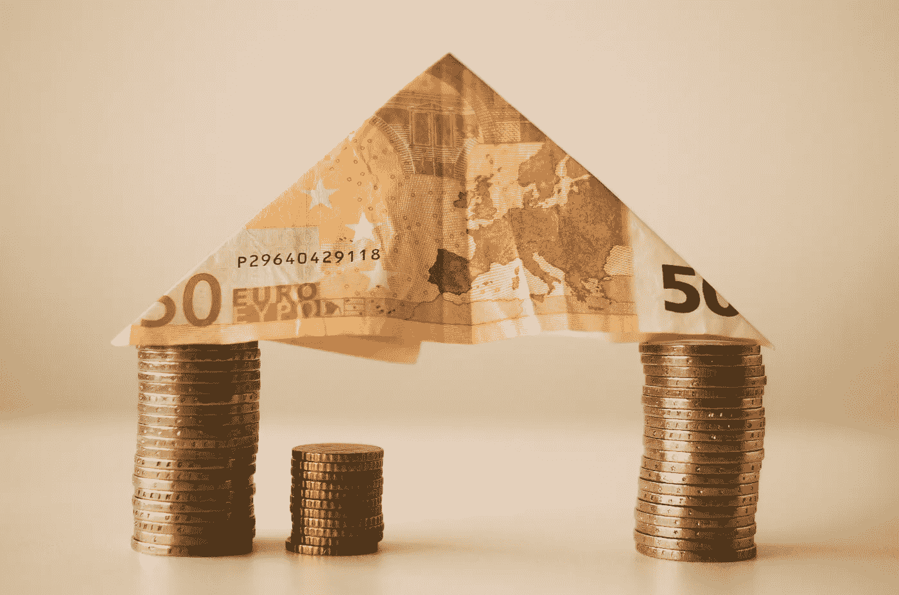

When you’re so bored with your stacks

在华尔街工作和你想象的一样紧张和有回报。许多西装，许多阴沉的脸和大量的香烟烟雾。在你所期待的世界金融中心的疯狂中，每个人的潜在目标都很简单。冒着把事情过于简单化的风险，我现在就告诉你，金融就是用钱(你自己的或者你借的)来获得更多的钱。金融业实际上并不创造任何价值，而是利用其他因素来获得投资回报。

股票市场是最著名的基础设施之一，通过它任何人都有可能发财。如果有人能破解预测未来股票价格的密码，他们将几乎统治世界。

只有一个问题。准确预测股票市场的未来几乎是不可能的。那么多的分析师，那么多的研究人员，那么多超级聪明的人都试图弄清楚这一切。没有人能够获得一致的结果。没有人。

那么这篇文章的重点是什么呢？为什么我要写关于使用机器学习来预测股票市场的可能性？我猜主要是为了好玩。然而，更重要的是，对于机器学习和金融来说，这是一个很好的学习练习。

# 议程

1.  储料器模块
2.  移动平均线
3.  简单线性回归
4.  k-最近邻
5.  多层感知器
6.  你应该做什么
7.  需要改进的地方
8.  资源

*如果你想更深入地了解这个项目，或者如果你想添加代码，查看一下* [*GitHub 库*](https://github.com/jerrytigerxu/Stock-Price-Prediction) *。*

# 使用储料器模块

Stocker 模块是一个简单的 Python 库，包含了许多有用的股票市场预测函数。在初始化时，它们不是那么准确(最好抛硬币决定)。但是通过一些参数的调整，结果会好得多。

首先我们需要克隆 GitHub 库。

```
!git clone [https://github.com/WillKoehrsen/Data-Analysis.git](https://github.com/WillKoehrsen/Data-Analysis.git)
```

我们还需要导入一些库。既然已经克隆了 repo，我们也可以导入 Stocker 模块了。

```
!pip install quandl
!pip install pytrends
import stocker
from stocker import Stocker
```

让我们创建一个 Stocker 对象。我选择谷歌作为我的公司，但你没有义务也这样做。Stocker 模块有一个名为 plot_stock()的函数，它自己做了很多工作。

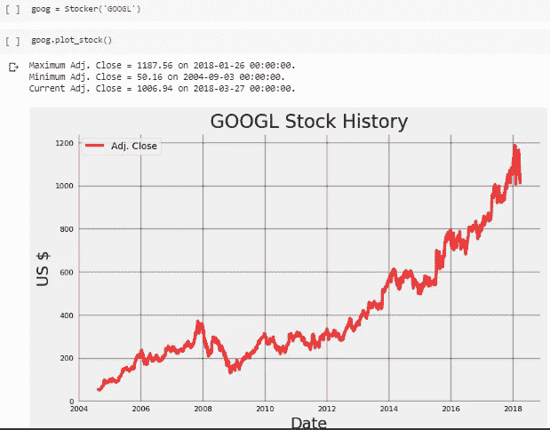

Google’s stock is very nice

如果您注意的话，您会注意到 Stocker 对象的日期不是最新的。止于 2018–3–27。仔细看看实际的模块代码，我们会发现数据来自 Quandl 的 WIKI 交换。也许数据没有更新？

我们可以使用 Stocker 进行技术股票分析，但现在我们将专注于成为媒介。Stocker 使用了一个由脸书开发的叫做 prophet 的软件包，这是一个很好的附加建模软件。

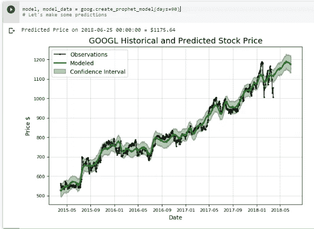

现在让我们测试一下斯托克的预测。我们需要创建一个测试集和一个训练集。我们将培训时间定在 2014 年至 2016 年，测试时间定在 2017 年。让我们看看这个模型有多精确。

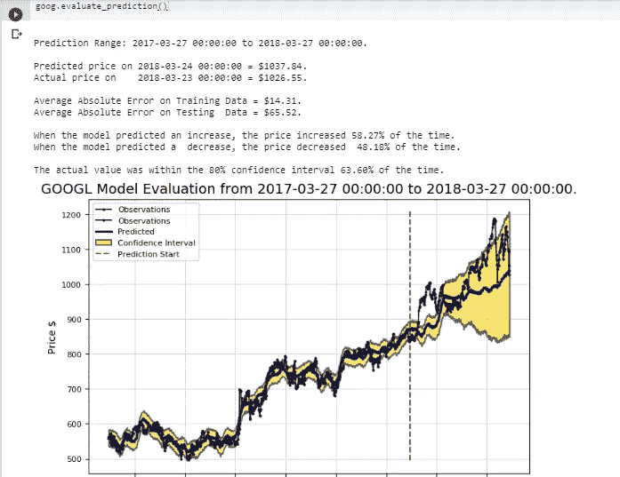

Look how terrible this prediction is!

结果相当可怕，预测几乎和掷硬币一样糟糕。让我们调整一些超参数。

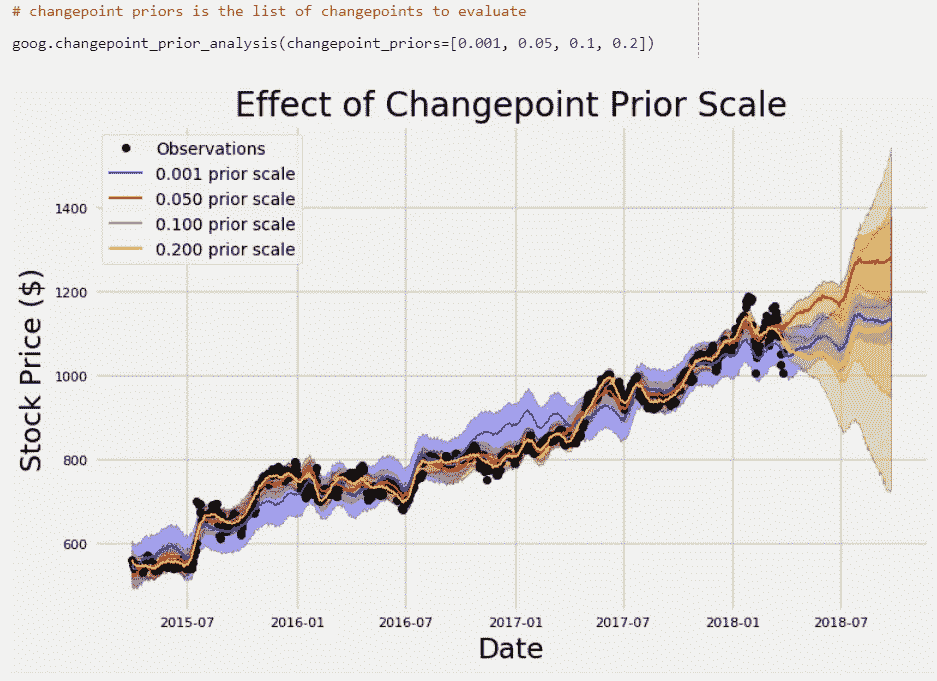

Here we can see the results of using different changepoints

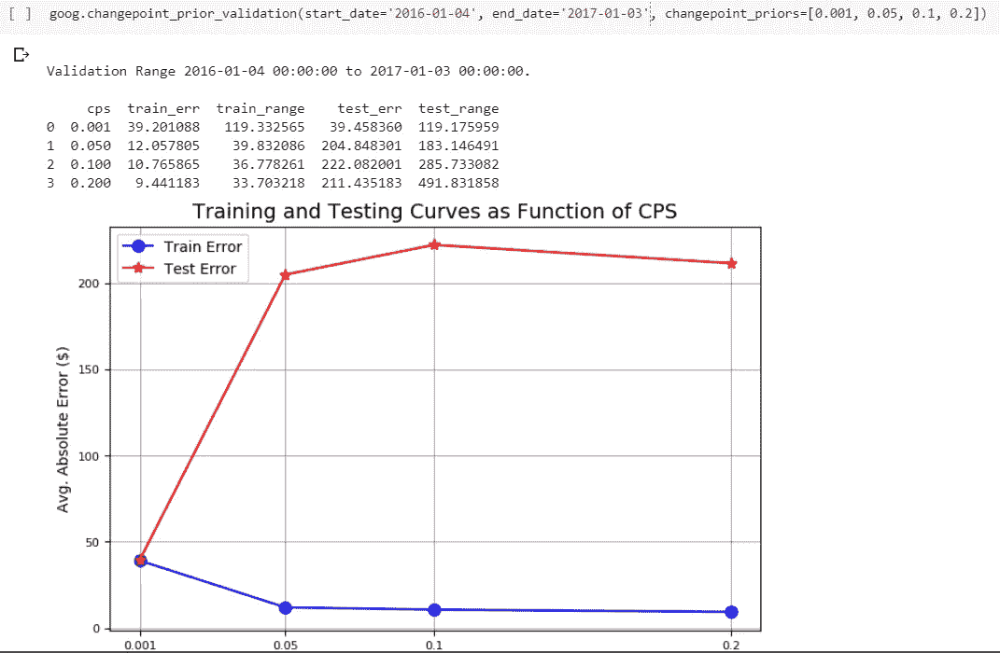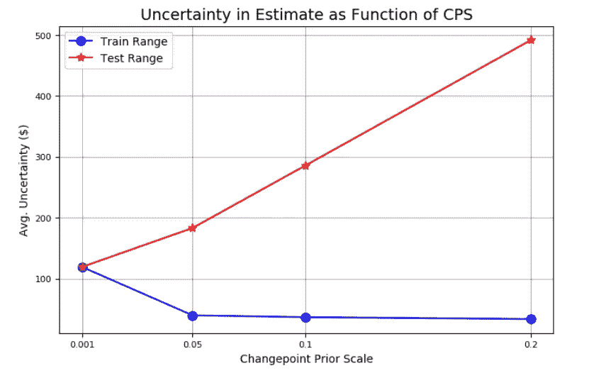

对变点进行验证是调整超参数以更好地调整股票预测算法的有效方法。

现在，我们可以评估优化的模型，看看预测估计值是否有任何改进。

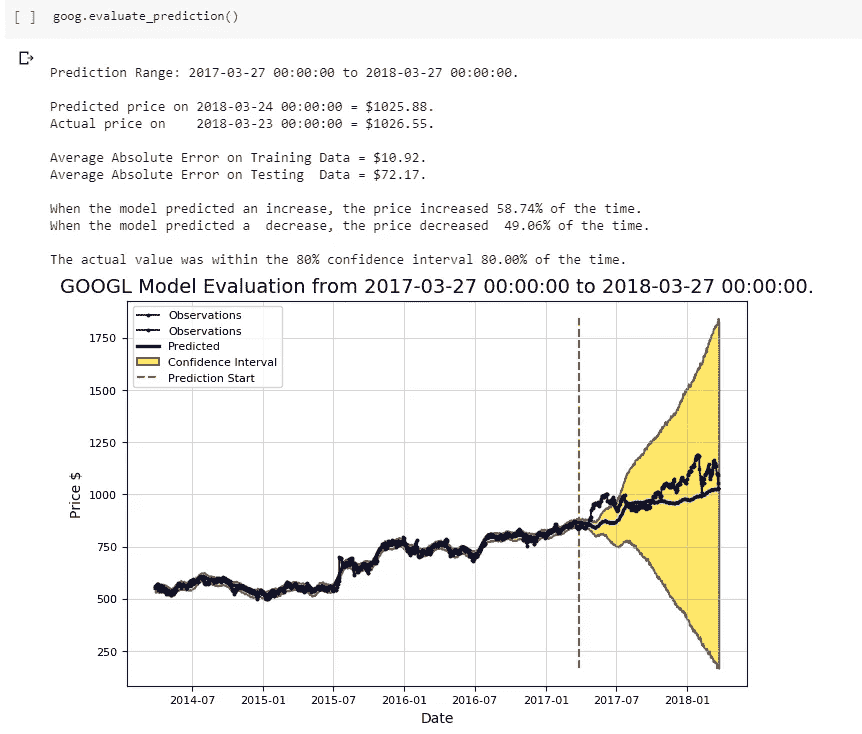

This is only SLIGHTLY better than the previous model

现在是做终极测试的时候了:去股市碰碰运气(当然是模拟的)。

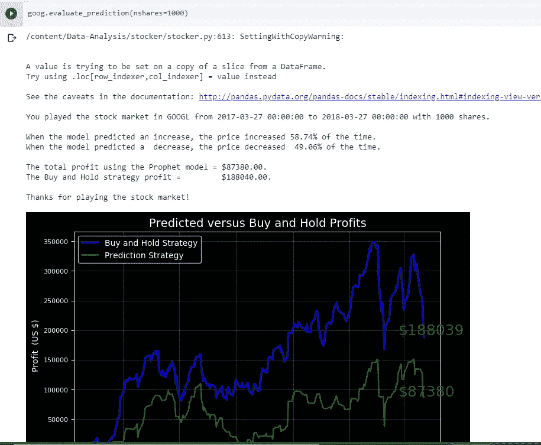

Looks like it’s just better to buy and hold.

即使在所有这些调整之后，很明显，简单地买入并持有会产生更好的回报。

# 为机器学习准备数据

现在让我们继续尝试用机器学习来预测股票价格，而不是依赖于一个模块。对于这个例子，我将使用 Stocker 提供的 make_df 函数来使用 Google 股票数据。

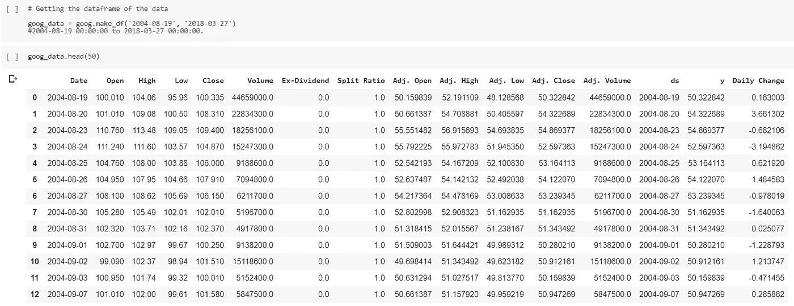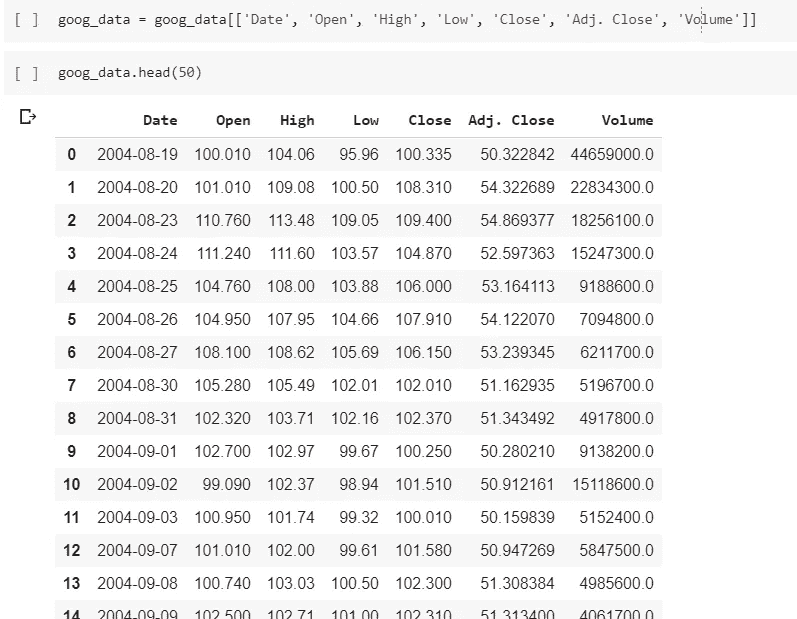

Narrowing down the dataframe to get the stuff we care about

# 移动平均线

总之，均线是技术分析中常用的指标。这是一个滞后指标，这意味着它使用过去的价格来预测未来的价格。它可以有效地消除任何短期波动，并找到整体趋势。我们将使用移动平均线来看看我们是否能更好地预测股票价格。

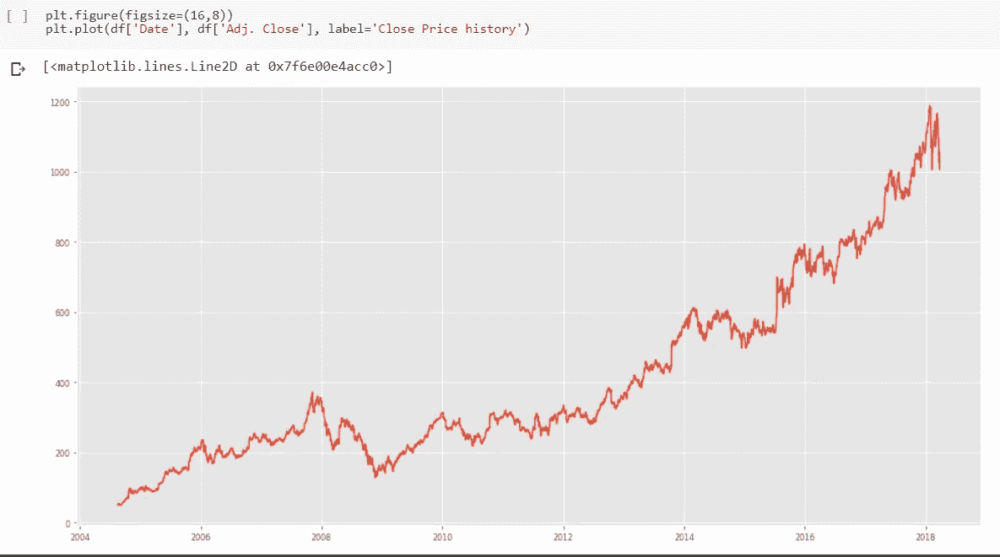

Here’s the closing prices for Google stock

让我们用 RMS(均方根误差)来衡量我们模型的准确性。

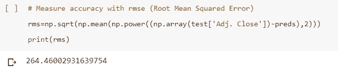

现在让我们看看我们的预测在实际价格旁边的位置。

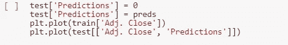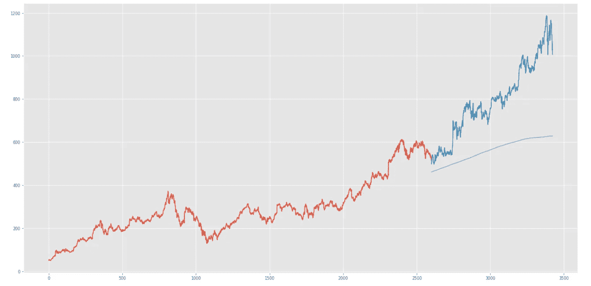

Yikes

就找出股票数据的总体趋势而言，移动平均线方法做得不错，但它未能看到价格上涨的全部幅度，这不好。我们肯定不想用这种方法进行实际的算法交易。

# 简单线性回归

让我们尝试使用另一种方法来预测未来的股票价格，线性回归。

首先，让我们基于原始数据集创建一个新的数据集。

现在，让我们为线性回归算法的数据集添加更多的要素。我们将使用 **fastai** 模块中的一些函数。

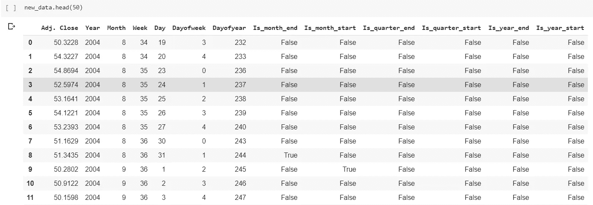

现在让我们做一个火车测试分裂。

现在我们可以实现算法并得到一些结果。

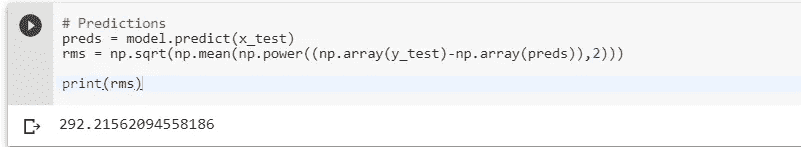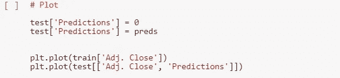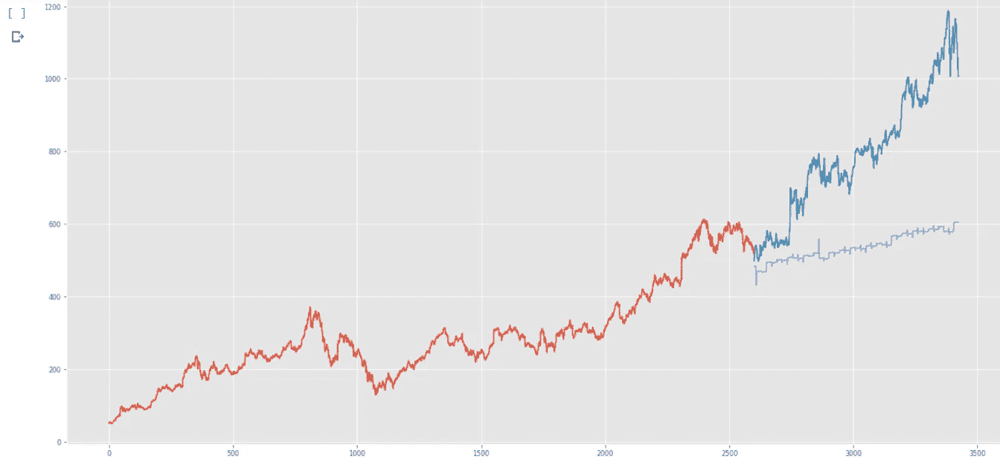

再一次，预测算法在某种程度上指出了总体趋势，但是它没有抓住我们最需要的东西。

# k-最近邻

让我们继续另一个机器学习算法，KNN。

让我们用和线性回归一样的数据经历同样的过程。唯一的区别是我们将对数据实施不同的算法。让我们看看哪些预测更好。

我们的结果是什么？

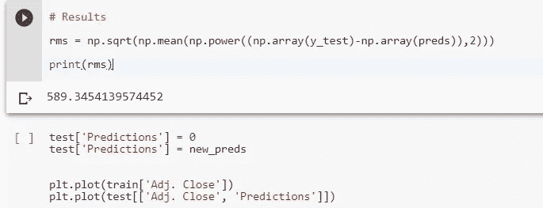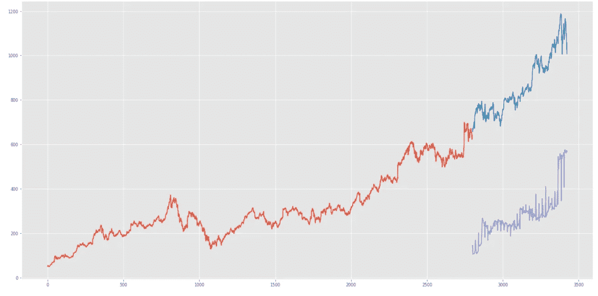

What a horror story

呀！这是迄今为止我们得到的最糟糕的预测！k-最近邻对于分类问题和小规模回归更有用是有原因的。这似乎是过度拟合的典型案例。因为 KNN 实际上只是计算从一个点到另一个点的距离，它完全无法计算出价格走向的趋势。下一步是什么？

# 多层感知器

让我们进入一些深度学习，更具体地说，神经网络。多层感知器是最简单的神经网络类型之一，至少比卷积神经网络和长短期记忆简单。我们不需要深入算法实际工作的细节。如果您感兴趣，请查看本文末尾的参考资料。

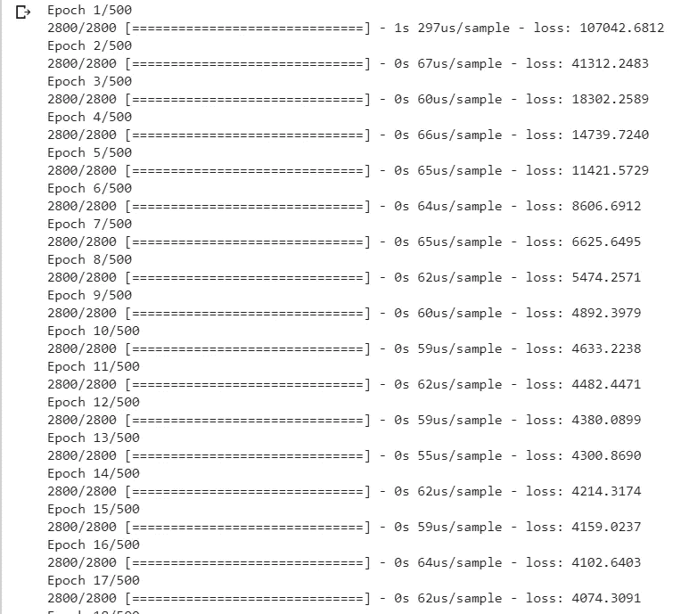

让我们看看结果。

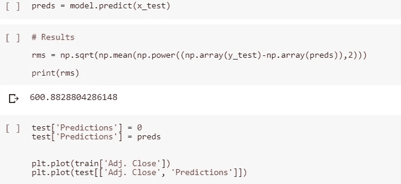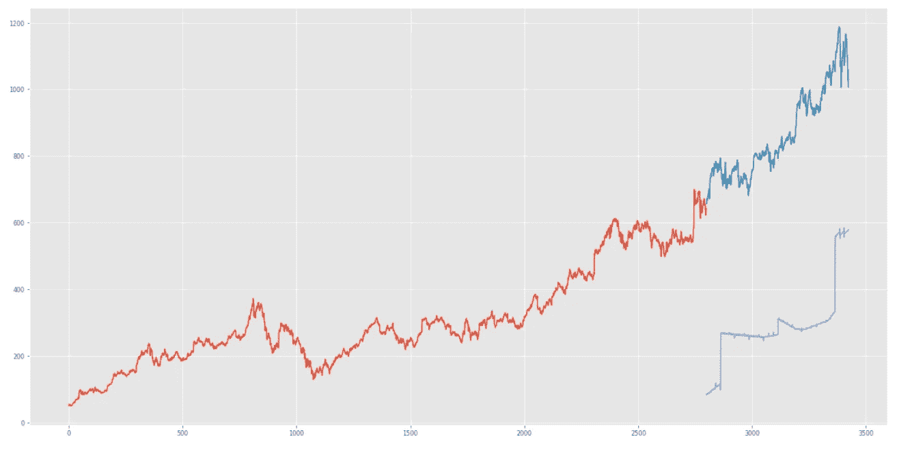

这比 KNN 还糟糕！关于为什么神经网络在预测股票价格方面如此糟糕，有许多因素，其中之一肯定是缺乏有意义的特征和数据。显然，还有许多超参数可以调整。

# 结论

我们今天学了什么？所有这些技术分析向我们展示了什么？答案很简单:如果你不是雷伊·达里奥、沃伦·巴菲特或任何伟大的投资者，那么试图跑赢股市的风险很大，最终也不会那么有利可图。根据一些消息来源，大多数对冲基金甚至不能比标准普尔 500 做得更好！因此，如果你想在你的投资上获得最好的回报，就采取买入并持有的策略。在很大程度上，简单地投资于标准普尔 500 这样的指数基金已经获得了相当不错的回报，即使是在经济出现几次大幅下滑的时候。最后还是要由你来决定。

# 需要改进的地方

感谢您花时间通读这篇文章！请随意查看我的[作品集网站](https://jerrytigerxu.github.io/?source=post_page---------------------------)或[我的 GitHub](https://github.com/jerrytigerxu?source=post_page---------------------------) 。

## 1.使用不同的股票数据

我只在相对较短的时间内使用了谷歌股票数据。随意使用不同的数据，这些数据可以通过 Stocker 或 Yahoo Finance 或 Quandl 获得。

## 2.尝试不同的机器学习算法

有许多非常好的机器学习算法。我只使用了其中的一小部分，其中只有一个是深度学习算法。

## 3.调整更多超参数

这是不言自明的。大多数情况下，任何算法的默认设置都不是最优的，因此尝试一些验证来找出哪个超参数最有效是很有用的。

# 资源

1.  [了解股市](https://www.youtube.com/watch?v=p7HKvqRI_Bo)
2.  [技术分析](https://www.youtube.com/watch?v=HzNTUp-WAIE)
3.  [什么是机器学习？](https://www.youtube.com/watch?v=HcqpanDadyQ&t=7s)
4.  [移动平均线](https://www.youtube.com/watch?v=4R2CDbw4g88)
5.  [线性回归](https://www.youtube.com/watch?v=nk2CQITm_eo)
6.  [K-最近邻](https://www.youtube.com/watch?v=HVXime0nQeI)
7.  [神经网络](https://www.youtube.com/watch?v=aircAruvnKk&t=4s)
8.  [张量流](https://www.youtube.com/watch?v=UbMDK4UNtPA)
9.  [Keras](https://www.youtube.com/watch?v=J6Ok8p463C4)