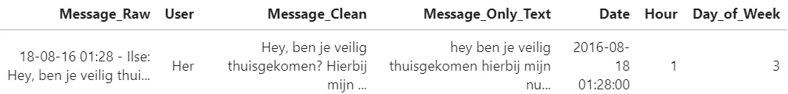
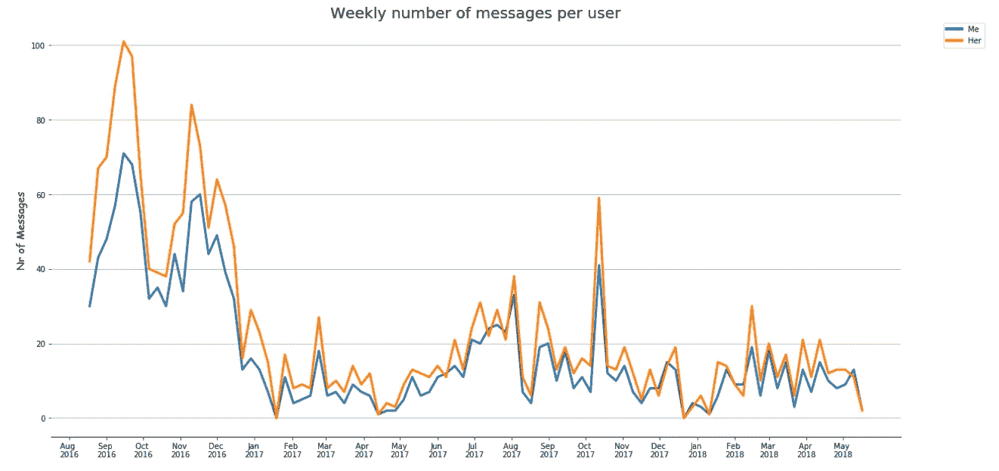
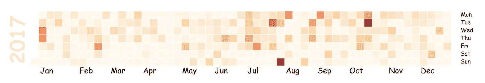
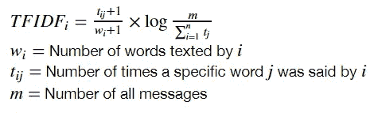
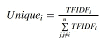
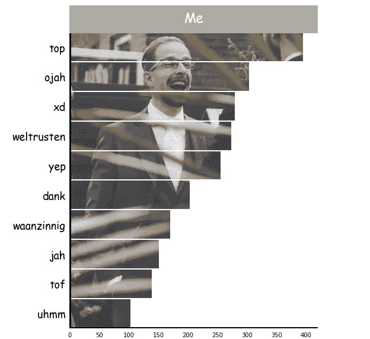
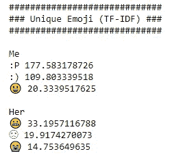
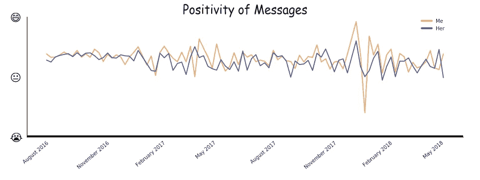
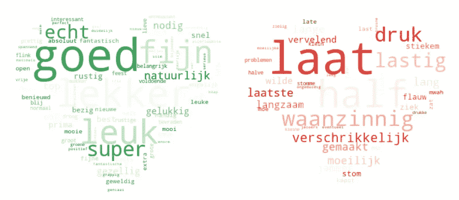
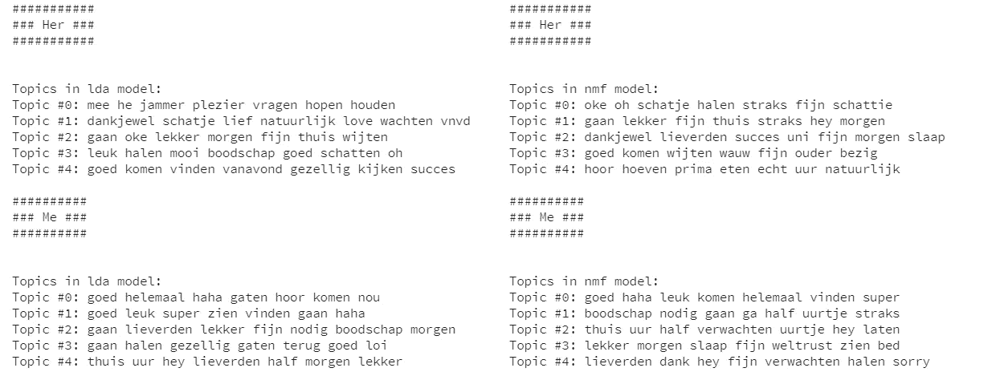

# 如何使用 NLP 分析 WhatsApp 消息

> 原文：<https://towardsdatascience.com/how-to-use-nlp-to-analyze-whatsapp-messages-1adf0e85907c?source=collection_archive---------8----------------------->

## NLP-WhatsApp

## 使用 NLP 分析我和妻子之间的 WhatsApp 消息


2018 年 8 月 17 日，我和我梦想中的女人结婚了，想在婚礼前一天送她一份礼物给她一个惊喜。当然，作为一名数据科学家，我必须通过**数据**进行交流！

我们的 **WhatsApp messages** 似乎是一个很好的信息来源。我使用 NLP 来分析消息，并创建了一个小的 python 包，名为[**【SOAN】**](https://github.com/MaartenGr/soan)，它允许你这样做。

在这篇文章中，我将指导你完成我所做的分析，以及你将如何使用我创建的包。点击[此](https://faq.whatsapp.com/en/wp/22548236)链接，获取将 WhatsApp 文本下载为. txt 的说明。

# **预处理数据**

该包允许您预处理。txt 文件作为特定的格式是进行分析所必需的。只需导入 helper 函数来导入数据和处理数据。 *import_data* 用于导入数据，而 *preprocess_data* 用于准备数据，以备分析。

```
from soan.whatsapp import helper      # Helper to prepare the data
from soan.whatsapp import general     # General statistics
from soan.whatsapp import tf_idf      # Calculate uniqueness
from soan.whatsapp import emoji       # Analyse use of emoji
from soan.whatsapp import topic       # Topic modeling
from soan.whatsapp import sentiment   # Sentiment analyses
from soan.whatsapp import wordcloud   # Sentiment-based Word Clouds%matplotlib inline
df = helper.import_data('Whatsapp.txt')
df = helper.preprocess_data(df)
```

在对数据进行预处理后，您将得到几个列:Message_Raw、Message_Clean、Message_Only_Text、User、Date、Hour、Day_of_Week。Message_Raw 包含原始消息，Message_Clean 仅包含消息本身，不包含用户或日期，Message_Only_Text 仅保留小写文本并删除任何非字母数字字符:



The first row of our cleaned messages. It is in Dutch but basically states if I made it home alright :-P

# **探索性数据分析(EDA)**

既然已经对数据进行了预处理，就可以根据消息的频率创建一些初始图。调用 *plot_messages* 绘制每周的信息频率:

```
general.plot_messages(df, colors=None, trendline=False, savefig=False, dpi=100)
```



Weekly count of the number of messages over time.

有趣的是，这表明在 2016 年 12 月左右，消息似乎出现了明显的下降。那时我们搬到了一起住在 T21，这解释了为什么我们不需要给对方发那么多短信。

我还对我和妻子之间每天的信息频率感兴趣。从 Github 借鉴了一些灵感来创建一个日历情节(使用修改版的 [CalMap](https://pythonhosted.org/calmap/) ):

```
general.calendar_plot(df, year=2017, how='count', column='index')
```



The frequency of messages (darker = more often)

有一段时间，我们发短信的频率更高，但这似乎不是一种视觉上可以观察到的模式。让我们和 TF-IDF 一起更深入的探讨一下！

# **独特的文字(TF-IDF)**

我想展示一些对我们来说独一无二但也经常使用的单词。例如，单词“Hi”可能对我来说是唯一的(因为她总是使用单词“Hello”)，但如果我在数百条消息中只使用一次，它就不会那么有趣了。为了对此建模，我使用了一种流行的算法，称为 TF-IDF(即，术语频率-逆文档频率)。它获取文档中单词的频率，并计算这些单词在语料库中的反比:



TF-IDF slightly adjusted to work with text messages

基本上，它会告诉你哪些单词重要，哪些不重要。例如，像“the”、“I”和“an”这样的词出现在大多数文本中，通常并不那么有趣。

你在上面看到的 TF-IDF 版本略有调整，因为我关注的是一个人发短信的字数，而不是文本的数量。

下一步是通过简单地划分每个人的 TF-IDF 分数来计算每个人的独特性分数:



Uniqueness score for each person.

正如你在上面的公式中看到的，它考虑了聊天中每个人的 TF-IDF 分数。因此，它也适用于**群组**聊天。

从事数据科学的一件重要事情是以清晰、有趣和吸引人的方式交流结果。因为我的观众是我的妻子，我必须确保我的视觉效果是清晰的。我决定使用一个水平直方图来显示最独特的单词和它们的分数。水平直方图中的单词通常更容易阅读。为了使它在视觉上更有趣，您可以使用条形作为您想要包含的任何图像的遮罩。出于演示的目的，我用了一张我婚礼的照片:

```
unique_words = tf_idf.get_unique_words(counts, df, version = 'C')
tf_idf.plot_unique_words(unique_words, user='Me', 
                         image_path='histogram.jpg', image_url=None,
                         title="Me", title_color="white", 
                         title_background='#AAAAAA', width=400,
                         height=500)
```



My top 10 most unique words used in our text messages.

# **表情符号和情感分析**

我们使用的表情符号在一定程度上可以描述我们的感受。我觉得将你之前看到的公式(即 TF-IDF +独特词汇)应用于**表情符号**会很有趣。换句话说，哪些表情符号是谁独有的，但也经常使用？

我可以简单地获取原始信息并提取表情符号。然后，这是一种简单的方式来计算表情符号的数量并应用公式:

```
emoji.print_stats(unique_emoji, counts)
```



Unique and frequently emojis per person.

显然，我独特的表情符号更积极，而她的表情符号似乎是消极的。这并不一定意味着我使用更多积极的表情符号。这仅仅意味着她独特的表情符号倾向于更加消极。

这些分析的自然结果是**情绪**。从我们的信息中可以看出我们之间的关系是否有所下降？首先，我们需要提取积极的信息。请确保通过以下方式创建一个包含情感得分的新列:

```
from pattern.nl import sentiment  as sentiment_nl
df['Sentiment'] = df.apply(lambda row: 
                           sentiment_nl(row.Message_Clean)[0], 1)
```

我决定不把情感步骤放在包里，因为有很多方法(和语言)来创造情感。也许你想使用不同的方法，而不是基于词典的方法。然后，我们可以计算平均每周情绪，并绘制结果:

```
sentiment.plot_sentiment(df, colors=[‘#EAAA69’,’#5361A5'],     
                         savefig=False)
```



Our sentiment over time. The y-axis shows how happy or sad we communicated in that period.

2018 年 1 月，我遭遇了一场事故，这解释了那段时间信息的负面性。

# **基于情感的词云**

词云通常用于演示哪些词在文档中频繁出现。经常出现的词比只出现几次的词大。

为了让云彩更有趣，我用情感将它们分开。积极的词语和消极的词语有着不同的含义:

```
(positive, 
negative) = wordcloud.extract_sentiment_count(counts, 
                                              user = "Me")wordcloud.create_wordcloud(data=positive, cmap='Greens', 
                           mask='mask.jpg', 
                           stopwords='stopwords_dutch.txt',     
                           random_state=42, max_words=1000,  
                           max_font_size=50, scale=1.5, 
                           normalize_plurals=False,  
                           relative_scaling=0.5)wordcloud.create_wordcloud(data=negative, cmap='Reds', 
                           mask='mask.jpg', 
                           stopwords='stopwords_dutch.txt',     
                           random_state=42, max_words=1000,  
                           max_font_size=50, scale=1.5, 
                           normalize_plurals=False,  
                           relative_scaling=0.5)
```



Sentiment-based Word Clouds for my messages.

这些单词是基于*模式*包中的现有词典选择的。我们通常使用的正面词汇是 *goed* (好)和 *super* (超级)。负面词有 *laat* (后期)和 *verschrikkelijk* (恐怖)。有趣的是，我发现有些词被贴上了负面标签，而我并没有这样使用它们。例如，我通常使用*waanzining*(疯狂)作为 *very* 来强调某些单词。

# **主题建模**

主题建模是一种试图从文本文档中提取主题的工具。一组文档可能包含用户可能感兴趣的多个主题。一个主题由一组单词表示。例如，一个主题可能包含单词*狗*、*猫*和*马。*根据这些话，好像题目是关于动物的。

我在 SOAN 实现了两个创建主题的算法，即 LDA(潜在狄利克雷分配)和 NMF(非负矩阵分解)。NMF 使用线性代数来创建主题，而 LDA 基于概率建模。查看[这篇](https://medium.com/ml2vec/topic-modeling-is-an-unsupervised-learning-approach-to-clustering-documents-to-discover-topics-fdfbf30e27df)帖子，获取对模型的深入解释。

我决定删除对两个模型的参数进行工作的选项，因为它旨在给出可能的主题的快速概述。它为每个用户分别运行模型:

```
topic.topics(df, model='lda', stopwords='stopwords_dutch.txt')
topic.topics(df, model='nmf', stopwords='stopwords_dutch.txt')
```



Topics generated per person using LDA and NMF

在生成的主题中你能看到的(如果你能读懂荷兰语)是可以找到描述做杂货的主题。也有相当多的话题在某种程度上描述了第二天见面或说晚安。这是有意义的，因为我们大部分的信息都是在我们不住在一起的时候发出的。

使用主题建模的缺点是用户需要自己解释主题。它还可能需要调整参数来找到高质量的主题。

# 感谢您的阅读！

如果你和我一样，对人工智能、数据科学或心理学充满热情，请随时在 [LinkedIn](https://www.linkedin.com/in/mgrootendorst/) 上添加我，或者在 [Twitter](https://twitter.com/MaartenGr) 上关注我。

如果您想全面了解代码，请务必访问[笔记本](https://github.com/MaartenGr/soan/blob/master/soan.ipynb)！你可以通过这个链接简单地获取代码并添加你自己的 WhatsApp.txt 文件。