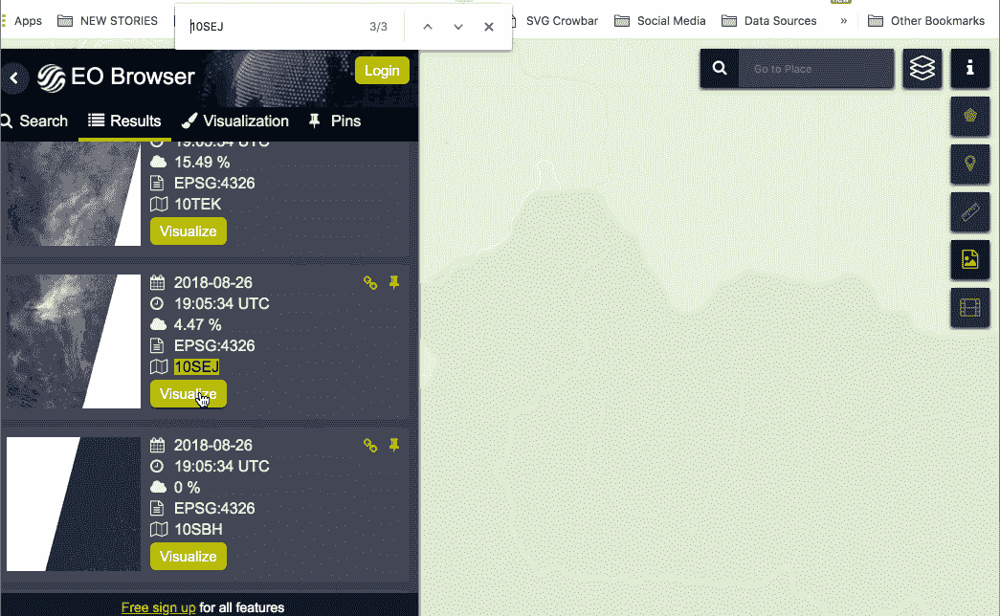

# 如何在调查报告中使用开源卫星数据

> 原文：<https://towardsdatascience.com/how-to-use-open-source-satellite-data-for-your-investigative-reporting-d662cb1f9f90?source=collection_archive---------3----------------------->


Investigation on water levels of the [Theewaterskloof Dam](https://en.wikipedia.org/wiki/Theewaterskloof_Dam) dam, **South Africa**

毫无疑问，这是一座巨大的信息金矿——也许太大了——许多记者仍然回避广泛使用卫星数据。自从像[*digital globe*](https://www.digitalglobe.com/)*和*[*Planet Labs*](https://www.planet.com/)*这样的公司提供高分辨率数据以来，卫星故事的供应如雨后春笋般增长。但是开源数据——尽管分辨率较低，但仍然是有效和及时的故事来源——仍然没有得到充分利用。手里有一座未被触及的数据山，许多人要么害怕错过森林——或者这个案例中的故事——因为树木或者误解。两者都是合理的担忧。今天，我们将尝试解决您可能与同事分享的一些保留意见，并教授一些访问、理解和处理开源卫星数据的基础知识。*

最近关于在新闻编辑室内外开展遥感活动的技术评论试图揭开如何利用开源卫星数据平台的神秘面纱。有些人试图解释如何简化收集数据的过程。很少有人在可行的故事和技术能力之间建立可行的联系。本教程试图挑战这种观念。我们将带您看一些基本的例子——从初学者到更高级的技术水平。

## 了解卫星图像的工作原理:

不同的卫星向地球发送不同的图像。区别包括分辨率(图像的清晰度)，它们产生的波段的数量和类型，以及它们更新的频率。

## 决议事关重大


Finding the balance between resolution, capabilities of bands and availability: Credit: Mark Corcoran, Reuters Institute Fellowship Paper, University of Oxford

## 有多频繁？


Credit: Mark Corcoran, Reuters Institute Fellowship Paper, University of Oxford

## 什么是光谱带？


Not a new musical genre: Spectral bands determine what type of analysis you can do with the data; Credit: Mark Corcoran, Reuters Institute Fellowship Paper, University of Oxford

[例如，Sentinel 2 卫星图像数据](https://sentinel.esa.int/web/sentinel/user-guides/sentinel-2-msi)以 13 个不同光谱带的形式出现，范围从可见和近红外到短波红外，具有 10 米的 4 个光谱带、20 米的 6 个光谱带和 60 米空间分辨率的 3 个光谱带。

将这些波段视为一种双筒望远镜，它可以让您发现原本隐藏在数据中的东西。这些乐队的正确组合是关键。可以在数据上运行各种脚本(可以是不同的波段组合，如果你愿意的话)(可以在本地机器上运行，也可以在 Sentinel hub 上运行)。

如果你是在广泛的基础上报道，你要让自己熟悉这些不同的组合，以及它们为你实现的目标，因为当其他渠道错过节拍时，它可能会派上用场。

## 教程:从这里你需要什么？

*   Python 3.6
*   一个合适的 Tif 阅读器(如果你想下载光栅文件)
*   Jupyter 笔记本和各种 python 包
*   Sentinel hub 的免费帐户(在 python 教程中找到描述)

## 2.使用 Sentinel Hub 浏览器工具搜索报道:

如果你是一个热爱技术的人，你可能会对使用浏览器应用程序的想法有点反感。但是请听我说完。对于探索和调查来说， [EO 浏览器](https://apps.sentinel-hub.com/eo-browser/)是一个不错的选择(如果你想退得更远，[哨兵游乐场](https://sentinel-hub.com/explore/sentinel-playground)的卫星更少，但提供了一种稍微简单的探索方式)。

> Predecessor 和其他开源卫星平台在工作流中使用 python 时可能会提供有限的选项。在这方面，Sentinel Hub 提供了一些有用的选项。此外，不需要为了做一些有趣的事情而下载整个栅格切片(可以说，调查很少同时需要所有切片数据)。相反，它允许放大特定区域。

## 以下是 EO 浏览器提供的数据列表以及使用这些数据的**理由**:

Description of EO Browser data

让我们开始沉迷于卫星狂潮吧。

# 1.新手

## 追踪野火:

对野火突然扩散和破坏的检测和报告，去年创纪录的火焰肆虐美国加利福尼亚州。这可能不是最后一次。专家称，这样的火灾在不久的将来有可能再次出现。免费获取的资源构成了 Landsat 8 数据(在美国地质调查局的帮助下提供)和 Sentinel-2 数据。

Sentinel-2 在可见光和红外光谱部分提供了比其开源同事更高分辨率的图像，完全可以胜任监测植被、土壤和水覆盖、内陆水道和沿海地区的任务。

## 挑战

*   进入 [EO 浏览器](https://apps.sentinel-hub.com/eo-browser/) —注册并登录(免费)
*   选择哨兵-2
*   通过将云覆盖率限制在 30%来缩小数据收集范围。
*   发现美国加利福尼亚州的野火，这些野火在 2018 年 7 月至 8 月期间达到高潮(它们在全州范围内如此全面地宣布，你应该不会有问题来发现云的羽状物)

**2018 年火灾可能的例子:**

[*纳齐兹大火(2018 年 7 月 20 日):41.956N 123.551 W*](https://apps.sentinel-hub.com/eo-browser/?lat=41.7749&lng=-122.5779&zoom=10)[*卡尔大火(2018 年 7 月 28 日):40.6543N 122.6236 W*](https://apps.sentinel-hub.com/eo-browser/?lat=40.611&lng=-122.528&zoom=8)[*门多西诺复杂大火(2018 年 7 月 29 日):39.243283 N*](https://apps.sentinel-hub.com/eo-browser/?lat=39.0720&lng=-122.0272&zoom=10)

接下来，我们要渲染一个特定的波段组合，以便更清楚地看到地面上的行动正在发生。

> ***复制'*** [***野火脚本***](https://raw.githubusercontent.com/sentinel-hub/custom-scripts/master/sentinel-2/markuse_fire/script.js)***':***

Pierre Markuse 好心地提供了这份文件。将其插入显示“< / >”的“自定义”部分(可视化选项卡下)(手动按钮旁边)。



Locating California wildfires (August 2018)

*有趣的角度:消防员在控制/隔离火势方面有多成功*


Example by **Pierre Markuse**: Fire retardant caused by firefighting planes [https://flic.kr/p/Wt8Vzo](https://flic.kr/p/Wt8Vzo)

如果您在指定的时间范围内成功发现了野火，您应该会发现黄红色的斑点。重要的是:不要把这些解释为火焰。尽管展示了它，你应该告诉你的观众所能看到的并不是真正的火灾，而仅仅是一个红外覆盖图——在某种程度上，它与活跃的火灾和热点是一致的。

## 挑战

在写这篇文章的时候，新的野火已经蔓延了近一周。

如果您有时间，发现这些火灾，像以前一样应用脚本并进行调查。

## 中规模集成电路（medium-scale integration 的缩写）

其他波段组合可用于说明潜在的野火风险区域。植被的干燥就是这样的指标之一。潮湿压力指数(MSI)可以揭示这种干燥区域，并有助于所谓的“火灾条件分析”。

该指数与其他水植被指数相反。[值越高，水分胁迫水平](https://raw.githubusercontent.com/sentinel-hub/custom-scripts/master/sentinel-2/msi/script.js)越大(含水量越少)。试一试，用不同的乐队脚本遵循相同的程序，看看您能检索到什么。

## MSI 脚本:

## 现在让我们使用 Python:

为了使用 Sentinel Hub 服务，您需要一个 Sentinel Hub 帐户(如果您还没有注册，请在此【https://www.sentinel-hub.com/[】免费注册)。](https://www.sentinel-hub.com/)

登录 Sentinel Hub 配置器。具有实例 ID(长度为 36 的字母数字代码)的配置已经存在。对于本教程，建议您创建一个新的配置**(通过“添加新配置”)**，并将配置设置为基于' **Python 脚本模板'**。


记下您的配置的实例 ID，并将其粘贴到 *INSTANCE_ID* 变量声明中:

所有请求都要求给定一个边界框作为 sentinelhub.geometry.BBox 的实例，并带有相应的坐标参考系统(sentinelhub.geometry.CRS)。我们将使用 WGS84，并且可以使用 sentinelhub.geometry.CRS 中预定义的 WGS84 坐标参考系统。

现在，我们只需提供一个 JS evalscript 的 URL 地址([在这个专用页面](https://github.com/sentinel-hub/custom-scripts)上有许多其他巧妙的脚本)。

让我们再次选择 fire 脚本，并将其 URL 作为参数 CustomUrlParam.EVALSCRIPTURL 的值提供。


Python output: Downloaded Sentinel-2 image with the provided wildfire JS evalscript

## 腈基丁二烯橡胶（nitrile-butadiene rubber 的缩写）

另一个专门检测[火灾的自定义脚本是 NBR](http://un-spider.org/node/10959)——归一化燃烧比的缩写— ( [链接到此处的脚本](http://un-spider.org/node/10959))。如果你报道一场大火的事后状态，这将有助于你的分析和报道。


Further explanation of NBR [here](http://un-spider.org/node/10959)

## 挑战

用 [NBR 脚本](https://raw.githubusercontent.com/sentinel-hub/custom-scripts/master/sentinel-2/nbr/script.js) t 找到被烧毁的植被。


Python output: Downloaded Sentinel-2 image with the provided NBR JS evalscript

# 2.中级—变得更具调查性

## 依靠火力脚本找到苏黑尔·哈桑准将的藏身之处——叙利亚最臭名昭著的军阀之一

这位绰号“老虎”的将军是“老虎部队”的舵手，这是一场俄罗斯支持的战役，也是叙利亚阿拉伯军队的精英部队，在叙利亚内战中主要作为进攻部队。

在叙利亚夺回东姑塔的行动中，根据侵犯人权文献中心(VDC)的数据，最近由猛虎组织执行的行动造成至少 600 名平民死亡，其中至少 100 名是儿童。

为了找出 2016 年苏黑尔·哈桑的藏身之处，我们进行了一次典型的情报工作，从看下面的视频开始:

我们可以看到向左飘来的几缕烟。在另一个序列中，我们看到了将军的藏身之处。


*The Hideout (left) of* Brigadier General Suheil al-Hassan, a.k.a the Tiger — “If you’re not with God then you’re with the devil. Be on the side of God so that God will be with you,” should Hassan reportedly have said at a more recent campaign on the edge of eastern Ghouta


Smoke clouds from nearby Aleppo thermal plant

从视频中，我们了解到这是为“打击 ISIS 的巴尔米拉之战”拍摄的。这可能是阿勒颇热电厂。


Confirmation: Google earth pics for the power plant show the extent of destruction after the fire raged (burned out circles on the right)

一个简单的网络搜索为我们提供了一定程度的澄清:

*   在谷歌上搜索' [***阿勒颇热电厂*** '](https://en.wikipedia.org/wiki/List_of_power_stations_in_Syria) 。维基百科的链接为我们提供了热电厂的长/纬度。
*   接下来，进入谷歌地球或谷歌地图，输入你找到的坐标:'[36° 10′30″N 37° 26′22″E](https://www.google.com/maps/place/36%C2%B010'30.0%22N+37%C2%B026'22.0%22E/@36.1753937,37.4353385,1121m/data=!3m1!1e3!4m5!3m4!1s0x0:0x0!8m2!3d36.175!4d37.4394444)'。你将会看到在工厂的右边有一组烧毁的塔。


在 EO Brower 上，打开 roads 并输入谷歌地图结果中的经度和纬度(36.175000，37.439444)(进入 EO 浏览器的搜索窗口)。在我们的例子中，我们对 2016 年 2 月 16 日(2016-02-16)感兴趣，在这一天我们目睹了奇妙的烟柱。


Smoke plums move to the left

接下来，我们像以前一样继续并应用[火灾脚本](https://raw.githubusercontent.com/sentinel-hub/custom-scripts/master/sentinel-2/markuse_fire/script.js)来可视化 Sentinel-2 图像中的火灾(**挑战**:如果你有信心，在你的 Python 环境中做，或者在你的 EO 浏览器窗口中模拟)。

既然我们有了更好的了解，我们就可以推断火灾发生时老虎的藏身之处。


Al-Hassan hideout (left) and Aleppo thermal plant (right) on google maps

为了证实我们的怀疑，我们可以检查谷歌地图卫星图像，并了解到藏身之处已被炸毁。


冲突、安全、武器和数字取证领域的开源专家 Benjamin Strick 解释说，这确实有助于显示当时哪座大楼着火了。后来，哈桑在工厂里的照片证实了这一点:那天那四座塔着火了。

从太空中观察某些地方的具体细节有其优点。事实上，是在人权领域。[最近的一项调查显示](https://www.sciencemag.org/news/2019/02/researchers-spy-signs-slavery-space)卫星图像有助于从太空揭示奴隶制。英国诺丁汉大学权利实验室数据项目主任 Doreen Boyd 估计，三分之一的奴隶制将在太空中可见——无论是以[窑](https://en.wikipedia.org/wiki/Kiln)的疤痕形式，还是以非法矿场或短暂的鱼类加工营地的轮廓形式(可以说，高分辨率的商业图像可能更适合这种调查)。

# 3.高级-运行算法

## 水位提取

让我们假设你正在报道水位下降的情况，可能会报道由此引发的冲突(根据最近的研究，缺水导致的紧张局势和冲突越来越有可能发生，这一点已被《经济学家》特别报道)报道过。

使用 Sentinel-2 多光谱和多时相图像制作了一个 Jupyter 笔记本*来探测水体的水位。

我们将在 python 中运行水检测算法，并在给定的时间间隔内提取单个水库的地表水位。

## 你要做的是:

1.  定义一些水体的几何形状
2.  准备并执行水探测的完整工作流程:使用 [SentinelHub](https://www.sentinel-hub.com/) 服务下载 Sentinel-2 数据(真彩色和 NDWI 指数),使用 [s2cloudless](https://github.com/sentinel-hub/sentinel2-cloud-detector) 云探测器进行云探测，最后探测水
3.  可视化一段时间内的水体和水位
4.  过滤掉多云的场景以改善结果

## 你需要什么？

*   ` EO-learn `—[https://github.com/sentinel-hub/eo-learn](https://github.com/sentinel-hub/eo-learn)
*   `水观测站后端`-【https://github.com/sentinel-hub/water-observatory-backend T2

基本终端/文件设置:

> **和前面的例子一样:**之前，为了运行它，您还需要一个 Sentinel Hub 帐户。您可以在 [Sentinel Hub 网页](https://services.sentinel-hub.com/oauth/subscription)创建一个免费试用账户。帐户设置好后，登录 [Sentinel Hub Configurator](https://apps.sentinel-hub.com/configurator/) 。默认情况下，您已经拥有了带有**实例 ID** (长度为 36 的字母数字代码)的默认配置。对于本教程，我们建议您创建一个新的配置(`"Add new configuration"`)并将配置设置为基于 **Python 脚本模板**。这种配置将已经包含这些示例中使用的所有层。否则，您必须自己为您的配置定义层。准备好配置后，请按照[配置说明](http://sentinelhub-py.readthedocs.io/en/latest/configure.html)将配置的**实例 ID** 放入`sentinelhub`包的配置文件中。

通过加载以下 Python 库来设置 Python 工作环境。确保按照上面的说明运行 **Python 虚拟环境**。

# 获得水体的几何形状

让我们以南非的 Theewaterskloof 大坝为例——这个巨大的水资源储备为开普敦 400 万居民中的大部分人提供了宝贵的资源。它是西开普省供水系统中最大的水坝，在干旱时水量会减少。有迹象表明人们对水资源短缺的意识增强了。如何覆盖这样一个话题说明了这个[例子](https://www.freshplaza.com/article/9077688/fruitlook-satellite-images-show-stark-and-enduring-impact-of-cape-drought/)。

在[the waters kloof Dam](https://en.wikipedia.org/wiki/Theewaterskloof_Dam)或地球上任何其他大型水体的情况下，你可以通过[BlueDot Water Observatory](https://water.blue-dot-observatory.com/)API 轻松获得几何图形。

通过搜索特定水体，您可以复制 URL 中的`ID`号，以便访问相应水体的标称几何形状(即 url `[https://water.blue-dot-observatory.com/38538/2019-02-05](https://water.blue-dot-observatory.com/38538/2019-02-05))`中的`38538`号 [)](https://water.blue-dot-observatory.com/38538/2019-02-05))


[The BlueDot Water Observatory](https://www.blue-dot-observatory.com/)

用于下载几何图形的 Python 代码:


现在，为了下载 Sentinel-2 数据，我们需要这个几何体的边界框。我们定义了一个边界框，并对其进行了一点膨胀，以构建一个 BBox 对象，用于 Sentinel Hub 服务。BBox 类也接受坐标系(CRS)，这里我们使用与几何图形相同的坐标系(即 [WGS84](https://en.wikipedia.org/wiki/World_Geodetic_System) )。


Plotting the BBox and the geometry

# 准备/执行水检测的完整工作流程

哨兵枢纽服务安装有`eo-learn`。它是 Python 中用于机器学习的开源地球观测处理框架，提供无缝访问和处理任何卫星舰队获取的时空图像序列的能力。

`eo-learn`以工作流的形式工作——工作流由一个或多个任务组成。每个任务完成一个特定的工作(下载数据，计算波段组合等。)在一个区域的一小片上，叫做 EOPatch。EOPatch 是 EO 和非 EO 数据的容器。

让我们定义一个工作流来下载和获取水检测所需的数据。我们将下载 RGB 波段，以便实际可视化水体的真彩色图像。此外，我们将下载`NDWI`波段组合([归一化差异水体指数](https://www.sentinel-hub.com/eoproducts/ndwi-normalized-difference-water-index))，用于水体检测。它被定义为


Formula for [Normalized Difference Water Index](https://www.sentinel-hub.com/eoproducts/ndwi-normalized-difference-water-index)

其中 B3 和 B8 分别是绿色和近红外哨兵-2 波段。

```
**Next: Definitions of some custom tasks that will be used in the workflow**
```

```
**Initializations of EOTasks:**
```

```
Output: Finished loading model, total used 170 iterations
```

```
Output: CPU times: user 3min 9s, sys: 14.7 s, total: 3min 24s
Wall time: 3min 23s
```

**“EO patch”的结构**

通过键入来检查结构

```
Input: eopatch
```


现在让我们来看一下给定时间序列中所选水体的前几张真彩色图像。我们在下面看到一些图像包含云，这导致了正确的水位检测问题。

```
**Plot the NDWI to see how the water detector traces the waterbody outline:**
```


Plotting of [Normalized Difference Water Index](https://www.sentinel-hub.com/eoproducts/ndwi-normalized-difference-water-index)

```
**Plot true-color images with the detected water outlines:**
```


Clear as day: comparing true water levels with [Theewaterskloof Dam](https://en.wikipedia.org/wiki/Theewaterskloof_Dam) dam’s outline

```
**Plotting the detected water levels**
```


由于云的干扰，您应该会看到数据中有很多波动(灰色表示云的覆盖范围。它与水位异常值共享相同的日期)。

现在让我们设定一个最大云量为 2 %的阈值，并过滤掉对应于多云场景的日期。这是通过过滤掉值`eopatch.scalar['COVERAGE']`大于 0.02 的日期来完成的。


A lot less vacillating

瞧，这就是 T2。水位在 2018 年年中创下三年来的历史新低，但此后逐渐恢复。

## 结论:

仍然渴望更多的卫星图像分析？我在这里介绍了一些与经济夜灯分析相关的基本[技术(它充当了经济增长的代理)。99 . Gisgeography.com 汇集了其他应用设想，列举如下。请自便。](https://advent18.journocode.com/door/19/)

c

本教程由一名调查记者撰写，并得到了 [**Matic Lubej**](https://medium.com/@lubej.matic) **、**在 [@sinergise](http://twitter.com/sinergise) 、 [**的数据科学家、遥感布道者 Pierre Markuse**](https://pierre-markuse.net/) 和[**Benjamin Strick**](https://www.bellingcat.com/author/benjaminstrick/)的友好支持，Benjamin Strick 是 BBC 的一名开源调查员，也是 EUArms 工作室的讲师。