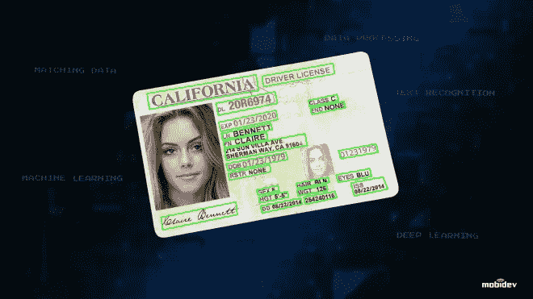
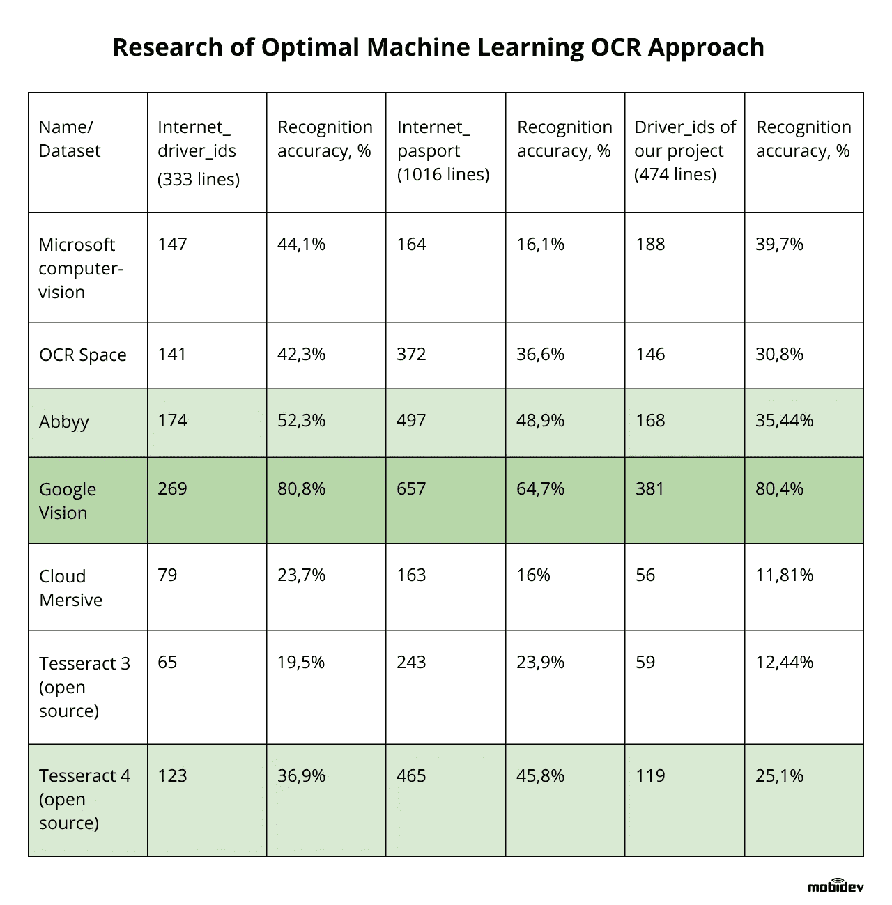

# 如何使用光学字符识别进行安全系统开发

> 原文：<https://towardsdatascience.com/how-to-use-optical-character-recognition-for-security-system-development-9dc57258afa3?source=collection_archive---------14----------------------->

## 用于身份证件数据识别的深度学习和计算机视觉。

将机器学习技术应用于安全解决方案是当前 [AI 趋势](https://mobidev.biz/blog/future-ai-machine-learning-trends-to-impact-business?utm_source=towardsds&utm_medium=ocr&utm_campaign=ml-trends)之一。本文将介绍使用深度学习算法开发基于 OCR 的软件的方法。该软件可用于分析和处理身份证明，如美国驾照，作为验证身份的安全系统的一部分。

机器学习公司已经在[使用 OCR(光学字符识别)技术进行业务流程自动化和优化，使用案例从 Dropbox 使用它解析图片到谷歌街景](https://mobidev.biz/services/machine-learning-consulting?utm_source=towardsds&utm_medium=ocr&utm_campaign=mlservice)[识别不同的街道标志](https://www.blog.google/products/translate/google-translates-instant-camera-translation-gets-upgrade/)到搜索短信和实时翻译文本。

在这种特殊情况下，OCR 可以用作自动化
[生物特征验证](https://mobidev.biz/blog/multimodal-biometrics-verification-system-ai-machine-learning?utm_source=towardsds&utm_medium=ocr&utm_campaign=multimodal)系统的一部分。该解决方案使用自拍照片，并与包含从驾驶执照中提取的面部特征(面部嵌入)的数据库进行比较。

OCR 过程使用以下数据:

*   一张与官方身份照片对比的自拍照。
*   驾照正面的照片，用于检测脸部。
*   包含条形码的驾驶执照背面的图片，我们从中获取数据，如出生日期、姓名和其他字段。

在 beta 测试中，很明显用户能够欺骗验证过程。一种方法是传递来自多个文档的图片。用户展示的第一张照片是有效的身份证明，但第二张背面的照片包含虚假信息。对于任何现实世界的实施来说，欺诈企图都是已知的，并且已经创建了一个独立的验证系统来[防止欺骗企图](https://mobidev.biz/blog/face-anti-spoofing-prevent-fake-biometric-detection?utm_source=towardsds&utm_medium=ocr&utm_campaign=antispoofing)。它交叉检查代表 ID 两侧的两张图片，以确认匹配或标记差异。

**决定最佳 OCR 解决方案**

一旦阐明了用例的范围，我们就开始使用光学字符识别 SDK 和 API。OCR 解决方案有多种形式，从开源到商业的现成解决方案。

人们可能会认为简单的方法是最好的，在这种方法中，可以实现顶级的商业 OCR 解决方案来读取图片并处理相关信息。但是这并不是一个有效的方法。

**OCR 的用户友好性和安全性问题**

一个重大挑战是，身份证上的照片和自拍照片有时会有明显的定位和质量差异。这是用不同的相机和工艺拍摄不可避免的后果。

如果系统在查找匹配时要求高的准确性阈值，大量合法的照片将被拒绝，这可能导致用户体验的问题。需要在保持高安全标准的同时将错误拒绝保持在最低限度之间取得平衡。

解决这个问题的一个方法是提高用户提交的自拍照的质量。通过创建一个平滑的用户界面/UX 体验以及一套易于遵循的拍照说明，自拍照片的质量可以大大提高。

一旦用户提交的图片变得标准化，就有可能在用户友好性和安全性之间取得更好的平衡。虽然许多基于计算机视觉的 OCR 解决方案可以被描述为一个“黑盒”，但这个解决方案需要原始数据才能运行。

**驾照数据识别的挑战**

美国的每个州都会创建一个独特的驾照格式，这些格式会定期更改。因此，不可能简单地预先生成用于解析许可证的模板。另一个障碍是驾照照片的质量经常很差。任何使用它们的 OCR 解决方案都必须考虑这些问题。

任何使用 CV 和 ML 的 OCR 系统都会产生错误。对于这个系统，有必要创建一个安全可靠的解决方案，能够处理与 OCR 组件配对的低质量图片。因此，DS 和软件工程团队都参与了开发过程。

为了规划任何基于人工智能的解决方案的开发，有必要回答几个基本问题。首先，强制性的数据要求是什么，可用数据的使用方式是什么？

我们开始对大约 150 个 id 和 100 个驾照进行数据挖掘，这些数据来自现有的公开数据集和我们收集的数据。

在初始阶段，对现有的开源和商业 OCR 系统进行了比较和评估。选择了最适合的 OCR 解决方案的短列表，并使用真实数据集对这些系统进行了评估。

研究过程中跟踪的指标是出生日期、姓名和姓氏的直接匹配，谷歌视觉是这一过程的自然选择。

**评估大型开放数据集**

另一种方法可能是尝试用书籍扫描或包含文本的图片来处理大型开放数据库。然而，这种方法不适合处理驾照的独特任务。考虑到驾照模板的可变性以及随之而来的低质量照片，许多原本适用的 OCR 解决方案根本无法胜任这项任务。需要完美对齐的文本和优秀图片才能运行的 OCR 解决方案在这方面将会失败。

解析驾照和其他 id 的实际任务给出了解决方案适用性的最真实指标。最佳数据集是根据目标受众的任务专门收集的数据集。

**实现 OCR 引擎**

符合数据安全的 OCR 解决方案需要一种结合 ds、ML 和软件工程的方法。

一个主要挑战是处理 Google Vision 提供的原始数据，并以 100%的准确度将其与条形码提供的数据进行交叉引用。虽然谷歌的 OCR 系统是行业顶级的，但错误是不可避免的。虽然许多情况下允许出现错误，但在与安全相关的领域中，这些错误不会出现。这种 OCR 解决方案需要额外的安全层来挫败利用 OCR 的局限性进行欺诈的企图。

**对机器可读区的额外关注**

MRZ(机器可读区)是任何旅行证件的一部分，具有清晰的数据字段，无论是数字还是字母。MRZ 还会有校验位，以确保数据被准确解析。

然而，即使使用谷歌视觉，MRZ 识别能够达到的准确度值也远低于 100%。因此，有必要创建一个额外的数据交叉检查流程。

OCR 在读取数据时容易犯一些常见的错误。一个例子是符号“1，l，I，I”和“O，D，Q，0”。这些符号在物理上是相似的，可能会被引擎错误分类。通过收集历史错误数据，可以构建一个组件来纠正 OCR 系统造成的错误。

**总之，使用 OCR 的四个技巧:**

1.  首先确定系统需要能够实现的所有用例以及业务目标。这推动了您选择工具和系统架构的方法。
2.  [了解您的数据](/data-science-consulting-from-idea-to-deployment-ea8efed8c388)并使用尽可能多的真实数据至关重要。
3.  一旦理解了数据的基本原理，您就可以做出明智的决定，决定是使用商业数据集还是开放数据集。
4.  在训练神经网络和创建自定义数据科学模型时，最好在较小的数据集中使用更相关的数据。虽然使用大规模数据集可能看起来很有吸引力，但如果它不能很好地反映您最终的真实数据，您的结果将是无效的。
5.  [基于深度学习的 OCR](https://mobidev.biz/blog/ocr-machine-learning-implementation?utm_source=towardsds&utm_medium=ocr&utm_campaign=ocr-deepl) 可以作为初步工具，将提供的信息与用户文档进行比较[开发多模态生物特征认证系统](/why-you-should-use-multimodal-biometric-verification-for-security-systems-f345134ffd05?source=your_stories_page---------------------------)。