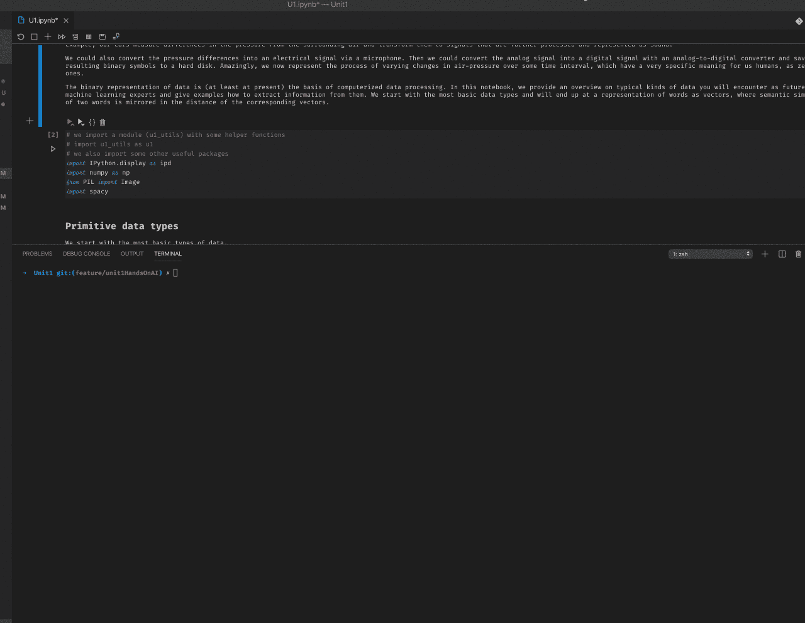
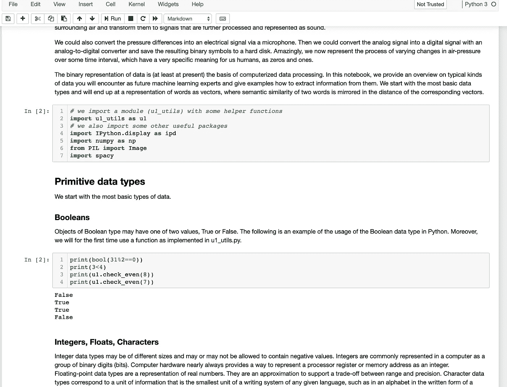
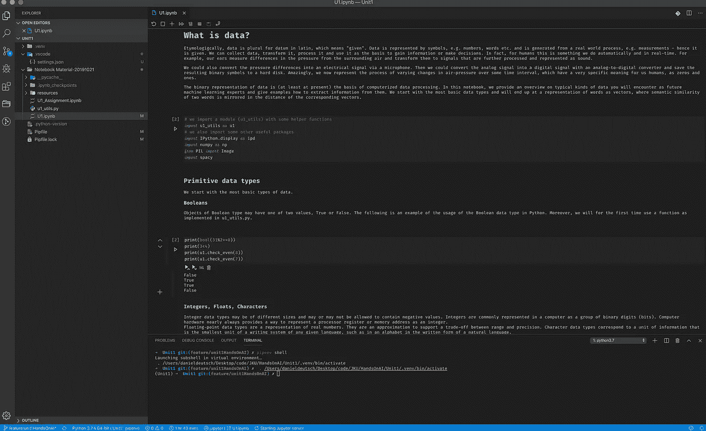

# 如何将 Pipenv 与 Jupyter 和 VSCode 一起使用

> 原文：<https://towardsdatascience.com/how-to-use-pipenv-with-jupyter-and-vscode-ae0e970df486?source=collection_archive---------4----------------------->



Activating the right environment in VSCode for Jupyter Notebook

# 更新 2021

本文写于 2019 年。在多年的开发过程中，我遇到了 pipenv 设置的各种问题。我将环境和依赖管理改为使用一个 *conda 环境和一个带有 pip-compile* 的需求文件。在我的新文章“**如何开始一个数据科学项目**”[https://towards data science . com/How-to-start-a-data-science-project-boilerplate-in-2021-33d 81393 e50](/how-to-start-a-data-science-project-boilerplate-in-2021-33d81393e50)中描述了我的最新设置

如果你还想用 pipenv，那么这篇文章应该还是有价值的。享受吧。

# 介绍

目前，我在 JKU 大学学习人工智能，对于一些练习，我们需要使用 [jupyter 笔记本](https://jupyter.org/)。使用 Python 一点点之后，包管理器 [pipenv](https://pipenv-fork.readthedocs.io/en/latest/) 被证明是有价值的。现在，我在 Jupyter 笔记本和 VSCode 中使用它时遇到了一些问题。因此，一个简短的指导我如何解决它。

# 目录

*   [问题](https://github.com/Createdd/Writing/blob/feature/pipenvJupyterVscode/2019/articles/VSCodePipenv.md#the-issue)
*   [在浏览器中使用 Jupyter 笔记本开发](https://github.com/Createdd/Writing/blob/feature/pipenvJupyterVscode/2019/articles/VSCodePipenv.md#developing-with-jupyter-notebook-in-the-browser)
*   [在 VSCode 中用 Jupyter 笔记本开发](https://github.com/Createdd/Writing/blob/feature/pipenvJupyterVscode/2019/articles/VSCodePipenv.md#develop-with-jupyter-notebook-in-vscode)
*   [关于](https://github.com/Createdd/Writing/blob/feature/pipenvJupyterVscode/2019/articles/VSCodePipenv.md#about)

# 问题

正如我在上一篇文章[使用 Jupyter 和 VSCode](/working-with-vscode-and-jupyter-notebook-style-5ecaf47f9f84) 中所描述的，我使用 pyenv 和 pipenv 来管理我的 python 开发中的所有包。我还参考了一些文章，为什么这种方式是有帮助的，易于使用。现在，有必要再深入一点。有两种方法可以让你用 jupyter notebook 进行开发。您可以直接在浏览器中或在 VSCode 中使用它。在这两种用例中，都会出现问题。

# 在浏览器中用 Jupyter 笔记本开发



Jupyter Notebook in the browser

假设您的系统上已经有了合适的 python 环境，现在您想为一个项目创建一个特定的环境。

1.  首先，创建一个 Pipenv 环境。
2.  确保导航到正确的目录。
3.  使用`pipenv install <packages>`来安装你所有的软件包。
4.  然后用`pipenv shell`激活你的外壳。
5.  然后用`pipenv install jupyter`，之后用`pipenv run jupyter notebook`。

现在 jupyter 服务器已经启动，您的笔记本将可以访问正确的环境。


Activating the right environment for Jupyter notebook in the browser

# 在 VSCode 中用 Jupyter 笔记本开发



Jupyter Notebook in VSCode

现在来看看 VSCode 中的工作流。在这里，了解不同的 shells 是很重要的。我经常使用单独的终端(iterm2 ),有时激活的 shell 无法被 VSCode 识别，或者您位于错误的目录中，或者它没有被激活。所有这些都会带来问题。因此我的工作流程如下:

1.  首先，创建一个 Pipenv 环境。
2.  确保导航到正确的目录。
3.  使用`pipenv install <packages>`来安装你所有的软件包。
4.  然后，确保在 vscode 文件夹中有一个正确的设置文件，其内容如下:

```
{
    "python.venvPath": "${workspaceFolder}/.venv/bin/python",
    "python.pythonPath": ".venv/bin/python",
}
```

*   之后，您可以在 VSCode 中选择合适的 python 环境。(应该是用 Pipenv 创建的！)现在，python 文件可以识别正确的环境。

通常这对于 VSCode 应该足够了，你可以在其中启动 Jupyter 服务器。

但是有时你改变了环境，或者设置文件有问题。如果是这种情况，您需要打开 VSCode 终端并运行`pipenv shell`来激活 shell。(检查是否仍在 VSCode 中选择了正确的环境):


Activating the right environment in VSCode for Jupyter Notebook

现在打开。ipynb 文件，您将能够运行单元格，而不会得到错误`"... was not able to start jupyter server in environment xxx"`

如果有帮助，或者在 VSCode 和 Jupyter Notebook 中使用 Pipenv 有其他问题或解决方案，请告诉我。

[](https://www.buymeacoffee.com/createdd)

You can support me on [https://www.buymeacoffee.com/createdd](https://www.buymeacoffee.com/createdd)

# 关于

我认为自己是一个解决问题的人。我的强项是在复杂的环境中导航，提供解决方案并分解它们。我的知识和兴趣围绕商业法和编程机器学习应用发展。我在构建数据分析和评估业务相关概念方面提供服务。


**接通:**

*   [领英](https://www.linkedin.com/in/createdd)
*   [Github](https://github.com/Createdd)
*   [中等](https://medium.com/@createdd)
*   [推特](https://twitter.com/_createdd)
*   [Instagram](https://www.instagram.com/create.dd/)