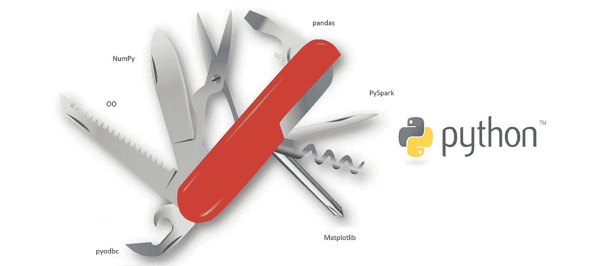
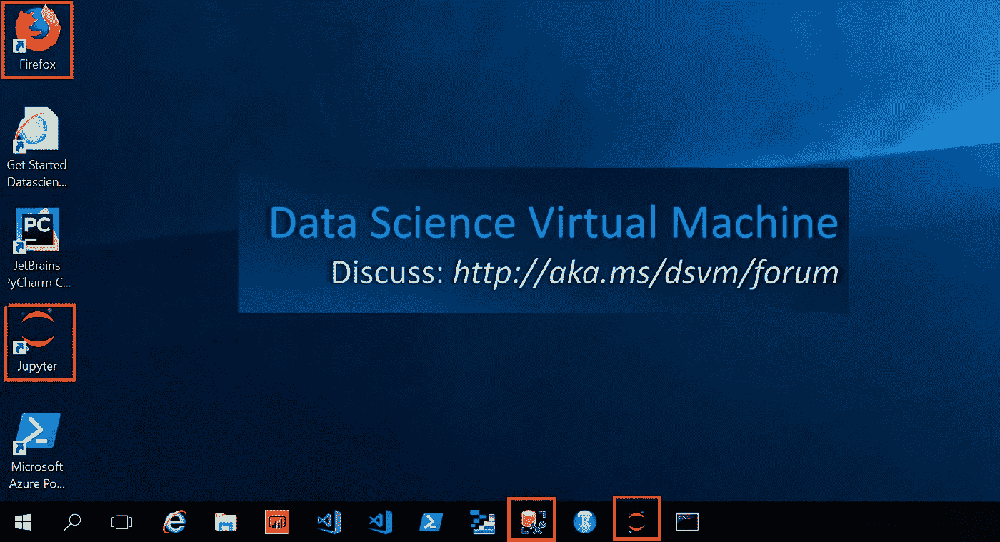
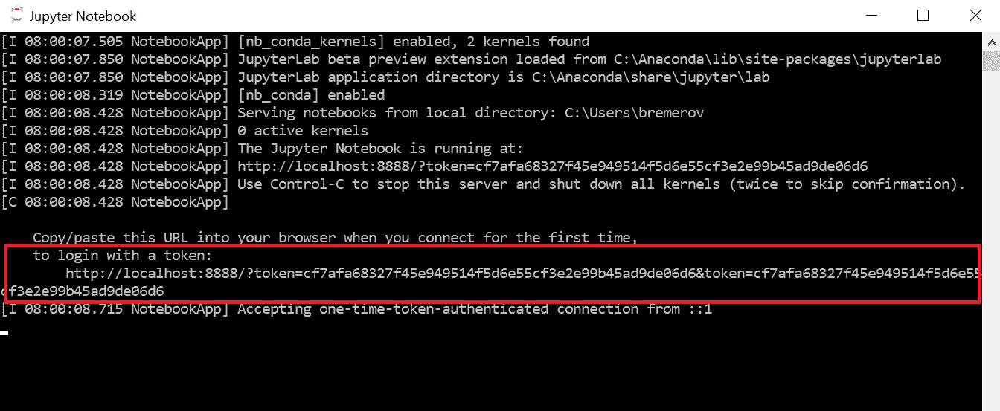
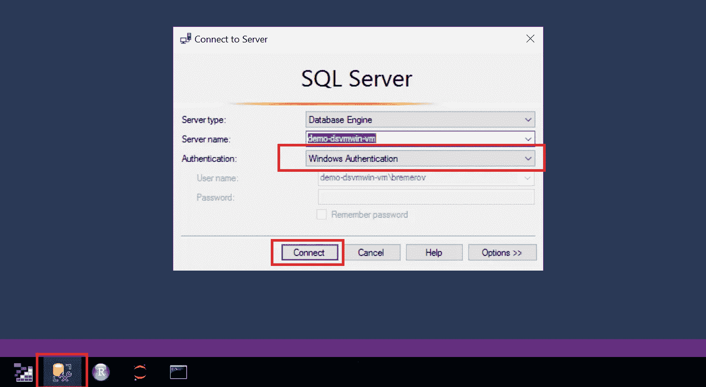
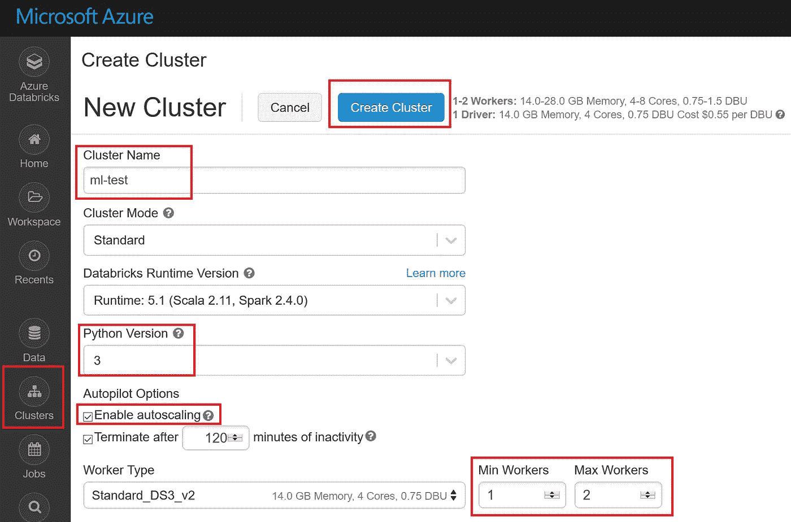
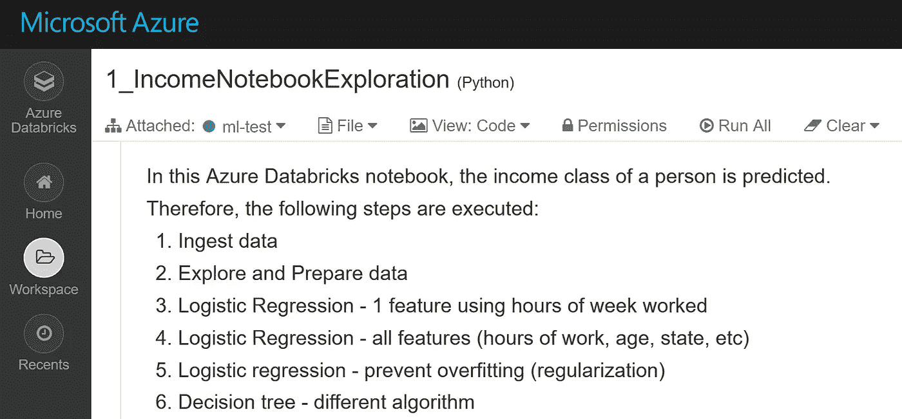

# 如何在数据分析项目中使用 Python 特性

> 原文：<https://towardsdatascience.com/how-to-use-python-features-in-your-data-analytics-project-e8032374d6fc?source=collection_archive---------11----------------------->

## 使用 OO，NumPy，pandas，SQL，PySpark 的 Python 教程

# 1.介绍

许多公司正在向云迁移，并考虑应该使用什么工具进行数据分析。在内部，公司大多使用专有软件进行高级分析、商业智能和报告。然而，这种工具在云环境中可能不是最合理的选择。原因可能是 1)缺乏与云提供商的集成，2)缺乏[大数据](https://en.wikipedia.org/wiki/Big_data#Characteristics)支持，或者 3)缺乏对机器学习和深度学习等新用例的支持。

Python 是一种通用编程语言，广泛用于数据分析。几乎所有的云数据平台都提供 Python 支持，并且通常新特性首先在 Python 中可用。在这方面，Python 可以被视为数据分析的瑞士军刀。



1\. Python as Swiss Army knife for data analytics

# 2.目标

在本教程中，创建了两个考虑到 Python 重要特性的项目。项目描述如下:

*   在第一个项目中，在 Azure 中的数据科学虚拟机(DSVM)上执行 Jupyter 笔记本。面向对象(OO)类是使用数据的继承、重载和封装创建的。随后，NumPy 和 pandas 用于数据分析。最后，数据存储在 DSVM 上的数据库中。
*   在第二个项目中，Databricks 笔记本在具有多个虚拟机的 Spark 集群上执行。PySpark 用于创建机器学习模型。

因此，将执行以下步骤:

*   3.先决条件
*   4.DSVM 上带有 Jupyter 的 OO、NumPy、pandas 和 SQL
*   5.Spark 集群上带有 Azure 数据块的 PySpark
*   6.结论

这是一个独立的教程，重点是学习 Python 的不同方面。重点不在于“深入”各个方面。如果你对深度学习更感兴趣，请参见[这里](/how-to-create-your-own-deep-learning-project-in-azure-509660d8297)或在 devops for AI，参考我以前的博客，[这里](/how-to-bring-your-data-science-project-in-production-b36ae4c02b46)和关注安全，请参见[这里](/how-to-embed-security-in-your-azure-data-science-project-55ef3f2ab47)。

# 3.先决条件

需要创建以下资源:

*   [数据科学虚拟机](https://docs.microsoft.com/en-us/azure/machine-learning/data-science-virtual-machine/provision-vm#create-your-dsvm)(第四部分)
*   [Azure Databricks 工作区](https://docs.azuredatabricks.net/getting-started/try-databricks.html#step-2-create-a-databricks-workspace)(第五部分)

# 4.DSVM 上带有 Jupyter 的 OO、NumPy、pandas 和 sql

在这一部分中，一个包含三个类的示例 Python 项目。使用这些类，足球运动员的数据被登记。执行以下步骤:

*   4a。开始
*   4b。面向对象编程
*   4c。使用 NumPy 的矩阵分析
*   4d。使用熊猫进行统计分析
*   4e。读取/写入数据库

## 4a。开始

登录到您的 Windows 数据科学虚拟机(DSVM)。在桌面上，可以找到预装组件图标的概述。点击 Jupyter 快捷方式开始 Jupyter 会话。



4a1\. preinstalled components on DSVM needed in this tutorial

随后，打开可以在任务栏中找到的 Jupyter 命令行会话。复制 URL 并在 Firefox 会话中打开它。



4a2\. Localhost URL to be openen in Firefox

然后将以下笔记本下载到 DSVM 的桌面上:

```
[https://raw.githubusercontent.com/rebremer/python_swiss_army_knife/master/SwissArmyKnifePython.ipynb](https://raw.githubusercontent.com/rebremer/python_swiss_army_knife/master/SwissArmyKnifePython.ipynb)
```

最后，选择在 jupyter 会话中上传笔记本。然后点击菜单中的运行按钮，运行单元格中的代码。笔记本最重要的部分也将在本章的剩余部分讨论。

## 4b。面向对象编程

这部分教程的灵感来自 Theophano Mitsa 的[教程](/a-data-scientist-should-know-at-least-this-much-python-oop-d63f37eaac4d)。在这一部分中，创建了三个类来跟踪足球运动员的数据。一级球员的片段可以在下面找到:

```
# Class 1: Player
class Player(object):
    _posList = {'goalkeeper', 'defender', 'midfielder', 'striker'}

    def __init__(self,name):
        self._playerName=name
        self._trainingList=[]
        self._rawData = np.empty((0,3), int)

    def setPosition(self, pos):
        if pos in self._posList:
            self._position=pos
            print(self._playerName + " is " + pos)
        else:
            raise ValueError("Value {} not in list.".format(pos))        

    def setTraining(self, t, rawData):
        self._trainingList.append(t)
        self._rawData = np.append(self._rawData, rawData, axis=0) def getTrainingRawData(self):
        return self._rawData #def getTrainingFilter(self, stage, tt, date):
    # see github project for rest of code
```

在这个类中可以看到以下内容:

*   一个 _rawData 属性在新玩家被实例化时被创建。该属性用于**用 setTraining 方法封装**训练数据
*   _rawData 被创建为受**保护的**变量。这告诉程序员应该使用 get 和 set 方法来处理 _rawData

随后，可以在下面找到 FirstTeamPlayer 类:

```
# Class 2: FirstTeamPlayer
class FirstTeamPlayer(Player):
    def __init__(self,ftp):
        Player.__init__(self, ftp)

    def setPosition(self,pos1, pos2):
        if pos1 in self._posList and pos2 in self._posList:
            self._posComp=pos1
            self._posCL=pos2
            print(self._playerName + " is " + pos1)
            print(self._playerName + " is " + pos2 + " in the CL")
        else:
            raise ValueError("Pos {},{} unknown".format(pos1, pos2))   

    def setNumber(self,number):
        self._number=number
        print(self._playerName + " has number " + str(number))
```

在这个类中可以看到以下内容:

*   FirstTeamPlayer **从 Player 类继承了**，这意味着 Player 类的所有属性/方法也可以在 FirstTeamPlayer 中使用
*   方法 setPosition 在 FirstPlayerClass 中被**重载**，并有了新的定义。方法 setNumber 仅在 FirstPlayerClass 中可用

最后，可以在下面找到培训课程的一个片段:

```
# Class 3: Training
class Training(object):
    _stageList = {'ArenA', 'Toekomst', 'Pool', 'Gym'}
    _trainingTypeList = {'strength', 'technique', 'friendly game'}

    def __init__(self, stage, tt, date):
        if stage in self._stageList:
            self._stage = stage
        else:
            raise ValueError("Value {} not in list.".format(stage))
        if tt in self._trainingTypeList:
            self._trainingType = tt
        else:
            raise ValueError("Value {} not in list.".format(tt))

        #todo: Valid date test (no static type checking in Python)
        self._date = date

    def getStage(self):
        return self._stage

    def getTrainingType(self):
        return self._trainingType

    def getDate(self):
        return self._date
```

在这个类中可以看到以下内容:

*   Python 中没有静态类型检查**。例如，日期属性不能声明为日期，必须创建一个附加检查**

这三个类是如何实例化和使用的示例可以在下面的最终代码片段中找到:

```
# Construct two players, FirstTeamPlayer class inherits from Player
player1 = Player("Janssen")
player2 = FirstTeamPlayer("Tadic")# SetPosition of player, method is overloaded in FirsTeamPlayer
player1.setPosition("goalkeeper")
player2.setPosition("midfielder", "striker")# Create new traning object and add traningsdata to player object. 
training1=Training('Toekomst', 'strength', date(2019,4,19))
player1.setTraining(training1, rawData=np.random.rand(1,3))
player2.setTraining(training1, rawData=np.random.rand(1,3))# Add another object
training2=Training('ArenA', 'friendly game', date(2019,4,20))
player1.setTraining(training2, rawData=np.random.rand(1,3))
player2.setTraining(training2, rawData=np.random.rand(1,3))
```

## 4c。使用 NumPy 的矩阵分析

NumPy 是使用 Python 进行科学计算的基础包。在本教程中，它将被用来做矩阵分析。请注意，attribute _rawData 已经作为 NumPy 数组封装在 Player 类中。NumPy 通常与 Matplotlib 一起使用来可视化数据。在下面的代码片段中，数据取自玩家类，然后进行一些矩阵运算，从基础到更高级。完整的例子可以在 github 项目中找到。

```
# Take the matrix data from player objecs that were created earlier
m1=player1.getTrainingRawData()
m2=player2.getTrainingRawData()# print some values
print(m1[0][1])
print(m1[:,0])
print(m1[1:3,1:3])# arithmetic
tmp3=m1*m2 # [m2_11*m1_11,  ..,  m1_33*m2_33]
print(tmp3)# matrix multiplication
tmp1 = m1.dot(m2) # [m1_11 * m2_11 + m1_23 * m2_32 +  m1_13 * m2_31, 
                  #   ..., 
                  # m1_31 * m2_13 + m1_23 * m2_32 +  m1_33 * m2_33]
print(tmp1)# inverse matrix
m1_inv = np.linalg.inv(m1)
print("inverse matrix")
print(m1_inv)
print(m1.dot(m1_inv))# singular value decomposition
u, s, vh = np.linalg.svd(m1, full_matrices=True)
print("singular value decomposition")
print(u)
print(s)
print(vh)
```

## 4d。使用熊猫进行统计分析

Pandas 是 Python 中高性能、易于使用的数据结构和数据分析工具的包。在幕后，pandas 使用 NumPy 作为它的数组结构。在本教程中，它将用于计算一些基本的统计数据。在下面的代码片段中，数据取自 player 类，然后进行一些统计操作。完整的例子可以在 github 项目中找到。

```
# Create the same matrices as earlier
m1=player1.getTrainingRawData()
m2=player2.getTrainingRawData()# create column names to be added to pandas dataframe
columns = np.array(['col1', 'col2', 'col3'])

# Create pandas dataframe
df_1=pd.DataFrame(data=m1, columns=columns)
df_2=pd.DataFrame(data=m2, columns=columns)# calculate basic statistics col1
print(df_1['col1'].sum())
print(df_1['col1'].mean())
print(df_1['col1'].median())
print(df_1['col1'].std())
print(df_1['col1'].describe())# calculate correlation and covariance of dataframe
tmp1=df_1.cov()
tmp2=df_1.corr()

print("correlation:\n " + str(tmp1))
print("\n")
print("covariance:\n " + str(tmp2))
```

## 4e。读取/写入数据库

最后，数据将被写入 SQL 数据库。在本教程中，使用了作为 DSVM 一部分的 MSSQL 数据库。在任务栏中查找 Microsoft SQL Server Management Studio(SSMS)图标，并启动一个新会话。使用 Windows 身份验证登录，另请参见下文。



4e1\. SSMS session using Windows Authentication

在菜单中查找“新查询”并开始新的查询会话。然后执行以下脚本:

```
USE [Master]
GO

CREATE DATABASE pythontest
GO

USE [pythontest]

CREATE TABLE [dbo].[trainingsdata]
(  
 [col1] [float] NOT NULL,
 [col2] [float] NOT NULL,
 [col3] [float] NOT NULL
)
GO
```

最后，可以将数据写入数据库和从数据库中读取数据。熊猫数据帧将用于此，也见下面的片段。

```
# import library
import pyodbc# set connection variables
server  = '<<your vm name, which name of SQL server instance >>'
database = 'pythontest'
driver= '{ODBC Driver 17 for SQL Server}'# Make connection to database
cnxn = pyodbc.connect('DRIVER='+driver+';SERVER='+server+';PORT=1433;DATABASE='+database + ';Trusted_Connection=yes;')
cursor = cnxn.cursor()#Write results, use pandas dataframe
for index,row in df_1.iterrows():
    cursor.execute("INSERT INTO dbo.trainingsdata([col1],[col2],[col3]) VALUES (?,?,?)", row['col1'], row['col2'], row['col3'])
    cnxn.commit()#Read results, use pandas dataframe
sql = "SELECT [col1], [col2], [col3] FROM dbo.trainingsdata"
df_1read = pd.read_sql(sql,cnxn)
print(df_1read)
cursor.close()
```

# 5.Spark 集群上带有 Azure 数据块的 PySpark

在前一章中，所有的代码都在一台机器上运行。如果产生更多的数据或需要进行更高级的计算(例如深度学习)，唯一的可能是采用更重的机器，从而将**放大**以执行代码。也就是说，计算不能分配给其他虚拟机。

Spark 是一个分析框架，可以将计算分配给其他虚拟机，因此可以通过添加更多虚拟机来**横向扩展**。这比让一台“超级计算机”做所有的工作要高效得多。Python 可以在 Spark 中使用，通常被称为 PySpark。在本教程中，将使用 Azure Databricks，这是一个针对 Azure 优化的基于 Apache Spark 的分析平台。在这种情况下，执行以下步骤。

*   5a。开始
*   5b。项目设置

## 5a。开始

启动 Azure Databricks 工作区并转到群集。使用以下设置创建新群集:



5a1\. Create cluster

接下来，选择工作区，右键单击，然后选择导入。在单选按钮中，选择使用 URL 导入以下笔记本:

```
[https://raw.githubusercontent.com/rebremer/devopsai_databricks/master/project/modelling/1_IncomeNotebookExploration.py](https://raw.githubusercontent.com/rebremer/devopsai_databricks/master/project/modelling/1_IncomeNotebookExploration.py)
```

另请参见下图:


5a2\. Import notebook

选择您在 4b 中导入的笔记本，并将该笔记本连接到您在 4a 中创建的集群。确保集群正在运行，否则启动它。使用快捷键 SHIFT+ENTER 逐个单元格地浏览笔记本。



5a3\. Run notebook

最后，如果你想跟踪模型，创建模型的 HTTP 端点和/或创建项目的 DevOps 管道，请参见我的高级 DevOps for AI 教程[这里](/how-to-bring-your-data-science-project-in-production-b36ae4c02b46)，关于安全性，请参见[这里](/how-to-embed-security-in-your-azure-data-science-project-55ef3f2ab47)。

## 5b。项目的设置

在这个项目中，创建了一个机器学习模型，该模型使用年龄、每周工作时间、教育程度等特征来预测一个人的收入阶层。在这种情况下，执行以下步骤:

*   以 Spark 数据框架的形式接收、探索和准备数据
*   逻辑回归-使用一周工作时间的 1 个特征
*   逻辑回归—所有特征(工作时间、年龄、状态等)
*   逻辑回归—防止过度拟合(正则化)
*   决策树—不同的算法，找出性能最好的算法

请注意，pyspark.ml 库用于构建模型。也可以在 Azure Databricks 中运行 scikit-learn 库，但是，工作只能由驱动程序(主)节点完成，计算不是分布式的。请看下面使用 pyspark 包的片段。

```
from pyspark.ml import Pipeline, PipelineModel
from pyspark.ml.classification import LogisticRegression
from pyspark.ml.classification import DecisionTreeClassifier
#...
```

# 6.结论

在本教程中，创建了两个 Python 项目，如下所示:

*   Jupyter 笔记本在数据科学虚拟机上使用面向对象编程、NumPy、pandas 进行数据分析，并使用 SQL 存储数据
*   分布式 Spark 集群上的 Databricks 笔记本，具有多个使用 PySpark 构建机器学习模型的虚拟机

许多公司考虑在云中使用什么工具进行数据分析。在这方面，几乎所有的云数据分析平台都支持 Python，因此，Python 可以被视为数据分析的瑞士军刀。本教程可能会帮助你探索 Python 的可能性。


6\. Python as Swiss Army knife for data analytics