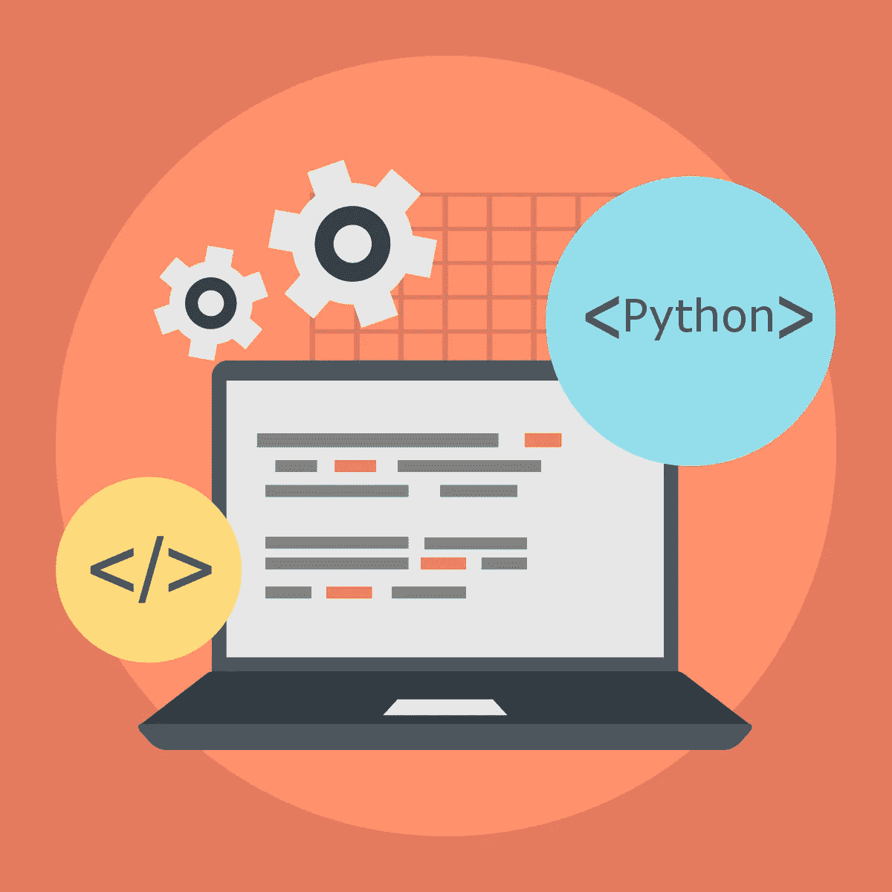
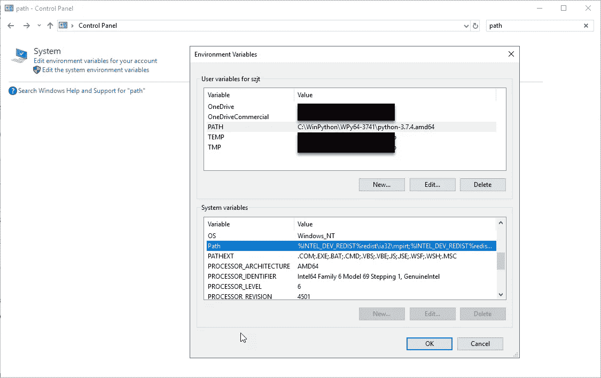
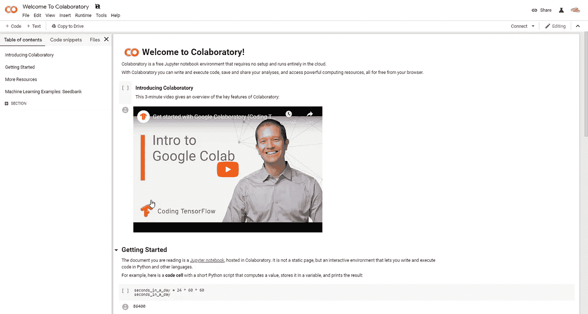
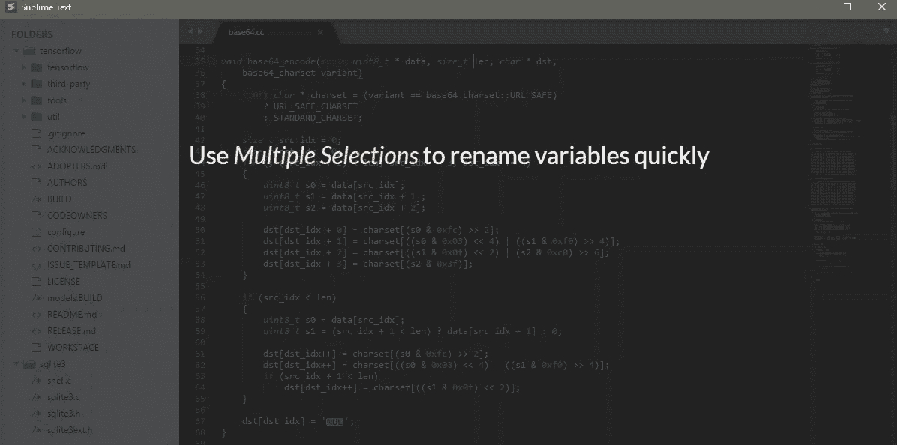
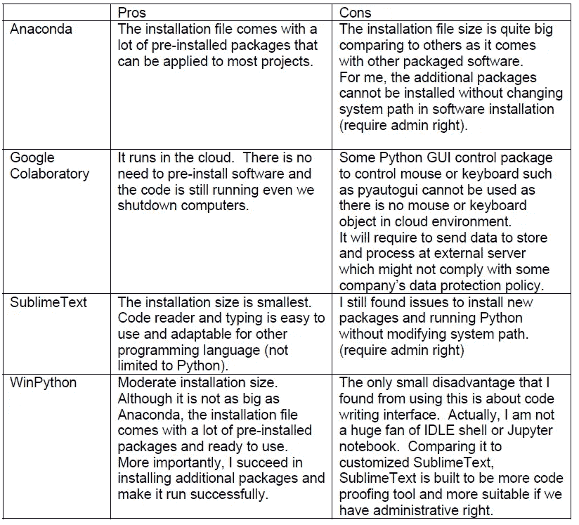

# 没有管理权限如何使用 Python

> 原文：<https://towardsdatascience.com/how-to-use-python-without-administrative-right-at-your-workplace-a50ee2ee2267?source=collection_archive---------6----------------------->

## [现实世界中的数据科学](https://towardsdatascience.com/data-science-in-the-real-world/home)

## 在您的工作场所或在便携模式下使用

Image from freepik.com

从我的经验来看，Python 是一门漂亮的语言。它工作如此之快，简单易学，可以适用于各种领域。我开始使用 Python 学习数据科学，但最近发现它还可以扩展到 web 抓取或自动化机器人编程。通常，大多数工作在我有管理权限的个人笔记本电脑上运行良好。然而，当我试图将这些知识应用到我在工作场所的职责领域时(即，在我公司的没有管理权限的用户工作环境中)，他们感到沮丧，并且大多数时候，软件包安装工作不顺利。经过几天的寻找和尝试，我终于找到了一个有效的方法。因此，我相信写这篇博客可以帮助其他人解决我所面临的同样的问题。也就是说，如何在没有管理权限的情况下在工作场所使用 Python。

没有管理权限，我将需要使用软件，可以安装在便携式模式或基于网络的应用程序。我尝试过很多可以用来运行 Python 的便携软件或者云平台。其中包括 [Anaconda](https://www.anaconda.com/) 、 [SublimeText](https://www.sublimetext.com/) 、 [PortablePython](https://portablepython.com/) 、 [WinPython](https://winpython.github.io/) 、 [Google Colaboratory](https://colab.research.google.com/) 、[微软 Azure services](https://azure.microsoft.com/en-us/) 等等。由于我只是彻底尝试了其中的一部分，所以我在这里只提到其中的一部分。

第一个推荐的软件是使用 [Anaconda](https://www.anaconda.com/) ,因为它附带了大多数有用的便捷包，并且它可以以便携模式直接安装到您的工作机器上，而不需要管理权限。我开始用这个软件是通过 Jupyter 笔记本运行自学的，用了几个月。但是，我不能使用这个 Anaconda 环境安装任何额外的包，比如著名的 XGBoost ML 算法。在 [Stackoverflow](https://stackoverflow.com/questions/52075996/anaconda-install-package-without-administrator-rights) 上有几个帖子，像[这个](https://stackoverflow.com/questions/52075996/anaconda-install-package-without-administrator-rights)我已经浏览过了，但是并没有解决问题。归根结底，我似乎需要配置系统路径，但我没有权限这样做。对于 Windows 10，您可以通过控制面板访问此路径配置，并在搜索栏中键入“PATH”。正如您在下面的快照中看到的，我没有更改系统路径的管理权限。我也许可以请 IT 支持人员帮我修改一下，但是应该有一些更好的方法在用户模式下编写 Python 代码。让我们试试其他的选择。

PATH configuration in Windows 10

其次，我在 [Google 联合实验室](https://colab.research.google.com/)尝试过免费的云平台。这只是典型的免费 Jupyter 笔记本环境，不需要设置，完全在云中运行。我可以用！pip install XXX 在我的个人笔记本上安装类似 Jupyter notebook 的新包。对我来说，这在一段时间内相当有效。直到我发现使用这个平台有三个主要缺点。首先，这个 Colab 平台是为间歇用户设计的，因为运行一整套冗长的机器学习模型可能会消耗服务器的大量资源。在我尝试了 2 天的运行时间后，我收到了一些警告消息，要求我降低 GPU 级别，以便将资源让给其他人使用。其次，模型中需要输入的数据需要上传到 Colab 中。虽然它可以很好地与 Google Drive 同步，但这违反了我公司关于数据保留的政策。每一个上传到外部服务器的文件都将被跟踪，我不想仅仅因为这个愚蠢的原因被解雇。第三，由于这个平台在云中工作，一些 GUI 包无法安装。对于我来说，我打算使用 pyautogui 构建一些 BOT 来控制鼠标移动，并使用 keyboard 来帮助我减少一些重复的复制和粘贴任务。这个 Colab 不支持 GUI 控制，因为它在云中没有鼠标或键盘。

Google Colab

第三，我试过 [SublimeText3](https://www.sublimetext.com/) 。在未注册版本中使用代码编辑软件是免费的(您需要为注册版本付费，但您可以继续使用免费版本)。这个软件不仅是为 Python 用户设计的，它还可以选择编译哪种语言。它非常好，因为代码编辑模块可以定制，批量编辑，并添加一些代码检查器包。对我来说，它看起来像是真正为开发者而建的。不幸的是，在尝试了几天之后，我无法在不修改系统路径的情况下安装任何额外的软件包。你可以注意到它漂亮的教程视频。

[https://www.sublimetext.com/](https://www.sublimetext.com/)

最后，在尝试了几种方法都没有成功之后，我发现 [WinPython](https://winpython.github.io/) 可能是一种有用的可移植 Python 编辑器软件方法。在我看来，与 Anaconda 相比，有一些可移植的软件，如 [PortablePython](https://portablepython.com/) 等，它们的根文件夹/安装文件更容易理解，WinPython 对我来说最好。我可以在 WinPythonCommandPrompt for *中使用 pip install 添加新的软件包安装。whl 文件或者我可以解压*.tar.gz 文件，放在 [WinPython](https://winpython.github.io/) 包根文件夹。与之前解释的两个平台不同，这两种包安装方法都运行良好，我可以使用这个 [WinPython](https://winpython.github.io/) 安装 XGboost 和 pyautogui。它在 Jupyter notebook 中工作，不需要任何管理权限，我想让您知道，这是我让 Python 在公司环境中运行的最佳方法，但仍符合数据泄漏预防政策，并且不使用外部云服务器。我也把我的赞成/反对的比较放在这个博客的底部。感谢您的阅读。有什么建议可以随意评论。

Jupyter notebook running from WinPython

