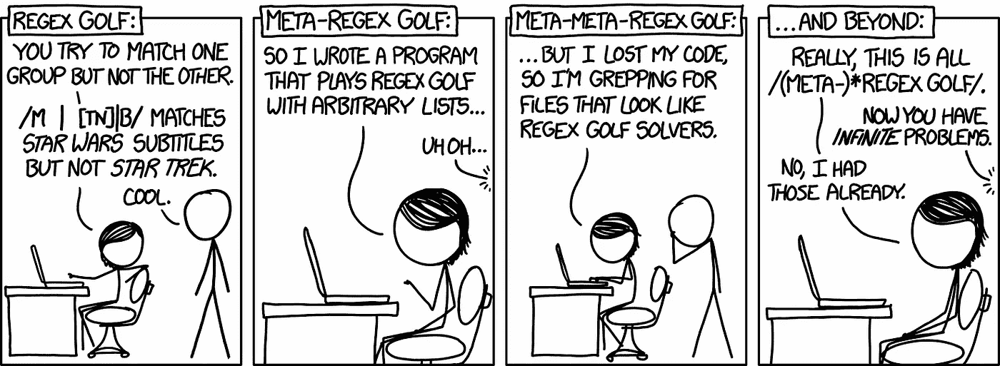
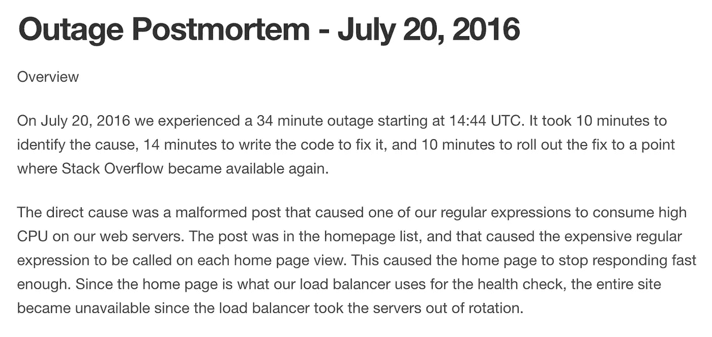
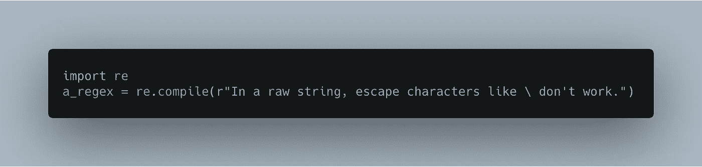
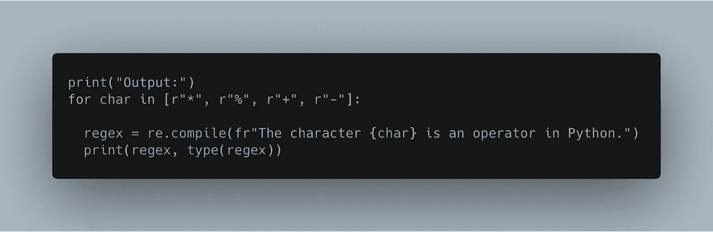
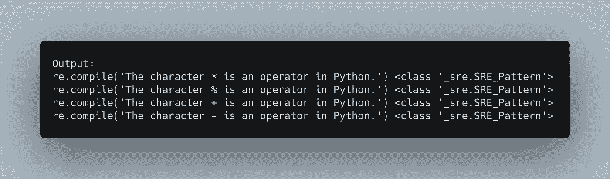
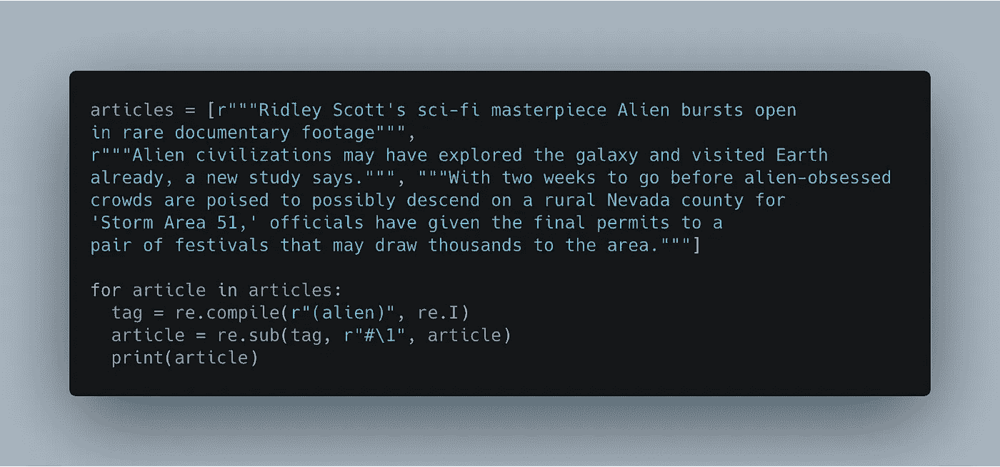
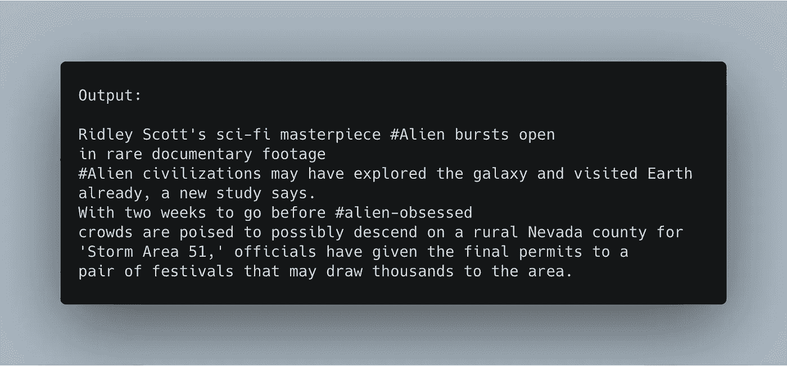
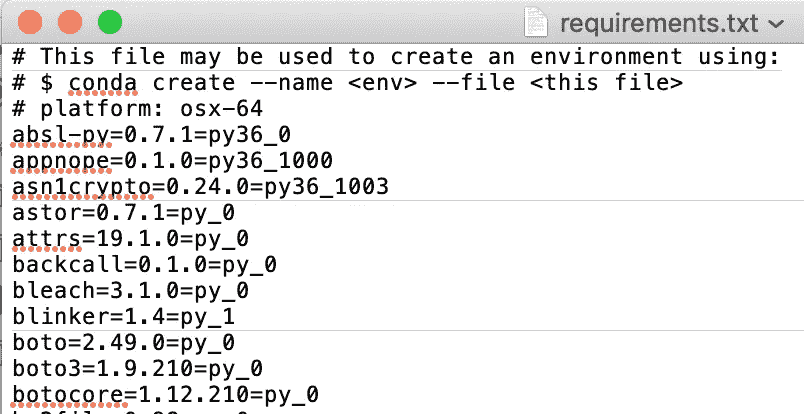
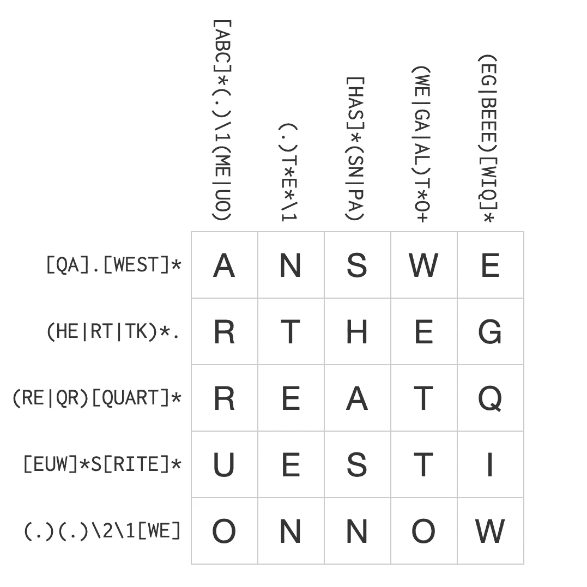

# 提升你的正则表达式技能

> 原文：<https://towardsdatascience.com/how-to-use-regex-7aeaf4dd25e9?source=collection_archive---------15----------------------->

## 为了乐趣和利益的正则表达式

正则表达式名声不好。它们很硬，不透明，会打碎东西。

They even [broke Stack Overflow](https://stackstatus.net/post/147710624694/outage-postmortem-july-20-2016).

依赖内置模块进行字符串匹配对于某些任务来说是不错的，但是您将错过编写自己的正则表达式所带来的强大功能和灵活性。(如果你真的很专注，你甚至可以让他们[做算术](https://regex101.com/r/xF5sEs/1)。)

这篇文章将向你展示一些你以前可能没有尝试过的正则表达式的用例，并给你一些资源，让学习它们变得有趣。

## **让你的 f 弦更加百搭**

Python 的 [f-strings](https://realpython.com/python-f-strings/) 非常棒——它们可读性强、简洁，并且比旧的%格式化方法更不容易出错。

使用 regex，您可以从中获得更多。为表达式加上前缀 *r* 表示“raw ”,这告诉 Python 忽略所有的转义字符。

But beware, even a raw string can’t consist **entirely** of a single backslash.

当你需要交换你的正则表达式的部分时，结合使用前缀 *r* 和前缀 *f* 。您可以用它来编写更短的循环，或者为您还没有或不需要编译的值保留一个位置。([这里有一个后一种情况的例子](https://nbviewer.jupyter.org/github/lorarjohns/Miniprojects/blob/master/notebooks/Python/Regex%20for%20Eric.ipynb)。)

Use re.compile to pre-compile a regular expression object.

## 精确查找和替换文本

正则表达式为您提供了一种改变字符串内容的简洁方法。在一行中，您可以使用捕获组来定位要替换和更改的项目。

在这里，我用这种技术扫描新闻文章中的句子，并用单词“alien”制作标签。

Use a numbered reference to the capturing group enclosed in parentheses.

The second expression replaces the targeted substring in the call to re.sub.

## 从嘈杂的数据中获取有价值的信息

我在日常生活中使用 regex 来简化其他任务(是的，真的)。例如，我想要 requirements.txt 文件中的包列表，但是不想要它们的具体版本。

Not pleasant.

Regex 避免了手动提取包名的繁琐。你可以在 [Regex101](https://regex101.com/r/9r8tGT/2/) 看到我是怎么做的。为此，我喜欢使用 [BBEdit](https://www.barebones.com/products/bbedit/) (以前的 TextWrangler)，但是你也可以使用 Regex101 中的“导出匹配”特性。这个网站给了你实时调试你的表达的额外好处。

花在学习正则表达式上的时间可以让你从繁琐的搜索中解脱出来，从而获得数倍的回报。我使用正则表达式从其他 Python 脚本中提取正则表达式，并在命令行中使用 T2 对文件进行 grepping。

## 训练你的大脑，享受挑战

在应用正则表达式时，您将通过分解搜索问题、抽象模式并在算法上应用它们来提高您的计算思维技能。

I’m fun at parties.

但是使用正则表达式的最好理由可能是它们只是*的乐趣*。如果你是那种喜欢解谜的人，你会沉迷于寻找不同的方法来解决同一个问题和解决边缘案例。

虽然正则表达式确实很难，有时甚至很危险，但生活中大多数美好的事情都是如此。做几个[填字游戏](https://regexcrossword.com)，打一点 [regex 高尔夫](https://nbviewer.jupyter.org/url/norvig.com/ipython/xkcd1313.ipynb)，看你合不同意。