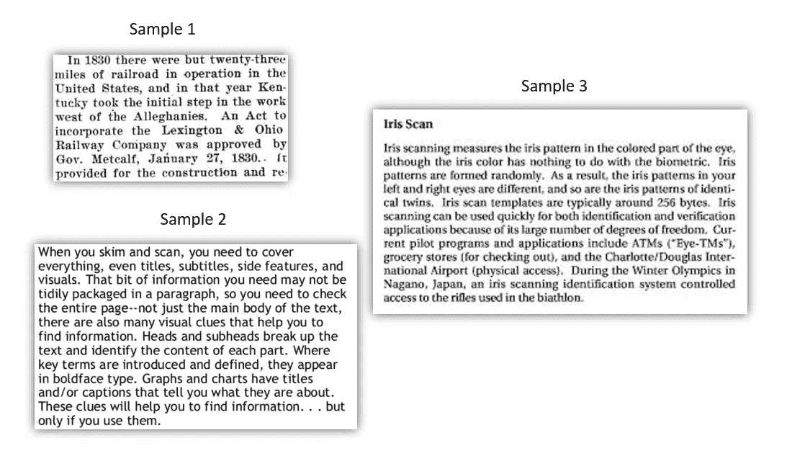
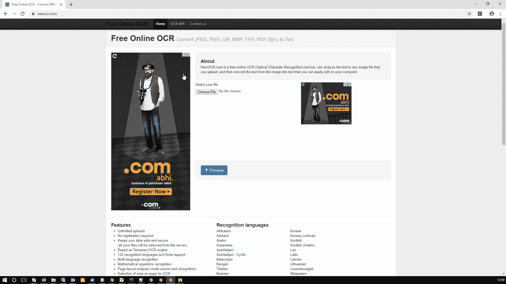
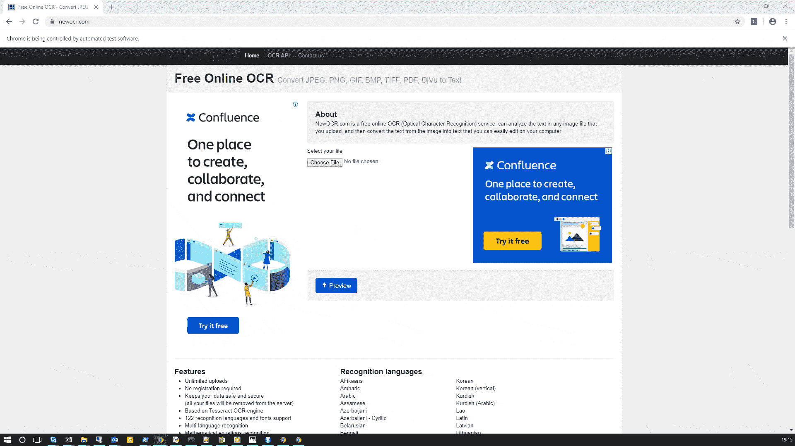

# 如何在处理无聊任务时使用硒作为救命稻草

> 原文：<https://towardsdatascience.com/how-to-use-selenium-as-life-saver-when-dealing-with-boring-tasks-ca264d1ce88?source=collection_archive---------18----------------------->

## 以 Selenium 的方式自动化永无止境的重复任务

如果您是一名开发人员，那么您可能不需要介绍 selenium。Selenium 是一个强大的工具，用于与 web 服务器交互，以编程的方式处理请求。它用于自动执行各种各样的任务，包括与远程 web 服务器的交互。在本文中，我将通过一个简单的例子来演示它的强大用法。

让我们考虑使用在线服务从扫描图像样本中自动提取文本的任务，称为光学字符识别(OCR)。该过程包括以下步骤。

1.  从本地存储器上传图像。
2.  启动 OCR 提取过程
3.  等待文本提取完成
4.  找到文本元素并检索
5.  将它写在 txt 文件中

我正在使用 [newocr](https://www.newocr.com/) 在线 ocr 服务进行任务演示。当我们一步一步地看代码时，我会解释正在做什么。代码是用 python 写的，但是没有 python 知识的读者也能理解这里讨论的概念。我已经挑选了一个样本扫描图像。让我们来看看样本图像。



# 1.导入所需的库

**webdriver** —与服务器交互的 Selenium 驱动类对象

**WebDriverWait** —暂停执行一段时间的功能

**预期条件** —等待条件通过

**超时异常** —用于处理因服务器响应延迟而导致的错误

**By** —用于指定要查找的元素类型

**ChromeDriverManager** —用于启动浏览器的 Chrome 版本

列出文件名以'结尾的所有文件。工作目录中的 jpeg' (jpeg 图像)。此外，你应该会看到一个 Chrome 浏览器自动启动，并登陆到 Newocr 主页。

**注意**:如果 chromedriver.exe 在 executable_path 中不可用，那么您将遇到“**web driver exception”**这意味着驱动程序存储在其他地方或者驱动程序不存在。如果 chromedriver.exe 不存在，下载它并指定位置的完整路径。

# 2.找到元素标签

对于每个动作，我们希望 selenium 在元素上执行，我们需要提供相应的元素路径。元素路径是指向 HTML 文档中给定标签的东西。这样做背后的想法是，我们要求 Selenium 在给定的位置标记并对其执行指定的操作。按照下面显示的步骤获取元素路径。



有许多方法可以定位元素，“CCS 选择器”是其中之一。一旦你做了上面的步骤，CSS 选择器的元素就会被复制到剪贴板上。然后使用这个选择器来定位元素。下面是从图像中提取文本的代码片段。

上面的代码片段做了以下事情:

1.  找到“选择文件”按钮并发送图像文件的完整路径
2.  找到“预览”按钮，并执行触发上传过程的点击操作。
3.  等待，直到“#ocr”元素出现，这意味着上传过程已完成，但不会超过 25 秒。
4.  一旦元素“#ocr”出现，就执行触发文本提取过程的点击动作。
5.  等待提取完成。
6.  定位检索到的文本元素，然后复制结果并存储在变量“txt”中。

让我们付诸行动吧。



您可能想知道手动执行过程是否比编程更容易，为什么要编写代码。想象一下你自己处于这样一种情况，你必须处理 100 张图像来从中提取文本，这是一个繁琐的过程。在这种情况下，硒可能是救命稻草。当你在办公室自助餐厅和同事聊天、喝咖啡时，Selenium 会让你的机器完成工作。让我们看看它是怎么做的。

该代码循环遍历每个图像，并应用前面讨论过的操作。对样本图像运行的代码片段产生以下结果。

```
Output from the Sample_1.jpeg :In 1830 there were Dut twenty-three
miles of railroad in operation in the
United States, and in that year Ken-
tucky took the initial step in the work
weat of the Alleghanies. An Act to
incorporate the Lexington & Ohio
Railway Company was approved by
Gov. Metcalf, January 27, 1830.. {t
provided for the construction and re.Output from the Sample_2.jpeg :When you skim and scan, you need to cover
everything, even titles, subtitles, side features, and
visuals. That bit of information you need may not be
tidily packaged in a paragraph, so you need to check
the entire page--not just the main body of the text,
there are also many visual clues that help you to
find information. Heads and subheads break up the
text and identify the content of each part. Where
key terms are introduced and defined, they appear
in boldface type. Graphs and charts have titles
and/or captions that tell you what they are about.
These clues will help you to find information. . . but
only if you use them.Output from the Sample_3.jpeg :irks ScanTris scanning meusures the iris pattern in the cotored part of the eye,
although the iris color has nothing to do with the biornetric. tris
patterns are formed randomly. As a result, the iris patterns in your
left and right eyes are different, and so are the iris patterns of identi-
cal twins, Iris scan templates ure typically around 256 bytes. bis
scanning can be used quickly for both identification and verification
applications because of its large number of degrees of freedom, Cur-
Tent pilot programs and applications include ATMs (“Eye-TMs"),
grocery stores (for checking out), and the Charlotte/Douglas Inter-
national Airport (physical access}. During the Winter Otympics in
Nagano, Japan, an iris scanning identification system controlled
access to the rifles used in the biathlon.
```

感谢您的阅读。