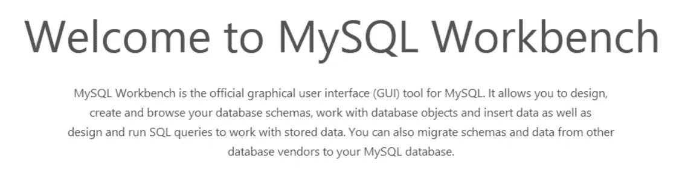
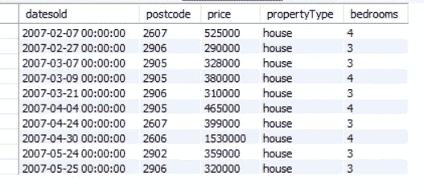
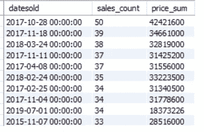
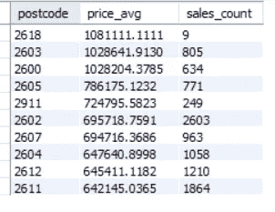
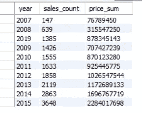
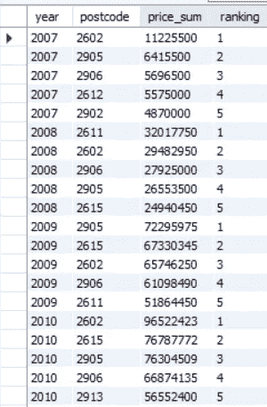
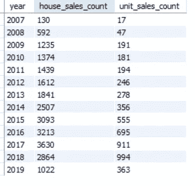
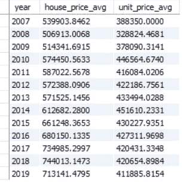
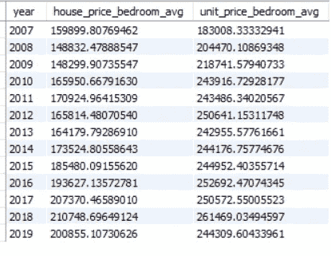

# 如何使用 SQL 进行数据分析(房产销售时间序列)

> 原文：<https://towardsdatascience.com/how-to-use-sql-to-perform-data-analysis-house-property-sales-time-series-bf36cd3c2528?source=collection_archive---------13----------------------->

欢迎阅读我的新文章。如果你想在求职过程中脱颖而出，数据分析永远是一项必要的技能。也许你知道怎么用 Python 或者 R 甚至 SAS/Matlab 来执行。但是了解 SQL 通常是您应该拥有的一项必要而重要的技能。许多公司仍然大量使用 SQL 进行数据提取和分析。简单但能够处理足够多的数据帮助 SQL 在多年后仍然很重要(我编写 SQL 已经超过七年了)。

因此，我在这里演示一个使用 SQL 的数据分析。我做 SQL 用的平台是 MySQL Workbench。您可以从以下链接免费下载:

[](https://dev.mysql.com/downloads/workbench/) [## MySQL::下载 MySQL 工作台

### MySQL Workbench 为数据库管理员和开发人员提供了一个集成的工具环境，用于:数据库设计和建模

dev.mysql.com](https://dev.mysql.com/downloads/workbench/) 

而这个分析的数据集是来自 Kaggle 的“房产销售时间序列”。

 [## 房产销售时间序列

### 下载数千个项目的开放数据集+在一个平台上共享项目。探索热门话题，如政府…

www.kaggle.com](https://www.kaggle.com/deltacrot/property-sales) 

关于如何使用 MySQL Workbench 超出了本文的范围。您可以从文档中获得更多信息。有一点要提的是，我是用 MySQL 编码 SQL 的。如果您使用 Oracle 或其他软件编码，可能会有一些不同。如果遇到错误，不必惊慌。只要变回你的语言应该有的样子。

 [## MySQL 工作台

### 这是 MySQL 工作台参考手册。它记录了 MySQL Workbench 社区和 MySQL Workbench…

dev.mysql.com](https://dev.mysql.com/doc/workbench/en/) 

该模式称为“数据集”，数据存储为一个名为“raw_sales”的表

第一步总是打印数据集中的一些记录。

```
SELECT * FROM dataset.raw_sales
LIMIT 10
```



因此，数据集中有五列，日期出售、邮政编码、价格、财产类型和卧室。

```
select min(datesold) as min_datesold, max(datesold) as max_datesold 
from dataset.raw_sales;select count(1) from dataset.raw_sales;
```

该数据集涵盖了从 2007 年 2 月 7 日到 2019 年 7 月 27 日的 29580 条记录。

那么哪个日期的销售最频繁呢？

```
select datesold, count(1) as sales_count, sum(price) as price_sum
from dataset.raw_sales
group by datesold
order by sales_count desc 
limit 10;
```



所以一天的最大销售量是 50 件，总价是 4200 万英镑。

哪个邮政编码的平均销售价格最高？

```
select postcode,avg(price) as price_avg , count(1) as sales_count
from dataset.raw_sales
group by postcode
order by price_avg desc
limit 10;
```



邮编 2618 的共 9 笔销售，均价 1.08M

而哪一年的销量最低？

```
select year(datesold) as year , count(1) as sales_count, sum(price) as price_sum 
from dataset.raw_sales
group by year 
order by sales_count
limit 10;
```



有没有可能知道每年价格排名前五的邮编？当然可以，但是要知道什么是窗函数。

一开始我不知道什么是窗口函数。但是后来我在面试中被一次又一次地问到。所以我查了一下，意识到我应该早点知道这个(至少帮我面试回答问题)。

基本上，window 函数可以基于分区执行聚合，并将结果返回给一行。如果您想了解更多关于窗口函数的语法和用法，我建议您阅读 Oracle 的文档，如下所示:

 [## MySQL :: MySQL 8.0 参考手册::12.21.1 窗口函数描述

### 在以下函数描述中，over_clause 表示 over 子句，如第 12.21.2 节“窗口…”所述

dev.mysql.com](https://dev.mysql.com/doc/refman/8.0/en/window-function-descriptions.html) 

所以我首先按年份和邮编合计价格

```
select year(datesold) as year ,postcode, sum(price) as price_sum 
from dataset.raw_sales
group by year, postcode
```

然后我使用窗口函数得到每年总价的排名。

```
select year,postcode, price_sum, row_number() over (partition by year order by price_sum desc) as ranking
from (
select year(datesold) as year ,postcode, sum(price) as price_sum 
from dataset.raw_sales
group by year, postcode
)  a
```

最后，选择所有排名小于或等于 5 的记录

```
select * from
(
select year,postcode, price_sum, row_number() over (partition by year order by price_sum desc) as ranking
from (
select year(datesold) as year ,postcode, sum(price) as price_sum 
from dataset.raw_sales
group by year, postcode
)  a
) b
where ranking <=5 
order by year,ranking
```



接下来，我将继续讨论 propertyType。有两种类型，房子和单位。

那么每年有多少房子和单元的销售呢？

最简单的方法是分组，然后数有多少条记录。但在这里，我通过使用 case when 提出了另一种方法。函数是根据标准进行聚合的另一个有用函数的情况。在这里，当我计算记录的数量时，我没有使用 count 函数，而是使用 sum 函数和 case when 函数。

```
select year(datesold) as year, 
sum(case when propertyType = "house" then 1 else 0 end) as house_sales_count,
sum(case when propertyType = "unit" then 1 else 0 end) as unit_sales_count 
from dataset.raw_sales
group by year;
```

因此，对于 house_sales_count，如果 propertyType 等于 house，则返回 1。否则，它返回 0。然后对所有记录求和。这将显示 propertyType 等于 house 的销售数量。



另一个优点是结果看起来像 Excel 数据透视表。可以直接做个对比。

你可以清楚地看到，每年的房屋销售量都比单位销售量多。那么后续的问题一定是关于房子和单位的平均差价。当然我们也可以用 case 当函数。但有一点需要谨慎的是，else 部分。

```
select year(datesold) as year,
avg(case when propertyType = "house" then price else null end) as house_price_avg,
avg(case when propertyType = "unit" then price else null end) as unit_price_avg
from dataset.raw_sales
group by year;
```

有必要返回一个空值，而不是返回 0，这样在计算平均值时就不会包括该特定记录。



再说一次，房子的平均价格比单位价格更高。

进一步考虑卧室数量怎么样？

```
select year(datesold) as year,
avg(case when propertyType = "house" then price/bedrooms else null end) as house_price_bedroom_avg,
avg(case when propertyType = "unit" then price/bedrooms else null end) as unit_price_bedroom_avg
from dataset.raw_sales
group by year;
```



这次的情况有所不同。就卧室数量而言，该单元的平均价格高于房子。

这个分析到此结束。我会说 SQL 已经削弱了它在数据分析中的重要性，尤其是许多公司仍然只将 SQL 用于数据挖掘和分析。知道如何掌握 SQL 绝对有助于你获得一个分析职位。希望你看完我的文章能有所收获。请随意给出你的评论或者下次你想让我介绍什么。希望你喜欢，下次再见。