# 如何在熊猫小组中运用分裂-运用-结合策略

> 原文：<https://towardsdatascience.com/how-to-use-the-split-apply-combine-strategy-in-pandas-groupby-29e0eb44b62e?source=collection_archive---------1----------------------->

## 通过这个熊猫视觉指南掌握 Python 中的分割-应用-组合模式`groupby-apply`。

## TL；速度三角形定位法(dead reckoning)

Pandas `groupby-apply`是 Python 数据科学家工具箱中的一个无价工具。在没有完全理解其所有内部复杂性的情况下，您可能会走得很远。然而，有时这可能会表现为意外的行为和错误。吃过吗？或者也许您正在努力解决如何处理更高级的数据转换问题？然后阅读这个熊猫`groupby-apply`范例的视觉指南，一劳永逸地理解它是如何工作的。


*来源:我的团队在* [*晒版机*](https://sunscrapers.com/?utm_source=medium&utm_medium=article) *提供。*

# 介绍

在 Pandas 中处理更高级的数据转换和数据透视表时，对`groupby-apply`机制的深入理解通常是至关重要的。

这对新手来说可能是一个陡峭的学习曲线，对中级熊猫用户来说也是一种“陷阱”。这就是为什么我想与你分享一些视觉指南，展示当我们运行`groupby-apply`操作时实际发生的事情。

下面是我认为您应该首先了解的一些事情，以便更直接地使用更高级的 Pandas 数据透视表:

Groupby —它是做什么的？

1.  应用—它是如何工作的，我们传递给它什么？
2.  联合收割机阶段会发生什么？
3.  当自定义函数返回一个序列时会发生什么？
4.  当它返回一个数据帧时呢？
5.  当自定义函数返回除了上面两个以外的东西时会发生什么？

请继续阅读，以获得这些问题的答案以及关于在 Pandas 中使用数据透视表的一些额外见解。

# 我们的示例表

让我们以经典的 Iris 数据集为例(可从 Seaborn 绘图库中获取),为简单起见，将其限制为 15 行:

```
import seaborn as snsiris_data = sns.load_dataset(‘iris’)
df = iris_data.head(5).copy()
df = pd.concat([df, iris_data..iloc[50:55]])
df = pd.concat([df, iris_data.iloc[100:105]])
```

该表很小，但足以满足我们的需求，非常适合本文中的演示目的:

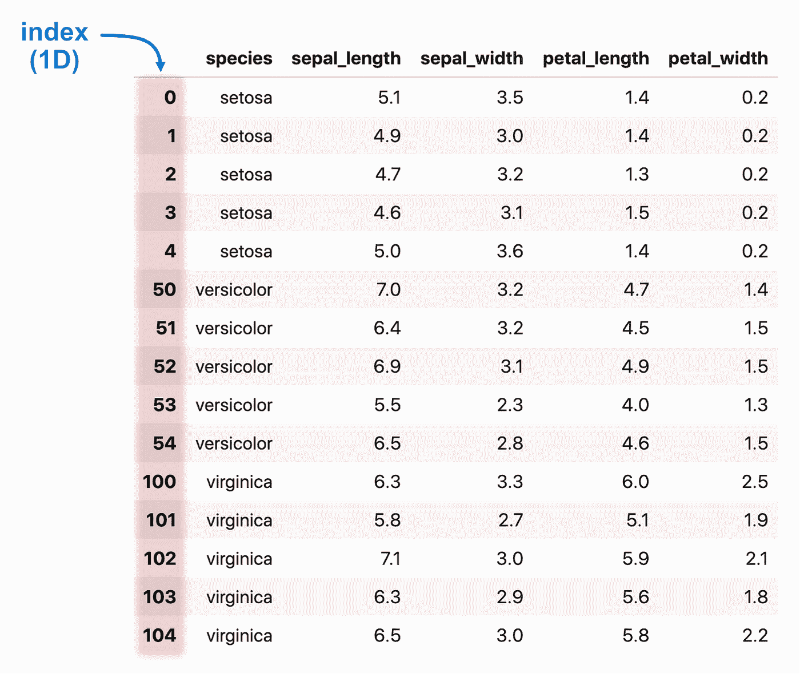

# 使用 groupby()分组

让我们从更新一些关于`groupby`的基础知识开始，然后在我们进行的过程中在上面构建复杂性。

您可以将`groupby`方法应用于具有简单 1D 索引列的平面表。它还没有在表上执行任何操作，只是返回了一个`DataFrameGroupBy`实例，因此需要链接到某种聚合函数(例如，`sum`、`mean`、`min`、`max`等)。更多的见这里的[，它们将对分组行起作用(我们将在后面讨论应用)。](https://pandas.pydata.org/pandas-docs/stable/reference/groupby.html)

这里需要记住的重要一点是，它会自动将单个聚合结果连接回一个数据框架。

一个非常简单的例子是按特定的列值分组(如我们表中的“物种”),并对所有剩余的适用列求和:

```
df.groupby(‘species’).sum()
```

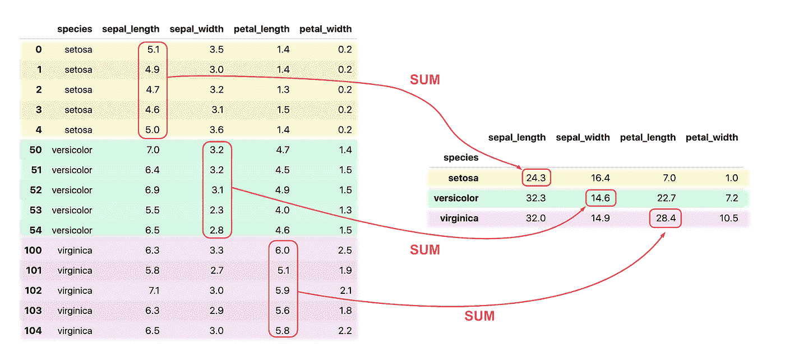

或者，我们可以指定要对哪些列求和。一些人犯的一个常见错误是先计算总和，然后在末尾添加一个列选择器，如下所示:

```
df.groupby(‘species’).sum()[‘sepal_width’] *# ← BAD!*
```

这意味着首先对每个适用的列(数字或字符串)进行求和，然后选择一个指定的列进行输出。

这里有一个更好的方法:

**在聚合函数之前指定列，以便在过程中只对一列求和，从而显著提高速度(对于这个小表是 2.5 倍):**

```
df.groupby(‘species’)[‘sepal_width’].sum() *# ← BETTER & FASTER!*
```

注意，由于只有一列被求和，因此结果输出是一个`pd.Series`对象:

```
species
setosa 16.4
versicolor 14.6
virginica 14.9
Name: sepal_width, dtype: float64
```

但是，如果您想直接自动返回 dataframe 对象(毕竟它的可读性要好得多)，就没有必要通过`pd.Dataframe()`进行强制转换。相反，将列名作为列表提供给列选择(本质上，使用双括号)，如下所示:

```
df.groupby(‘species’)[**[**‘sepal_width’**]**].sum()
```

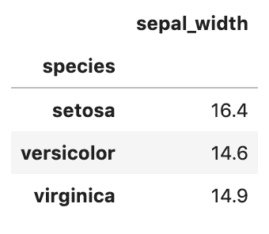

最后，`groupby`可以接受一个列名列表，并对所有剩余的适用列(之前没有提到)执行聚合函数。

**理解这一点很重要，结果表将有一个** `**MultiIndex**` **对象作为索引，其行为与常规表略有不同。**

```
multicol_sum = df.groupby([‘species’, ‘petal_width’]).sum()
```

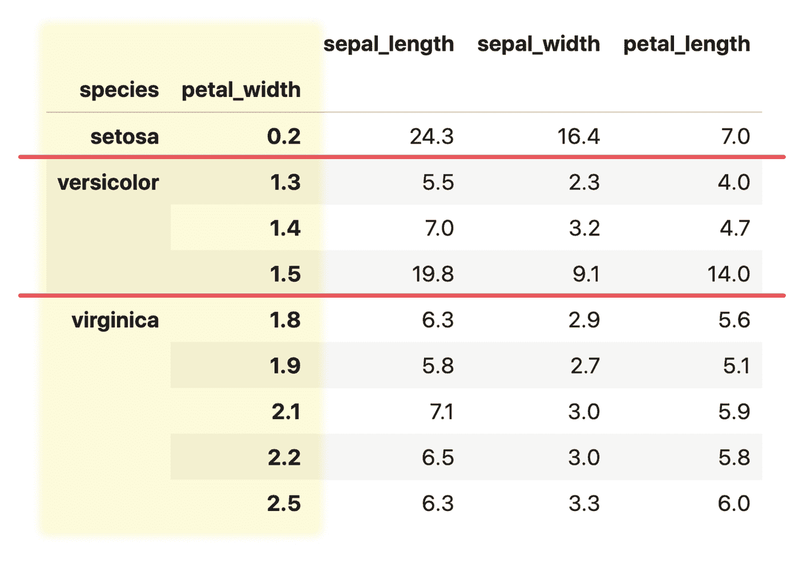

**有用提示:使用** `**MultiIndex**` **表时，您可以使用** `**.xs**` **选择数据帧的子集，方法是选择一个值，然后选择特定的索引级别。产生的输出通常也是 dataframe 对象。**

这里有一个例子:

```
multicol_sum.xs(‘virginica’, level=’species’)
```

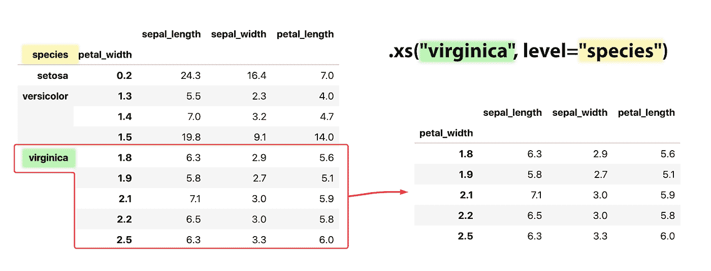

另外，不要忘记您可以通过运行`reset_idnex`方法将索引“展平”成列:

```
multi_sum.reset_index()
```

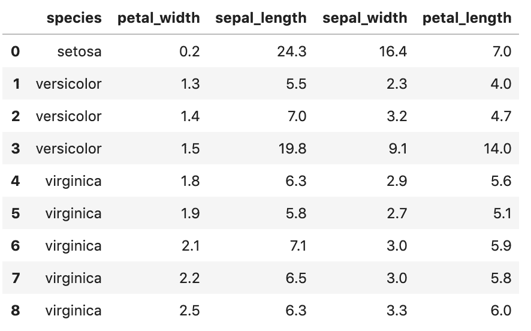

此外，如果您将一个`drop=True`参数传递给`reset_index`函数，您的输出数据帧将删除组成`MultiIndex` 的列，并创建一个具有增量整数值的新索引。

# `apply()`法

现在让我们进入下一个阶段。

我们可以定义自己的自定义函数，并通过`apply()`方法在表上运行它，而不是使用 Pandas 提供的常用函数来操作组。

要写好一个自定义函数，你需要理解这两个方法如何在所谓的 Groupby-Split-Apply-Combine 链式机制中相互协作(更多关于这个[在这里](http://pandas.pydata.org/pandas-docs/stable/user_guide/groupby.html))。

正如我已经提到的，第一阶段是创建一个 Pandas `groupby`对象(`DataFrameGroupBy`)，它为 apply 方法提供一个接口，以便根据指定的列值将行分组在一起。

我们暂时将这些组分开，并通过一个优化的 Pandas 内部代码将它们循环。然后，我们将每个组作为一个`Series`或`DataFrame`对象传递给一个指定的函数。

函数的输出被临时存储，直到所有组都被处理。在最后一个阶段，所有结果(来自每个函数调用)最终被组合成一个输出。

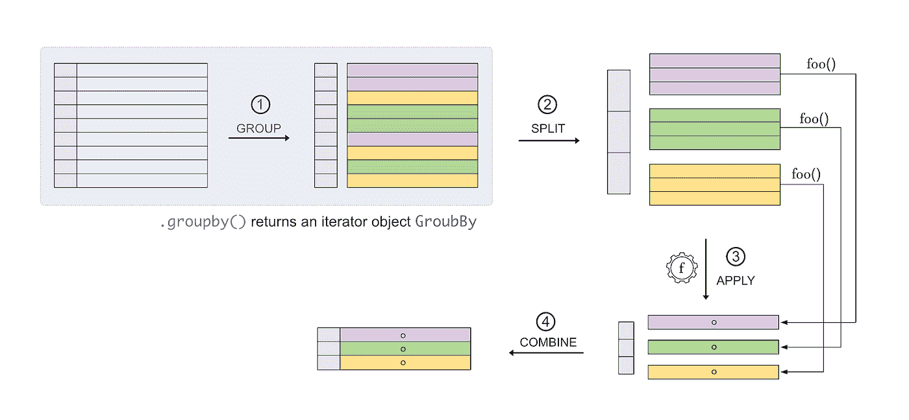

这里有几点我们需要记住，以避免在使用`groupby`和`apply`方法时可能出现的意外。

在极少数情况下，当我们被迫使用一个 *for-in* 循环迭代单个行组时，这一点尤其重要(通常，这是一种不好的做法——然而，在某些情况下这可能是不可避免的)。

# 1]应用功能

您可以通过几种方式为每组操作提供逻辑。

您可以定义单独的函数并将其作为要应用的对象传递，也可以直接传递 lambda 表达式。还有一种`.agg()`方法，它通过提供一个名称或一系列函数名称来实现多个聚合函数(但这超出了本文的范围)。

例如，这两个命令

```
df.groupby(‘species’).apply(lambda gr: gr.sum())
```

和

```
def my_sum(gr):
 return gr.sum()df.groupby(‘species’).apply(my_sum)
```

产生完全相同的结果:

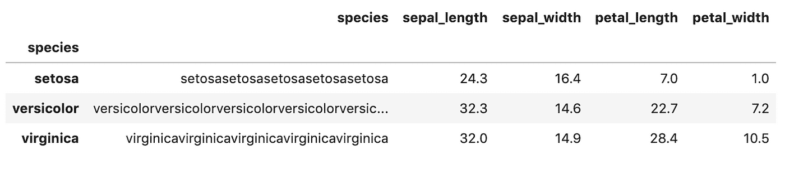

顺便说一下，是的，具有字符串值的列也被“求和”，它们只是简单地连接在一起。

# 2]功能输入

定制函数应该有一个输入参数，该参数可以是一个`Series`或一个`DataFrame`对象，这取决于通过`groupby`方法指定的是一列还是多列:

```
def foo(gr):
 print(type(gr))
 return Nonedf.groupby(‘species’).apply(foo)
```

产出:

```
<class ‘pandas.core.frame.DataFrame’>
<class ‘pandas.core.frame.DataFrame’>
<class ‘pandas.core.frame.DataFrame’>
<class ‘pandas.core.frame.DataFrame’>
```

，而(忽略这里有 4 行的事实，我稍后会解释)

```
df.groupby(‘species’)[‘petal_length’].apply(foo)
```

退货:

```
<class ‘pandas.core.series.Series’>
<class ‘pandas.core.series.Series’>
<class ‘pandas.core.series.Series’>
```

# 3]在自定义函数中使用 print()语句

当编写一个复杂的表转换时，你有时可能想要遍历`apply`ed 函数的内部工作方式，并添加一个`print()`语句来检查操作过程中发生了什么(我经常这样做，以便在遇到困难时确定方向)。

对你们中的一些人来说，这可能很令人吃惊，但是当你运行下面的代码时，你将得到一个你可能没有预料到的额外的位:

```
def foo(gr): 
 print(gr, ‘\n’)

df.groupby(‘species’).apply(func=foo)
```

这是打印出来的内容:

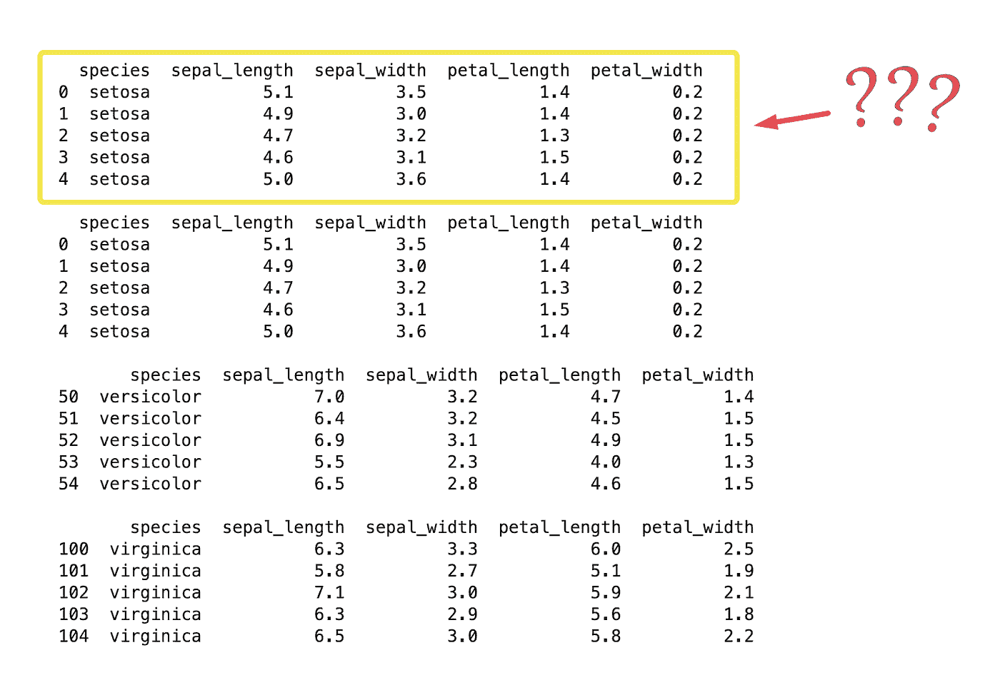

这种神秘的行为实际上在熊猫文档[中有解释，但是很容易被忽略——我知道我是这么做的，而且不得不艰难地学习它，所以让我来帮你省点麻烦:](http://pandas.pydata.org/pandas-docs/version/0.24/reference/api/pandas.DataFrame.apply.html)

> *在当前实现中，在第一列/行上应用调用 func 两次，以决定它是否可以采用快速或慢速代码路径。如果 func 有副作用，这可能会导致意外的行为，因为它们会对第一列/行生效两次。*

# 4]功能输出

拼图的最后一块是应用函数的输出，以及如何在*合并*阶段处理它。这里发生的事情是，Pandas 从每个后续的组操作中获取所有的输出，并将它们与它们相应的标签连接起来，这些标签也是由`DataFrameGroupBy`对象提供的。后者随后被用于创建新的索引。

这意味着您可以设计一个自定义函数来返回任何内容，它将被放置在组名标签下的特定组的一行中。

这个例子应该很好地说明了这一点:

```
def foo(gr):
 return pd.Series(“This is a test”)df.groupby(‘species’).apply(func=foo)
```

将创建:

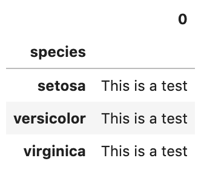

然而，在大多数情况下(例如，使用 sum 函数)，每次迭代都返回每行一个 Pandas `Series`对象，其中索引值用于将值分类到最终数据帧中的正确列名。

这个例子应该说明:

让我们创建一个定制的`Series`对象，并通过`apply`方法在每个组上返回它:

```
myseries = pd.Series(
 data=[‘one’, ‘two’, ‘3’],
 index=[‘a’, ‘b’, ‘c’]
)def foo(gr):
 return myseriesdf2.groupby([‘species’, ‘petal_width’]).apply(func=foo)
```

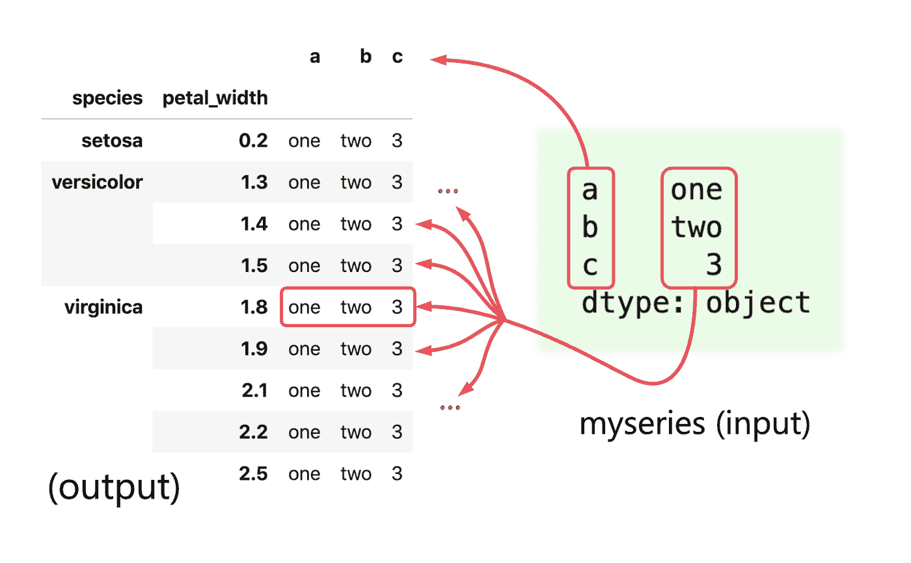

如果我们为每个迭代组返回一个`DataFrame`会怎么样？结果有点有趣，因为它将创建一个具有`MultiIndex`结构的表。它将把`DataFrame`按原样追加到每一行中，并且它的索引将与组标签值集成在一起，例如:

```
def foo(gr):
 return pd.DataFrame(myseries) df2.groupby([‘species’, ‘petal_width’]).apply(func=foo)
```

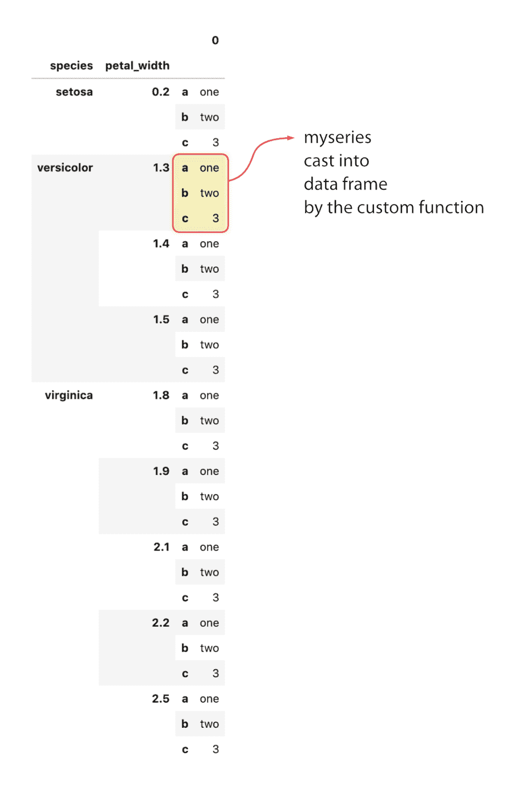

**现在就这样。**

理解这些问题将使您更容易在 Pandas 表上处理一些更复杂的枢轴和操作。每当我陷入困境时，我会时不时地重温这些基础知识——它总能帮助我大大加快这个过程！