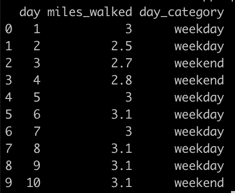
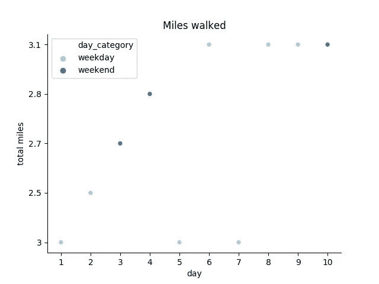
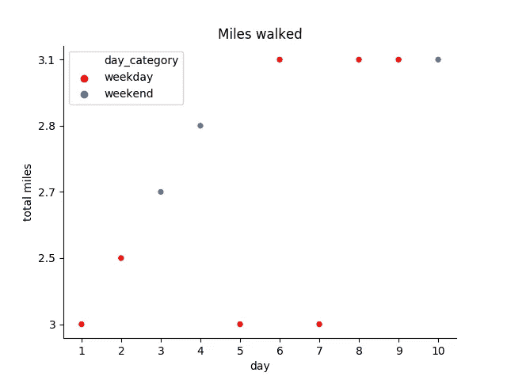

# 如何在 Seaborn 中使用自己的调色板

> 原文：<https://towardsdatascience.com/how-to-use-your-own-color-palettes-with-seaborn-a45bf5175146?source=collection_archive---------5----------------------->


前几天，我用 [seaborn](http://seaborn.pydata.org) 制作了一些可视化效果，这是一个基于 Matplotlib 的非常棒的超级易用的库。

即使我很喜欢 seaborn 的默认风格，因为它们的美学非常干净，但我通常喜欢定制的一点是数据点上的颜色。

我试图寻找如何在 seaborn 中使用或创建自定义调色板的端到端示例，但是很难找到。

所以我决定利用我的 matplotlib 知识，收集我能找到的关于 seaborn 调色板的所有信息，来创建我自己的代码示例/模板。

希望你觉得有用。

像往常一样，您从漂亮的虚拟数据开始😀

```
import numpy as np
import pandas as pd
import seaborn as sns
import matplotlib.pyplot as pltdata = np.array([[1, 3, 'weekday'], [2, 2.5, 'weekday'],[3, 2.7, 'weekend'], [4, 2.8, 'weekend'], [5, 3, 'weekday'], [6, 3.1, 'weekday'], [7, 3, 'weekday'], [8, 3.1, 'weekday'], [9, 3.1, 'weekday'], [10, 3.1, 'weekend']])# Creating a data frame with the raw data
dataset = pd.DataFrame(data, columns=['day', 'miles_walked', 'day_category'])
```

如果你想看一眼数据集

```
print(dataset)
```

你会看到这样的东西



## 1.使用现有的调色板

seaborn 和 matplotlib 有很多不同的调色板可供选择。在这个例子中，我将使用[配对调色板](https://seaborn.pydata.org/tutorial/color_palettes.html#using-categorical-color-brewer-palettes)。

```
# Set the color palette
sns.set_palette(sns.color_palette("Paired"))# Plot the data, specifying a different color for data points in
# each of the day categories (weekday and weekend)
ax = sns.scatterplot(x='day', y='miles_walked', data=dataset, hue='day_category')# Customize the axes and title
ax.set_title("Miles walked")
ax.set_xlabel("day")
ax.set_ylabel("total miles")# Remove top and right borders
ax.spines['top'].set_visible(False)
ax.spines['right'].set_visible(False)plt.show()
```



使用现有的调色板，您唯一需要做的事情是在调用 plot 方法和您想要的任何其他定制之前设置它。

## **2。使用自己的调色板**

如果你想使用一组特定的颜色，或者因为它们是你最喜欢的颜色，或者是你正在使用的风格指南的一部分，你也可以这样做！

```
# Create an array with the colors you want to use
colors = ["#FF0B04", "#4374B3"]# Set your custom color palette
sns.set_palette(sns.color_palette(colors))# And then, from here onwards, it's exactly like the previous example# Plot the data, specifying a different color for data points in
# each of the day categories (weekday and weekend)
ax = sns.scatterplot(x='day', y='miles_walked', data=dataset, hue='day_category')# Customize the axes and title
ax.set_title("Miles walked")
ax.set_xlabel("day")
ax.set_ylabel("total miles")# Remove top and right borders
ax.spines['top'].set_visible(False)
ax.spines['right'].set_visible(False)plt.show()
```



如果您想在多个图中使用自己的调色板，您也可以在 seaborn 图中使用参数`palette`，并在整个代码中引用您的自定义调色板。

```
# Create an array with the colors you want to use
colors = ["#FF0B04", "#4374B3"]# Set your custom color palette
customPalette = sns.set_palette(sns.color_palette(colors))# Use the parameter palette and use your own palette across all your
# plots
ax = sns.scatterplot(x='day', y='miles_walked', data=dataset, hue='day_category', palette=customPalette)# Customize the axes and title
ax.set_title("Miles walked")
ax.set_xlabel("day")
ax.set_ylabel("total miles")# Remove top and right borders
ax.spines['top'].set_visible(False)
ax.spines['right'].set_visible(False)plt.show()
```

这样就会造成和上面一样的剧情！但是现在你可以在你的任何一幅 seaborn 图中引用`customPalette`来使用相同的调色板。

就是这样！一个很好的方式来定制您的情节，使您的可视化更有见地。

*感谢阅读！*