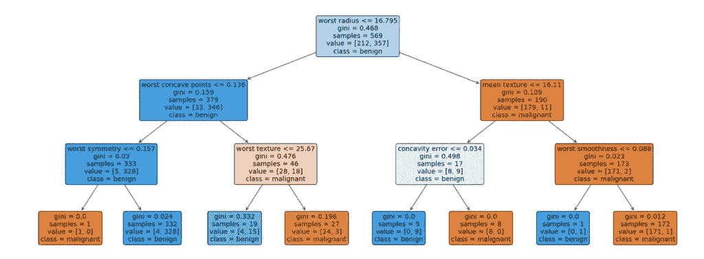

# 如何用 Python (2020)三步可视化决策树

> 原文：<https://towardsdatascience.com/how-to-visualize-a-decision-tree-in-5-steps-19781b28ffe2?source=collection_archive---------10----------------------->

## 用 Python 学习 Scikit 的一个例子

Photo by [Alexandre Chambon](https://unsplash.com/@goodspleen?utm_source=medium&utm_medium=referral) on [Unsplash](https://unsplash.com?utm_source=medium&utm_medium=referral)

决策树是一种非常流行的机器学习模型。它的美妙之处在于其易于理解的可视化和在生产中的快速部署。

在本教程中，你将发现一个**的三步程序，用于可视化 Python(Windows/Mac/Linux)中的决策树**。

跟着做，画出你的第一棵决策树！

**2020 年 4 月更新****:
sci kit-learn(sk learn)库增加了一个新功能，允许我们在没有 GraphViz 的情况下绘制决策树。
所以我们可以使用 matplotlib 库的 [plot_tree](https://scikit-learn.org/stable/modules/generated/sklearn.tree.plot_tree.html) 函数。**

# **步骤 1:下载并安装 Anaconda**

**根据您的计算机操作系统版本，选择正确的 Anaconda 包进行下载。Anaconda 是一个常见的 Python 发行版，通常允许大型公司下载和安装。**

** [## Anaconda Python/R 发行版-免费下载

### 开源的 Anaconda 个人版(正式的 Anaconda 发行版)是执行 Python/R…

www.anaconda.com](https://www.anaconda.com/distribution/#download-section) 

**相关文章:** [如何安装/设置 Python 并立即准备数据科学](https://www.justintodata.com/install-python-and-prep-for-data-science/)
查看使用 Anaconda 安装 Python 的分步说明。

# 步骤 2:导入包并读取数据

首先，让我们从 Python 机器学习库 [scikit-learn](https://scikit-learn.org/stable/) 导入一些函数。

sklearn 需要 0.21 或更高版本。如果你刚刚安装了 Anaconda，它应该足够好了。

接下来，让我们读入数据。这里以乳腺癌数据为例。

# 第三步:创建决策树并将其可视化！

在您的 Python 版本中，复制并运行以下代码来绘制决策树。我更喜欢 Jupyter 实验室，因为它的互动功能。

恭喜你的第一个决策树图！

希望本指南对您有所帮助。

如果你有任何问题，请留言。** 

**在你离开之前，别忘了 [*报名参加刚刚进入数据快讯的*](https://www.justintodata.com/) ！或者通过[推特](https://twitter.com/JustintoData)、[脸书](https://www.facebook.com/justintodata/)与我们联系。**

*****更多数据科学相关文章来自 Lianne 和 Justin:*****

** [## 如何在线学习数据科学:你需要知道的一切——进入数据

### 这是利用在线资源进入数据科学的完整路线图/课程。你是否想学习…

www.justintodata.com](https://www.justintodata.com/how-to-learn-data-science-online-all-you-need-to-know/)  [## Python 中的数据清理:终极指南(2020)——只进入数据

### 我们用 Python 创建了这个新的完整的分步指南。你将学习如何寻找和清理的技巧:丢失…

www.justintodata.com](https://www.justintodata.com/data-cleaning-python-ultimate-guide/)  [## 预测时间序列的三个步骤:LSTM 与 TensorFlow Keras -只是进入数据

### 这是利用在线资源进入数据科学的完整路线图/课程。你是否想学习…

www.justintodata.com](https://www.justintodata.com/forecast-time-series-lstm-with-tensorflow-keras/)**