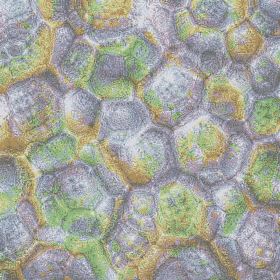

# 如何用 40 行代码可视化卷积特征

> 原文：<https://towardsdatascience.com/how-to-visualize-convolutional-features-in-40-lines-of-code-70b7d87b0030?source=collection_archive---------2----------------------->

## 卷积神经网络彻底改变了计算机视觉，并将彻底改变整个世界。开发解释它们的技术是一个重要的研究领域，在本文中，我将向您解释如何可视化卷积特征，如标题图片所示，只需 40 行 Python 代码。

最近，在读杰里米·里夫金的书《工作的终结》时，我看到了人工智能的一个有趣定义。里夫金写道:*“今天，当科学家们谈论人工智能时，他们通常指的是‘创造机器的艺术，这些机器执行的功能需要人来执行。”(摘自 Kurzweil，Raymond 著《智能机器时代》(麻省剑桥:麻省理工出版社，1990 年)，第 14 页。)".我喜欢这个定义，因为它避免了人工智能在我们的智能意义上是否真正智能的大肆讨论。作为一名科学家，揭示我们大脑的功能原理并创造一个真正智能的机器的想法让我兴奋，但我认为重要的是要认识到*深度学习模型不是大脑的模型(弗朗索瓦·乔莱，用 Python 进行深度学习(纽约州谢尔特岛:曼宁出版公司，2018 年)，第 8 页)*。深度学习研究旨在从数据*中*学习规则，以自动化到目前为止还不能自动化的过程。虽然这听起来不那么令人兴奋，但它确实是一件伟大的事情。仅举一个例子:深度卷积神经网络的出现彻底改变了计算机视觉和模式识别，并将允许我们在医疗诊断等领域引入大量自动化。这可以让人类迅速将顶尖的医学诊断带给贫穷国家的人们，这些国家没有能力培养他们原本需要的许多医生和专家。*

尽管有关于深度学习的所有令人兴奋的消息，但神经网络看待和解释世界的确切方式仍然是一个黑箱。更好地理解它们如何准确地识别特定的模式或对象，以及它们为什么工作得如此好，可能会让我们 1)进一步改进它们，2)还会解决法律问题，因为在许多情况下，机器做出的决定必须是人类可以解释的。

有两种主要方法可以尝试理解神经网络如何识别某种模式。如果您想知道哪种模式显著激活了某个特征图，您可以 1)尝试在数据集中查找导致该特征图高平均激活率的图像，或者 2)尝试通过优化随机图像中的像素值来生成这种模式。后一种想法是由[尔汗等人 2009](https://www.researchgate.net/publication/265022827_Visualizing_Higher-Layer_Features_of_a_Deep_Network) 提出的。在本文中，我将向您解释如何通过优化随机图像的像素值来为封面图片所示的卷积神经网络生成特征可视化，只需大约 40 行 Python 代码。

这篇文章的结构如下:首先，我将向您展示一个 *VGG-16* 网络的几层中卷积特征的可视化，然后我们将尝试理解其中一些可视化，我将向您展示如何快速测试某个过滤器可能检测到哪种模式的假设。最后，我将解释创建本文介绍的模式所必需的代码。

我们开始吧:)

# 特征可视化

神经网络学习将输入数据(如图像)转换成意义越来越大、越来越复杂的连续层。

> 你可以把一个深层网络想象成一个多阶段的信息提炼操作，信息经过连续的过滤，越来越纯净。(弗朗索瓦·乔莱(Franç ois Chollet)，用 Python 进行深度学习(纽约州谢尔特岛:曼宁出版公司，2018 年)，第 9 页)

阅读完他的文章后，您将知道如何生成模式，以最大化在那些分层表示的特定层中所选特征图的平均激活，如何能够解释其中一些可视化，以及最终如何测试所选过滤器可能响应哪种模式或纹理的假设。下面你会看到一个 *VGG-16* 网络的几层中过滤器的可视化特征。在观察它们的同时，我希望你能观察到，随着我们深入网络，生成的模式的复杂性是如何增加的。

## 第 7 层:Conv2d(64，128)

filters 12, 16, 86, 110 (top left to bottom right, row-wise)

## 第 14 层:Conv2d(128，256)

filters 1, 6, 31, 32, 54, 77, 83, 97, 125, 158, 162, 190 (top left to bottom right, row-wise)

## 第 20 层:Conv2d(256，256)

filters 3, 34, 39, 55, 62, 105, 115, 181, 231 (top left to bottom right, row-wise)

## 第 30 层:Conv2d(512，512)

filters 54, 62, 67, 92, 123, 141, 150, 172, 180, 213, 233, 266, 277, 293, 331, 350, 421, 427 (top left to bottom right, row-wise)

## 第 40 层:Conv2d(512，512) —网络顶部

filters 4, 9, 34, 35, 75, 123, 150, 158, 203, 234, 246, 253, 256, 261, 265, 277, 286, 462 (top left to bottom right, row-wise)

那些图案真的让我大吃一惊！部分原因是我认为它们中的一些非常漂亮(以至于我会立刻把它们裱起来挂在墙上)，但主要原因是我认为它们只是通过最大化一个复杂的参数化数学函数产生的某个值而创造出来的，这个函数是对数千张图像进行训练的。在扫描通过最大化最后一个卷积层中特征映射的平均激活而获得的 512 个模式时，我遇到了几个让我想到“等等，这是一只鸡！”或者“这看起来不像羽毛吗？”

# 识别模式

让我们试着解释一下这些可视化的特性！

从这个开始，有没有让你想起什么？

layer 40, filter 286

这张照片立刻让我想起了教堂里拱形天花板的圆形拱门。

[Source](https://de.wikipedia.org/wiki/Romanik#/media/File:Gadebusch_Hallenschiff441.JPG)

那么我们如何检验这个假设呢？人造拱门的图片是通过最大化第 40 层中第 286 个特征地图的平均激活来创建的。因此，我们简单地将网络应用于图片，并在第 40 层绘制特征图的平均激活。

我们看到了什么？在特征地图 286 处有一个强烈的尖峰，正如所料！那么这是否意味着层 40 中的过滤器 286 是负责检测拱形天花板的过滤器？好吧，我会小心一点的。滤波器 286 显然响应图像中的拱形结构，但是要记住，这种拱形结构可能对几个不同的类别起重要作用。

*注意:当我使用第 40 层(一个卷积层)来生成我们正在看的图像时，我使用第 42 层来生成显示每个特征图的平均激活的图。层 41 和 42 是批量标准和 ReLU。ReLU 激活函数移除所有负值，选择层 42 而不是层 40 的唯一原因是，否则，图中将显示大量的负噪声，使得难以看到我们感兴趣的正尖峰。*

继续下一个例子。我可以发誓那些是鸡头(或者至少是鸟头)！你看到尖尖的嘴和黑黑的眼睛了吗？

layer 40, filter 256

我测试了这张图片:

[Source](https://upload.wikimedia.org/wikipedia/commons/thumb/8/89/Orpington_chicken_head.jpg/320px-Orpington_chicken_head.jpg)

瞧，特征图 256 显示了一个强尖峰。

下一个:

layer 40, filter 462

会不会是滤镜 462 对羽毛有反应？

[Source](https://commons.wikimedia.org/wiki/Feather#/media/File:Handschwingen_auswahl_2.jpg)

是的，过滤器 462 响应羽毛:

对 265 号过滤器有什么猜测吗？

layer 40, filter 265

或许是锁链？

[Source](https://commons.wikimedia.org/wiki/Chain#/media/File:Broad_chain_closeup.jpg)

是的，似乎是对的！

然而，还有一些其他的大高峰！让我们来看看为两个相应的过滤器生成的特征可视化:

layer 40, filters 95, 303

当快速浏览为第 40 层的 512 个滤镜生成的图案时，两张图片都没有响铃。但是现在网络说话了？也许有一点点*连锁*，你说呢？

这是一个很酷的例子:

layer 40, filter 64

我相信我看到了许多类似羽毛的结构，这让我想起了鸟的腿，在左下方可能有一些类似于黑色眼睛和长喙的鸟头的东西。比“鸡特征可视化”中的喙长。我真的不是鸟类专家，但这两只呢？它们有长长的腿和喙。

[Source](https://upload.wikimedia.org/wikipedia/commons/thumb/2/25/Wattledcranethumb.jpg/206px-Wattledcranethumb.jpg)

好吧，很明显在特征地图 64 上有一个尖峰，但是有更多甚至更大的尖峰！让我们来看看为其他四个滤波器生成的模式，这些滤波器的特征图显示了尖峰:

layer 40, filters 172, 288

layer 40, filters 437, 495

更多的鸟腿和更多的眼睛和嘴在最上面一排？然而，关于最下面一行，我没有任何线索。也许这些图案与图像的背景有关，或者只是代表了网络检测我不理解的鸟类所需的东西。我想这将是目前黑匣子的一部分…

最后一个可爱的，然后我们直接跳到代码，我保证。猜猜这是什么？

layer 40, filter 277

我养了两只猫很多年了，当我看到一只:D 时，我能认出一只小猫的耳朵，你看到它们了吗？在左上角找一个大的！

[Source](https://commons.wikimedia.org/wiki/Category:Cat_ears#/media/File:Daisy-jan13.jpg)

是的，在特征地图 277 上有一个尖峰，但是是什么导致了它右边的尖峰呢？

让我们快速生成最大化层 40 中的特征地图 281 的平均激活的图片:

layer 40, filter 281

可能是条纹猫毛？

试图从网络中窥探一些秘密让我很开心。然而，事实是，大多数滤波器甚至在最后的卷积层对我来说仍然是绝对抽象的。

更严格的方法是将网络应用于许多不同种类图像的整个数据集，并跟踪最能激发特定图层中特定过滤器的图像。

还有一件事我觉得很有趣。在浏览生成的模式时，我发现许多模式似乎出现在不同的方向(有时甚至是相同的方向)。

layer 20, filters 11, 36, 50, 125, 144, 213

这是有道理的！卷积是*平移不变的*，因为过滤器在图像上水平和垂直滑动。但是它们不是*旋转不变的*，因为过滤器不旋转。因此，该网络似乎需要不同方向上的几个类似的滤波器来检测不同方向上的对象和模式。

# 代码

想法如下:我们从包含随机像素的图片开始。我们将评估模式中的网络应用于该随机图像，计算某一层中某一特征图的平均激活，然后从该层计算相对于输入图像像素值的梯度。知道了像素值的梯度，我们接着以最大化所选特征图的平均激活的方式来更新像素值。

我知道这听起来可能令人困惑，所以让我们用不同的话再次解释它:网络权重是固定的，网络将不会被训练，我们试图通过对像素值执行梯度下降优化来找到最大化某个特征图的平均激活的图像。

*这种技术也用于* [*神经风格转移*](https://www.cv-foundation.org/openaccess/content_cvpr_2016/papers/Gatys_Image_Style_Transfer_CVPR_2016_paper.pdf) *。*

为了实现这一点，我们需要:

1.  一个随机的图像开始
2.  评估模式下的预训练网络
3.  一个很好的方法来访问我们感兴趣的任何隐藏层的激活结果
4.  计算梯度的损失函数和更新像素值的优化器

让我们从生成一个噪声图像作为输入开始。我们可以这样做，即按照下面的方式:`img = np.uint8(np.random.uniform(150, 180, (sz, sz, 3)))/255`其中`sz`是图像的高度和宽度，3 是颜色通道的数量，我们除以 255，因为这是`uint8`类型的变量可以存储的最大值。如果你想要更多或更少的噪音，玩数字 150 和 180。然后，我们使用`img_var = V(img[None], requires_grad=True)`(这是 *fastai* 语法)将其转换为需要渐变的 PyTorch 变量。像素值需要梯度，因为我们希望使用反向传播来优化它们。

接下来，我们需要一个评估模式下的预训练网络(这意味着权重是固定的)。这可以通过`model = vgg16(pre=True).eval()`和`set_trainable(model, False)`来完成。

现在，我们需要一种方法来访问其中一个隐藏层的功能。我们可以在我们感兴趣的隐藏层之后截断网络，这样它将成为输出层。然而，PyTorch 中有一个更好的方法来解决这个问题，叫做*钩子*，它可以在 PyTorch `Module`或`Tensor`上注册。要理解这一点，你必须知道:

1.  Pytorch `Module`是所有神经网络模块的基类。
2.  我们神经网络中的每一层都是一个`Module`。
3.  每个`Module`都有一个名为`forward`的方法，用于计算给定输入的`Module`的输出。

当我们将我们的网络应用于我们的噪声图像时，第一层的`forward`方法将图像作为输入并计算其输出。这个输出是第二层的`forward`方法的输入，依此类推。当你在某一层注册一个*前向钩子*时，该钩子在该层的`forward`方法被调用时被执行。好吧，我知道这听起来很混乱。我想让你从这里得到的是:当你把你的网络应用到一个输入图像时，第一层计算它的输出，然后第二层，等等。当我们到达一个注册了钩子的层时，它不仅计算输出，还执行钩子。

那么这有什么好处呢？假设我们对图层 *i* 的特征地图感兴趣。我们在层 *i* 上注册一个 forward 钩子，一旦调用层 *i* 的 forward 方法，就将层 *i* 的特征保存在一个变量中。

下面的类实现了这一点:

当钩子被执行时，它调用方法`hook_fn`(见构造函数)。方法`hook_fn`保存`self.features`中输出的图层。注意，这个张量需要梯度，因为我们想对像素值进行反向传播。

你将如何使用一个`SaveFeatures`对象？

用`activations = SaveFeatures(list(self.model.children())[i])`为层 *i* 注册你的钩子，用`model(img_var)`将你的模型应用到图像后，你可以在`activations.features`中访问钩子为我们保存的特性。记得调用方法`close`来释放已用的内存。

太好了，我们现在可以访问图层 *i* 的特征图了！特征图可以具有形状[1，512，7，7]，其中 1 是批量维度，512 是过滤器/特征图的数量，7 是特征图的高度和宽度。目标是最大化所选特征图 *j* 的平均激活。因此，我们定义以下损失函数:`loss = -activations.features[0, j].mean()`和优化像素值的优化器`optimizer = torch.optim.Adam([img_var], lr=lr, weight_decay=1e-6)`。默认情况下，优化器会将损失最小化，因此我们只是将平均激活乘以-1，而不是告诉优化器将损失最大化。用`optimizer.zero_grad()`重置梯度，用`loss.backward()`计算像素值的梯度，用`optimizer.step()`改变像素值。

我们现在已经有了我们需要的一切:我们从一个随机图像开始，在评估模式中定义了一个预训练的网络，注册了一个前向挂钩来访问层 *i* 的特征，并定义了一个优化器和一个损失函数，允许我们以最大化层 *i* 中的特征图 *j* 的平均激活的方式来改变像素值。

很好，让我们来看一个例子:

layer 40, filter 265

等等，这不是我们想要的，对吗？这应该会导致我之前给你们看的连锁模式。如果你捏捏你的眼睛，你也许能猜出“锁链”可能在哪里。然而，我们必须以一个非常差的局部最小值结束，并且必须找到一种方法来引导我们的优化器朝向一个更好的最小值/更好看的模式。与我之前给你看的生成模式相比，这幅图是由一个类似于[对立例子](https://arxiv.org/pdf/1312.6199.pdf)的高频模式主导的。那么，我们能做些什么来解决这个问题呢？我尝试了不同的优化器、学习率和规则，但似乎没有减少高频模式。

接下来，我改变了噪声输入图像的大小。

image sizes 200x200, 300x300, 400x400

你能观察到“链状图案”出现的频率随着图像尺寸的增加而增加吗？我知道可能很难理解我的意思。然而，对我来说，生成模式的频率随着图像大小的增加而增加确实是有意义的，因为卷积滤波器具有固定的大小，但是它们与图像相比的相对大小随着图像分辨率的增加而减小。换句话说:假设创建的图案总是具有大致相同的像素尺寸。如果我们增加图像尺寸，则生成的图案的相对尺寸将减小，并且图案频率增加。

如果我的假设是真的，我们想要的是低分辨率示例的低频模式(甚至低于上面显示的模式)，但具有高分辨率。这有道理吗？我们如何做到这一点？

我试图从一个非常低分辨率的图像开始，即 56×56 像素，优化了几个步骤的像素值，然后以一定的系数增加图像大小。放大图像后，我又优化了几个步骤的像素值，然后再次放大图像…

这样效果更好:

layer 40, filter 265

我们现在有了一个分辨率更好的低频模式，没有太多的噪声。为什么会这样？我有以下想法:当我们从低分辨率开始时，我们会得到低频模式。放大后，放大模式的频率低于优化器在随机图像的较大图像尺寸下生成的频率。因此，当在下一次迭代中优化像素值时，我们处于更好的起点，并且似乎避免了糟糕的局部最小值。这有道理吗？为了进一步减少高频模式，我在放大后稍微模糊了图像，这对高频模式的影响比对低频模式的影响更大。

我发现按 1.2 的因子放大 12 倍会得到很好的结果。

看看下面的代码。你会发现我们已经讨论了最重要的几行，比如创建随机图像，注册钩子，定义优化器和损失，以及优化像素值。唯一重要的新方面是，1)我将代码包装在一个类中，2)在优化像素值几个步骤后，我们将图像放大几次。

像这样使用`FilterVisualizer`:

如果你想玩这个，请随意使用和更换[笔记本](https://github.com/fg91/visualizing-cnn-feature-maps/blob/master/filter_visualizer.ipynb)。如果你不明白每一行，不要担心，首先你可以简单地改变层和过滤器指数，并运行笔记本从上到下。按照 [*自述文件*](https://github.com/fg91/visualizing-cnn-feature-maps/blob/master/README.md) 中的说明创建一个安装了`fastai==0.7.0`的 conda 环境。

你能找到其他能识别模式的特征地图吗？如果你想像我在这篇文章中一样用一张图来测试你的假设，请随意使用这个[笔记本](https://github.com/fg91/visualizing-cnn-feature-maps/blob/master/Calculate_mean_activation_per_filter_in_specific_layer_given_an_image.ipynb)。如果你发现了很酷的东西，现在就告诉我吧！:)

我希望你和我一样喜欢这些视觉化特征的美丽，并且我能够教你一些有趣的东西。如果有任何不清楚的地方或者你需要更多的解释，请留下评论，我很乐意帮助你理解:)

*更新:一位读者给我看了这篇令人兴奋的新* [*论文*](https://openreview.net/pdf?id=Bygh9j09KX) *，它表明神经网络可能无法识别形状，而是对纹理做出反应。看看吧！*