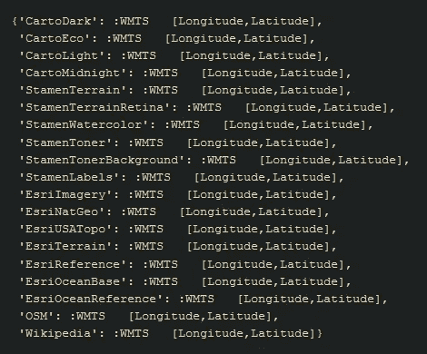
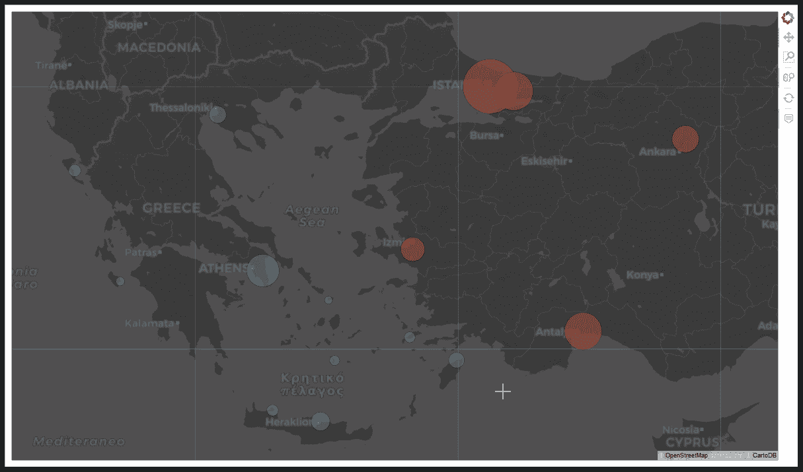

# 如何使用 Geoviews 库在 Python 中可视化地图顶部的数据

> 原文：<https://towardsdatascience.com/how-to-visualize-data-on-top-of-a-map-in-python-using-the-geoviews-library-c4f444ca2929?source=collection_archive---------9----------------------->

所以让我们从我们将要解决的问题开始。假设您有一些数据代表一个特定的数字(如人口)，该数字因地点而异(如不同的城市)，您希望绘制一个图表来可视化该数据。你是怎么做到的？

一种方法(也是最常用的方法)是创建一个条形图。y 轴代表数字(如人口)，x 轴代表地点(如城市)。我敢打赌，这种数据上的绝大多数图都是这种类型的。结果，网上有无数这样的例子，因此我没有必要再增加一个。

幸运的是，有一种更好的方法来可视化这种数据。请记住，情节必须直观，观众才能更好地掌握他们面前的东西。因此，在这种情况下，将数据可视化的更直观的方法是将它们绘制在地图上。有什么比交互式地图更直观的呢？在交互式地图上，你可以放大、缩小和查看你要找的地方或人物。

出于本教程的目的，我们将绘制一个图表来显示我国希腊和邻国土耳其最繁忙的机场的客流量，以便进行比较。

首先，我们需要导入将要使用的库和方法。

```
import pandas as pd
import numpy as np
import geoviews as gv
import geoviews.tile_sources as gvts
from geoviews import dim, opts
gv.extension('bokeh')
```

我们的两个数据框架`greek_aiports`和`turkish_airports`，分别由客流量排名前 10 位的希腊机场和前 5 位的土耳其机场组成。


Stats for 2018

对于这些数据帧，我们将添加一个额外的列`country`。

```
greek_airports['country']= 'GR'
turkish_airports['country']= 'TR'
```

我们还将添加列`color`。你以后会明白我们为什么这样做。

```
greek_airports['color']= '#30a2da'
turkish_airports['color']= '#fc4f30'
```

现在如果我们把这两个数据帧合并成`airports`

```
airports = pd.merge(greek_airports, turkish_airports, how='outer')
```

`airports`数据帧看起来像这样。


airports dataframe

对于这个例子，我不需要`citizens(k)`列，所以我将删除它。

```
airports.drop('citizens(k)', axis=1, inplace=True)
```

所以最终的`airports`数据帧看起来会像这样。


airports dataframe

> (对于那些想在笔记本上跟随的人，可以在[这里](https://www.dropbox.com/s/hy2y82rlfb5m12g/airports.csv?dl=0)找到`airports`数据框)

现在让我们开始使用 geoviews 模块。具体来说，让我们使用`geoviews.Points`功能创建一个带有我们的点的情节。

```
airports_gv_points = gv.Points(airports, ['longitude', 'latitude'],
                               ['IATA', 'city', 'passengers',
                               'country', 'color'])
```


airports_gv_points

为了在地图上标出这些点，我们需要一张…地图。geoviews 模块提供了许多我们可以使用的 tilemaps。如果我们输入的话，我们可以看到什么是可用的

```
gvts.tile_sources
```



Available tilemaps

例如，让我们使用 CartoLight tilemap。让我们看看我们能得到什么

```
gvts.CartoLight
```


CartoLight

现在，我们可以在 CartoLight 的顶部用

```
gvts.CartoLight * airports_gv_points
```


gv.Points on CartoLight

这里有几个问题:

*   剧情维度真的很小。
*   我不喜欢经纬度的轴标签。
*   我不喜欢地图上的网格。

我可以通过在`gvts.CartoLight`上添加一些选项来解决这些问题，比如

```
gvts.CartoLight.options(width=1300, height=800, xaxis=None, yaxis=None, show_grid=False)  * airports_gv_points
```


geoviews.Points on CartoLight

现在，因为点仍然只是点，因此它们不能说明客流量，我将使用我们之前导入的`opts`方法。我们需要的参数是`size`。此外，为了让数字更接近，我将使用`np.sqrt`函数来获得它们的平方根。

```
airports_plot = (gvts.CartoLight * airports_gv_points).opts(
    opts.Points(width=1200, height=700, alpha=0.3,
                xaxis=None, yaxis=None,
                size=np.sqrt(dim('passengers'))*10))
```


airports_plot

如你所见，我们现在有了互动地图，显示了希腊和土耳其的机场有多繁忙。显然，雅典拥有希腊最繁忙的机场，而土耳其最繁忙的机场位于伊斯坦布尔。

为了使绘图更好，我们可以为每个国家使用不同的颜色，同时我们还可以添加一个悬停工具，以便在我们将光标移动到机场上方时获得一些关于机场的信息。为了添加颜色，我们添加了参数`color=dim('color')`，它使用我们在`color`列中指定的颜色，对于悬停工具，我们添加了参数`tools=['hover']`。

```
airports_plot = (gvts.CartoLight * airports_gv_points).opts(
    opts.Points(width=1200, height=700, alpha=0.3,
                color=dim('color'), hover_line_color='black',  
                line_color='black', xaxis=None, yaxis=None,
                tools=['hover'],size=np.sqrt(dim('passengers'))*10))
```


airports_plot

我们甚至可以创建自己的悬停工具来完全控制悬停工具显示的内容。例如，我不希望它显示每个国家使用的颜色代码。
最后，当我将光标放在每个点上时，我希望每个点的颜色变暗一点，所以我添加了参数`hover_fill_alpha=0.5`。

```
from bokeh.models import HoverTool
tooltips = [('IATA', '[@IATA](http://twitter.com/IATA)'),
            ('Passengers', '[@passengers](http://twitter.com/passengers){0.00 a}m'),
            ('City', '[@city](http://twitter.com/city)'),
            ('Country', '[@country](http://twitter.com/country)'),
            ('Longitude', '$x'),
            ('Latitude', '$y'),
            ]
hover = HoverTool(tooltips=tooltips)airports_plot = (gvts.CartoLight * airports_gv_points).opts(
    opts.Points(width=1200, height=700, alpha=0.3,
                color=dim('color'), hover_line_color='black',  
                line_color='black', xaxis=None, yaxis=None,
                tools=[hover],size=np.sqrt(dim('passengers'))*10,
                hover_fill_color=None, hover_fill_alpha=0.5)) 
```


airports_plot

如果你像我一样喜欢深色主题，你可以随时使用`gvts.CartoDark` tilemap。

```
airports_plot = (gvts.CartoDark.options(alpha=0.8) * airports_gv_points).opts(
    opts.Points(width=1200, height=700, alpha=0.3,
                color=dim('color'), hover_line_color='black',  
                line_color='black', xaxis=None, yaxis=None,
                tools=[hover],size=np.sqrt(dim('passengers'))*10,
                hover_fill_color=None, hover_fill_alpha=0.5))
```



airports_plot

今天到此为止。希望你觉得有用。下次见！

你可以点击[这里](https://www.linkedin.com/in/christoszeglis/)在 LinkedIn 上找到我。