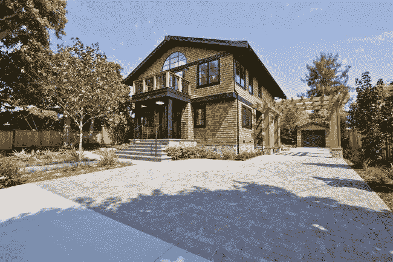

# 如何赢得房地产投标战

> 原文：<https://towardsdatascience.com/how-to-win-a-bidding-war-in-real-estate-49ef50903449?source=collection_archive---------36----------------------->

## 利用机器学习预测竞价战中的最优价格

加州马林县是全国最昂贵的住宅房地产市场之一。它也是竞争最激烈的市场之一，2018 年超过 45%的单户住宅收到了多个报价。买家或买家代理人如何确定房屋的最优出价——一个足以赢得竞标战的价格，但又不高于下一个最高出价的价格。本质上这是一个经典的拍卖问题。

下面的 web 应用程序使用户能够确定面临竞价战的房屋的预测价格。预测价格是基于 2015 年至 2019 年的历史数据，所有在马林出售的单户住宅都收到了两个或更多的报价。用户可以选择面积，卧室数量，浴室数量，预期报价和上市价格的数量，应用程序将提供预测的销售价格。

[**点击此处查看多重报价计算器！**](https://multiple-offers.herokuapp.com)

作为一个经验法则，房地产经纪人用每份报价的 2%到 3%来决定竞标中的价格。例如，如果有 3 个出价，那么出价应该比标价高出 6%到 9%。

要使用 web 应用程序，只需选择预测选项卡，选择标准，应用程序将返回预测的报价。有关目标、数据、评估协议和模型选择的说明，请使用解释选项卡。“评估”选项卡提供了用于评估预测相对于实际中标报价的准确性的指标。

我欢迎建设性的批评和反馈，请随时给我发私信。

这篇文章最初出现在我的 [GitHub 页面](https://jimking100.github.io/2019-12-04-Post-6/)网站上。

在 Twitter 上关注我 [@The_Jim_King](https://twitter.com/The_Jim_King)

*马林房地产数据来源:马林 MLS (BAREIS)，2015–2019 数据*