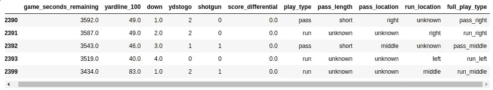
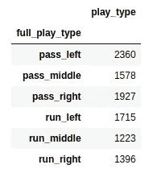
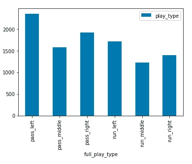
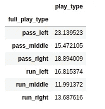
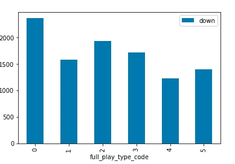
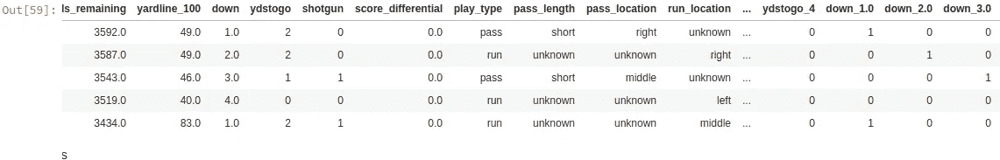
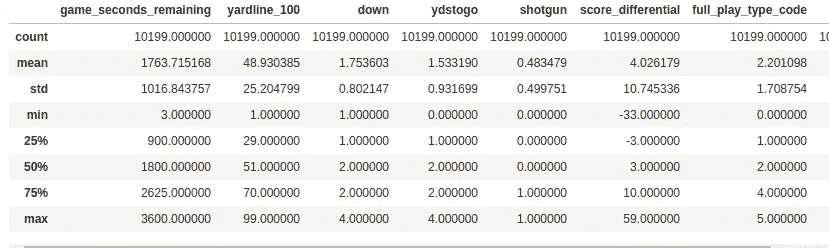
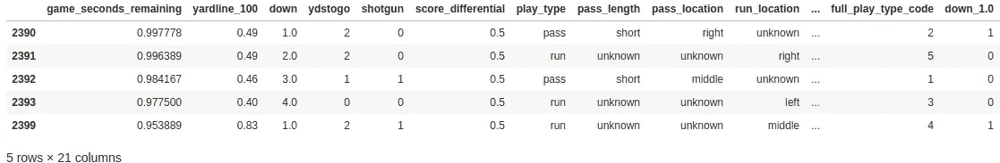
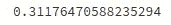

# 如何用机器学习在 NFL 中获胜

> 原文：<https://towardsdatascience.com/how-to-win-in-the-nfl-b2b441ca8f5d?source=collection_archive---------12----------------------->

## 预测足球比赛


你被达拉斯牛仔队聘为防守协调员，你将在超级碗比赛中执教新英格兰爱国者队。我意识到这是一个极不可能的场景，因为牛仔队看起来一点也不像超级碗的竞争者。然而，我们仍然可以使用它作为创建 AI/ML 模型的步骤的示例项目。

在过去的二十年中，爱国者队一直是 NFL 中最好的球队，而爱国者队的四分卫汤姆·布拉迪可以说是同一时期 NFL 中最好的球员。作为防守协调官，阻止爱国者将是一项巨大的任务。但是，我们这边有优势:AI/ML。让我们设计一个流程，看看我们是否能在事情发生之前预测到，这将使我们能够相应地调整我们的防御方案。对于这个例子，我们将使用 Python 和 [sklearn](https://scikit-learn.org/stable/) 。我们将遵循以下流程:

1.  获取或生成数据
2.  为探索性数据分析(EDA)准备数据。
3.  分析数据以寻找潜在的模式。
4.  为 AI/ML 模型准备数据。
5.  训练和评估你选择的 AI/ML 模型。

# 获取或生成数据

你首先需要的是一个数据集。如果您无法访问相关的数据集，您可以使用类似于[本文](/data-science-with-no-data-b3c21acee17c)的流程生成一个样本数据集。对于我们的例子，我们将使用这个数据集，其中包含自 2009 年以来运行的每场 NFL 比赛的信息。它在 [Kaggle](https://www.kaggle.com/maxhorowitz/nflplaybyplay2009to2016) 上主持。如果你不熟悉 Kaggle，它是一个编码竞赛网站，有许多不同的数据集；当我想找到一些数据时，这通常是我首先检查的地方。

一旦我们下载并解压缩了文件，我们需要它的格式能够让我们探索数据。为此，我们将使用 Pandas，这是一个 Python 库，其中包含许多修改和探索数据集的函数。下面是从我们的 CSV 文件加载数据帧的代码:

```
import pandas as pd
import matplotlib
from sklearn import preprocessing
%matplotlib inline
df = pd.read_csv('data/nfl_plays.csv')
```

# 为探索性数据分析(EDA)准备数据

EDA 是探索数据问题(缺失值、错误输入的数据等)的过程，希望我们可以看到数据中的一些趋势。

首先，让我们看看已经加载了多少行和列:

```
df.shape
```

这给出了:

```
(449371, 255)
```

如您所见，这个数据集中有很多信息(255 列)。如果能知道每个字段代表什么就好了。经过一番挖掘，我最终找到了这个页面，它描述了所有的栏目以及它们的含义。我对这些领域感兴趣:

*   posteam —拥有控球权的球队(在这种情况下，我们只需要 NE)
*   game_seconds_remaining —游戏还剩多少时间
*   yardline_100 —团队在哪个码线上(比例为 100)
*   下降—我们处于什么水平(1.0、2.0、3.0、4.0)
*   ydstogo——第一次进攻所需的码数
*   散弹枪——他们排成散弹枪队形了吗？
*   分数差异—他们的分数—我们的分数
*   比赛类型——比赛的类型(跑动、传球等)
*   run_location —他们朝哪个方向跑了(左、中、右)
*   pass_location —他们朝哪个方向走了(左、中、右)

我们还可以使用其他字段来帮助预测，但是让我们先使用这些字段。下面是根据这些行和列进行过滤的代码

```
#filter rows
nedf = df[(df.posteam=='NE') & (df.down.isin([1.0, 2.0, 3.0, 4.0])) & ((df.play_type=='run') | (df.play_type == 'pass'))]#filter columns
nedf = nedf[['game_seconds_remaining', 'yardline_100', 'down', 'ydstogo', 'shotgun', 'score_differential', 'play_type', 'pass_length', 'pass_location', 'run_location']]nedf.head()
```

此时，在开始 EDA 之前，我们还有一个步骤。我们试图预测的值由依赖于 play_type 的四列表示。例如:

*   如果玩法类型是“跑步”，则会填充跑步位置，但不会填充传球位置。
*   如果玩法类型是“传球”，则传球位置将被填充，而跑动位置不会被填充。

我们需要将所有这些值合并到一个字段中。下面是实现这一点的代码(注意，我们还过滤掉了 location='unknown '):

```
import numpy as np
def get_full_play_type(play):
    play_type, pass_location, run_location = play
    if(play_type == 'run'):
        return play_type+'_'+ run_location
    else:
        return play_type+'_'+ pass_location
nedf = nedf.replace(np.nan, 'unknown', regex=True)    
nedf['full_play_type'] = nedf[['play_type','pass_location', 'run_location']].apply(get_full_play_type, axis=1)
nedf = nedf[(nedf.full_play_type.isin(['pass_left', 'pass_middle','pass_right','run_left', 'run_middle', 'run_right']))]
```

这段代码将创建一个名为 full_play_type 的列，这就是我们试图预测的。让我们最后看一下我们的数据，以确保一切正常:

```
nedf.head()
```



# 分析数据以寻找潜在的模式

首先，让我们看看我们的 full_play_type 包含哪些值:

```
nedf.groupby(['full_play_type']).count()[['play_type']]
```



如你所见，如果我们随机猜测下一出戏，我们有六分之一的机会(16.66%)是正确的。我们将以此为基准，看看我们是否可以改进。

有时以图表形式查看会有所帮助:

```
nedf.groupby(['full_play_type']).count()[['play_type']].plot(kind='bar')
```



接下来，我们来了解一下哪些重头戏按占总数的百分比被调用:

```
nedf.groupby(['full_play_type']).count()[['play_type']].apply(lambda x:100 * x / float(x.sum()))
```



我们的预测已经有所改进了！如果我们预测每场比赛的 pass_left，我们的正确率是 23%对 16.66%。我们还可以做得更好。

# 为 AI/ML 模型准备数据

AI/ML 模型需要数字输入和输出。当数字规模相似时，它们也能更好地工作。在本节中，我们将利用一些不同的技术来实现这一点。

首先，我们将使用 sklearn 的**预处理**库将我们的 full_play_types 转换为 numeric:

```
le = preprocessing.LabelEncoder()
le.fit(nedf.full_play_type)
nedf['full_play_type_code'] = le.transform(nedf['full_play_type'])
```

这将创建一个名为 full_play_type_code 的列，它是 full_play_type 的数字表示。让我们看看 full_play_type_code 数据，确保它仍然与 full_play_type 匹配。

```
nedf.groupby(['full_play_type_code']).count()[['down']].plot(kind='bar')
```



正如您所看到的，图表与上面的图表相匹配，但是现在 x 轴是一个数值，而不是文本。

接下来，我想简化 ydstogo 值。从技术上讲，这可以是 1 到 99 之间的一个值。但是，我想将这个距离放入一些桶中(1-4 码、5-8 码、9-12 码、13-16 码、≥17 码)，这将使我们的模型能够识别模式。我选择的范围是任意的，可以很容易地修改。

```
def bucketize(val, size, count):
    i=0
    for i in range(count):
        if val <= (i+1)*size:
            return i
    return idef bucketize_df(df):
    df['ydstogo'] = [bucketize(x, 4, 5) for x in df['ydstogo']]
    return dfnedf = bucketize_df(nedf)
```

现在，我想对 down 和 ydstogo 列进行热编码，这意味着我们将把行“透视”到列，并用“1”填充包含我们正在编码的值的列，否则为 0。例如，足球比赛中有四个回合。当我们对 down 列进行热编码时，我们将得到四列，其中 1 只被填充一次。如果我们要对一个表示第三个向下的行进行热编码，我们将得到新列的这些值[0，0，1，0]。请注意，第三列是唯一包含 1 的列。这样做的好处是，我们的 down 和 ydstogo 数据现在表示为 0 和 1，这也应该有助于我们的模型学习。sklearn 中的代码非常简单:

```
nedf = pd.concat([nedf, pd.get_dummies(nedf['down'], prefix='down')], axis=1)
nedf = pd.concat([nedf, pd.get_dummies(nedf['ydstogo'], prefix='ydstogo')], axis=1)
```

以下是我们的数据样本此时的样子:



现在，你可以看到 ydstogo_*和 down_*用 0 和 1 表示。但是，game_seconds_remaining、yardline_100 和 score differential 列仍然与零和一处于不同的刻度。例如,“游戏剩余秒数”包含 0 到 3600 之间的值。

我们可以通过在列中添加一些数学来解决这个问题。首先，让我们看看这些列包含的值的范围。

```
nedf.describe()
```



在本练习中，我们将查看最小值和最大值，并使用它们将数据标准化为介于 0 和 1 之间的值。game_seconds_remaining 的最小值是 3，而最大值是 3600。我们将游戏剩余时间除以 3600。Yardline_100 将除以 100。对于分数差异，我们将应用以下公式:

```
(score_diff + min_diff) / (max_diff-min_diff)
```

然而，为了简化，我们将对 min_diff 使用-50，对 max_diff 使用 50。我们的逻辑是，如果你赢了或输了超过 50 分，此时你脑子里想的是别的事情。下面是我们应用这些公式的代码:

```
nedf['game_seconds_remaining']/=3600
nedf['yardline_100']/=100
nedf['score_differential']=(nedf['score_differential']+50)/100
```

现在，如果我们看看我们的数据集，这是我们得到的结果:



我们现在已经将所有的输入字段转换为 0 到 1 之间的值，所以我们准备在模型上进行试验。

# 训练和评估你选择的人工智能/人工智能模型

在本教程中，我们将使用 RandomForestClassifier 来看看我们能否预测下一场比赛。但是首先，我们需要去掉我们的模型中不需要的所有列。然后，我们需要将数据分成一个训练集和一个测试集，每个测试集包含一个 X(输入数据)和 y(结果数据)。这可以用三行 Python 快速完成。

```
from sklearn.model_selection import train_test_split#select important columns for input
X=nedf[['yardline_100', 'shotgun', 'score_differential', 'game_seconds_remaining', 'down_1.0', 'down_2.0', 'down_3.0', 'down_4.0','ydstogo_0','ydstogo_1','ydstogo_2','ydstogo_3','ydstogo_4']]#select result column for output
Y=nedf['full_play_type_code']#split data for train and test
train_x, test_x, train_y, test_y = train_test_split(X, Y, random_state = 0)
```

此时，我们可以训练我们的模型来拟合输入数据。

```
from sklearn.ensemble import RandomForestClassifier
the_clf=RandomForestClassifier(max_depth=8, n_estimators=64)
the_clf.fit(train_x, train_y)
```

现在我们的模型已经被训练好了，让我们看看它在我们的测试数据上得分如何。

```
from sklearn.metrics import accuracy_score
pred = the_clf.predict(test_x)
acc =accuracy_score(test_y, pred)
print(acc)
```



我们现在能够在 31%的时间里预测正确的打法，这听起来可能不太好，但请记住，这几乎是我们开始随机猜测的两倍(16.66%)，比仅仅猜测他们最喜欢的打法好 25%(pass _ left，23%)。

# 后续步骤

仅用几行 Python 代码，我们的教练技能几乎提高了一倍。然而，您可能已经注意到，我们编写的大部分代码都与组织和管理我们的数据有关。现在我们已经完成了，我们可以使用这些数据来训练更复杂的模型。

在我们的下一篇文章中，我们将探索四种技术，利用我们处理过的数据生成更好的预测:

1.  过采样/数据扩充
2.  型号选择
3.  模型评估
4.  模型调整

感谢阅读，本文的代码将托管在 github 上。