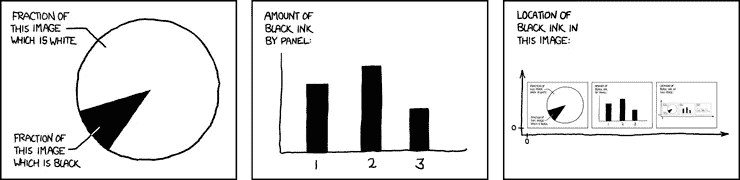

# 如何可视化地处理数据—R 语言教程

> 原文：<https://towardsdatascience.com/how-to-work-visually-with-data-tutorial-in-r-6841be051f2f?source=collection_archive---------34----------------------->

## 了解如何在对数据集应用 ML 算法之前对其进行可视化解码

数据就是数字。人类并不擅长同时处理大量数字。人类是视觉动物。因此，在你开始对数据应用机器学习之前，获得数据的可视化解释总是有意义的。


Photo by [Austris Augusts](https://unsplash.com/@biosss91?utm_source=medium&utm_medium=referral) on [Unsplash](https://unsplash.com?utm_source=medium&utm_medium=referral)

# 1.第一步—准备数据

每个机器学习项目都是从准备数据集开始的。[本文](/life-cycle-of-a-data-science-project-3962b9670e5b)描述了一个 ML 项目的整个生命周期。我们将选择一个准备好的数据集。

我们将使用来自 r 包 **mlbench 的**玻璃数据集**。**


[Glass Dataset](https://www.rdocumentation.org/packages/mlbench/versions/2.1-1/topics/Glass)

它有 214 个观察值，包含 7 种不同类型玻璃的化学分析实例。

# 2.安装并加载库

在本教程中，我们将使用 2 R 库。

1.  ML 工作台
2.  Corrplot

```
**#clear all objects**
rm(list = ls(all.names = TRUE))
**#free up memrory and report the memory usage** gc() **#Load the libraries** library(mlbench)
library(corrplot)
```

# 3.加载数据

然后，我们实际加载数据集并显示它的前几个数据点。

```
**#Load the dataset** data("Glass") **# display first 10 rows of data** head(Glass, n=10) **# display the dimensions of the dataset** dim(Glass)
```

我们很快就掌握了哪些列以及它们各自的取值范围。如果你的数据集很大，这是常有的事，你可以取一个小样本来检查。

快速浏览一下，我们可以看到这些列对应的是化学元素—(钠:钠，镁:镁，…)。


我们还看到每一行都有 9 个不同的特征。所有这些都有助于形成**型**玻璃。最后一栏告诉你玻璃的实际类型。

这样的数据集可用于建立逻辑回归模型，该模型基于 9 个特征预测玻璃类型。

记录数据的维度也能让我们了解数据集有多大


# 4.了解每个功能

然后，我们试图掌握数据的统计和其他属性


```
**# list types for each attribute**
sapply(Glass, class)
**# standard deviations and mean for each class**
y<-sapply(Glass[,1:9], mean)
sapply(Glass[,1:9], sd)
xn<-colnames(Glass[,1:9])
x<-c(1:9)
y<-sapply(Glass[,1:9], mean)
barplot(y, main = "Average Value For Each Feature",
     xlab = "Feature Name",
     ylab = "Average Value")
```

我们还可以查看数据类型来评估数据兼容性。


注意，最后一列是称为**因子**的分类数据类型，其余的是**数字**浮点。这个信息非常重要，因为类型决定了进一步的分析、观想的类型，甚至是你应该使用的学习算法。

我们还可以绘制每个特征的**标准偏差**来指导我们稍后的标准化过程。


**标准差和均值都是有用的工具**

> 例如，对于高斯分布，它可以作为一个快速剔除异常值的工具，任何大于标准偏差三倍的值都被视为异常值。

# 5.了解每个类


Number of data points in each class

除了根据数据的特征查看数据之外，我们还可以分析每个类。一个快速测试的东西可能是**类分布**

在任何分类问题中，您必须知道属于每个类值的实例的数量。这充当了数据集中不平衡的快速测试。在多类分类问题的情况下，可能会暴露具有少量或零个实例的类，这些实例可能是从数据集中移除的候选。这可以通过再平衡技术来增强。

```
**# distribution of class variable**
y <- Glass$Type
cb <- cbind(freq=table(y), percentage=prop.table(table(y))*100)
barplot(table(y), main = "Frequency Distribution of All Classes",
        xlab = "Class Name",
        ylab = "Number of Data Points", legend = TRUE)
```

# 6.特征之间的关系


courtesy the corrplot library

要考虑的最重要的关系之一是特征之间的相关性。在 ML 中，我们从不需要高度相关的特征。[本文展示了使用 Python 实现 KNN (K 近邻)算法时检测这些特征的技术](/x8-the-ai-community/knn-classification-algorithm-in-python-65e413e1cea0)。作为 R 中的一个快速测试，我们可以做以下事情

```
**# calculate a correlation matrix for numeric variables**
correlations <- cor(Glass[,1:9])
**# display the correlation matrix**
print(correlations)
corrplot(correlations, method = "circle")
```

正相关显示为蓝色，负相关显示为红色。颜色强度和圆圈的大小与相关系数成正比。

我们可以很容易地看到，Ca 与 RI 高度相关，可以从我们的分析中去掉其中一个。



[xkcd](https://xkcd.com/688/)

可视化解码数据集为您提供了理解数据集的最快方式。这成为实际应用机器学习算法的一个非常重要的先驱。