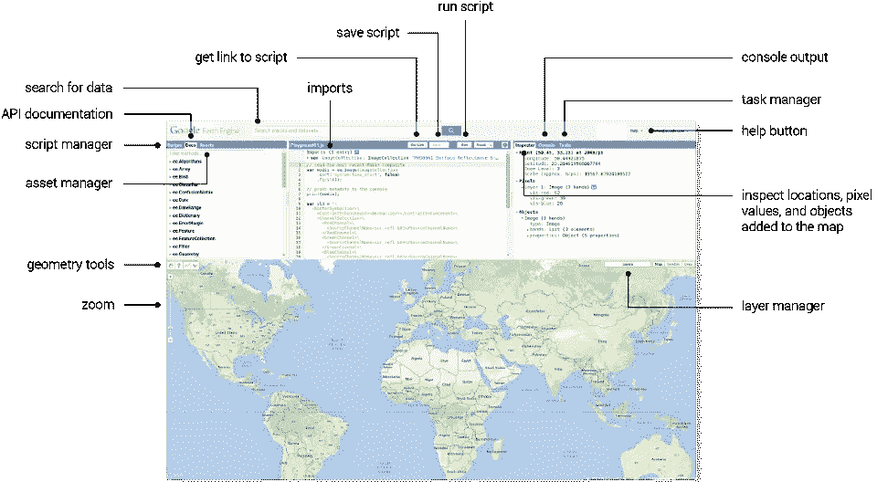

# 如何使用大地理空间数据

> 原文：<https://towardsdatascience.com/how-to-work-with-big-geospatial-data-4ba919a8ffc2?source=collection_archive---------8----------------------->

我作为一名自由 webGIS 开发人员已经工作了三年多，在此之前，我获得了地理信息学学士学位，所以我必须与地理空间数据打交道。

地理空间数据变大并不罕见，尤其是在处理栅格数据时。几千兆字节的数据非常常见，大多数桌面 GIS 软件(如 ArcGIS 和 QGIS 等。)通常能够处理这么多数据。

> 但是如果数据变得非常庞大怎么办？比如兆兆字节或者千兆字节？

例如，当您必须在国家或大陆范围内处理高分辨率多光谱或高光谱图像的镶嵌时。这时数据集的大小可能会膨胀到万亿字节甚至千兆字节，真正的麻烦就开始了，因为传统的 GIS 软件无法轻松处理如此大量的数据。

这时，你必须开始寻找桌面 GIS 软件的替代品，因为关于这个主题的在线帮助还不多，所以我想我应该分享我的经验，以帮助那些期待使用大型地理空间数据集的人。以下是我在这种情况下推荐的一些工具和技术:

# 1.谷歌大查询地理信息系统

Google [BigQuery](https://cloud.google.com/bigquery/) 是 Google 的一个工具，用于数据仓库和对大型数据集进行分析。幸运的是，它还附带了一个名为 Bigquery GIS 的空间扩展。这里有一个简短的介绍:

Google BigQuery GIS

值得注意的是，BigQuery 有其自身的局限性，例如，它只能与 WGS 84 投影(EPSG: 4326)一起工作，并且没有其他开源 GIS 数据库(如 PostGIS)那么多的功能。

但是当涉及到大型数据集时，没有什么能打败 BigQuery GIS。我曾经试图在 PostGIS 中从一个巨大的数据集(它有超过 7 亿条记录)中找到错误的多边形，几乎需要一天的时间才能找到它们，而 BigQuery GIS 能够在不到 3 分钟的时间内找到它们。

如果你有兴趣，你可以在这里阅读更多关于 BigQuery GIS 及其可用功能[的内容。](https://cloud.google.com/bigquery/docs/gis-data)

# 2.开源库和二进制文件

处理这种数据集的另一种方式是拥有一个进程，并通过开源库和二进制文件以编程方式运行它，您可以在 shell 脚本中使用它们以获得优势。

OpenSource tools capable of handling large GIS datasets

我的团队曾经在 Linux 环境中使用 python GDAL 绑定(我们编写了 python 脚本)处理数万亿字节的数据，还使用了一些 ogr2ogr 命令，并将它们全部封装在 bash 脚本中，这些脚本将一个接一个地执行所有步骤。对于一个非常大的数据集，我们使用格网将大陆尺度的栅格划分为数百个小方块，单独处理它们，最后合并最终结果。这项技术甚至可能需要几天才能完成，但它能够处理非常大的数据集。

这些脚本也可以使用不同的工具和技术来加速。一旦我们有了一个 python 脚本来处理大型数据集，一名团队成员使用 [Google DataFlow](https://cloud.google.com/dataflow/) 对其进行扩展，原本需要几天的过程可以在几分钟内完成，使我们能够处理大量数据。

# 3.空间 Hadoop

Apache Hadoop 是一个开源软件实用程序的集合，有助于使用许多计算机的网络来解决涉及大量数据和计算的问题。它还带有一个地理空间扩展，被称为 [SpatialHadoop](http://spatialhadoop.cs.umn.edu/) 。到目前为止，我自己还没有使用过它，但是如果没有 SpatialHadoop，谈论处理地理空间大数据是不公平的。

SpatialHadoop 具有对空间数据的原生支持，并且知道位置。它使用传统的地理空间索引，如 R 树、网格等。在 Hadoop 代码基础之上，从而使其具有位置感知能力。

# 4.谷歌地球引擎

Google Earth Engine 无疑是处理地理空间数据的最好和最简单的工具之一。它拥有数 Pb 来自遥感卫星的开源图像，并持续实时接收这些图像，你可以不用下载就能使用它们。它还处理它们以创建其他数据集。下面简单介绍一下地球发动机:

Introduction to Google Earth Engine

Earth Engine 附带了一个已经可用的[无数数据集](https://developers.google.com/earth-engine/datasets/)，你可以进一步做波段计算和/或使用其他[函数](https://developers.google.com/earth-engine/api_docs)根据你的需要操纵这些数据集。它还允许你在简单的[平台](https://earthengine.google.com/platform/)中上传和操作你自己的数据集。它看起来是这样的:

Google Earth Engine Platform

Earth Engine 最棒的地方在于，它完全免费用于研究和非商业目的。如果你懂 Python 或者 Javascript，你很容易上手。还可以准备实时图层，添加到谷歌地图中，使用谷歌地球引擎创建令人兴奋的网络地图。

我已经使用地球引擎来监测洪水，监测植被及其变化，并监测降雨和降雪。尽管如此，我从来不需要在我的电脑上下载大量的卫星图像。在未来，我会写更多的博客来展示地球引擎的实际应用，并分析不同的现象，如洪水、森林砍伐和森林火灾等。

编辑:以下是人们在回应这个故事时推荐的工具和技术，我没有使用过它们，但我想我也应该添加它们，因为它们似乎也做得很好。

# 5.AWS 雅典娜

Amazon Athena 是一种交互式查询服务，它使得使用标准 SQL 直接分析 Amazon 简单存储服务(Amazon S3)中的数据变得很容易。

这也支持地理空间数据类型，并提供地理空间查找和[功能](https://docs.aws.amazon.com/athena/latest/ug/geospatial-functions-list.html)。

AWS Athena

# 6.波斯特吉斯

现在你一定在想为什么是波斯特吉斯？我甚至将其与 Bigquery GIS 进行了比较，后者的性能不如前者。我个人将它用于较小的数据集，在使用它处理大型数据集时没有太多经验。但事实证明，如果数据集大小在几兆字节左右，甚至可以使用 PostGIS。

但是在那种情况下你必须让它工作。你需要非常依赖于分析和解释，并且你必须虔诚地监控日志以减少你的查询。您需要对表进行优化和索引，积极的清空是必不可少的。

# 7.NoSQL 和图形数据库

像 MongoDB 和 ElasticSearch 这样的 NoSQL 数据库擅长处理大型数据集，并且有不错的地理空间支持。我们也有像 Neo4j 这样的图形数据库，它们擅长处理大型数据集并支持地理空间查询。

# 边注

> 要了解地理空间大数据的运行情况，请看一下[滑翔机](https://www.glidefinder.com/)。我们使用谷歌 BigQuery GIS 和开源库和二进制文件来处理大量数据，以建立这个可以实时监控野火的网站。如果你有兴趣了解更多关于它是如何制作的，可以看看 CTO 的博客

 [## GlideFinder:我们如何在谷歌云上建立一个可以监控野火的平台|谷歌云博客

### 我们选择 Google Cloud infrastructure 是因为它的可扩展性(允许数百万并发用户从…

cloud.google.com](https://cloud.google.com/blog/products/data-analytics/glidefinder-how-we-built-a-platform-on-google-cloud-that-can-monitor-wildfires) 

# 没有“一种工具可以统治所有人”

现实世界的问题是复杂的，它们互不相同，处理这些问题所需的数据集的性质也各不相同。你不能指着一种工具或技术说它可以帮助所有的数据集。您应该选择哪个选项始终取决于您想要实现的目标，并且在许多情况下，您需要使用不同工具、技术和技巧的组合。

> 我是拉米兹·萨米。我爬山、举重、构建 WebGIS 解决方案。请随时在 Linkedin 上与我联系。