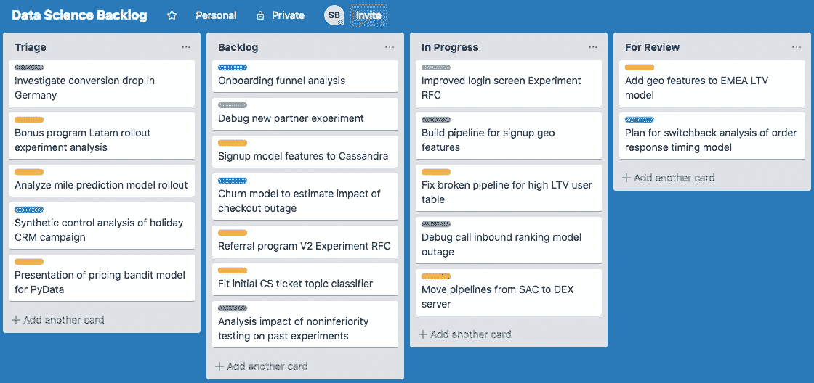
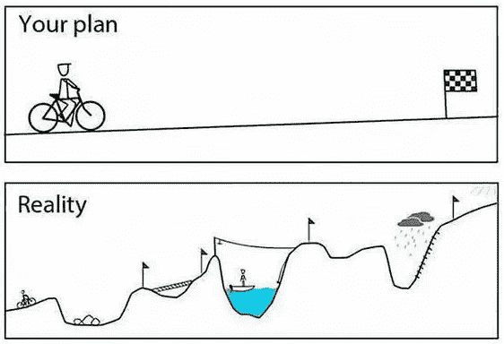
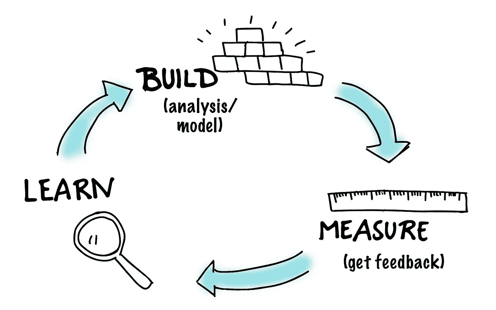

# 作为数据科学家，如何与利益相关方合作

> 原文：<https://towardsdatascience.com/how-to-work-with-stakeholders-as-a-data-scientist-13a1769c8152?source=collection_archive---------11----------------------->

[Image source](https://www.bigstockphoto.com/image-246816937/stock-photo-business-partners-or-men-coworkers-fist-bump-in-team-meeting%2C-multiethnic-diverse-group-of-happy-col)

数据科学家最重要的技能之一是能够与利益相关方有效合作。你的影响力将取决于你与产品经理集思广益、与工程师合作以及说服高管的能力。这确实是工作中令人兴奋的部分，然而，很难找到做好它的建议。过去两年，我在 Booking.com 和优步的产品团队中担任数据科学家。这里有一些在项目过程中与利益相关者合作的技巧，我希望我在开始时就知道。

**1。将请求转化为对话**

当一个利益相关者向你要求一个特定的产出时，这个产出几乎总是实现其他目标的手段。尝试将请求转化为关于他们主要目标和实现目标的最佳方式的对话。

例如，假设产品经理要求您尝试取消用户在注册时提供邮寄地址的要求。如果产品经理的主要目标是推动转化，你可能会认为从详细的漏斗分析开始有助于发现更有影响力的机会。

一个类似的想法支撑着[基于利益的谈判](https://www.amazon.com/Getting-Yes-Negotiate-Agreement-Without/dp/0743526937)，它建议谈判各方应该探索他们的潜在利益，而不是他们来到谈判桌前的更直接的立场。作为一名数据科学家，不要只关注利益相关者的初始立场(他们的直接要求)，要理解支撑这一立场的利益。

**2。学会说不**

作为一名数据科学家，在开始工作的前几周内，你会收到比可能处理的更多的请求。接受你无法完成的请求对任何人都没有帮助，所以你必须说不。但是如果你用错误的方式说不，你会惹恼很多人。这里有一些我认为有用的技巧。

从假设最好的情况开始，或者至少意识到你缺乏完整的信息。例如，如果你收到一个请求，你认为这个人应该照顾好自己，你可能会很容易忽略它或者没好气地回应。停下来！你有可能遗漏了一条重要的信息，而这个要求比你想象的更合理。不管怎样，得罪任何人都没有意义。

即使你的回答是出于好意，说“不”而不引起别人的反感也是不容易的。我发现一个有用的方法是[“将人们与问题分开”](https://www.amazon.com/Getting-Yes-Negotiate-Agreement-Without/dp/0743526937)，这是基于利益的谈判的另一个有用的教训。将讨论框定为两个人一起努力解决如何最好地投资数据科学资源的问题，而不是你拒绝他们的个人请求。

第二个与之密切相关的策略是，公开你不优先考虑某个项目的原因。拥有每个人都同意的目标[可以让你更容易对不太重要的想法说不。说不不是一场政治或情感辩论，而是对承诺的理性回应。”](https://rework.withgoogle.com/print/guides/6229207193485312/)组织有序的任务积压也有助于将潜在的紧张分歧转化为关于在哪里消磨时间的理性讨论，即使当优先事项不明确并成为对话的一部分时。

真诚地讨论如何最佳利用你的时间也会让你更有效率，因为有时你会发现“不”实际上是错误的答案。

**3。管理预期**

当你刚开始一份工作，一位同事问他们要等多久才能得到他们急需的东西时，你很想告诉他们你认为他们想听的话，或者至少说些积极的话。抵制诱惑！

我们系统地低估了任务需要多长时间，因为[我们专注于眼前的事情，忽略了“未知的未知”](https://www.amazon.com/dp/B00555X8OA/ref=dp-kindle-redirect?_encoding=UTF8&btkr=1)，例如，你实验中没有预料到的错误。与此同时，根据期望-不一致理论，人们的期望和他们感知的结果之间的差距在形成他们的满意度方面发挥了很大的作用。

把这两种心理现象放在一起，你就有了制造麻烦的方法。你给利益相关者你过于乐观的估计(可能为了让他们高兴而进一步夸大)设定了很高的期望，然后当你不能实现时，他们对你的看法就崩溃了。所以在管理期望时要小心。

[Image source](https://theincidentaleconomist.com/wordpress/planning-falacy/)

帮助解决你预测中过度自信的一个策略是[事前分析](https://www.amazon.com/dp/B00555X8OA/ref=dp-kindle-redirect?_encoding=UTF8&btkr=1):在你开始之前，想象一下这个项目非常糟糕，然后写一份事后分析。如果你认为一个完整的预死亡是多余的，至少花点时间想想可能会出错的不同事情。考虑潜在的陷阱将有助于限制你的过度自信，并在问题发生前抓住它们。

**4。了解背景并拥有执行力**

本·霍洛维茨认为，好的产品经理应该[“了解背景……并负责设计和执行一个成功的计划(没有借口)。”](https://a16z.com/2012/06/15/good-product-managerbad-product-manager/)数据科学家也是如此，因为你也应该在推动项目前进中发挥作用。

当作为一个更大的团队的一部分从事项目时，不要把头埋在数据里。深刻理解问题的来龙去脉，有助于你更好地开展工作。与利益相关者沟通也很重要，因为如果你不能回答一个关于大项目的基本问题，这将损害你的可信度。

一旦你投入到一个项目中，掌握细节和执行。例如，您对用于部署您的模型的代码理解得越多，您就越有可能在问题出现之前发现它们。一个项目的结果比谁做了什么更重要，因此，超越你的严格责任，取得项目的成功。

**5。产生最小可行分析**

从产生一个最小可行的分析开始:最快的分析将让你开始测试你的项目的可行性。然后迭代并改进你最初的工作。例如，如果您正在构建一个预测模型，从一个简单的模型和几个有前途的特性开始。

从与利益相关者合作的角度来看，从最基本的可能分析开始有两个好处。首先，你要么有东西可以展示你的工作，要么可能很快失败，如果项目不工作的话。你不希望自己在第一个项目中花了三周时间构建一个复杂的模型，却没有任何东西可以分享，也不确定是否会产生任何有用的东西。

[Image source](https://medium.com/insights-from-meeteor/how-smart-meeting-practices-help-you-build-measure-learn-509dfc3f6c60)

第二，从一个简单的分析开始可以让你在迭代的时候得到反馈。最小可行产品的想法是从产品的最小版本开始，允许一个[完整的构建循环，测量产品的性能，并学习](https://www.amazon.com/Lean-Startup-Entrepreneurs-Continuous-Innovation/dp/0307887898)。在进行分析时，您可以考虑类似的循环，测量阶段包括获得反馈。我不会把你的结果告诉这里的一大群人。相反，向少数人寻求反馈，比如产品经理或其他数据科学家。

这种迭代工作流不是构建数据科学项目的唯一方式，但它是一种有效且低风险的方法，尤其是对于团队中的第一个项目。

**6。经常清晰地沟通**

作为一名产品经理，Lenny Rachitsky 注意到，[“过度沟通非常困难”](https://hackernoon.com/how-to-get-into-product-management-78c58bd9c8cf)。对数据科学家来说也是如此，因为你经常会帮助管理项目。当项目被延迟时，频繁的交流尤其有价值，但却很容易避免。定期传达信息让利益相关者了解最新进展，并帮助他们确信你正在处理问题。

优秀的数据科学家，就像优秀的产品经理一样，[“宁可选择清晰。”](https://a16z.com/2012/06/15/good-product-managerbad-product-manager/)分享见解时非常注意清晰。你需要确保你的发现能很快被理解并被正确解释。例如，如果你的结果只适用于一个特定的用户群体，那么就要清楚地表明，人们应该谨慎地推断出更广泛的人群。

你还应该特别注意用书面形式清晰地交流。与我共事的一位工程经理 Gergely Orosz 强调，文笔好能让你[“提升你与多个团队、一个组织或整个公司有效沟通的能力。”作为一名数据科学家，写好文章的一个关键部分是避免错误。你要求人们根据你的数字做出重大决定，如果你写的东西充满错别字，他们会发现很难相信你的勤奋。在分享之前，一定要通读邮件和文件，检查错误。](https://blog.pragmaticengineer.com/on-writing-well/)

**7。广泛沟通:让你的工作引人注目**

沟通的重要性并不仅限于完成分析或部署模型。确保让你的项目在你的直接团队之外可见。

Photo by [Headway](https://unsplash.com/@headwayio?utm_source=medium&utm_medium=referral) on [Unsplash](https://unsplash.com?utm_source=medium&utm_medium=referral)

有很多方法可以做到这一点:在你的项目还在进行的时候，主动与人讨论你的项目(你也可能得到有用的信息)，写下你的项目，并广泛传播一封链接到它的电子邮件(确保在电子邮件中包含你的要点的摘要)，[创建常见问题解答、论文和其他资源，人们可以利用这些资源](https://a16z.com/2012/06/15/good-product-managerbad-product-manager/)(一个有说服力的情节可以走得很远)，或者在内部或外部活动中展示你的结果。

如果人们看到你正在做的工作，这对你的职业生涯有好处，但这不仅仅是自我推销。让你组织中的其他人知道你在做什么，对于避免重复工作和寻找合作机会非常有帮助。

我希望这篇文章对你有所帮助。这个列表是主观的，远非详尽，如果有更多关于数据科学家如何在组织内有效工作的讨论，那就太好了。因此，如果你有任何不同意见或有其他建议要分享，请在下面发表评论或在[推特](https://twitter.com/sgbarrows)上联系。

*大大感谢* [*马克*](https://www.linkedin.com/in/mark-belvedere/)*[*尼克*](https://www.linkedin.com/in/jones-nicholas-s/) *和* [*小纳*](https://www.linkedin.com/in/samir-mathew-a6487639/) *对本帖草稿的审阅。**