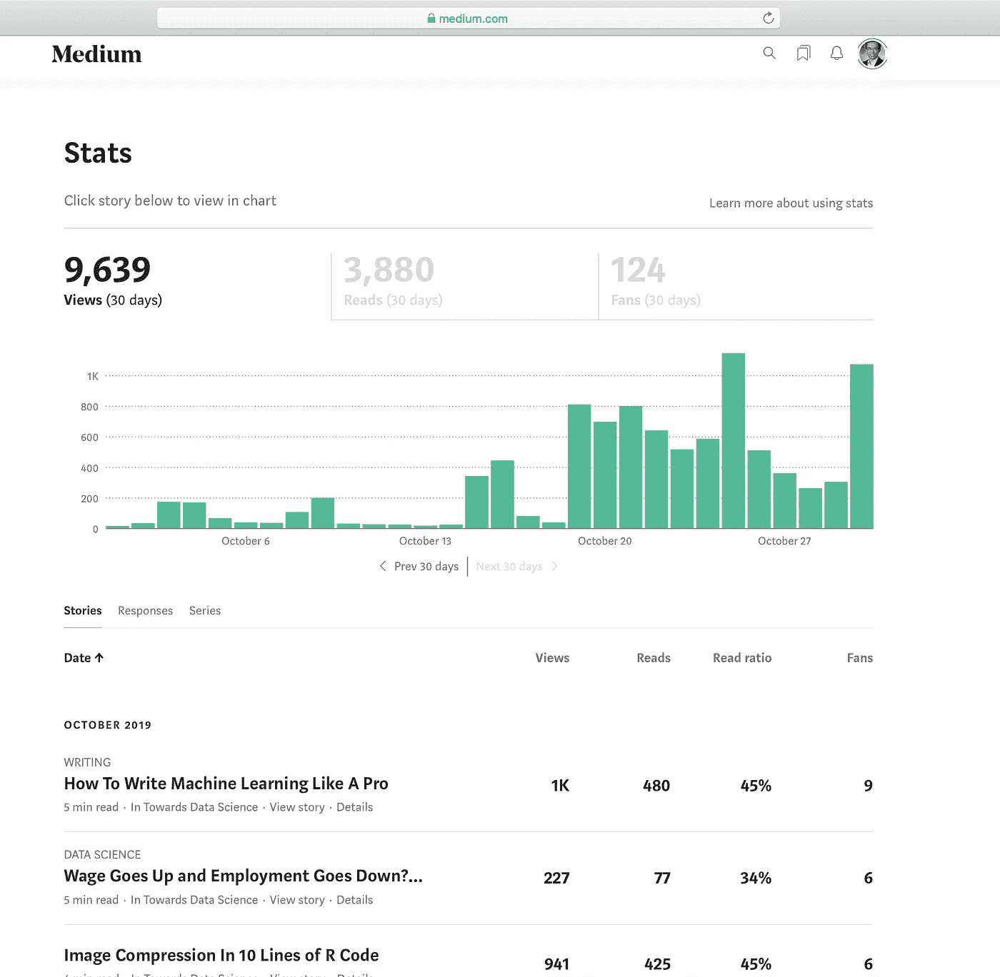
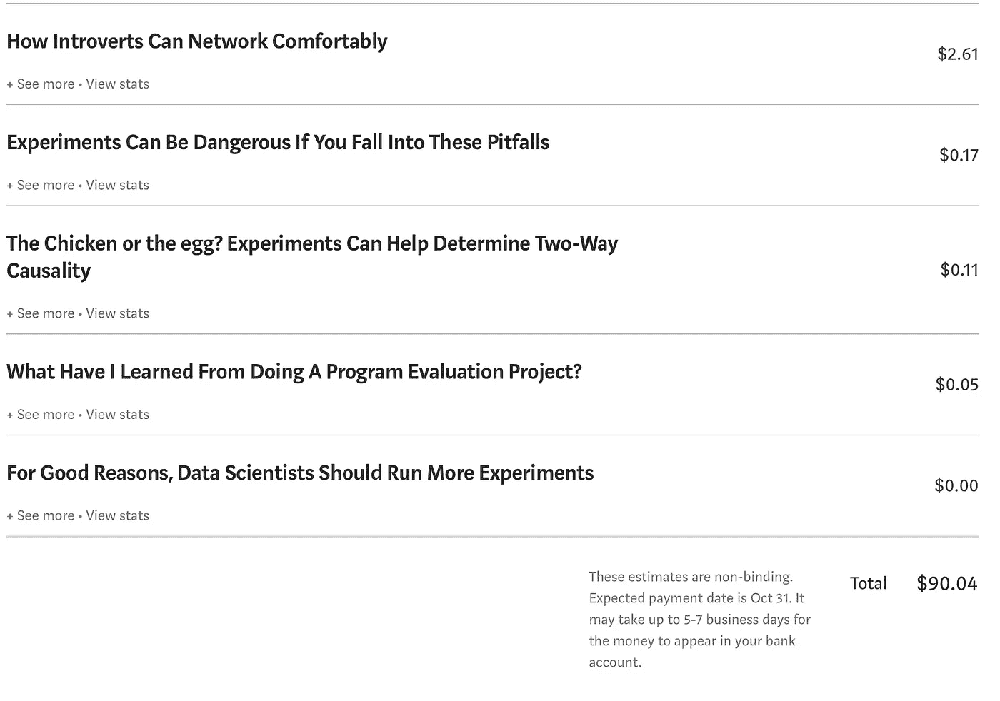
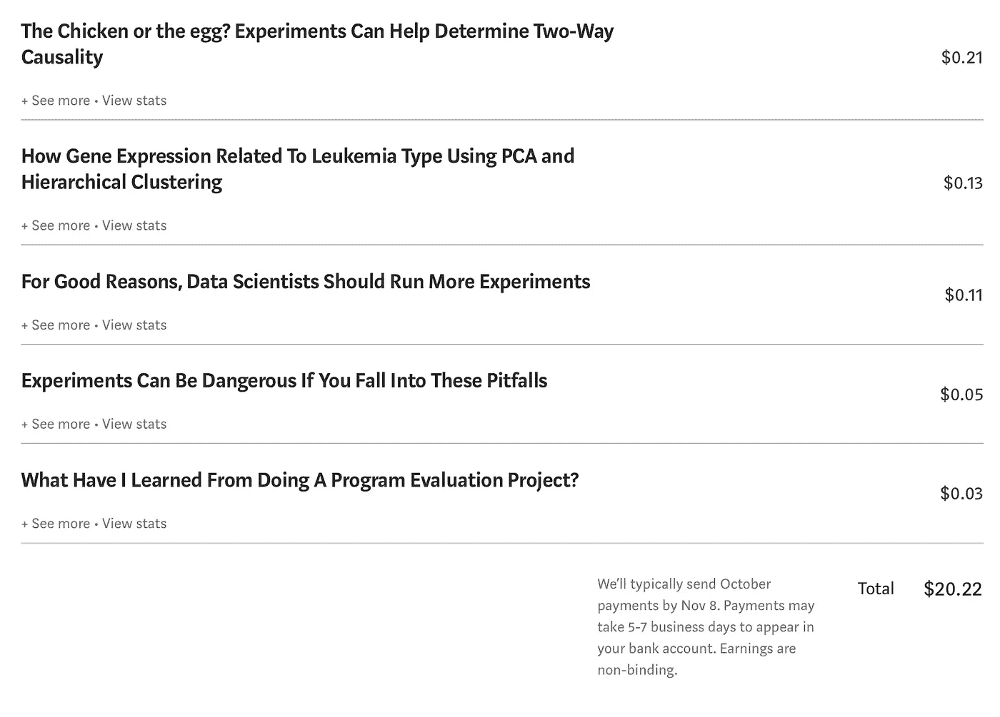

# 如何成为一个精明的机器学习博主:从零到英雄

> 原文：<https://towardsdatascience.com/how-to-write-machine-learning-like-a-pro-d2a2ebfc4041?source=collection_archive---------23----------------------->

## 数据科学:技术写作

## 要遵循的 5 条规则和要避免的陷阱

Photo by [Denerio Watkins](https://unsplash.com/@deneriow?utm_source=unsplash&utm_medium=referral&utm_content=creditCopyText) on [Unsplash](https://unsplash.com/s/photos/hero?utm_source=unsplash&utm_medium=referral&utm_content=creditCopyText)

******最近更新于 2020 年 1 月 4 日******

> **权力越大，责任越大。**
> 
> 机器学习是强大的。

向《走向数据科学》的编辑们大声喊一声:[安妮·邦纳](https://medium.com/u/a71060a2ef24?source=post_page-----d2a2ebfc4041--------------------------------)和[卢多维克·贝尼斯坦特](https://medium.com/u/895063a310f4?source=post_page-----d2a2ebfc4041--------------------------------)，并向我的数据科学家同事们致以最美好的祝愿。

写作对每个人来说都是痛苦的。

尽管我很享受从我的笔(或键盘)里出来的最终产品，但写作的过程本身是痛苦的。

大约两个月前，我开始写关于因果推理、机器学习和媒体数据科学的技术博客。截至今天(2019 年 12 月 1 日)，我在 10 月份贡献了 12 篇帖子，在 11 月份贡献了 6 篇帖子，几乎都是由《走向数据科学》发布的，并由中型策展人挑选。

在过去的两个月里，我收到了 18k+的浏览量，6K+的阅读量，和 100+的新粉丝。

我第一个月赚了 110.26 美元，第二个月赚了 62.29 美元。官方媒体报道称，大约 8.9%的作家每月收入 100 美元。

最重要的是，我成为了商业领域的顶级作家。

9.30–10.27

10.28–10.31

当然，这是一个很好的赞美和激励。深吸一口气后，我承认我在技术写作方面肯定做对了一些事情。

在这篇文章中，我将分享我的个人经历和奋斗，并希望我的写作尝试可以帮助你从零开始，快速成为机器学习英雄。

A 调整站立桌的高度，放上我最喜欢的 Spotify 播放列表(顺便说一句，是 Piano Guys)和一杯绿茶，我试图找到最佳的位置、合适的时刻和舒适的写作节奏。

几个小时后，我看着我刚刚写的毫无意义的东西，捶着头。

我现在已经筋疲力尽了，今天就到此为止吧。

这曾经是我在尝试写作。我不会说技术写作现在变得更容易了，但它产生的焦虑更少了。

Writing in the old-school way; Photo by [Aaron Burden](https://unsplash.com/@aaronburden?utm_source=unsplash&utm_medium=referral&utm_content=creditCopyText) on [Unsplash](https://unsplash.com/s/photos/writing?utm_source=unsplash&utm_medium=referral&utm_content=creditCopyText)

作为一个新的开始，首先弄清楚你为什么要写作是个好主意。

对我来说，我不想很快成为一名自由职业者，也不需要任何来自博客的固定收入。

两个原因让我保持动力:

1.  **架起学术和商业世界之间的桥梁**。我目睹了如此多的误解和沟通失误，我想尽我的努力来促进研究人员和商业领袖之间的故事。
2.  为我的机器学习研究伙伴创造价值。无论你是数据科学家、机器学习工程师，还是定量 UX 研究人员，我希望我的博客能提供技术支持，并激励你的下一步努力。

就是这样。

我写作是为了创造价值，不是为了钱。

这是一个顿悟的时刻，我调整了我的写作风格和选择来服务于这个首要目标。例如，我定期在 ML 和因果推理之间轮换话题。

**此外，我关注不同方法的应用方面**，并展示我们如何使用该方法解决实际的业务问题，包括问题的类型、技术挑战、陷阱和一步一步的实施。

**最后，我删除了所有 CTA(行动号召)**。有一段时间，我偏离了目标，试图通过创建电子邮件列表、加入亚马逊联盟计划、促进图书销售等来赚取额外收入。

我停止做所有的事情，因为它们不创造价值。

人们读诗是为了好玩，但读技术报告是为了快速解决问题。牢记这一点，我在写作时力求清晰易懂:任何阅读我的帖子的人都可以很容易地复制结果。

Photo by [TK Hammonds](https://unsplash.com/@tkristin?utm_source=unsplash&utm_medium=referral&utm_content=creditCopyText) on [Unsplash](https://unsplash.com/s/photos/superhero?utm_source=unsplash&utm_medium=referral&utm_content=creditCopyText)

让我们深入探讨一下这五条黄金法则。

## 规则 1:清晰的布局可以完成 90%的工作。

我会让我的读者提前知道他们将要阅读的内容。

在这篇[帖子](/a-time-series-analysis-of-lake-erie-from-1921-to-1970-using-a-sarima-model-b79698df4762)和这篇[帖子](/does-minimum-wage-decrease-employment-a-difference-in-differences-approach-cb208ed07327)中，我在标题中解释了我的意图，并在**执行摘要**中陈述了主要发现。

在其余的帖子中，我会清楚地说明我是如何将研究问题分解成不同的部分，以及我是如何处理每一部分的。

这是一个实用的布局。读者马上就能理解主要论点，也能理解不同部分是如何联系在一起并链接回问题的。

有时候，我发现自己在阅读别人的帖子时迷失了方向，因为作者在展示大图之前玩弄了一些小细节。

## R **ule #2 了解我的读者，温和地与他们交谈**

对于《机器学习 101》【T21 邮报】,我最不愿意做的事情就是用数学或者展示复杂的技术来吓跑新手读者。

如果我想为更高级的读者写作，我可能会稍微涉及一些基础知识，把重点放在技巧本身，包括更多的数学知识。

我花了一段时间找到我的利基观众。找到利基后，我为我的读者量身定做我的故事。

## **规则#3 简单、简短、明了**

选择简单的单词。

写短句。

写简单的句子(比如这个)。

如前所述，技术写作是关于清晰和准确。如果读者不得不花时间检查复合句，那就没有附加价值。

## **规则四:和时间做朋友**

不要着急。

制作高质量的作品需要时间。

如果我没有准备好草稿，从头开始要花 2、3 天的时间。我通常会让草稿搁置几天，然后回去，通过在线工具(比如 Grammarly 很棒)运行它，并在点击发布按钮之前修改它，直到我满意为止。

一篇经过事实检验的好文章要比十篇陈述不准确的文章重要得多。

**质量>数量！**

## 规则 5:向我的读者学习

获得反馈至关重要。

我对前四个帖子没有太多的看法，一位同行朋友提醒我，我需要更实际一些，应该包括 R 实现。总之，我必须演示如何实现该方法。

# 外卖食品

> 1.清晰的布局
> 
> 2.了解我的读者，用他们的语言和他们交谈
> 
> 3.简单
> 
> 4.和时间做朋友
> 
> 5.获得反馈

*Medium 最近进化出了它的* [*作家伙伴计划*](https://blog.medium.com/evolving-the-partner-program-2613708f9f3c) *，支持像我这样的普通作家。如果你还不是订户，通过下面的链接注册，我会收到一部分会员费。*

 [## 阅读叶雷华博士研究员(以及其他成千上万的媒体作家)的每一个故事

### 作为一个媒体会员，你的会员费的一部分会给你阅读的作家，你可以完全接触到每一个故事…

leihua-ye.medium.com](https://leihua-ye.medium.com/membership) 

## 喜欢读这本书吗？

> 请在 [LinkedIn](https://www.linkedin.com/in/leihuaye/) 和 [Twitter](https://twitter.com/leihua_ye) 找到我。
> 
> 查看我关于人工智能和机器学习的其他帖子。