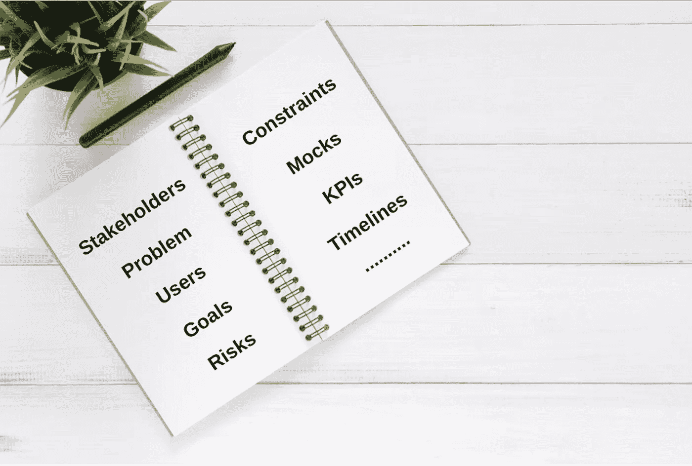

# 机器学习& AI 产品的产品说明书怎么写？

> 原文：<https://towardsdatascience.com/how-to-write-product-specifications-for-machine-learning-ai-products-68f6fe750a6d?source=collection_archive---------28----------------------->

为成功设置您的产品

根据您组织的规模、产品的类型、您的开发生命周期和您组织的实践，您将有自己定义产品规范的方式。无论你遵循哪种机制，这里都有一些关键的调整和见解，可以包括在你的规范中，以构建有效的机器学习和人工智能产品:

# 利益相关者

## 它需要一个村庄

为了构建有效的机器学习产品，通常你会有来自多个学科的几个利益相关者，包括数据科学家(各种各样)、工程师、设计师、领域专家、产品营销等等。确保他们所有人从产品规格开始就参与进来，并与您合作，为您产品的成功而努力。

# 目标/特征

## 不要为 ML/AI 设计，要为用户价值设计

在过去的几十年里，科技行业经历了快速发展的阶段，每隔几年就会有一项技术彻底改变我们解决各种问题的方式。在过去的十年里，机器学习和人工智能达到了前所未有的高度，几乎每个产品都声称或希望朝着使用 ML/AI 的方向发展。这促使各种产品经理几乎感到必须为“机器学习”或“人工智能”解决方案进行设计。作为产品经理，我们几乎有责任记住:技术会发展和变化，但解决用户问题永远不会过时。这是优化的关键目标，而解决方案可以是任何东西。请记住，产品只有在解决用户问题时才是成功的，而不是它是否使用 ML 或 AI 将有助于确保您的产品目标/功能符合正确的目标。

## 给实验留有余地

产品经理，尤其是机器学习和人工智能领域的新手，对他们产品中潜在使用的各种新算法和技术充满热情。大多数这些新技术都是日常对话的一部分，当谈到机器学习或人工智能技术时，项目经理很难在产品和技术规范之间划清界限。在你的说明书中，确保用户问题和预期的产品解决方案是清楚的，避免提及特定的机器学习或人工智能技术。这将为您的技术团队提供自由，让他们不受约束地进行试验并找到最佳解决方案。这也将允许您的规范随着技术的发展而保持相关性，这是非常快的！

# 产品目标/关键绩效指标

## 设定相关的目标或者不要预先设定

大多数产品规格包括设定产品要达到的某些目标。如果您的产品是基于 ML/AI 的，那么在您的产品和底层模型目标之间建立一致性是非常重要的。这将确保技术实现针对相同的 KPI 进行优化，并且有一种端到端评估产品的方法。在我的 [**上一篇文章**](/how-to-determine-if-your-machine-learning-model-is-ready-for-deployment-c84e32ba260a)**中，我写了如何为你的模型设定目标。**

**如果你的产品是独一无二的，而且是新的，在这个领域，一开始设定特定的数字目标可能并不明显，那么可以从定义成功的标准开始，然后让来自你产品的数据来驱动你的目标。最好是数据驱动，迟做比早做好，但要完全偏离目标。**

## **将模型评估作为产品的一部分进行烘焙**

**很多时候，基于机器学习模型的产品从一开始就没有考虑现实世界场景中的模型评估。一开始不考虑这些情况会对你以后造成伤害，因为:**

*   **即使您从一开始就不需要评估，您的产品也可能会丢弃稍后需要进行评估的数据点。因此，在开始时考虑各种场景将有助于避免以后出现这种情况**
*   **除非你有一个机制来做评估，否则你是盲目的，这可能会很快导致问题，特别是在基于人工智能的产品中，这些产品可以实时学习和适应**
*   **在许多高影响力的行业中，你的用户会寻找能够信任你的产品并认为它有用的评价。因此，虽然你的产品输出本身可以让你的用户激活，其验证和评估将有助于你的用户采用和参与。**

# **限制**

## **解决数据的现实问题**

**在指定机器学习产品的新特性/功能时，最常见的错误是没有评估和深入研究您的产品必须处理的数据挑战。预先确定数据限制有助于你为你的产品描绘一个现实的路径，并有助于避免你的产品规格在以后的多次迭代。**

****