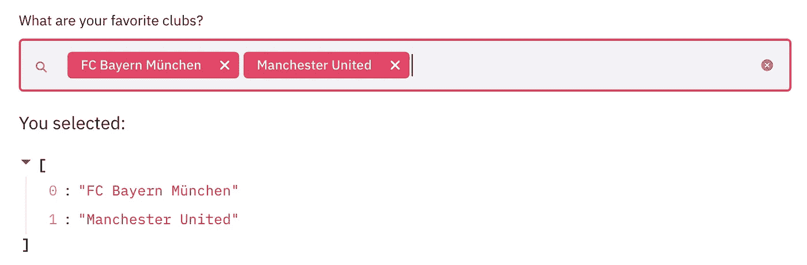

# 如何为数据科学家使用简单的 Python 编写 Web 应用？

> 原文：<https://towardsdatascience.com/how-to-write-web-apps-using-simple-python-for-data-scientists-a227a1a01582?source=collection_archive---------1----------------------->


Relax and Code on. Photo by [Cody Black](https://unsplash.com/@cblack09?utm_source=medium&utm_medium=referral) on [Unsplash](https://unsplash.com?utm_source=medium&utm_medium=referral)

## 无需了解任何 web 框架，即可轻松将您的数据科学项目转换为酷炫的应用程序

如果我们没有一个好的方式来展示它，机器学习项目就永远不会真正完成。

在过去，一个制作精良的可视化工具或一个小 PPT 足以展示一个数据科学项目，随着 RShiny 和 Dash 等仪表板工具的出现，一名优秀的数据科学家需要具备相当多的 web 框架知识。

Web 框架很难学。为了一些看似简单的事情，我仍然会对所有的 HTML、CSS 和 Javascript 感到困惑。

更不用说做同一件事的许多方法，这让我们数据科学的人感到困惑，因为 web 开发对他们来说是次要技能。

***那么，我们注定要学习 web 框架吗？或者半夜打电话给我们的开发者朋友问些愚蠢的问题？***

这就是 StreamLit 的用武之地，它承诺只用 Python 创建 web 应用。

> Python 的禅:简单比复杂好，简化让创建应用程序变得非常简单。

***本文旨在了解如何使用 Streamlit 创建支持数据科学项目的应用。***

为了更好地理解导致 streamlit 的架构和思维过程，请看最初的开发者/创始人之一 Adrien Treuille 的这篇精彩的[帖子](/coding-ml-tools-like-you-code-ml-models-ddba3357eace)。

如果你想在亚马逊 ec2 上部署一个 streamlit 应用，请查看我的下一篇[帖子](/how-to-deploy-a-streamlit-app-using-an-amazon-free-ec2-instance-416a41f69dc3)。

# 装置

安装就像运行命令一样简单:

`pip install streamlit`

要查看我们的安装是否成功，我们只需运行:

`streamlit hello`

这应该会显示一个屏幕，上面写着:


你可以在浏览器中访问本地网址:`localhost:8501`,查看一个正在运行的 Streamlit 应用程序。开发者提供了一些很酷的演示，你可以玩玩。回来之前，一定要花时间感受一下这个工具的威力。


# Streamlit Hello World

Streamlit 旨在使用简单的 Python 简化应用程序开发。

因此，让我们编写一个简单的应用程序，看看它是否能实现这一承诺。

这里我从一个简单的应用程序开始，我们称之为 streamlit 的 Hello World。只需将下面给出的代码粘贴到名为`helloworld.py`的文件中

```
import streamlit as stx = st.slider('x')
st.write(x, 'squared is', x * x)
```

在终端上运行:

```
streamlit run helloworld.py
```

瞧，你应该能在`localhost:8501`看到一个简单的应用程序在你的浏览器中运行，它允许你移动滑块并给出结果。


A Simple slider widget app

这很容易。在上述应用中，我们使用了 Streamlit 的两个功能:

*   我们可以滑动这个`st.slider`小部件来改变 web 应用程序的输出。
*   还有多才多艺的`st.write`指挥。我很惊讶它是如何从图表、数据框架和简单文本中写出任何东西的。稍后将详细介绍。

***重要提示:记住每次我们改变 widget 值，整个 app 都是从上到下运行的。***

# 简化小部件

小部件为我们提供了一种控制应用程序的方式。阅读这些小部件的最佳地方是 [API 参考](https://streamlit.io/docs/api.html)文档本身，但是我将描述一些您可能最终会使用的最突出的小部件。

## 1.滑块

```
**streamlit.slider****(*label*, *min_value=None*, *max_value=None*, *value=None*, *step=None*, *format=None*)**
```

我们已经在上面看到了`st.slider`的动作。它可以与最小值、最大值和步长一起使用，以获取某个范围内的输入。

## 2.文本输入

获取用户输入的最简单的方法是一些 URL 输入或一些用于情感分析的文本输入。它只需要一个标签来命名文本框。

```
import streamlit as sturl = st.text_input('Enter URL')
st.write('The Entered URL is', url)
```

这是应用程序的外观:


A Simple text_input widget app

**提示:**你只需更改文件`helloworld.py`并刷新浏览器即可。我的工作方式是在 sublime text 中打开并更改`helloworld.py`，并在浏览器中并排查看更改。

## 3.检验盒

复选框的一个用例是隐藏或显示/隐藏应用程序中的特定部分。另一个可能是在函数的参数中设置一个布尔值。`[st.checkbox()](https://streamlit.io/docs/api.html#streamlit.checkbox)`接受一个参数，即小部件标签。在这个应用程序中，复选框用于切换条件语句。

```
import streamlit as st
import pandas as pd
import numpy as npdf = pd.read_csv("football_data.csv")
if st.checkbox('Show dataframe'):
    st.write(df)
```


A Simple checkbox widget app

## 4.选择框

我们可以使用`[st.selectbox](https://streamlit.io/docs/api.html#streamlit.selectbox)`从系列或列表中选择。通常情况下，用例是将其用作简单的下拉菜单，从列表中选择值。

```
import streamlit as st
import pandas as pd
import numpy as npdf = pd.read_csv("football_data.csv")option = st.selectbox(
    'Which Club do you like best?',
     df['Club'].unique())'You selected: ', option
```


A Simple dropdown/selectbox widget app

## 5.多选

我们也可以使用下拉列表中的多个值。这里我们使用`st.multiselect`在变量`options`中获取多个值作为列表

```
import streamlit as st
import pandas as pd
import numpy as npdf = pd.read_csv("football_data.csv")options = st.multiselect(
 'What are your favorite clubs?', df['Club'].unique())st.write('You selected:', options)
```



A Simple multiselect widget app

# 逐步创建我们简单的应用程序

了解重要的小部件就到此为止。现在，我们将一次使用多个小部件创建一个简单的应用程序。

首先，我们将尝试使用 streamlit 可视化我们的足球数据。借助上面的小部件，做到这一点非常简单。

```
import streamlit as st
import pandas as pd
import numpy as npdf = pd.read_csv("football_data.csv")clubs = st.multiselect('Show Player for clubs?', df['Club'].unique())nationalities = st.multiselect('Show Player from Nationalities?', df['Nationality'].unique())# Filter dataframe
new_df = df[(df['Club'].isin(clubs)) & (df['Nationality'].isin(nationalities))]# write dataframe to screen
st.write(new_df)
```

我们简单的应用程序看起来像:


Using multiple widgets in conjunction

那很容易。但是现在看起来很基本。我们可以添加一些图表吗？

Streamlit 目前支持许多用于绘图的库。 ***Plotly、Bokeh、Matplotlib、Altair 和 Vega 图表*** 就是其中的一些。 ***Plotly Express*** 也是可以的，虽然他们在文档里没有明确说明。它也有一些内置的图表类型，像`st.line_chart`和`st.area_chart`。

我们将在这里与`plotly_express`合作。这是我们简单应用程序的代码。我们刚刚使用了四个调用来简化它。其余的都是简单的 python。

```
import streamlit as st
import pandas as pd
import numpy as np
import plotly_express as pxdf = pd.read_csv("football_data.csv")**clubs = st.multiselect('Show Player for clubs?', df['Club'].unique())
nationalities = st.multiselect('Show Player from Nationalities?', df['Nationality'].unique())**new_df = df[(df['Club'].isin(clubs)) & (df['Nationality'].isin(nationalities))]
**st.write(new_df)**# create figure using plotly express
fig = px.scatter(new_df, x ='Overall',y='Age',color='Name')# Plot!
**st.plotly_chart(fig)**
```


Adding charts

# 丰富

一开始我们说过，每次我们更改任何小部件，整个应用程序都会从头到尾运行。当我们创建将服务于深度学习模型或复杂的机器学习模型的应用时，这是不可行的。Streamlit 通过引入 ***缓存*** 在这方面为我们做了介绍。

## 1.贮藏

在我们简单的应用程序中。每当一个值改变时，我们就一遍又一遍地读取熊猫数据帧。虽然它适用于我们拥有的小数据，但它不适用于大数据，或者当我们必须对数据进行大量处理时。让我们使用 streamlit 中的`st.cache` decorator 函数来使用缓存，如下所示。

```
import streamlit as st
import pandas as pd
import numpy as np
import plotly_express as px**df = st.cache(pd.read_csv)("football_data.csv")**
```

或者对于只需要运行一次的更复杂和耗时的函数(考虑加载大型深度学习模型)，使用:

```
@st.cache
def complex_func(a,b):
    DO SOMETHING COMPLEX# Won't run again and again.
complex_func(a,b)
```

当我们用 streamlit 的 cache decorator 标记一个函数时，无论何时调用该函数，Streamlit 都会检查调用该函数时使用的输入参数。

***如果这是 Streamlit 第一次看到这些参数，它将运行该函数并将结果存储在本地缓存中。***

下次调用该函数时，如果这些参数没有改变，Streamlit 知道它可以完全跳过执行该函数。它只是使用缓存中的结果。

## 2.补充报道

为了根据您的偏好获得更整洁的外观，您可能希望将您的小部件移动到侧边栏中，类似于 Rshiny dashboards。 ***这个挺简单的。只需在您的小部件代码中添加*** `***st.sidebar***` ***即可。***

```
import streamlit as st
import pandas as pd
import numpy as np
import plotly_express as pxdf = st.cache(pd.read_csv)("football_data.csv")clubs = **st.sidebar.multiselect**('Show Player for clubs?', df['Club'].unique())
nationalities = **st.sidebar.multiselect**('Show Player from Nationalities?', df['Nationality'].unique())new_df = df[(df['Club'].isin(clubs)) & (df['Nationality'].isin(nationalities))]
st.write(new_df)# Create distplot with custom bin_size
fig = px.scatter(new_df, x ='Overall',y='Age',color='Name')# Plot!
st.plotly_chart(fig)
```


Move widgets to the sidebar

## 3.降价？

我喜欢用 Markdown 写作。我发现它没有 HTML 冗长，更适合数据科学工作。那么，我们可以在 streamlit 应用程序中使用 Markdown 吗？

是的，我们可以。有几种方法可以做到这一点。在我看来，最好的方法是使用[魔法指令](https://streamlit.io/docs/api.html#id1)。神奇的命令让你写 markdown 像写注释一样容易。您也可以使用命令`st.markdown`

```
import streamlit as st
import pandas as pd
import numpy as np
import plotly_express as px'''
# Club and Nationality AppThis very simple webapp allows you to select and visualize players from certain clubs and certain nationalities.
'''
df = st.cache(pd.read_csv)("football_data.csv")clubs = st.sidebar.multiselect('Show Player for clubs?', df['Club'].unique())
nationalities = st.sidebar.multiselect('Show Player from Nationalities?', df['Nationality'].unique())new_df = df[(df['Club'].isin(clubs)) & (df['Nationality'].isin(nationalities))]
st.write(new_df)# Create distplot with custom bin_size
fig = px.scatter(new_df, x ='Overall',y='Age',color='Name')'''
### Here is a simple chart between player age and overall
'''st.plotly_chart(fig)
```


Our final App Demo

# 结论

Streamlit 使创建应用程序的整个过程民主化了，我不能再推荐它了。

在这篇文章中，我们创建了一个简单的 web 应用程序。但是可能性是无限的。这里举个例子就是细流网站的[脸甘](https://research.nvidia.com/publication/2017-10_Progressive-Growing-of)。它的工作原理与小部件和缓存的指导思想相同。


我喜欢开发人员使用的默认颜色和样式，我发现它比使用 Dash 要舒服得多，直到现在我还在我的演示中使用 Dash。您还可以在您的 streamlit 应用程序中包含[音频](https://streamlit.io/docs/api.html#display-interactive-widgets)和视频。

最重要的是，Streamlit 是一款免费的开源软件，而不是一款开箱即用的专有网络应用。

在过去，我必须联系我的开发人员朋友来解决演示或演示中的任何一个变化；现在做那件事相对来说是微不足道的。

> 我的目标是从现在开始在我的工作流程中更多地使用它，考虑到它所提供的功能，我认为你也应该这样做。

我不知道它是否会在生产环境中表现良好，但它对于小型概念验证项目和演示来说是一个福音。我的目标是从现在开始在我的工作流程中更多地使用它，考虑到它所提供的功能，我认为你也应该这样做。

你可以在这里找到最终应用[的完整代码。如果你想在亚马逊 ec2 上部署这款应用，请查看我的下一篇](https://github.com/MLWhiz/data_science_blogs/tree/master/streamlit_football_demo)[帖子](/how-to-deploy-a-streamlit-app-using-an-amazon-free-ec2-instance-416a41f69dc3)。

如果你想了解创建可视化的最佳策略，我想从密歇根大学调出一门关于 [**数据可视化和应用绘图**](https://coursera.pxf.io/e45JOX) 的优秀课程，这是一门很好的 [**数据科学专业的一部分，Python**](https://coursera.pxf.io/e45JOX) 本身就是其中之一。一定要去看看。

谢谢你的阅读。将来我也会写更多初学者友好的帖子。在[](https://medium.com/@rahul_agarwal)**关注我或者订阅我的 [**博客**](https://mlwhiz.ck.page/a9b8bda70c) 了解他们。一如既往，我欢迎反馈和建设性的批评，可以通过 Twitter [@mlwhiz](https://twitter.com/MLWhiz) 联系。**

**此外，一个小小的免责声明——这篇文章中可能会有一些相关资源的附属链接，因为分享知识从来都不是一个坏主意。**