# 如何编写你的第一个 Quine 程序

> 原文：<https://towardsdatascience.com/how-to-write-your-first-quine-program-947f2b7e4a6f?source=collection_archive---------6----------------------->

## Python 中自我复制程序的快速指南

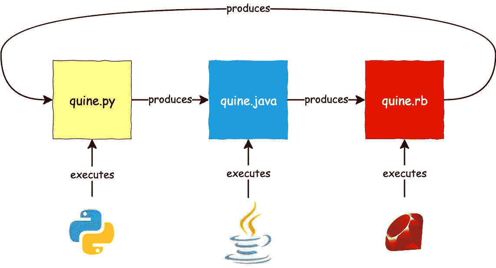

A quine-relays: a Python program generates a Java program that generates a Ruby program that generates the first Python program

本指南的目的是展示如何编写一个程序，让**在没有输入的情况下输出自己的源代码**。这一系列程序被称为奎因。

这为什么有意思？因为自我引用的东西总是很有趣:)

构建这样的程序有很多方法，但最常见的方法叫做**构造方法**。

但首先…这不是一个有效的奎因计划:

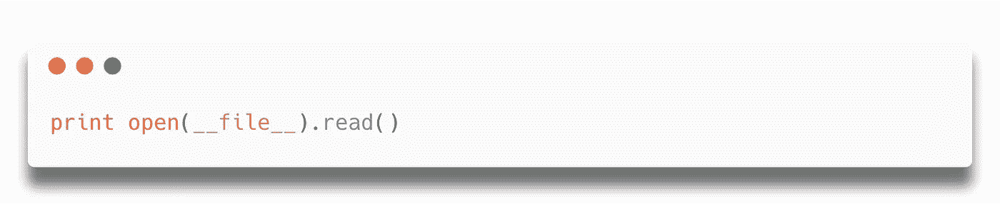

This is not Quine, is cheating in Python

一个程序只有在完全不需要输入的情况下才能被称为蒯因。在这种情况下，程序读取其源代码作为文件，从而使其使用自己作为输入。此外，本指南不考虑琐碎的 Quine 程序(如*0 字节程序或[自我评估原子](https://en.wikipedia.org/wiki/Lisp_(programming_language)#Self-evaluating_forms_and_quoting)如 Lisp)。*

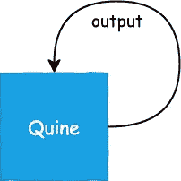

# 建设性蒯因

最有效和最容易理解的方法是将程序分成两部分:

*   委托打印信息的代码(如 Python 中的`print()`函数、Java 中的`System.out.println()`或 C++中的全局对象`std::cout`)。
*   可以存储部分源代码的数据结构(如字符串或列表)。注意，程序甚至需要打印字符串周围的引号。

这些要求必须根据您想要使用的语言规范进行调整和校准。由于每种语言使用不同的机制来管理数据结构和打印，这里不可能涵盖所有的变化，所以本指南只关注 Python 规范。

# python str()vs repr()

如果你已经知道这个机制，那么你可以跳过这一节。

否则，这不仅对完成我们的任务非常重要，而且对更好地理解语言本身的有趣之处也非常重要。

## str() —人类可读对象

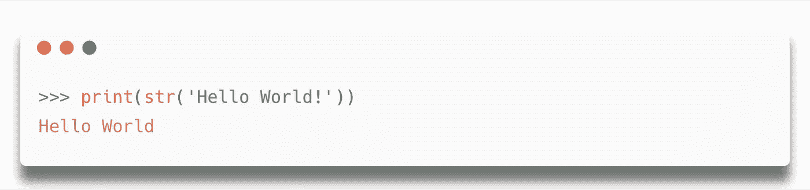

`[str()](https://docs.python.org/3/library/stdtypes.html#str)`是 Python 中的标准函数，返回对象的字符串版本。它应该生成一个友好的人类可读的字符串。

## repr()-可评估对象

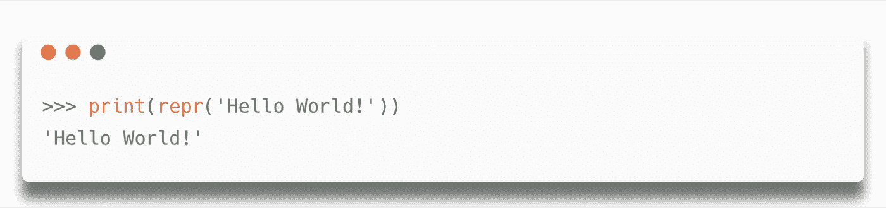

Notice the quotes surrounding the string

另一方面，`[repr()](https://docs.python.org/3/library/functions.html#repr)`返回表示对象的字符串的可求值版本(通过`[eval()](https://docs.python.org/3/library/functions.html#eval)`函数)。对于字符串，它返回用引号括起来的字符串本身。

通过使用下面的语法，同样可以用`printf`的方式编写，其中`%r`表示用`[repr()](https://docs.python.org/3/library/functions.html#repr)`格式化第二个`%`之后的字符串。

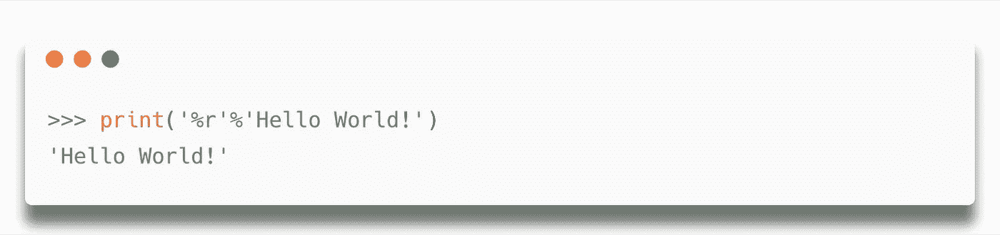

# 蒯因通过评估

这项技术包括使用`[eval()](https://docs.python.org/3/library/functions.html#eval)`功能。我们将要创建的程序的主要模式如下:

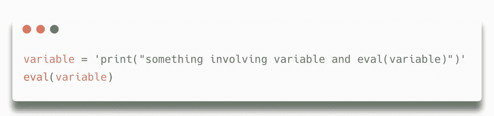

是我们的数据结构，我们必须在里面放一段代码来打印和评估它自己。为什么我们希望在字符串中也有 eval 函数？因为程序的最后一行使用了`[eval()](https://docs.python.org/3/library/functions.html#eval)`，我们必须在字符串中找到它。

由于程序以`variable='`开始，我们必须把这部分作为第一件要打印的东西。同样，出于同样的原因，最后要打印的部分必须是`eval(variable)`。

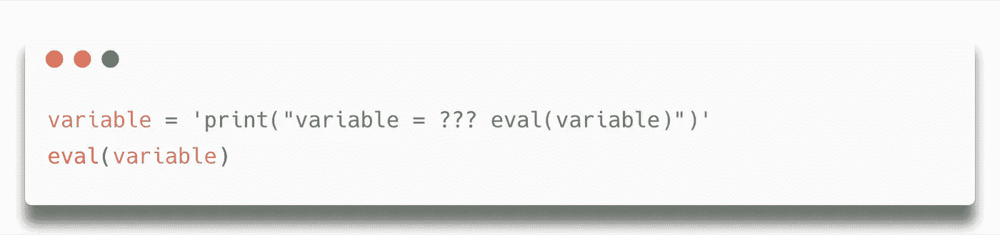

执行过程打印了`variable = ??? eval(variable)`，这很好，但是我们还必须打印`print()`函数、引号和换行符。我们不能在字符串 a `print(...)`中再写一次，否则我们将通过无限增加`print(...)`进入一个无限递归循环。

所以主要思想是再次使用`variable`，因为它已经包含了`print()`函数！就像这样连接它:

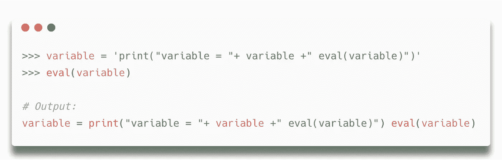

输出与源代码非常相似，但是我们必须处理围绕`print()`函数的引号和断行。幸运的是，我们现在知道 Python 提供了`[repr()](https://docs.python.org/3/library/functions.html#repr)`函数来返回一个字符串的可求值版本，对于换行符，我们可以添加一个转义的`\n`:

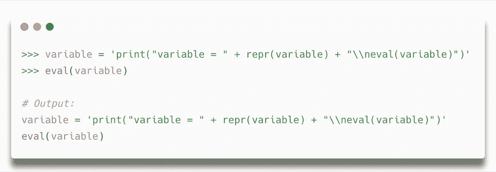

The Quine program perfectly working

这是你用 Python 写的第一个 Quine 程序，因为没有输入，输出就是程序的源代码！

# 其他奎因计划

还有其他方法来创建奎因程序，你可以在下面找到一些简短的描述。

## 最短的蟒蛇奎因

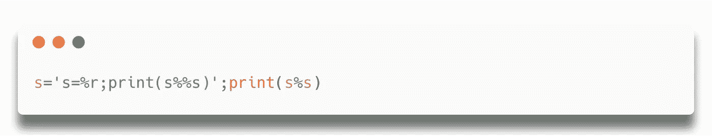

这是 Python 中最著名的 Quine 程序，也是有史以来最短的非平凡程序。请注意，它没有使用`[eval()](https://docs.python.org/3/library/functions.html#eval)`，而是以`printf`的方式使用`[repr()](https://docs.python.org/3/library/functions.html#repr)`。与我们的版本没有太大的不同，因为它使用了一种建设性的方法。

## 误差奎因

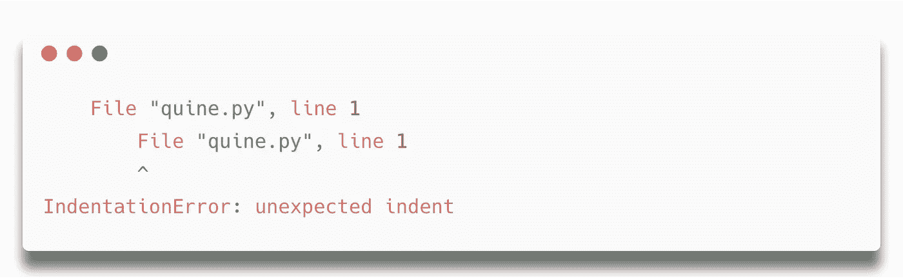

This program must be saved as quine.py

这很有意思。该程序是一个生成`IndentationError`的无效 Python 代码。它输出自己，但在`stderr`标准流中，而不是在`stdout`(在我看来，这仍然是一个有效的查询)。

## 奎因继电器

Quine-relay 是用一种语言编写的程序，它输出另一种语言的程序，后者又生成启动程序。

本文的特色图片给出了一个直观的例子。

你也可以在这里找到一个用于 128 种编程语言的 Quine-relays 的实际例子！

## 你能用你最喜欢的语言写一个蒯因程序吗？