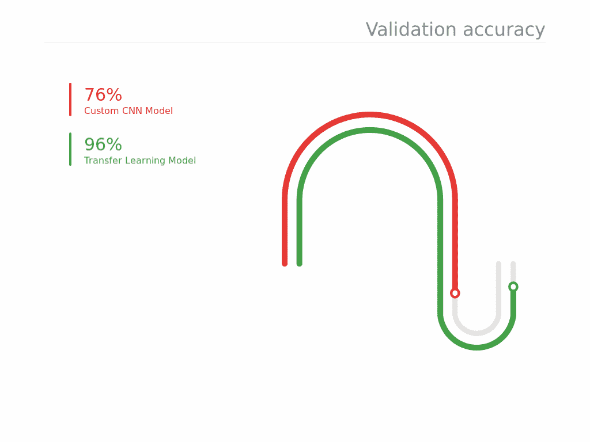
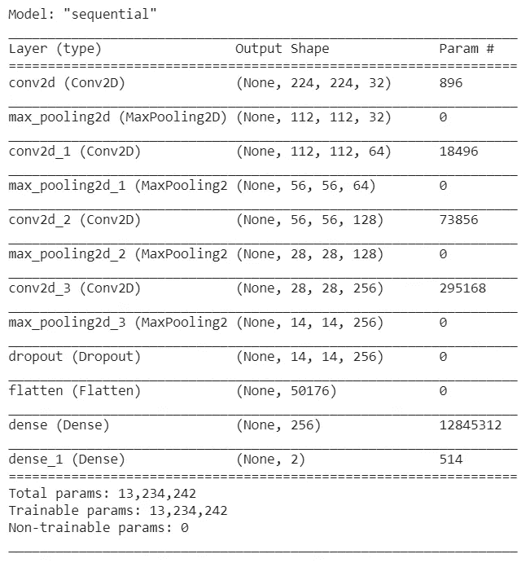
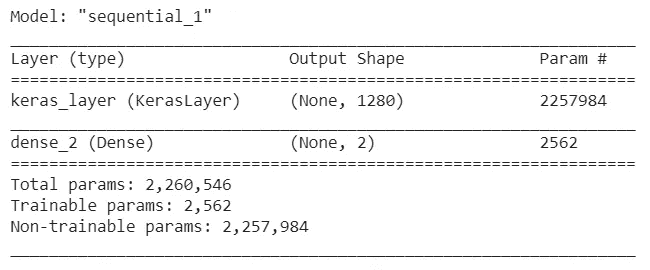
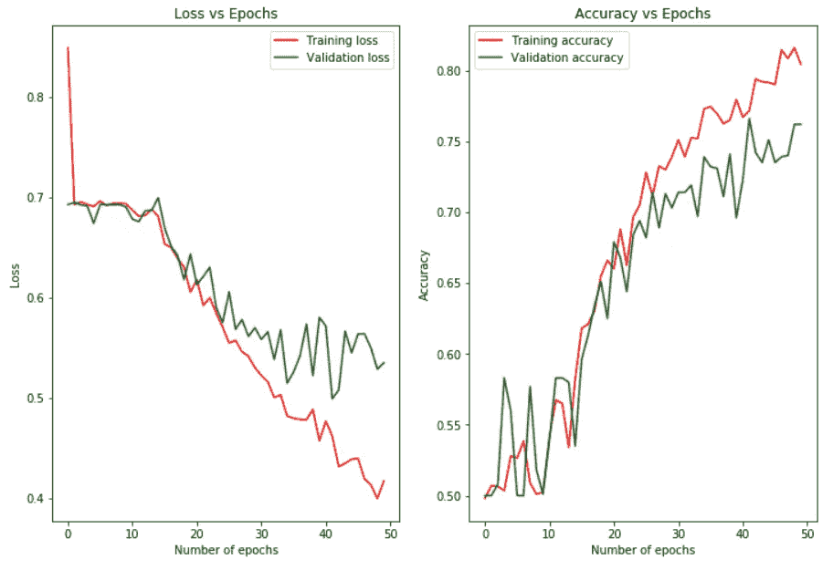
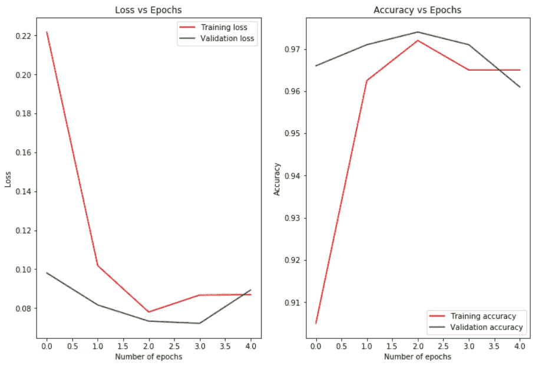

# 迁移学习如何成为深度学习模型中的幸事？

> 原文：<https://towardsdatascience.com/how-transfer-learning-can-be-a-blessing-in-deep-learning-models-fbc576dc42?source=collection_archive---------20----------------------->

## 转移学习要点

迁移学习是深度学习领域的一大进步，它不仅允许我们将高性能模型用于各种任务，还减少了对越来越多数据的依赖。在这篇文章中，我将讨论什么是迁移学习，以及我们如何利用它来解决手头的问题。笔记本链接如下:

 [## 谷歌联合实验室

### 编辑描述

colab.research.google.com](https://colab.research.google.com/drive/18GACFV395iu9hS47-wkKW7LSdkmOyE0P) 

# 什么是迁移学习？

迁移学习是一种技术，在这种技术中，针对某项任务训练的模型可用于根据其学习(权重)对另一项任务进行预测。

> 让我们以理解三角形的卷积神经网络为例，尝试更好地理解它。让我们考虑模型有两层。在第一层，模型将检测边缘。在第二层，模型将结合这些边来理解三角形。
> 
> 让我们考虑另一个 CNN 模型，它必须被训练来检测矩形。如果我们可以使用以前的 CNN 模型的知识来理解边缘，并只改变最后一层，这样在训练期间，它现在可以检测矩形而不是三角形。这就是迁移学习。使用已经训练好的模型对另一项任务进行预测。

# 为什么要转学？

迁移学习是一个非常重要的概念，在处理许多深度学习模型时非常有用。它带来的好处包括:

1.  **使用专家模型:**利用迁移学习，我们只要冻结参数，改变输出层，就可以直接使用专家精心高效创建的模型。
2.  **没有模型结构开发:**由于我们使用的是已经存在的模型，我们不再需要考虑要包含的层，应该分配什么参数等等。
3.  **更高更好的表现:**由于迁移学习中使用的模型是精心设计的，它们在其他类似的任务中也表现得更好。

让我们试着用迁移学习来解决猫和狗的问题。

# 猫和狗的问题解决方案

Photo by [Anusha Barwa](https://unsplash.com/@anshaaleena?utm_source=medium&utm_medium=referral) on [Unsplash](https://unsplash.com?utm_source=medium&utm_medium=referral)

## 问题描述

我们有一组猫和狗的图像。我们希望使用深度学习模型来区分这两个类别。

## 方法

我将首先自己创建一个 CNN 模型，并测量它的性能。然后，我将在一个流行的模型 MobileNet 上使用迁移学习来训练分类。我将把每个模型的图像大小设置为统一的 224x224，并对提供给每个模型的数据进行数据扩充。

## 培养

由于这个问题是一个 2 类分类问题，我将用`adam`优化器、`sparse_categorical_crossentropy`损失函数和度量标准`accuracy`来编译每个模型。

**训练定制模型** 我创建了一个 CNN 模型，有 4 个`Conv2D`层，分别有 32、64、128、256 个节点和`relu`激活函数。这些卷积层中的每一层都跟随着一个`MaxPooling2D`层。接下来，我添加一个`Dropout`层，防止过度渲染。我添加了一个`Flatten`层，这样我可以把它传递给 256 节点`Dense`层。最后一层是一个 2 节点`Dense`层，带有`softmax`激活函数，给出每一类的概率。当我从头开始训练模型时，我将运行它 100 个时期。

Custom CNN Model

**用迁移学习训练 MobileNet 模型** 我会从 Tensorflow Hub 下载 MobileNet 模型。然后我会冻结它，这样模型内部的重量就不会改变。我将添加一个有 2 个节点的密集层(两个类——猫和狗)和`softmax`激活函数。由于这是一个预训练的模型，我将只运行 5 个时期。

Transfer Learning model

## 结果比较

让我们来看看这两种模型的精度和损耗曲线。

Custom CNN model training curves

对于定制的 CNN 模型，在 50 个时期之后，该模型实现了 76%的验证准确度。然而，即使准确性仍在提高，训练和验证准确性之间的差异正在扩大，这表明它开始过度拟合。

Transfer Learning model training curves

就在 5 个时期之后，MobileNet 迁移学习模型实现了 96%的验证准确性。

> 迁移学习模型的准确性比定制模型高出 20%。这也减少了训练时间。

从使用现有模型的过程，到在数据集上训练它，都是如此简单和容易。这对任何人来说都是一个巨大的机会，只要拿起一个经过训练的模型，用它来解决他们的问题。

# 结论

正如我们所看到的，迁移学习模型与定制 CNN 模型相比表现得非常好，并且也具有非常少的时期。很明显，迁移学习是一种非常特殊和强大的技术，可以创建深度学习模型，并帮助解决现有模型的多个问题。

查看其他文章:

 [## Google Colab——您在云上的 Python 工作空间

### 了解 Google Colab

towardsdatascience.com](/google-colab-your-python-workspace-on-cloud-c3aed424de0d)  [## 使用 React 和 Flask 创建一个完整的机器学习 web 应用程序

### 用 UI 和后端构建完整的 ML 应用程序

towardsdatascience.com](/create-a-complete-machine-learning-web-application-using-react-and-flask-859340bddb33)  [## 使用深度学习通过确保驾驶员的注意力来拯救生命

### 现实生活中的卷积神经网络

towardsdatascience.com](/using-deep-learning-to-save-lives-by-ensuring-drivers-attention-e9ab39c03d07)  [## 通过预测游客购买意向学习人工神经网络

### 使用 Keras 和 Tensorflow 构建人工神经网络

towardsdatascience.com](/learning-artificial-neural-networks-by-predicting-visitor-purchase-intention-724ba2be7c29)  [## 迁移学习指南:一个实用的教程与图像和文本的例子在 Keras …

### 在大型数据集上训练一个神经网络可能需要数周时间。幸运的是，由于有了模型，这个时间可以缩短…

海王星. ai](https://neptune.ai/blog/transfer-learning-guide-examples-for-images-and-text-in-keras) 

感谢阅读！请分享你的想法、观点和建议。我很乐意收到你的来信。