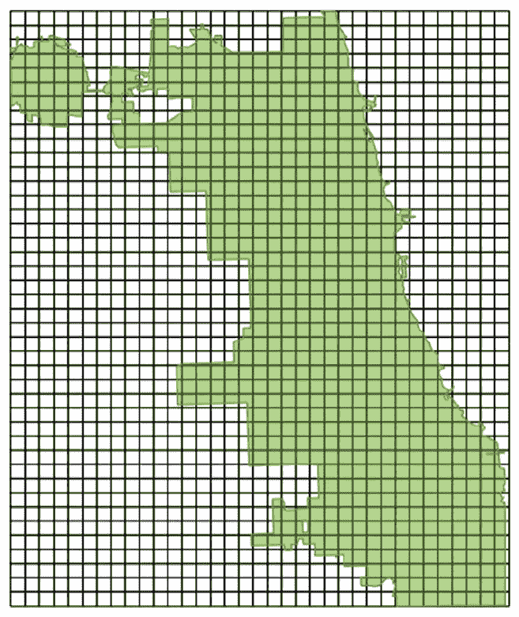
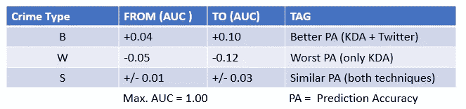
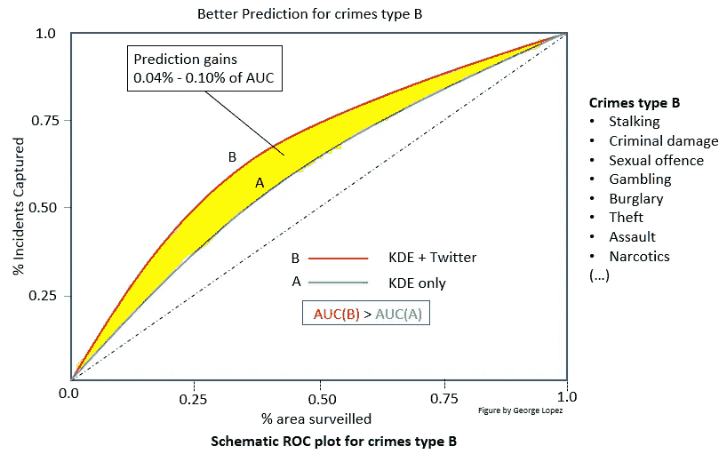
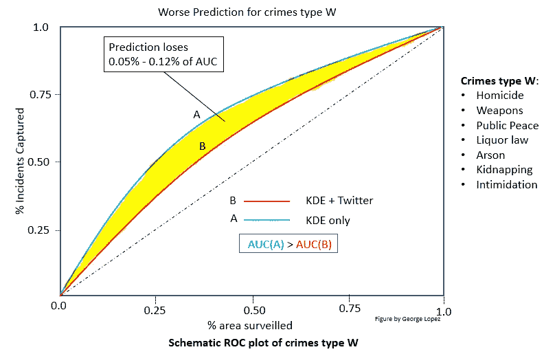
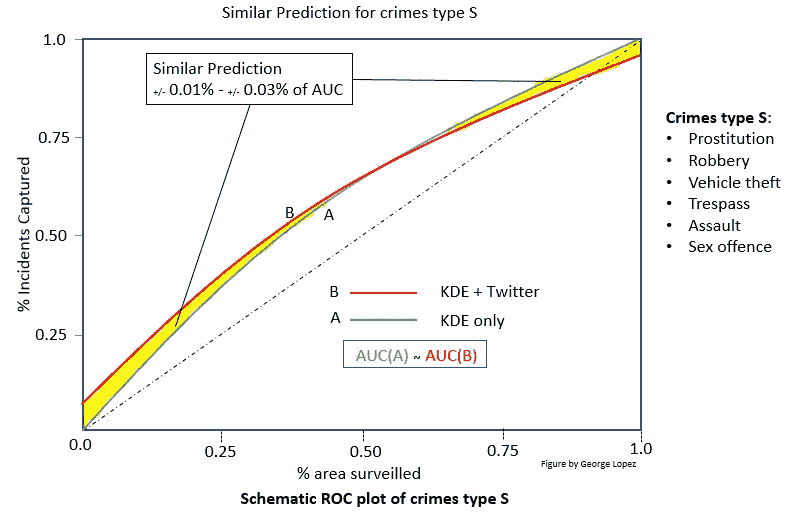
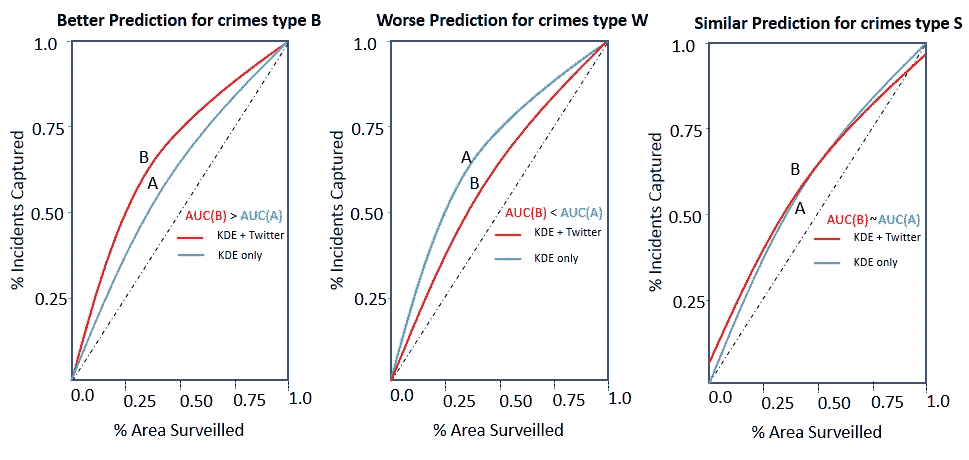
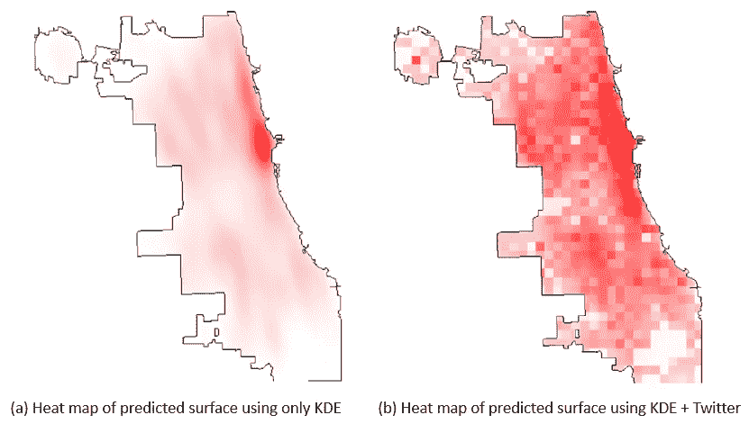

# Twitter 和 AI (KDE + LDA)如何帮助预测犯罪？

> 原文：<https://towardsdatascience.com/how-twitter-and-machine-learning-kde-lda-help-to-predict-crime-5b8abbd15596?source=collection_archive---------8----------------------->

这是对 Mattew S. Gerber 的论文“使用 Twitter 和内核密度估计预测犯罪”的 5 分钟评论。

犯罪预测被反犯罪组织用来优化他们在热点犯罪地区巡逻的有限资源的调度。

这种预测通过使用被称为“*潜在狄利克雷分配*”(**LDA**)模型的 NLP 机器学习(ML)技术处理的 Twitter 消息以及另一种被称为“*核密度估计*”(**KDE**)的 ML 技术得到了增强。使用这些消息的直觉是，人们通常用 twit 谈论他们所在的位置，而 Gerber 提出的方法利用了这些消息是地理定位的(twit 以纬度+经度的形式提供其来源位置。)

如何使用 twits 使预测更加准确？除了 **KDE** 之外，他(Gerber)还使用这些消息的主题建模，特别是 **LDA** 。作为简要总结， **LDA** 是一种生成概率主题建模方法，其发现遍及文本语料库的预设数量的主题。我们想要提取的主题的数量代表模型超参数( *K* )，并且需要先验地提供。这些*K*-主题按照出现概率的降序排列，在这种情况下，语料库由所有考虑的 twits 消息表示。例如，如果一个人在机场发 twit，很可能会包含诸如航班、飞机、登机口、航空公司、美国航空公司等词语，因此我们可以推断 twit 来自 twit 本身提供的地理位置，在这种情况下，位置发生在机场(在所研究的区域中)。在定位犯罪的情况下，让我们假设卖淫犯罪的最大概率主题(在 500 个主题中)是“lounge studios continental village Ukrainian……”，那么 twitter 消息提供的位置将指示这种犯罪可能在哪里发生。

Figure 1\. Division of Chicago Illinois USA city neighborhood boundaries for tweet-based topics, only the green cells were considered in Gerber’s analysis.

在他的论文中，Gerber 考虑了两种人工智能技术:Twitter 上的 **KDE** + **LDA** 。为了进行分析，他考虑了美国伊利诺伊州的芝加哥市，在那里他将该市划分为 1000 米乘 1000 米的正方形单元(小区)(见图 1)。

这种方法是如何工作的？预测方法的功能如下:对于每个邻居，发布的 twits 使用 **LDA** 进行主题建模。 **LDA** 将以最高概率贡献 *K* tweet-topics，并且 twit 携带 twit 本身的地理位置。同时， **KDE** 将量化犯罪的历史密度(按类型和单元)。

通过结合 **KDE** 和经过 **LDA** 处理的 Twitter 内容，他制定了一个预测模型，在应用该模型后，Gerber 观察到，在大多数犯罪类型中，预测准确性都有所提高。为了展示他在这种技术的预测准确性方面发现的收益和损失，我在 3 种犯罪类型(B、W 和 S)的 3 个示意图中总结了它们，其中类型 B 代表实现了更好的预测准确性(比单独使用 **KDE** )的那些犯罪，Gerber 声称在 AUC 方面获得了高达 0.10%的改善(见图 2)。)，对于那些预测准确性较差的犯罪，键入 W(见图 3。)和 S 型犯罪，其中预测准确性是相似的(见图 4)。我从 Gerber 的研究结果中任意选择了以下等级，根据犯罪类型对其进行分类(见表 1)。

Table 1

Figure 2

Figure 3

Figure 4

为了清楚起见，三幅图一起呈现(参见图 5)，如所解释的，他的模型报告了对于犯罪类型 B 的预测精度的提高，对于犯罪类型 P 的预测精度较差，对于犯罪类型 S，与仅使用 **KDE** 相比，预测精度相似。

Figure 5

下图显示了(a)仅使用 KDE 生成的热点图，而(b)显示了使用 KDE + Twitter 主题要素生成的热点图，在这里我们可以看到更明确、更密集的预测，这甚至类似于用于分析该区域的邻域划分(像元)。参见图 6。

Figure 6

在我看来，这篇论文通过使用 LDA 添加 Twitter 分析，为改进犯罪预测技术(仅基于 KDE)做出了很好的努力。然而，作者声称的预测准确性的提高并没有扩展到每一种犯罪类型。作者承认，很难解释为什么一些类型的犯罪或多或少受益于 Twitter 话题的增加，也许这将是一个关于这个问题的进一步研究的问题。除了 Twitter 消息的地理位置，或许还可以包括其他特征来提高犯罪预测的准确性，如 Twitter 情绪，甚至影响犯罪，如天气？

来源:

## [使用 Twitter 和核密度估计预测犯罪](https://www.sciencedirect.com/science/article/pii/S0167923614000268)

[Gerber 女士](https://scholar.google.ca/citations?user=5_kJ1oYAAAAJ&hl=en&oi=sra) —决策支持系统，2014 年—爱思唯尔

## [【书】用于统计和数据分析的密度估算](https://www.taylorfrancis.com/books/9781351456173)

taylorfrancis.com BW Silverman—2018 年——T4

## [PDF] [加速潜在狄利克雷分配模型的校准以改进软件工程中的主题分析](https://digital.library.ryerson.ca/islandora/object/RULA:6834/datastream/OBJ/download/Speeding_up_calibration_of_latent_Dirichlet_allocation_model_to_improve_topic_analysis_in_software_engineering.pdf)

JA lópez—2017—digital . library . ryerson . ca

关于本文作者:[https://www.georgelopez-portfolio.com/](https://www.georgelopez-portfolio.com/)

— — — — — — — — — — — — — — — — — — — — — — — — — — — — — —

亲爱的读者:

我有兴趣从你那里知道，根据你的标准，Twitter 正在捕捉的其他什么特征可以被认为是预测犯罪？

你可以留下评论，我会很乐意阅读。谢了。