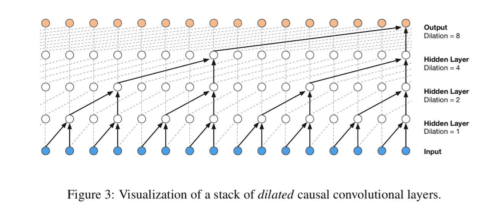
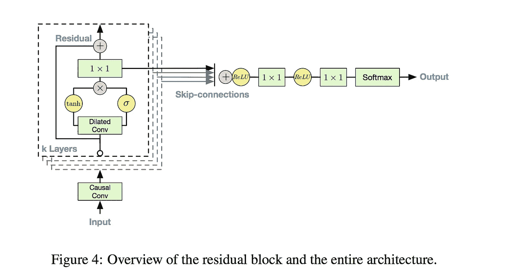
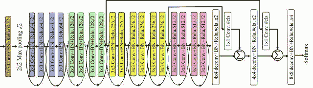
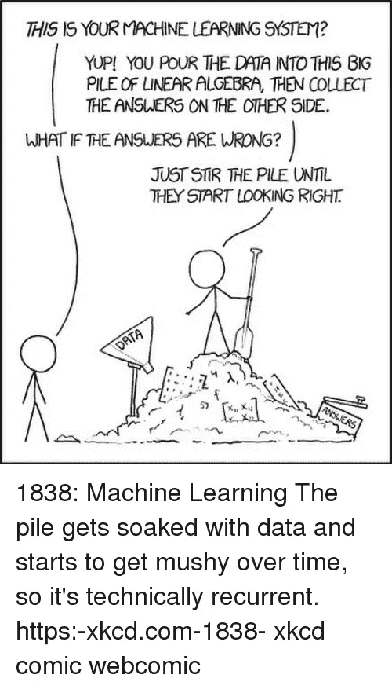
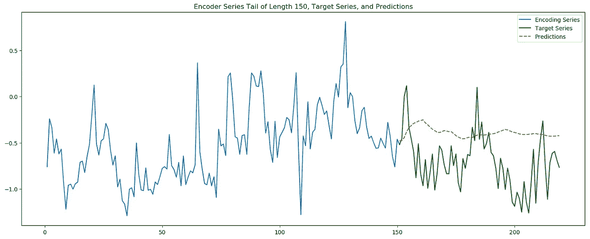
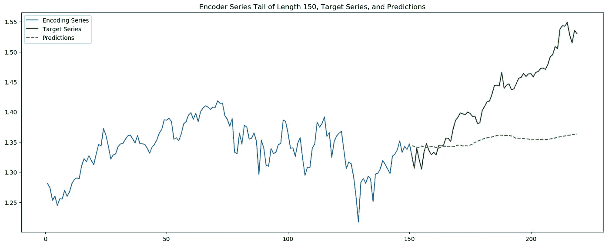

# WaveNet 如何工作

> 原文：<https://towardsdatascience.com/how-wavenet-works-12e2420ef386?source=collection_archive---------1----------------------->

## 是关于时序深度学习进化的！

WaveNet 是一种强大的新预测技术，它使用来自计算机视觉(CV)和音频信号处理模型的多种深度学习策略，并将它们应用于纵向时间序列数据。它是由伦敦人工智能公司 [DeepMind](https://deepmind.com/) 的研究人员创造的，目前为[谷歌助手语音](https://assistant.google.com/)提供动力。

The building blocks of the WaveNet Deep Learning Model

这篇博客文章伴随着我最近在西雅图[全球人工智能大会(2019 年 4 月 23 日至 25 日)](http://www.globalbigdataconference.com/seattle/global-artificial-intelligence-conference/event-103.html)上的一次演讲。它也是我用来讲课和实验的 Jupyter 笔记本的精华，[可以在我的 GitHub 上找到，还有支持数据和资源](https://github.com/ultimatist/WaveNet)。

我们将主要探索 WaveNet 及其工作原理，但首先让我们深入研究数据准备、当前的高性能模型(作为基线，脸书预言家)，然后比较结果！

我们正在分析雅虎财经 2000 年 1 月至 2019 年 5 月的 AAPL、MSFT、S&P500、纳斯达克指数数据；这些都在回购的数据文件夹里。

# 背景

在我们转向笔记本和我们的结果之前，我们必须了解 WaveNet 是如何形成的。DeepMind 正在研究音频排序问题，特别是与学习和模仿人类语言有关的问题。解决这个问题对于突破我们多年来一直使用的机器人声音至关重要，而且[让数字助理听起来更像人类](https://cloud.google.com/text-to-speech/docs/wavenet)。

DeepMind 寻找灵感的一个领域是计算机视觉和卷积网络架构。有趣的是，[滤波和卷积这两个概念不仅适用于图像和视频，*也适用于音频应用*](https://stackoverflow.com/questions/22471072/convolutional-neural-network-cnn-for-audio) 。简而言之，DeepMind 对这种被标记为“WaveNet”的架构的实验开始启用[谷歌复杂的助手语音](http://https)。

随着深度网络的跨功能应用如此成功，研究人员想知道 WaveNet 是否还有其他应用，如序列或时间序列数据。嗯…你猜怎么着？它运行得非常好，但是*需要一些调整*。让我们深入研究这些调整，以及我们需要为顺序数据优化的架构。

# WaveNet 架构

Gated Activations and Skip Connections

我们上面看到的是一个**门控激活**。与 LSTM 或格鲁什的门类似，*双曲正切分支*是一个激活滤波器，或者说是下面发生的扩张卷积的修改器。这就是我们之前在 CNN 上看到的“挤压功能”。*s 形分支*本质上充当了一个二进制门，能够消除之前的一切；它知道哪些数据是重要的，可以追溯到过去任意数量的时期。

还要注意指向右侧的灰色箭头:这些是**跳过连接**。它们允许完全绕过卷积层，并使原始数据能够影响未来任意多个时期的预测公式。这些是可以在数据切片上验证的超参数；最佳值取决于您想要学习的序列的结构和复杂性。

请记住，在全连接神经网络中，一个神经元接收来自前一层所有神经元的输入:早期层通过中间计算的层次结构影响后期层。这允许神经网络建立原始输入/信号的复杂交互。

但是…如果早期的原始输入对预测直接有用，并且我们希望它们直接影响输出，那该怎么办？具体来说，跳过连接允许任何层的输出绕过多个未来层，并且*跳过影响稀释！* Keras 允许我们使用`skips.append()`存储每个卷积块的张量输出——除了通过进一步的层传递之外。请注意，对于上面堆栈中的每个块，门控激活的输出如何加入跳过连接的集合。

Residual Connections

**剩余连接**类似于跳过连接:把它们想象成持续可用的短层跳过！我们将为我们的模型使用一层跳跃，但它也是一个超参数。他们为什么帮助是神秘的，但它最有可能是由于在反向传播中帮助[消失或爆炸梯度](https://medium.com/learn-love-ai/the-curious-case-of-the-vanishing-exploding-gradient-bf58ec6822eb)障碍。对于较大的模型来说，这变得更加重要，但是出于教育目的，我将向您展示一个较小设置中的实现。

# 我的结果

正如您在[笔记本](https://github.com/ultimatist/WaveNet)中看到的，与脸书先知相比，我的结果非常好:

*   预言者平均绝对误差:8.04
*   验证集上的 wave net MAE:~ 1.5

MSFT Volume Prediction

然而，当谈到股票预测时，有一些棘手的趋势，没有简单的答案:

MSFT Adjusted Close Prediction

整体趋势愚弄了 WaveNet 进入一个强大的回归，而不是跟随局部势头。唉，市场上没有容易赚到的钱！！

然而，我只对我的模型进行了轻微的超参数调整，我的训练集非常有限。我们能做得更好吗？请在下面的评论中告诉我你得到了什么结果，以及你是如何部署 WaveNet 的！