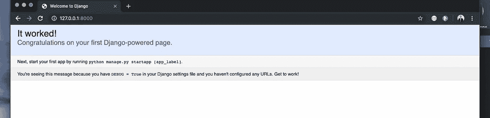
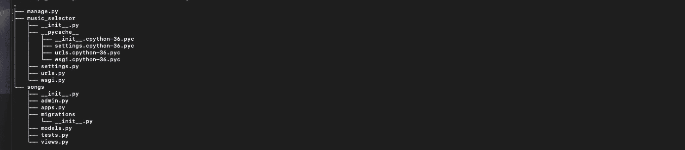
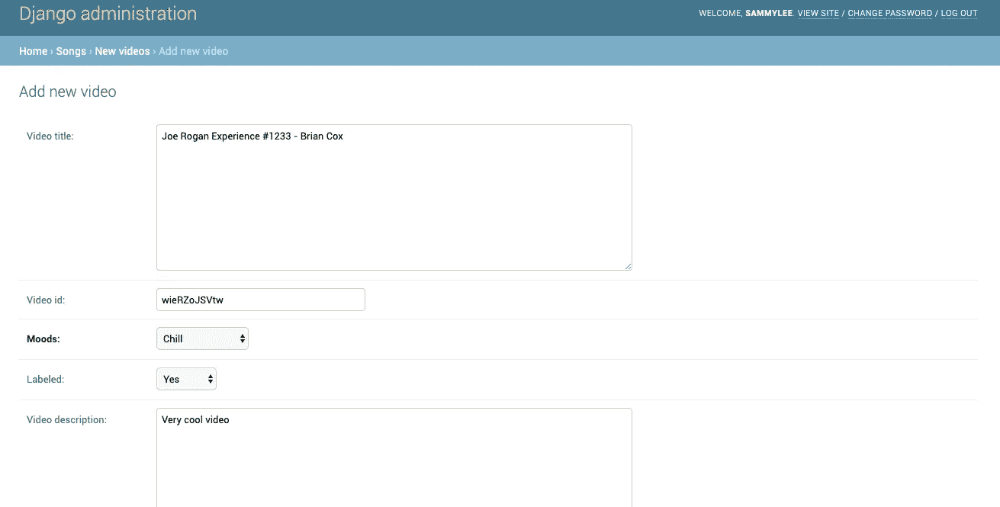
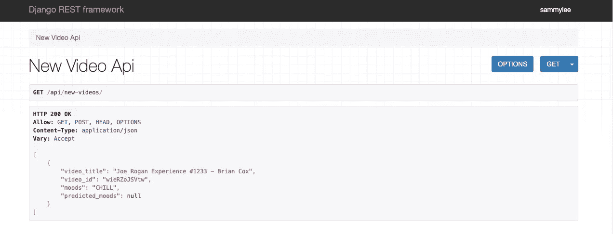
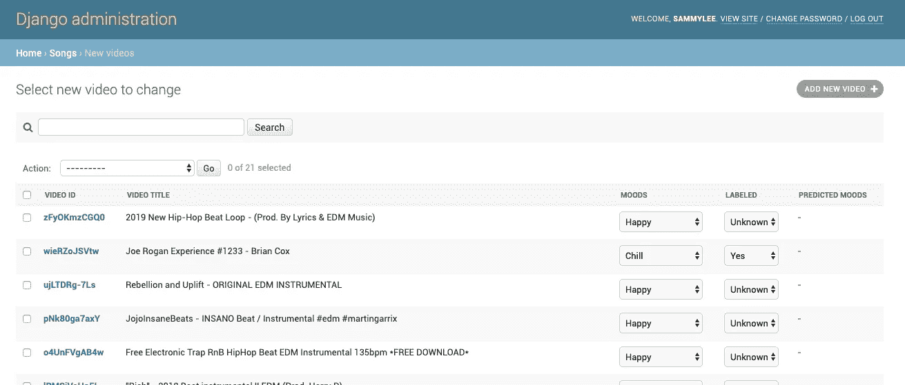
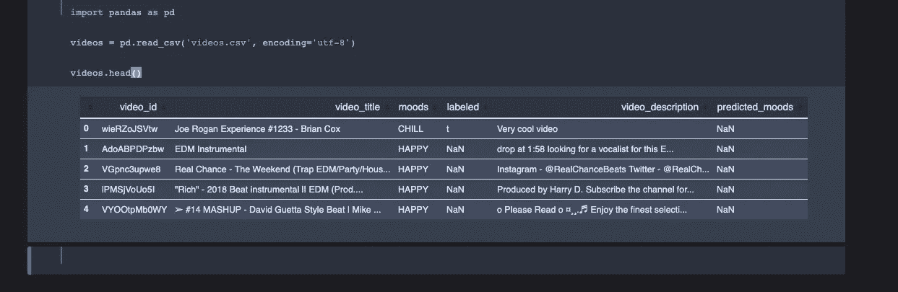
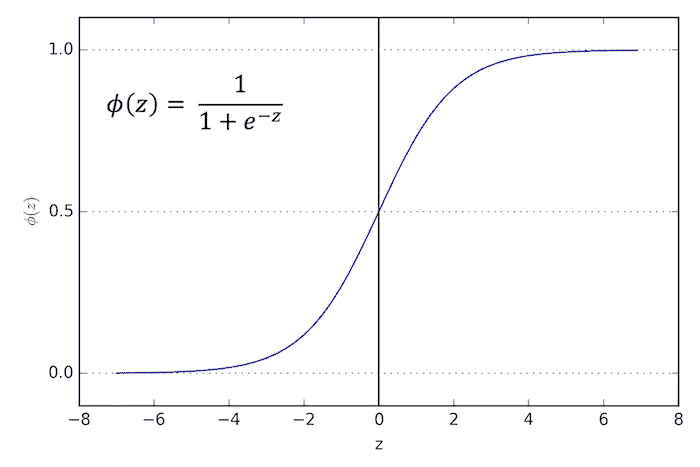

# 如何用 Python 构建基于内容的音乐过滤推荐系统

> 原文：<https://towardsdatascience.com/how-we-built-a-content-based-filtering-recommender-system-for-music-with-python-c6c3b1020332?source=collection_archive---------9----------------------->


背景:这个项目指的是 Lambda School 的 Lambda 实验室，学生们在过去的 5 周时间里构建了生产级的 web 应用程序，其中一些人利用机器学习模型作为他们后端的一部分。我们小组的任务包括开发一个应用程序，根据他们的情绪推荐无版权音乐。我是使用 Python 和 Django 等工具实现后端的数据科学团队的一员。如果你想看成品，去 moodibeats.com 看看，在那里你会找到超过 1000 首无版权音乐的目录——其中一些被你即将在这里看到的机器学习模型标记。

## **第一部分:推荐系统一瞥**

每当我想到推荐系统，我就会想到这部电影:

[高保真](https://en.wikipedia.org/wiki/High_Fidelity_(film))19 年前上映的一部电影，讲的是一个名叫罗布·戈登的唱片店老板，他的员工据说对音乐非常了解，以至于他们实际上阻止顾客购买他们想买的音乐。我提到这一点是因为在我们有网飞、亚马逊和 YouTube 之前，真人是最接近个性化推荐系统的。

知道你喜欢什么并推荐最新 Blink-182 或 Green Day 专辑的唱片店老板，尝过菜单上所有东西并根据你以前吃过的东西确切知道你想要什么的餐馆服务员，或者在街上告诉你去你正在寻找的地方的最快和最容易的方法的随机陌生人——这些都是活生生的推荐系统——并且非常有效。

问题是它们无法扩展。直到有了像谷歌这样的互联网，它才得以扩展。即便如此，直到数据科学的到来及其处理大量数据的能力出现之前，也没有办法有效地评估推荐过程。

推荐系统通常可以分为两种类型:

1.  基于协作的过滤:基于用户相似性提供推荐——使用[kNN](https://en.wikipedia.org/wiki/K-nearest_neighbors_algorithm)(k-最近邻)或[矩阵分解](https://en.wikipedia.org/wiki/Matrix_factorization_(recommender_systems))算法。协同过滤是个性化推荐系统的黄金标准，但你需要大量的用户数据，这就是为什么像 YouTube 和亚马逊这样的应用程序能够如此有效地做到这一点。
2.  基于内容的过滤:基于元数据或你想推荐的东西的特征提供推荐。如果你推荐电影之类的东西，那么你可以使用类型、演员、导演、电影长度等。作为预测你是否喜欢一部电影的输入。

对于 MoodiBeats，由于数据的限制，我们最终选择了基于内容的过滤。

## 第二部分:对 MoodiBeats 起源的一瞥

回到我们的 Lambda Labs 项目，在 [MoodiBeats](http://moodibeats.com) 的规划阶段，我们团队内部有一些相当大的斗争。试图将机器学习集成到尚不存在的 web 应用程序中的一个主要问题是先有鸡还是先有蛋的问题——在没有实际数据的情况下，如何设计数据科学驱动的前端，以及如何为您不太确定其规范的网站获取数据？

最初，数据科学家希望使用现成的 CSV 文件，所以我们花了近两周时间分析了 [last.fm](http://millionsongdataset.com/lastfm/) 数据集和臭名昭著的 [FMA](https://github.com/mdeff/fma/) 数据集。最终，为了避免版权问题和让用户下载歌曲的不可行性，前端团队决定使用 YouTube 的 API 和播放器来播放**无版权音乐**。这迫使数据科学团队完全放弃了在 last.fm 和 FMA 数据集上所做的所有工作，并在项目中途重新专注于尝试从 YouTube v3 API 获取数据。

## 第三部分:让我们构建一个作为 REST API 的准系统 Django 后端

警告 1:我将快速构建一个 Django 后端，只做最少的解释，这样对 Django 没有太多经验但感兴趣的读者可以参考 Medium 或 YouTube 上的无数教程，或者这里的。

警告 2:第三和第四部分必然会很长。但是，要知道我们在这里所做的实际上是建立一个机器学习管道，它将:

*   从 YouTube API v3 自动检索数据
*   运行机器学习模型
*   将 YouTube 数据和机器生成的预测(在这种情况下是情绪)作为 RESTful 端点公开

因此，对于希望收集大量新数据并以世界其他地方可以访问的形式拥有这些数据的数据科学家来说，这是非常重要的，而且可能非常有用。*如果您只关心数据科学部分，请直接跳到第五部分。

在命令行上:

```
"""Working within a virtual environment is highly recommended.  For this project either Conda or Pipenv is sufficient.  I'm using Python 3.6 and Django 1.11.20 and PostgreSQL for this project."""$ mkdir MoodiBeatsAPI && cd MoodiBeatsAPI# psycopg2 is for interfacing with PostgreSQL database
$ pip install Django==1.11.20 psycopg2# don't forget the trailing period
$ django-admin startproject music_selector .
```

现在在你选择的文本编辑器中打开项目文件夹(MoodiBeatsAPI ),现在很多人使用 VS 代码，我仍然使用 Sublime 文本。

Django 将 SQLite3 作为数据库提供，但是我更喜欢使用 PostgreSQL，所以如果您还没有 PostgreSQL，我建议您在系统上安装它。

您的项目结构应该如下所示:

```
.├── manage.py└── music_selector ├── __init__.py ├── settings.py ├── urls.py └── wsgi.py
```

首先创建 PostgreSQL 数据库:

```
$ psql -d postgrespostgres=# CREATE DATABASE moodibeats;# You can verify that the database has been created by running postgres=# \l# And exit
postgres=# \q
```

进入您的 **settings.py** 并进行一些更改:

```
### Change this:DATABASES = {
    'default': {
        'ENGINE': 'django.db.backends.sqlite3',
        'NAME': os.path.join(BASE_DIR, 'db.sqlite3'),
    }
}### To this:DATABASES = {
    'default': {
        'ENGINE': 'django.db.backends.postgresql_psycopg2',
        'NAME': 'moodibeats', # Name of our database
        'USER': 'sammylee', # This would be different for you
        'PASSWORD': '',
        'HOST': 'localhost',
        'PORT': '5432', }
}
```

在命令行上:

```
$ python manage.py migrate
$ python manage.py createsuperuser# Create your credentials$ python manage.py runserver# Go to [http://127.0.0.1:8000/](http://127.0.0.1:8000/) on your web browser
# Append 'admin' at the end of your localhost to gain access to your # Django admin app
```

如果一切顺利，您应该会看到:



现在让我们制作 Django 应用程序，它将是我们项目的主要功能核心。我们在这里所做的就是创建一个数据库来保存我们的数据，并将其公开为一个端点，这样就不再需要 **views.py** 和 **Django 模板系统**了。在命令行上:

```
$ python manage.py startapp songs
```

然后将新的“歌曲”应用添加到 **INSTALLED_APPS** 下的 **settings.py** :

```
INSTALLED_APPS = [
    # ...
    'songs',]
```

您的项目结构现在应该是这样的:



让我们为我们的新歌曲应用程序创建一个数据库表:

**models.py**

```
# songs/models.pyclass NewVideo(models.Model):
   MOOD_CHOICES = (
   ('HAPPY', 'Happy'),
   ('IN-LOVE', 'In-Love'),
   ('SAD', 'Sad'),
   ('CONFIDENT-SASSY', 'Confident-sassy'),
   ('CHILL', 'Chill'),
   ('ANGRY', 'Angry'),
   )
  video_title = models.TextField(db_index=True, null=True,        blank=True)   video_id = models.CharField(max_length=11, null=False, blank=True, primary_key=True) moods = models.CharField(choices=MOOD_CHOICES, max_length=20,  default='HAPPY')

  labeled = models.NullBooleanField() video_description = models.TextField(null=True, blank=True) predicted_moods = models.CharField(max_length=17, null=True, blank=True) def __str__(self):
      return self.video_title
```

你在上面看到的六种情绪[快乐、悲伤、自信、时髦、恋爱、寒冷、愤怒]将是我们的机器学习模型试图预测并最终作为 REST 端点公开的情绪。

这个新的视频模型也是我们为后端保存训练数据的地方。数据将来自一个 python 函数，该函数将对 [YouTube v3 API](https://developers.google.com/youtube/v3/) 进行一系列调用，并自动保存到我们的数据库。

现在在 **admin.py**

```
# songs/admin.pyfrom .models import NewVideoclass NewVideoAdmin(admin.ModelAdmin):
 list_display = [
  'video_id',
  'video_title',
  'moods',
  'labeled',
  'predicted_moods',
]
 search_fields = [
  'video_id',
  'video_title',
  'moods',
 ]
 list_editable = [
  'moods',
  'labeled',
 ]admin.site.register(NewVideo, NewVideoAdmin)
```

然后在命令行上:

```
$ python manage.py makemigrations
$ python manage.py migrate
```

如果你已经走了这么远，拍拍自己的背，我们已经走了一半的路了。

对于那些不熟悉 RESTful web APIs 的人来说，最简单的理解是，这只是后端 web 应用程序将其数据库公开为 JSON 的一种方式。它被认为是软件工程中最重要的发明之一，但是一旦你开始自己实现它们，它就非常容易掌握和使用。

为此，我们需要 Django REST 框架，我们可以将它覆盖在我们的项目之上。

在命令行上:

```
$ pip install djangorestframework==3.8.2# And add to INSTALLED_APPS on settings.py
INSTALLED_APPS = [
    # ... 'rest_framework',
]
```

现在，我们实际上要创建一个单独的“api”应用程序，它将保存我们所有的 API 相关代码:

```
$ python manage.py startapp api
```

在 api 内部，创建一个**serializer . py**文件:

```
# api/serializers.pyfrom rest_framework import serializersfrom songs.models import NewVideoclass NewVideoSerializer(serializers.ModelSerializer):
 class Meta:
  model = NewVideo
  fields = [
   'video_title',
   'video_id',
   'moods',
  ]
```

然后在你的**views . py**API app 里面:

```
# api/views.pyfrom django.shortcuts import renderfrom rest_framework import genericsfrom songs.models import NewVideofrom .serializers import NewVideoSerializer# Create your views here.class NewVideoAPIView(generics.ListCreateAPIView):
 queryset = NewVideo.objects.all()
 serializer_class = NewVideoSerializer
```

现在在 api 应用程序中创建一个 **urls.py** ,并且:

```
# api/urls.pyfrom django.conf.urls import urlfrom .views import NewVideoAPIViewurlpatterns = [
 url(r'^new-videos/$', NewVideoAPIView.as_view()),
]
```

然后在你的 urls.py 里面的项目配置文件夹(music_selector):

```
# music_selector/urls.pyfrom django.conf.urls import url, include
from django.contrib import adminurlpatterns = [
    url(r'^admin/', admin.site.urls),
    url(r'^api/', include('api.urls', namespace='api')),]
```

现在转到 Django 管理员，通过插入一些数据创建一个新的视频对象:



现在运行您的本地服务器，并在浏览器上转到该端点:

```
$ python manage.py runserver# Point your browser to [http://127.0.0.1:8000/api/new-videos/](http://127.0.0.1:8000/api/new-videos/)
```

Django REST 框架最棒的特性之一是它的可浏览 API，如果一切顺利，应该是这样的:



祝贺您——您已经创建了一个 RESTful 端点！

创建这个的重要性在于，我们现在可以以一种方式公开我们的数据，这种方式可以作为 API 被 React-made FrontEnds 之类的东西消费，这正是我们在 MoodiBeats 项目中所做的。

## **第四部分:让我们创建一个训练数据集**

Django 最酷的部分之一是能够创建所谓的管理命令——管理员用户可以在命令行上运行的功能:

```
$ python manage.py do_something
```

对于 MoodiBeats 的数据科学部分，我们需要一个从 YouTube API 获取数据并填充数据库的函数。为了做到这一点，我们在 Django 中创建了一个管理命令来获取 video_id 和 video_title，并在我们的 Heroku 服务器上设置了一个名为 Heroku Scheduler 的东西，每 24 小时运行一次相同的功能——有效地创建了所谓的 *Cron 作业*。

为此，您必须完成以下步骤:

1.  在歌曲应用程序中创建一个名为**管理**的文件夹
2.  在管理内部创建一个名为 **__init__ 的文件。py**
3.  同样在管理内部创建另一个名为**命令**的文件夹
4.  然后在命令内部创建另一个名为 **__init__ 的文件。py**
5.  最后，在命令内部，创建一个名为 **get_new_videos.py** 的文件
6.  给自己弄一个 [YouTube v3 API 密匙](https://developers.google.com/youtube/v3/getting-started)
7.  $ pip 安装 python-dotenv

如果您确实想要运行这个管理命令，请确保您已经安装了 python-dotenv。然后在您的顶层目录中，创建一个名为**的文件。env** 你想在这里存储 SECRET_KEY 或者 YouTube API Key 之类的东西，然后添加。env 到你的。gitignore 文件。如果你想把你的项目提交给 GitHub Repo，你需要做这些事情。

**记住，永远不要把 API 密匙之类的东西或者任何私人的东西放到你的 GitHub Repo 或者任何公共场所。如果你这么做了，你就冒着非常糟糕的事情从非常糟糕的人那里发生的风险。**

**get_new_videos.py**

```
# Credit goes to my data science teammate John Humphreys. for writing 
# this functionfrom django.core.management.base import BaseCommandfrom googleapiclient.discovery import build
from dotenv import load_dotenv
import osimport jsonfrom songs.models import NewVideoload_dotenv()def html_reverse_escape(string):
    '''Reverse escapes HTML code in string into ASCII text.'''
    # see Ned Batchelder post [https://stackoverflow.com/questions/2077283/escape-special-html-characters-in-python](https://stackoverflow.com/questions/2077283/escape-special-html-characters-in-python)
    return (string \
        .replace("&amp;", "&").replace("&#39;", "'").replace("&quot;", '"'))def search_api():
    '''Searches YouTube Data API v3 for videos based on project-specified parameters; returns list of videos.'''
    api_service_name = 'youtube'
    api_version = 'v3'
    DEVELOPER_KEY = os.getenv('DEVELOPER_KEY')youtube = build(api_service_name, api_version,
                    developerKey = DEVELOPER_KEY)request = youtube.search().list(
        part='id,snippet',
        maxResults=20,
        q='instrumental edm',
        relevanceLanguage='en',
        type='video',
        videoDuration='medium',
        videoLicense='creativeCommon',
        videoSyndicated='true',
    ).execute()videos = []
result_count = 0for search_result in request['items']:
        video_title = search_result['snippet']['title']
        video_title = html_reverse_escape(video_title)
        video_id = search_result['id']['videoId']
        video_description = search_result['snippet']['description'] try:
            new_videos = NewVideo(video_id=video_id,      video_title=video_title, video_description=video_description, predicted_moods=predicted_moods)new_videos.save()
        except:
            passclass Command(BaseCommand):
    def handle(self, *args, **options):
        print("Pulling data from YouTube API and saving")
        search_api()
```

如果您研究一下这个函数，它被设置为从 YouTube API 检索最多 20 个结果。我们特意将`q`设置为“乐器 edm ”,将`videoLicense`设置为“creativeCommons ”,因为我们只想要没有版权的音乐视频。

让我们运行命令

```
$ python manage.py get_new_videos
```

现在运行你的本地 Django 服务器，回到你的管理员那里。

您应该会看到类似这样的内容:



如果您单击 video_id 进入详细视图，您应该会在 description 字段中看到视频描述。

在大约 7 天的时间里用不同的查询参数做这件事，最终给了我们一个超过 1000 首歌曲的数据库。

在我们进入项目的数据科学部分之前，为了完成一个训练集，你需要做的是给你的数据贴上标签。这对我来说是一个突然的觉醒，因为我最终给 800 多个 YouTube 视频贴上了“正确”情绪的标签。

我给数据科学学生的建议是:不要习惯 UCI 数据仓库。

## 第五部分:数据科学时代的到来

我们将使用数据科学工具，因此请确保您的虚拟环境中安装了 Conda(我建议使用 miniconda)、Jupyter、Pandas 和 Scikit-Learn 等工具。

现在我们终于有了数据，是时候将它们转换成我们开始时期望的整洁的小 CSV 文件了。

我们将连接到 postgreSQL 数据库，查看一下表模式，然后运行一个简单的复制命令，复制到桌面上我创建的名为 CSV 的文件夹中。

```
$ psql -d postgrespostgres=# \c moodibeats;moodibeats=# \dtmoodibeats=# SELECT * FROM songs_newvideo LIMIT 5;\copy songs_newvideo(video_id,video_title,moods,labeled,video_description,predicted_moods) TO '/Users/sammylee/desktop/CSV/videos.csv' DELIMITER ',' CSV HEADER;
```

现在启动你的 Jupyter 笔记本，导入熊猫，看看数据:

```
# In the same directory which contains your 'videos.csv' file
$ jupyter notebook
```

然后

```
import pandasvideos = pd.read_csv('videos.csv', encoding='utf-8')video.head()
```



当然，在我的例子中，我们有更多的数据，其中大多数都有标签，但这正是我们想要的。

让我们回顾一下迄今为止我们所取得的成就:

1.  我们构建了我们的问题(基于内容的过滤)，并制定了一个计划来为数据科学构建 Django 后端，供 React 前端使用。
2.  然后，我们使用 Django REST 框架构建了后端
3.  利用 YouTube v3 API 检索数据

我们已经有效地为 MoodiBeats 的数据科学部分创建了一个第一通道的迷你管道。

我们还需要记住，我们使用文本数据进行分析，这意味着我们需要使用不同的工具来进行机器学习。

这些不同工具中最重要的是单词袋模型，它允许我们将文本表示为数字向量。单词袋模型基本上是一个两步过程，首先是 [**对文本文档**](https://nlp.stanford.edu/IR-book/html/htmledition/tokenization-1.html) 进行标记，然后将它们转换为字数的特征向量。

例如

```
"""This is taken straight out of Sebastian Raschka & Vahid Mirjalili's Python Machine Learning 2nd Edition, and in fact this project owes a debt of gratitude to their chapter 8 on Sentiment Analysis"""import numpy as np
from sklearn.feature_extraction.text import CountVectorizer
count = CountVectorizer()
docs = np.array([
    'The sun is shining',
    'The weather is sweet',
    'The sun is shining and the weather is sweet'])
bag = count.fit_transform(docs)# print out the vocabulary of our bag-of-words:
print(count.vocaulary_)
```

这将返回包含唯一单词及其索引位置的 Python 字典:

```
{'the': 5, 'sun': 3, 'is': 1, 'shining': 2, 'weather': 6, 'sweet': 4, 'and': 0}
```

此外，我们可以看到单词袋模型为我们创建的特征向量:

```
print(bag.toarray())# Returns
[[0 1 1 1 0 1 0]
 [0 1 0 0 1 1 1]
 [1 2 1 1 1 2 1]]
```

此数组的第一列[0，0，1]位于索引位置 0，表示单词“and”，它只出现在第三个句子中，因此为[0，0，1]。第二列[1，1，2]代表‘是’，我们可以看到‘是’在前两句出现一次，在最后一句出现两次。

我们需要的第二个工具是实际的机器学习算法。对于 MoodiBeats，我们选择了一个逻辑回归分类器。



Sigmoid function for Logistic regression

我们本质上正在做的是通过获取关于 YouTube 音乐视频的元数据(在这种情况下是文本形式的视频描述)并使用它来预测视频本身的情绪，来建立一个非个性化的基于内容的过滤推荐系统。逻辑回归试图根据样本的概率函数对样本进行分类，概率函数是一种称为 sigmoid 函数的 S 形函数。阈值设置为 0.5，超过该阈值的概率被分类为 1，低于该阈值的概率被分类为 0。在视频描述的数字表示上使用这种方法允许我们找到情绪的概率，并选择概率最高的一个作为我们的预测( [One-vs-Rest method](https://stats.stackexchange.com/questions/167623/understanding-the-one-vs-the-rest-classifier) )。

另一个重要的考虑是，当处理文本数据时，几乎总是会处理脏数据 HMTL、表情符号、标点符号等。我们还将编写一个函数来预处理脏数据。因此，在这里，我们将文本清理和文本标记化结合起来，为我们提供数据，然后我们可以在这些数据上运行逻辑回归分类器。

```
"""A simple text cleaning function borrowed from Sebastian Rachska""" import refrom nltk.corpus import stopwordsstop = stopwords.words('english')def tokenizer(text):
    text = re.sub('<[^>]*>', '', str(text))
    emoticons = re.findall('(?::|;|=)(?:-)?(?:\)|\(|D|P)', text.lower())
    text = re.sub('[\W]+', ' ', text.lower()) +\
        ' '.join(emoticons).replace('-', '')
    tokenized = [w for w in text.split() if w not in stop]
    return tokenized
```

实际训练之前的下一步是对我们的目标变量进行编码，也就是说将我们的情绪(快乐、自信、时髦、悲伤、愤怒、寒冷、恋爱)转化为我们的算法可以使用的数字。

**在这里，我们假设你已经在 Django admin 中浏览了你的数据，观看了所有的 YouTube 音乐视频，并在将它们发送到熊猫数据帧作为训练数据进行分析之前正确地标记了它们。**

```
from sklearn import preprocessingle = preprocessing.LabelEncoder()videos['moods_enc'] = le.fit_transform(videos['moods'])
df.head()
```

以下是我们最终培训的核心内容:

```
from sklearn.feature_extraction.text import HashingVectorizer
from sklearn.model_selection import GridSearchCV
from sklearn.linear_model import LogisticRegressionvect = HashingVectorizer(decode_error='ignore',
                        n_features=2**21,
                        preprocessor=None,
                        tokenizer=tokenizer)param_grid = {'C': [0.001, 0.01, 0.1, 1, 10, 100]}lr = LogisticRegression()grid_search = GridSearchCV(lr, param_grid, cv=5)X_train = vect.transform(X_train.tolist())grid_search.fit(X_train, y_train)X_test = vect.transform(X_test)print('Test set accuracy: {:.3f}'.format(grid_search.score(X_test, y_test)))print("Best parameters: {}".format(grid_search.best_params_))print("Best cross-validation score: {:.2f}".format(grid_search.best_score_))
```

在我们更大的 YouTube API 数据集上训练这个模型给了我们:

```
Test set accuracy: 0.368
Best parameters: {'C': 10}
Best cross-validation score: 0.42
```

虽然这些结果不是很好，但由于我们的项目处于功能冻结状态，我们基本上没有时间收集更多的数据并重新训练我们的模型。事实上，在我写这些文字的时候，离我们向全校做报告只有一个小时了。

下一个挑战是将模型投入生产。

我们所做的是通过在 Django 应用程序中插入我们训练过的模型来自动化这个过程，以作为管理命令运行:

```
$ python manage.py get_new_videos
```

您可以在生产中的 Heroku 调度程序上将该函数设置为 Cron 作业，以便在调用 YouTube API 的同时自动运行您的预测。为了简洁起见，我将跳过这一部分，但是如果你想了解它，请在评论中告诉我。

## 第六部分:经验教训

看看这首歌

An awesome band I discovered as a freshman in college

如果我要求把这归类为我们的六种情绪之一:

```
[HAPPY, CHILL, CONFIDENT-SASSY, SAD, ANGRY, IN-LOVE]
```

我敢肯定，你们大多数人会回答说，这首歌清楚地表达了愤怒，达到了愤怒的程度。

但是如果我给你这样的东西呢:

这是怎么回事？

普通观众水平的歌曲有两个维度(歌曲、歌词)，但音乐视频有三个维度(歌曲、歌词、视觉)。

乍一听，这首歌听起来很冷。视觉效果有点傻(看看所有关于小预算和绿色屏幕的评论)。

现在来看看这首歌的一些歌词:

```
[Verse 1: Ed Sheeran]
I’m at a party I don’t wanna be at
And I don’t ever wear a suit and tie, yeah
Wonderin’ if I could sneak out the back
Nobody’s even lookin’ me in my eyes
Can you take my hand?
Finish my drink, say, “Shall we dance?” (Hell, yeah)
You know I love ya, did I ever tell ya?
You make it better like that[Pre-Chorus: Ed Sheeran]
Don’t think I fit in at this party
Everyone’s got so much to say (Yeah)
I always feel like I’m nobody, mmm
Who wants to fit in anyway?[Chorus: Ed Sheeran]
‘Cause I don’t care when I’m with my baby, yeah
All the bad things disappear
And you’re making me feel like maybe I am somebody
I can deal with the bad nights
When I’m with my baby, yeah
Ooh, ooh, ooh, ooh, ooh, ooh
‘Cause I don’t care as long as you just hold me near
You can take me anywhere
And you’re making me feel like I’m loved by somebody
I can deal with the bad nights
When I’m with my baby, yeah
Ooh, ooh, ooh, ooh, ooh, ooh[Verse 2: Justin Bieber]
We at a party we don’t wanna be at
Tryna talk, but we can’t hear ourselves
Press your lips, I’d rather kiss ’em right back
With all these people all around
I’m crippled with anxiety
But I’m told it’s where we’re s’posed to be
You know what? It’s kinda crazy ’cause I really don’t mind
And you make it better like that[Pre-Chorus: Justin Bieber]
Don’t think we fit in at this party
Everyone’s got so much to say, oh yeah, yeah
When we walked in, I said I’m sorry, mmm
But now I think that we should stay
```

这首歌真的很寒意吗？难过？或者甚至是恋爱中？

你如何让一台机器学习像恋爱这样复杂的情感？爱情是人类情感的那不勒斯冰淇淋。有一种幸福的爱情，一切都很顺利，两个人都无法忍受彼此分离。有一种单相思，只有一个人感受到它的情感。甚至有一种爱是为结婚很久的夫妇保留的，在那里事情不是疯狂的，而是稳定的。

情绪是超级主观的，因此对于机器来说是一个超级难解决的问题。但是非常有趣。

## 第七部分:致谢

我要感谢我在 Lambda 学校 MoodiBeats 项目中的队友:

Jonathan Bernal、John Humphreys、史云光 Jake de los Santos、医学博士 Kawsar Hussen、Logan Hufstetler、Davina Taylor 和我们的项目经理 Kevin Brack。

搭建 MoodiBeats 是我在 Lambda 学校经历的最好、最有趣的经历之一。我们的团队太棒了，我不会忘记这次经历。

这篇文章的代码在这里:

[](https://github.com/Captmoonshot/moodibeats_api_medium) [## captmoonshot/moodibeats _ API _ medium

### 对于中等职位。在 GitHub 上创建一个帐号，为 Captmoonshot/moodibeats _ API _ medium 开发做贡献。

github.com](https://github.com/Captmoonshot/moodibeats_api_medium)