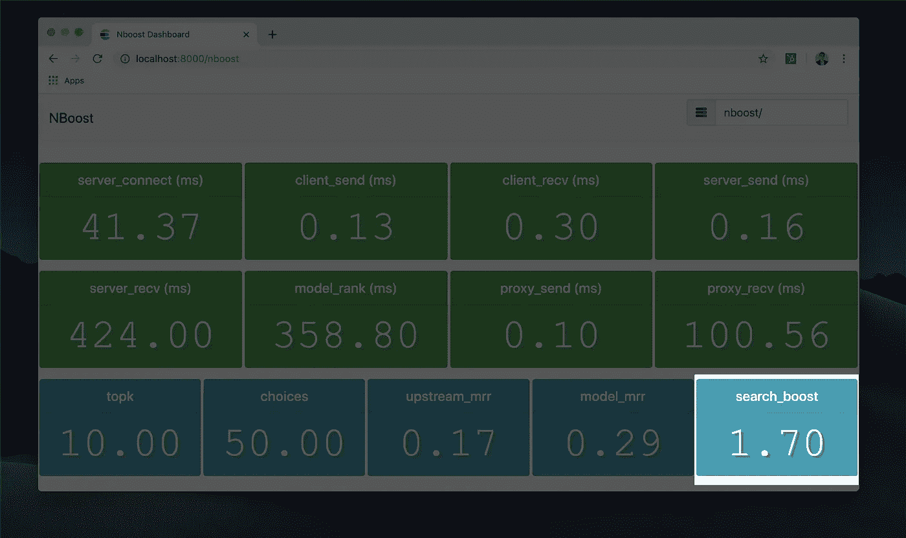

# 我们如何建立一个人工智能驱动的搜索引擎(而不是谷歌)

> 原文：<https://towardsdatascience.com/how-we-built-an-ai-powered-search-engine-without-being-google-5ad93e5a8591?source=collection_archive---------7----------------------->

## 你也可以！

由 [Jack Pertschuk](https://medium.com/u/a97c68c557df?source=post_page-----5ad93e5a8591--------------------------------) 合著，看看我们的 [Github](https://github.com/koursaros-ai/nboost)

在这篇文章中，我将讲述创建一个通用的人工智能搜索引擎的困难，以及我们如何开发我们的解决方案， [NBoost](https://github.com/koursaros-ai/nboost#benchmarks) 。

# 爆炸场

人工智能信息检索是一个蓬勃发展的研究领域。该领域的研究集中在基于搜索结果的含义而不仅仅是关键词来检索最相关的搜索结果。前沿研究通常涉及利用现有的深度神经网络(如谷歌的 BERT)，并训练它们对搜索结果进行排名。然而，问题是大量的(我将在下面谈到)。建立一个健壮的、可扩展的语义搜索引擎不是一件容易的事，所以谷歌赚这么多钱也就不足为奇了。

# 跨栏

1.  **很难击败现有的解决方案。现有的搜索引擎如 Elasticsearch 利用文本匹配算法，如[最佳匹配 25](https://en.wikipedia.org/wiki/Okapi_BM25) 。这些算法通过计算词频和其他单词模式来工作。它们实际上工作得非常好。因此，他们很难被打败。**
2.  **即使你击败了现有的解决方案，也很难一概而论。**机器学习中经常遇到的一个问题是，在一个特定的任务上训练一个模型太多，以至于它不能对一个新的任务得出结论。这被称为[过拟合](https://en.wikipedia.org/wiki/Overfitting)。即使你的模型对研究文章的搜索结果比基于文本的搜索引擎更好，那也不意味着它对烹饪食谱的搜索效果也一样好。
3.  最先进的(SoTA)模型通常速度缓慢且不可扩展。即使你已经有了既能击败文本匹配算法，又能在许多不同领域工作的完美模型，在生产中使用起来可能还是太慢了。通常，SoTA 模型(如 BERT)必须在特殊的硬件(GPU)上运行，以适应生产工作负载。这种硬件在计算上是昂贵的(因此在财政上也是如此)。要建立一个对数百万文档进行排序的搜索引擎，不能只告诉一个大模型对每一个搜索结果进行逐一排序。

# 我们是如何做到的

正如我之前提到的，有大量的研究正在研究机器学习在搜索引擎中的意义。这意味着研究人员正在竞争赢得信息检索基准上的头名，如[马可女士](http://www.msmarco.org/leaders.aspx)。与现有的搜索引擎相比，其中一些模式[的搜索结果质量提高了一倍多。我们使用这些模型，从中学习，并创建了我们自己的模型(使用](https://arxiv.org/abs/1910.14424)[顶级基准](https://github.com/koursaros-ai/nboost#benchmarks))。这就是**我们击败现有解决方案**的方式。

我们意识到，如果我们不能扩大规模，这些都没有多大用处。这就是我们构建 [NBoost](https://github.com/koursaros-ai/nboost#benchmarks) 的原因。当你部署 [NBoost](https://github.com/koursaros-ai/nboost) 时，你部署了一个位于用户和搜索引擎之间的前沿模型，一种[代理](https://en.wikipedia.org/wiki/Proxy_server)。每次用户查询搜索引擎时，模型都会对搜索结果进行重新排序，并将最佳结果返回给用户。我们还内置了对将 [NBoost](https://github.com/koursaros-ai/nboost) 部署到云的支持，并通过 [Kubernetes 引擎](https://en.wikipedia.org/wiki/Kubernetes)根据需要扩展到任意数量的计算机。这个**解决了可扩展性问题**。

从一开始，我们就想创建一个平台，为特定领域的 T2 搜索引擎奠定基础。因此，我们需要确保 [NBoost](https://github.com/koursaros-ai/nboost) 具有足够的通用性，能够应用于知识领域内的不同应用程序/数据集。默认模型在数百万个 bing 查询上被训练。我们发现，与现成的弹性搜索相比，我们的默认模型将搜索结果**的相关性提高了 80%。为了测试该模型在不同语料库上的可推广性，我们在维基百科查询([TREC·卡尔](http://trec-car.cs.unh.edu/))上测试了它，这是一个它以前从未见过的数据集。当前端显示默认模型在不同的数据集上将搜索结果提升了 70%时，这是一个惊喜。**

您可以在此复制我们的结果[。](https://nboost.readthedocs.io/en/latest/chapter/benchmarking.html)

# 你也可以！

当我们在构建 [NBoost](https://github.com/koursaros-ai/nboost) 的时候，我们尽力让我们的工具开源并易于使用。我们通过 pip、Docker 和 Helm (Kubernetes)提供它。我们的模型托管在 Google Buckets 上，当您通过`nboost --model_dir <model>`运行 NBoost 时会自动安装。您可以在我们的[基准表](https://github.com/koursaros-ai/nboost#benchmarks)中找到可用型号列表。

你可以按照[我们的教程](https://github.com/koursaros-ai/nboost#getting-started)来创建你自己的人工智能搜索引擎！