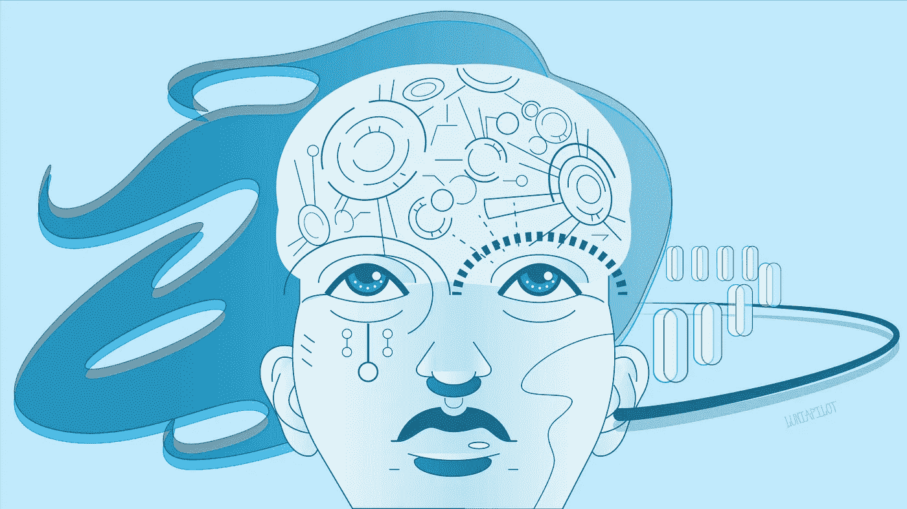
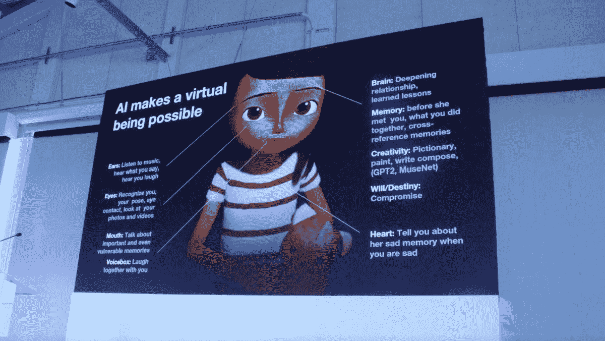
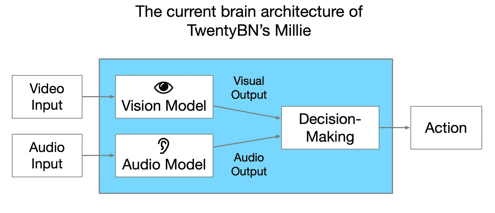
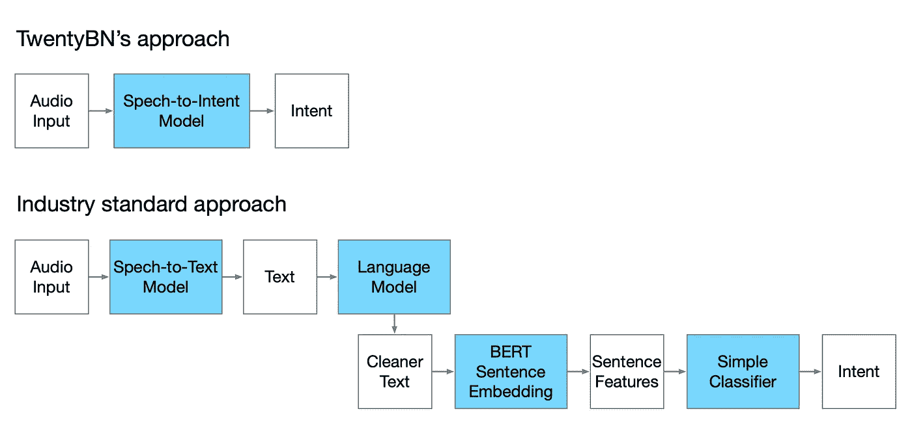
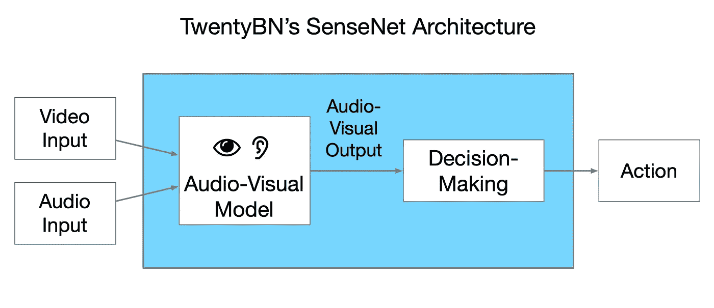

# 我们如何用深度学习构建虚拟人的大脑

> 原文：<https://towardsdatascience.com/how-we-construct-a-virtual-beings-brain-with-deep-learning-8f8e5eafe3a9?source=collection_archive---------18----------------------->

## 3 个视频演示，展示了 TwentyBN 用于人类行为理解的深度学习技术

A trip inside a virtual being’s brain (Illustrated by [**Luniapilot**](http://www.luniapilot.com/))

这篇博文是由 [**TwentyBN**](http://www.embodiedai.co/) 撰写的来自 [**Embodied AI**](http://www.embodiedai.co/) **，**你的关于 AI 化身和虚拟存在背后的最新新闻和技术的双周刊。不要错过👉 [**订阅此处**](http://www.embodiedai.co/) 。

下面这张照片是 VentureBeat 的[院长高桥](https://twitter.com/deantak)两周前在首届[虚拟存在峰会](https://www.virtual-beings.com)上拍摄的，它充分说明了这篇博文:“ ***人工智能使虚拟存在成为可能*** ”。在过去的几周里，我们的几位读者联系了我们，希望了解更多关于 TwentyBN 的人工智能化身 [**米莉**](https://vimeo.com/319436933) 背后的智能。

“AI makes a virtual being possible” (Credit: Dean Takahashi @ Virtual Beings Summit)

因此，我们很高兴带你去 TwentyBN 的人工智能化身米莉的大脑深处旅行。请务必观看下面的 3 个视频演示👇

# **人工智能化身的大脑**

Millie 的大脑由深度学习模型驱动，该模型在 TwentyBN 收集的超过 300 万个专有视频数据上进行训练。由于我们的座右铭是教会机器像人类一样感知世界，米莉的大脑有两个主要组成部分，一个视觉模型和一个音频模型，类似于我们的大脑如何处理我们每天经历的视觉和声音。

## 视觉模型:理解人类行为

我们的视觉模型是经典的基于图像的对象检测器到视频的扩展。类似于典型的对象检测器，如 [YOLOv3](https://pjreddie.com/media/files/papers/YOLOv3.pdf) ，我们的视觉模型同时进行定位和分类:它通过在对象周围放置边界框来检测对象，并识别每个边界框的对象类型(如面部、身体等)。).

与基于图像的检测器不同，我们的模型还理解每个对象正在执行的动作。这意味着它不仅可以检测和区分人脸和人体，还可以确定，例如，一张脸是“微笑”还是“说话”，或者一个身体是“跳跃”还是“跳舞”。这是通过在视频数据而不是静态图像上训练我们的模型来实现的。

与只处理二维图像的图像检测器相比，我们的模型可以处理时间维度。在架构方面，我们通过使用 3D 卷积层而不是 2D 卷积层来实现这一点，这使得神经网络能够提取识别每个对象执行的动作所需的相关运动特征。

这种端到端的方法为我们分析和理解人类行为提供了一个非常有效的工具。总之，我们的模型经过训练，可以检测超过 1，100 种人类活动和手势。我们试验的另一种方法包括将定位和分类分成两个独立的子任务:首先，我们提取包围盒，并使用对象检测器在每个对象周围进行裁剪；然后，我们使用第二个动作识别模型对每个作物中执行的动作进行分类。

我们的经验告诉我们，端到端方法比这种两步方法有几个好处:

*   **简单**:只需要维护一个深度学习模型。
*   **多任务/转移学习**:同时解决两个任务应该会让模型在每个单独的任务上做得更好。
*   **全知**:动作的识别不限于场景中的一个人；该模型知道同时发生的所有动作。
*   恒定复杂度:场景中有多少人并不重要。多人识别和动作分类所需的计算和一个人一样高效。
*   **速度**:同时识别和分类人体动作，节省推理时间。这使得在 iPad Pro 等边缘设备上实时运行视觉模型成为可能。

## 音频模型:语音到意图

以前依赖于云解决方案，现在我们有自己的边缘音频模型，不仅可以理解人们做什么，还可以理解他们说什么。与典型而复杂的管道(见下图)不同，我们受到人类处理语音的启发，选择了最直接和端到端的方法:*语音到意图*。在这种方法中，一个人不需要听和抄写每个单词来理解另一个人的意思。已经探索了各种语音到意图的方法(例如[这个](https://arxiv.org/pdf/1904.03670.pdf))。类似于 [Jasper](https://arxiv.org/pdf/1904.03288.pdf) 模型，我们模型的架构是完全卷积的。

TwentyBN 的首席执行官 Roland 喜欢语音到意图的方法:

> “我们是一家捕捉意图的公司，所以直奔人类意图是我们 TwentyBN 的工作方式。通过为我们的人工智能化身开发内部音频功能，我们只是将我们在视频理解方面的成功转移到语音识别上。这一切之所以成为可能，要归功于我们建立的全球最大的[群体行动平台](https://20bn.com/products/datasets)，它让我们能够快速获取大规模的基于意图的数据。”

3 语音转意图方法的优势包括:

*   **鲁棒性:**在我们对不同语音识别方法的实验中，语音到意图最终对噪声、口音和人们单词发音的变化更加鲁棒。
*   **轻量级:**神经网络可以轻松地在小型嵌入式设备上实时运行，如平板电脑和智能手机。
*   **反应性:**与使用云解决方案相比，在本地运行音频模型大大减少了延迟，显著改善了与 Millie 等人工智能化身的交互和整体用户体验。

# 走向 SenseNet:一个视听模型

就在我们说话的时候，TwentyBN 的研究人员和工程师正在研究一种新的深度学习模型，称为 **SenseNet** ，它将我们的视觉和音频模型融合成一个单一的视听模型，用于意图分类。

SenseNet 在将虚拟生物从高度受限的环境带到“野外”方面至关重要(想象一下在拥挤的超市里看到 Alexa)。人工智能就像人类一样，需要依赖视觉线索，这些线索可以揭示话语的来源或场景的背景。融合视觉和音频是在混乱环境中实现高意图分类准确性的必要步骤。

我们希望你喜欢这次在虚拟人大脑中的旅行。如果您有任何意见或问题，请告诉我们。确保你和你的朋友分享这篇文章🙌并且 s **订阅在**下面👇

 [## 人工智能化身时事通讯

### 具体化的人工智能是权威的人工智能化身时事通讯。报名参加最新新闻、技术…

www.embodiedai.co](http://www.embodiedai.co/) 

*写的是* [*纪尧姆*](https://twitter.com/GuillaumeBrgr) *和* [*那华*](https://twitter.com/nahuakang) *。编辑* [*罗兰*](https://twitter.com/RolandMemisevic) ， [*大卫*](https://twitter.com/david_greenberg) *，* [*安托万*](https://www.linkedin.com/in/merciera/) *，以及* [*莫里茨*](https://twitter.com/muellerfreitag) *。插图由* [*氹欞侊*](http://www.luniapilot.com/) *绘制。*