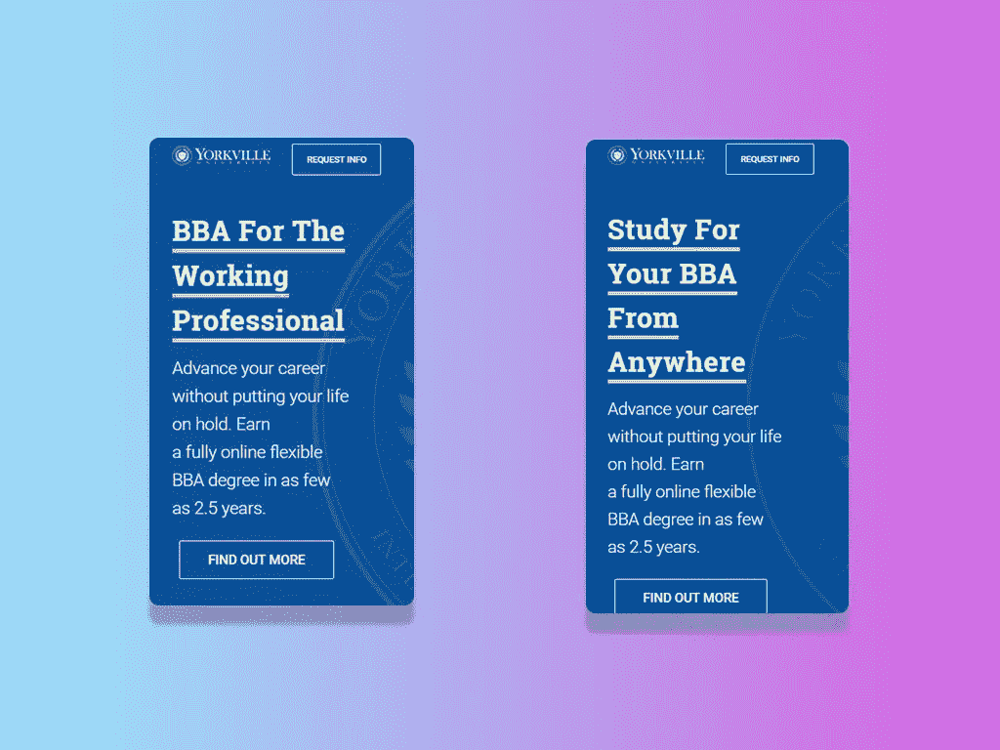
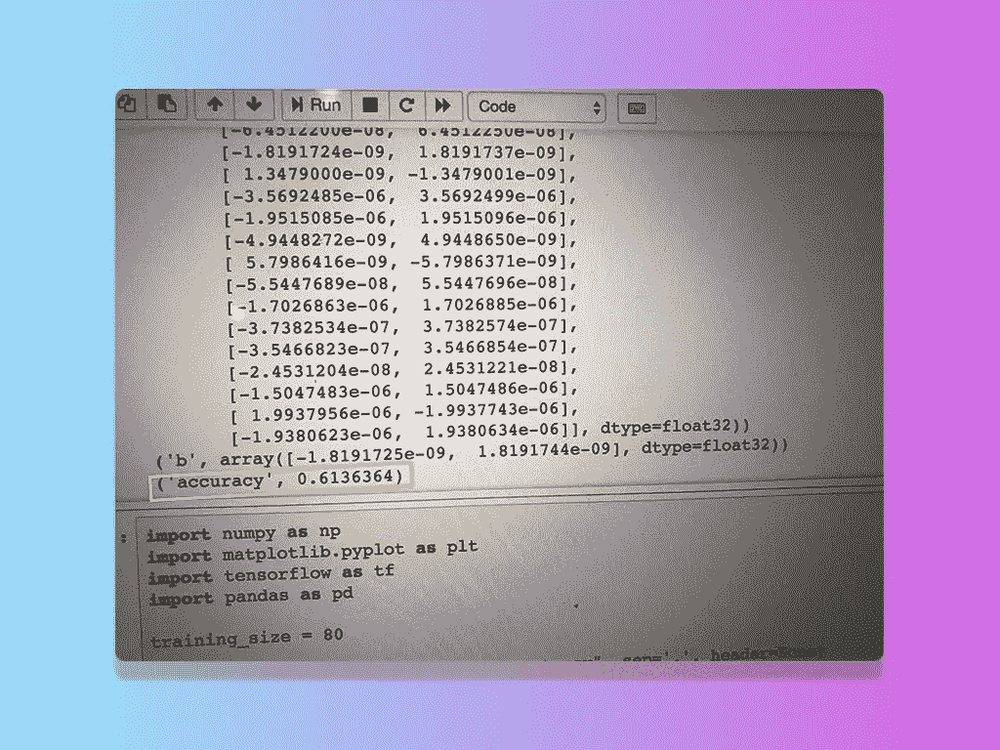

# 我们如何为机器学习抛弃 A/B 测试

> 原文：<https://towardsdatascience.com/how-we-dumped-a-b-testing-for-machine-learning-2b44632ba9df?source=collection_archive---------11----------------------->

我之前的工作是 A/B 测试员。我们将成千上万的访问者从付费渠道吸引到我们的网站，所以自然地，我们希望通过优化我们的转化率来确保我们的广告支出得到最大的回报。每隔一周，我会启动新的测试并分析之前测试的结果。

有一次，当我正在为我们的一个文凭网站(我在一所私立大学工作)完成一个页眉图像测试时，我决定做一个简单的实验:我让我的同事根据他们的表现对页眉图像的变体进行排名——旨在将我队友的猜测与实际结果进行比较。至少可以说，这个结果是令人惊讶的。

他们的猜测大错特错。这并不罕见；A/B 测试意在引出顾客想要的和营销人员认为顾客想要的之间的差异。但我的一些队友是那个文凭项目的毕业生，这使他们成为我们的目标市场。他们对统计上表现最差的标题图像的强烈偏好让我想到:也许在 A/B 测试的设计中有一个根本性的缺陷。

让我来举例说明:假设你决定 A/B 测试你的标题。

在变体 A 和变体 B 之间平分网站流量后，你意识到 70%的总转化发生在变体 A 上，30%的转化来自变体 B。

根据 A/B 测试的方法——你会得出结论，与变体 B 相比，变体 A 表现出更好的性能——因此它应该成为默认标题。

这就是错误所在:绝对不能保证在变体 B 上转化的人也会在变体 a 上转化。也许变体 B 的标题与你的目标市场的子集产生了共鸣，这是总转化的 30%。如果你决定选择变式 A，你可能最终会疏远那些喜欢变式 B 的人——从而损害你的整体转化率。

由于我的人工智能创业经验，我对 Tensorflow 有一些初步的了解，它似乎是解决这个问题的完美工具。目标是在页面呈现之前预测用户最有可能转换的标题。收集数据和做出预测的时间限制迫使我依赖客户端的特性列表。使用免费服务，我能够找到访客的真实 IP 地址，并随后找到他们来自的城市。另一个 API 调用给了我他们城市当前的天气情况。

我必须给浏览器、操作系统和城市名称分配一个数字 id，因为机器学习模型使用统计数据，这使它们无法消化单词。由于世界上城市的数量太多，我将 ML 实验的范围限制在加拿大——即使在那时，也有数百个城市需要标记，它本身就成了一个迷你项目。

最后，我们用以下特征来训练我们的模型:

时区—浏览器名称—操作系统名称—浏览器的默认语言—启用 cookie 启用 java 屏幕宽度—屏幕高度—屏幕颜色深度—一周中的某一天—一天中的某一小时—城市—一天中的最低预测温度—一天中的最高预测温度—风速—风向—能见度—大气压

为了找出标题的变化，我们调查了“前线”的同事:招生顾问。本质上，我们不只是试图预测最好的标题，我们试图猜测潜在客户的意图，在我看来，没有人比你的销售团队更了解这一点。

调查显示，我们的大多数学生属于两大类:

1.  想要在事业上出人头地的职场人士。
2.  想要享受从任何地方学习的自由的年轻人。

为了迎合这两个类别，我们创建了以下两个网站标题:

1.  职业人士的 BBA
2.  从任何地方为你的 BBA 学习

The two variants

现在，随着我们的功能集和标题变化锁定，是时候收集数据了。计划是运行每个标题，直到我们有 100 个数据点。由于[登录页面是使用 Vue.js 框架](https://medium.com/@sarimhaq/why-landing-page-management-sucks-and-how-google-sheets-came-to-the-rescue-459c9073dbdf)构建的，让页面收集数据并在稍后阶段进行实时预测相对容易。

我们花了四周的时间来收集数据——我们让每个标题运行了大约两周，并收集了在这些标题上转化的访问者的属性。在那段时间里，我编写了管道代码来进行预测，并重新训练模型。为了简单起见，我使用了 Softmax 回归机器学习模型。

当每个标题有 100 个数据点时，就该训练 ML 模型了。我有一个坦白:理想情况下，在这个阶段，我应该执行一些被称为特征工程的东西，在那里你找出无关紧要的特征，并组合显示出强相关性的特征。但是由于我急于尽快得到解决方案，我将特性工程推迟到以后。

训练模型的第一遍只给了我们 52%的准确率——仍然优于抛硬币，但我们必须做得更好，ML 模型才是可行的。对超参数的修改将准确率提高到了 67%——不是最佳的，但我们用 160 个数据点(40 个数据点用于测试)训练模型，我们不可能指望性能比这更好。随着时间的推移，通过不断的再训练，准确率有望提高。

Adjusting hyper-parameters to improve the accuracy

在我们部署模型之前，需要做一些整理工作。例如，我们必须优化页面加载速度，以补偿实时预测算法增加的额外毫秒数。我们的策略是，最初在 20%的总会话中推出该模型，如果一切顺利，每周以 20%的速度增加该百分比，直到我们实现 80%的流量流向 ML 驱动的页面，20%流向常规页面的分布。我们希望 20%的流量总是流向非 ML 页面的原因是为了不断地训练模型(我们的探索利用策略)。

部署一个月后，我们注意到转化率增加了 4%。这个数字看起来并不令人兴奋，但对于一个在 PPC 广告上花费数百万美元的公司来说，这是值得的。

另一个指标显示了相当大的改进，这完全出乎意料:*访问者在页面上花费的时间增加了 25%* 。由于谷歌的算法奖励网站的用户参与度，会话持续时间的增加导致我们的每次点击成本大幅下降——使我们的线索更便宜。

但是就这样吗？最终目的是获得更便宜的线索吗？不。我们的目标是通过在第一次互动时定制我们的信息来满足他们的需求，从而改善我们学生的旅程，并在这样做的过程中，打破常规，推动可能性的边界。

有一句名言:“如果你不成长，你就是在死亡。”在我看来，增长是包括创新在内的诸多因素的副产品。所以，实际上…

> “如果你不创新，你就死定了。”