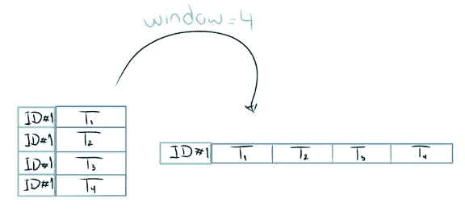

# 我们如何获得第三名并赢得数据科学竞赛

> 原文：<https://towardsdatascience.com/how-we-finished-3rd-and-still-won-a-data-science-competition-bf8a71cf8c38?source=collection_archive---------22----------------------->

## 我们有很多工作要做——甚至在最终分数公布之后。

made with ♥️ by [Luciano Infanti](https://medium.com/u/d42f71e111ed?source=post_page-----bf8a71cf8c38--------------------------------)

Listen to [Unboxing Data Science on **Spotify**](https://open.spotify.com/episode/4YDGO5BQdyofBasNOt6kfu?si=wfqQUrf-T-yVUlmdgwtMhQ)

这是一场新手对决全球资深科学家的对决，所以你可以想象结局。

几个月前，我们只是两个积累数据科学知识并努力专业进入该领域的学生。当时， [Victor](https://www.linkedin.com/in/victor-oliveira-b0634449) 是 IBM Research 的一名数据科学家实习生，而我是埃森哲的一名软件架构分析师。我们的共同目标使我们开始了越来越令人沮丧的竞争搜索，因为它总是归结为获胜纯粹是技术上的，像排行榜探测这样的事情变得司空见惯。

一个月后，我们发现了测试我们纯技术以外技能的机会:T2 EY next wave 数据科学竞赛 T3。它解决了亚特兰大的城市流动性问题，挑战参与者根据地理定位数据预测轨迹是否会在市中心结束。

这一次不同。

这不是另一个只靠硬技能的挑战，因为建立一个得分最高的模型只是成功的一半:一流的科学家必须向 EY 大学最高职位的评委展示他们的方法和研究背景。外部数据的使用、EDA 鲁棒性和面向问题的方法是主要标准。

在这里，我们给**一个战略时间表**，说明如何通过专注于解决潜在的问题，在获胜项目中转变我们的第三名模式。请跟随 GitHub 上的[完整代码，全面了解我们。](https://github.com/jcezarms/ey-nextwave-competition)

# 我们如何分析数据

正如已经指出的那样，我们的工作方法是面向问题的，而不是面向竞争的。严格来说，这意味着我们已经使用以业务为中心的数据科学流程来管理我们的时间，以了解问题、探索数据、提取特征、训练模型和分析结果，从而使我们能够在需要时在真实环境中实施该解决方案，而不仅仅是产生一个事后可能无用的分数。

Our **Data Science Cycle**

第一个重要的步骤是深入理解我们试图解决的问题。在那里，我们在文献中进行了详尽的搜索，以澄清人们通常如何处理这个问题，以及使用了哪些工具。我们完成竞赛和处理数据的时间有限，这使得这一阶段对于定义和缩小我们对可行备选方案的关注非常重要，而不是在我们可投资的时间内花费时间在可能证明无用的技术上。

在开始我们的探索性数据分析阶段时，我们进行了一系列的可视化以了解总体数据分布，同时尝试检查数据生成中的不一致性和问题。**然后我们遇到了一个主要问题:超过一半的数据是零距离轨迹**，即它们的进入和退出位置是相同的。

这给建模带来了一些困难，如果没有广泛的分析，是不可能识别的。最后，我们把它变成了一个优势——在一个人的旅程中，零距离轨迹的计数后来成为一个特征。

A pair of 0-distance routes coupled with normal ones

此外，组织者提供的数据来自**笛卡尔投影**，而不是通常的纬度/经度值。将它们转换成后一种格式对我们的 EDA 和工程过程将是一个很大的优势，尽管我们最初缺乏这方面的知识。幸运的是，通过更深入的分析和研究，我们发现了如何使用 python 中的**墨卡托投影**和`pyproj`库来转换所有值。

Visualization of most common trajectory paths using KMeans and Google Maps API

在探索和讨论了数据的空间复杂性之后，理解它们随时间的分布是至关重要的。像任何例行的人类活动一样，这些事件发生的时间对它们如何发生有着广泛的影响。

有效性是关键。我们分析中的这一点必须满足两个需求:1)断言训练集和测试集分布之间的一致性，以及 2)随着时间的推移提供基本的可视化。两者都显示在下面的柱状图中，但只有后者引发了讨论。

Fundamental visualizations through available time period (0h — 16h)

从图#1 中，我们可以观察到平均行驶距离的第一个局部最大值，发生在午夜(0h)。之后，上升趋势在早上 6 点左右达到全球最大值。根据上面的时间判断，我们得出结论，这些旅行将是上下班的路线——即使是午夜高峰也可能是夜班结束的标志。

虽然第一个可视化是启发性的，但第二个似乎是令人担忧的复杂性。市中心**的人数不断打破最高记录，从早上 6 点到下午 3 点**，我们预测的*目标时段*是下午 3 点到 4 点。

这意味着，正如趋势所示，我们的目标可能包含全球最大值，或者，在一个复杂的转折中，这些数字的第一次重大下降——这是现有数据中尚未看到的模式。我们必须赋予我们的模型更高的深度，以便它们能够准确预测目标。

# 我们如何投资于功能工程

我们最大的工作量是放在这个部门的有效增长上。我们希望通过研究和分析支持的特性来提升排名，所以性能最好的特性应该是我们最了解的。

因为我们的问题是关于轨迹分析，我们必须知道任何一点离中心和轨迹入口/出口有多远。所以在我们的第一轮研究之后，我们选择了对我们来说最有意义的三个距离公式。

Our main distances

哈弗线距离从根本上不同于其他距离-它考虑了表面的球形形式-并要求我们掌握我们在 EDA 上学习的墨卡托投影。

此时，我们已经创建了一组广泛的距离特征，如到中心顶点、到原点和先前条目的距离。进一步的分析让我们明白，并不是我们数据中的所有旅行者都有一个**干净利落的旅程**。通过我们的火车和测试设备，许多人开始从与他们最后一站不同的地方出发。这是后来的一个重要特征，我们称这些间隙为**盲区**。

Blind Distance drawn — the 4th entry here is disconnected from the 3rd exit

然而，直到用哈弗辛公式而不是欧几里得公式计算，这个特征才显得如此重要。看到每个公式的表现如此不同，我们决定*计算每个距离特征* ***三次***——以欧几里德、曼哈顿和哈弗森的形式。

这三者之间有明显的相关性，但它们中的每一个都在我们的最终模型中扮演着特定的角色。我们的策略旨在**通过组合距离公式以及对所有特征执行(`min`、`max`、`std`、…)聚合，最大化可识别模式的数量**。通过这种方式，我们还利用了梯度增强算法(如 LightGBM)的鲁棒性，用于大量可能高度相关的特征。

没有任何距离分析可以单独提供一个关于时空问题的完整观点。清楚地理解时间的作用是至关重要的，我们通过将 EDA 的最大见解与一天中的时间段、不同数量的增量以及小时和分钟的连续表示等特征联系起来来寻求时间的作用。

A continuous representation of time (15h30 = 15.5) and time delta w.r.t origin

现在进一步分析单一路线，应用几何学的中心方面对我们的分类无疑是重要的，特别是分析**角度特征**。对任何过去轨迹的方向有一个数字尺度，最终将我们与一个主要平台区分开。

Trajectory direction & angles to city center’s a) midpoint, b) vertexes.

总结我们的特征工程范围，在比赛的后半段，我们的模型中需要某种内存管理——旅程中的前几个点可以帮助揭示连续性模式。一种模式在这里变得更加清晰，那就是人们住在市中心，但在远离市中心的地方工作，最后还是回家。回忆他们过去的一些旅行肯定会有所帮助。由于 LSTMs 的性能不如 LightGBM，我们继续将数据集转换成序列。

Sequence format for the T4 row of ID #1

像这样，每一行都记录了一个人以前的轨迹。为了避免过度拟合，我们对不同的窗口大小进行了基准测试，以限制在一个序列中保留多少轨迹——达到最终提交的最佳`window = 6`值。

# 从系统性错误中学习

在比赛进行到一半时，我们已经达到了一个主要的平台期，一个多星期以来我们所做的任何尝试都没有超过它(这在一个长达一个月的比赛中是很多的)。

进化停滞让我们采取了一种更成熟的方法，并开始通过执行**残差分析**从我们模型的错误中不断学习。

简而言之，这是一个跟踪和分析两个相反样本的过程:正确预测的数据点和错误的数据点。我们在这里的目标是以每一种合理的方式面对这些组之间的区别，识别我们的错误中最大的模式，并制定任何优化来最小化它们。

多层的解释让我们得出结论，我们的模型对大多数轨迹都是正确的，这些轨迹要么在亚特兰大中心之内，要么在中心之外。最常出错的是那些进出亚特兰大的**。**

Shortest-distance wrong predictions (left) vs correct (right). Purple rectangles are Atlanta’s center area.

人们可以清楚地看到上面的空间稀疏性差异，以及错误预测的数据(左)与城市中心的相互作用有多强。在意识到这是我们预测中的主要失败后，我们开始创建一组重要的特征:

Prominent features born from Residual Analysis

高原被克服了。如果我们没有停止漫无目的地尝试改进，或者没有真正评估我们的弱点，我们可能仍然在与绩效停滞作斗争。

# 超越给定的数据

通常，竞赛通过尽你所能从给定的数据集中榨取分数来让你茁壮成长。Victor 和我反对将 T5 作为主要实践 T6，因为它不能反映现实项目中发生的事情。

现实生活中很少——如果有的话——会给你一个完美的数据集来支持你刚刚想出的很酷的新项目。你通常需要研究、搜集、收集和清理你想要使用的数据。这给你带来了一层通常的竞赛所没有的困难。

然而在这里，他们的指导方针鼓励使用外部数据。我们认为这是一个完全测试我们在数据科学方面的弹性的机会，所以我们立即抓住了这个机会。

Traffic data from Georgia’s federally required traffic monitoring program

搜索并真正找到有用的数据并不容易——在竞争泡沫之外，有一个充满论文和研究的世界，它们使用与你的意图不同的数据，或者不公开发布你想要的数据。在几次阅读中，我们发现了佐治亚州的交通相关研究，它为我们的特征空间中最重要的组之一做出了贡献。

# 验证和培训策略

另一个让这次比赛感觉像一个真实项目的有趣之处是，组织者没有给我们一个可以用来直接预测我们的目标变量的标签。也就是说，由我们决定选择监督(分类、回归)还是非监督学习。

第一个显而易见的选择是应用线性回归预测 x 和 y 的位置，然后推断它是否在市中心内结束。然而，在考虑使用这种策略时，我们遇到了一些警告:我们不会最小化真正的目标，预测两个不同变量的误差度量没有考虑入口点和出口点之间的距离，而是独立地计算 x 和 y。考虑到这些障碍，我们决定应用**二元监督分类**来促进我们的工作。

Sketch of our supervised approach.

接下来，我们需要定义我们的验证方法。根据竞赛规则，所提供数据的 30%被保留为测试集，即组织者将计算分数以确定最终排名的数据。为了创建一致的验证并且不过度适应测试集，我们将剩下的 70%的数据分成训练集和验证集来评估我们的模型结果。为了进行超参数调整，我们仅使用训练数据对`k = 5`使用交叉验证 K-Fold——这样我们可以避免过度拟合我们的验证集。

Validation strategies.

# 还有更多的吗？

是的。这篇文章主要是对我们所做的部分工作的总结，目前最完整的参考文献是[我们的 GitHub repo](https://github.com/jcezarms/ey-nextwave-competition) 。获胜是我们理性的结果，但也是由此而来的算法和分数的结果，因此理解这里的深度需要进一步研究实现了什么。

# 替代方法

没有胜利是完美的象征。在我们看来，成为一名有意识的数据科学家意味着意识到所采取的任何策略的缺点。在这里，我们打算清楚地陈述我们的方法能够实现的最佳模型的几个好步骤。

通过提出利用距离公式组合、特征聚集和序列格式转换来最大化可识别模式，我们还**最大化了我们的特征计数**。LightGBM 已经优化了性能，到比赛结束时，我们将 AWS Sagemaker 设置为用于大多数训练和调优，但人们可以通过应用主成分分析(PCA)等降维策略来更好地花费时间和资源。计算时间和负载是任何迭代过程中最宝贵的资源，更不用说数据科学管道了，所以这种优化是我们首先想到的。

此外，值得注意的是，我们在 EDA 阶段使用了聚类作为指导，但我们在特征提取中没有像我们希望的那样探索它。例如，我们可以使用 DBSCAN 在数据中创建**感兴趣区域(ROI)** ，如下图所示。

Regions of Interest using DBSCAN.

更好的是，我们可以使用这些区域来创建不同的预测位置，并增加可能值的范围，而不是将数据建模为二元分类任务。另一个没有深入研究的方法是使用回归技术直接预测 x 和 y 位置，如下图所示。

Predicting x and y positions directly

然而，所有上述方法也有其缺点。使用聚类技术创建新要素会给数据的时间方面带来一些困难-我们不能使用邻近位置但不同时间的点来查看该点有多少个邻居(或我们可能想要提取的任何其他要素)。预测 x 和 y 位置的表现不如预期，因为我们没有尝试最小化真实到达点和预测到达点之间的距离，而是独立地预测 x 和 y，这对我们的分数产生了负面影响。当然，由于我们在功能工程上花费了大量的时间，我们没有足够的时间用科学的方法来探索替代方法。

# 经验教训

团队中的数据科学项目远不像大学中的小组项目。即使在 Google Colab 中，你仍然不能像在 Google Docs 中那样实时协作——也许你不应该这样做。我们试图这样做，认为如果我们在一个给定的模型中合作，事情会做得更快，但现在我们知道 Jupyter 笔记本是为了用代码讲述一个故事。让两个人同时编辑同一个故事和代码可能会产生许多混乱的结果。

我们最终一起做了一些基本的东西(EDA，特性工程…)，但是在不同的笔记本上，这样我们就可以比较我们个人的，不带偏见的见解。更多的主题(残差分析、聚类…)被并行化。没有永远完美的方法，这种方法对我们有效，因为(另一个教训)我们专注于在第一时间设计我们具体的工作流程**，而不是马上投入工作。**

在整个比赛过程中，我们感到**越来越需要比较和评估我们过去提交的作品**。为此，我们甚至尝试将提交的笔记本副本存放在一个单独的文件夹中。当然，这是不可持续的，因为我们已经提交了 100 多份，到最后只保留了高分的。很少跟踪架构基准(LSTM 对梯度推进对…)，这正是我们需要做得最好的，以决定我们的最终提交和堆叠策略。

具有讽刺意味的是，我们只是在比赛结束后才意识到，但想想看:我们使用了 git、 *one* *这个星球上最广泛的* ***版本控制*** *工具*。其主要目的是启用文件历史导航。我们本可以为每个提交创建 **git 标签，为了更好的组织，遵循一种命名模式，比如`architecture/public score`。创建标签就像做`git tag -a lightgbm/882`一样简单，要检查它的文件，我们只需`git checkout lightgbm/882`——就像处理分支一样。**

组织者保留了提交分数的历史，到最后，他们显示了所有转换为私人的公开分数。但是由于我们没有跟踪每一个提交，我们无法知道给定分数中的架构/变化是什么。0.856 是 LSTM 吗？我们是否在 0.788 中移除了功能聚合？如果我们已经创建了标签，那么这篇文章现在可能已经有了完整的公共和私有分数基准，通过将标签创建的日期与 EY 模型历史中的日期进行匹配，可以很容易地收集到这些分数。

我们很高兴将这个项目作为我们在数据科学领域的第一个大型项目，因为这个竞赛优先考虑了我们的确切价值观:科学在解决问题中的作用，以及**将你的解决方案与其他人**交流，而不仅仅是增加分数。毕竟，复杂问题的解决是一种协作努力，超越了纯技术能力的界限。