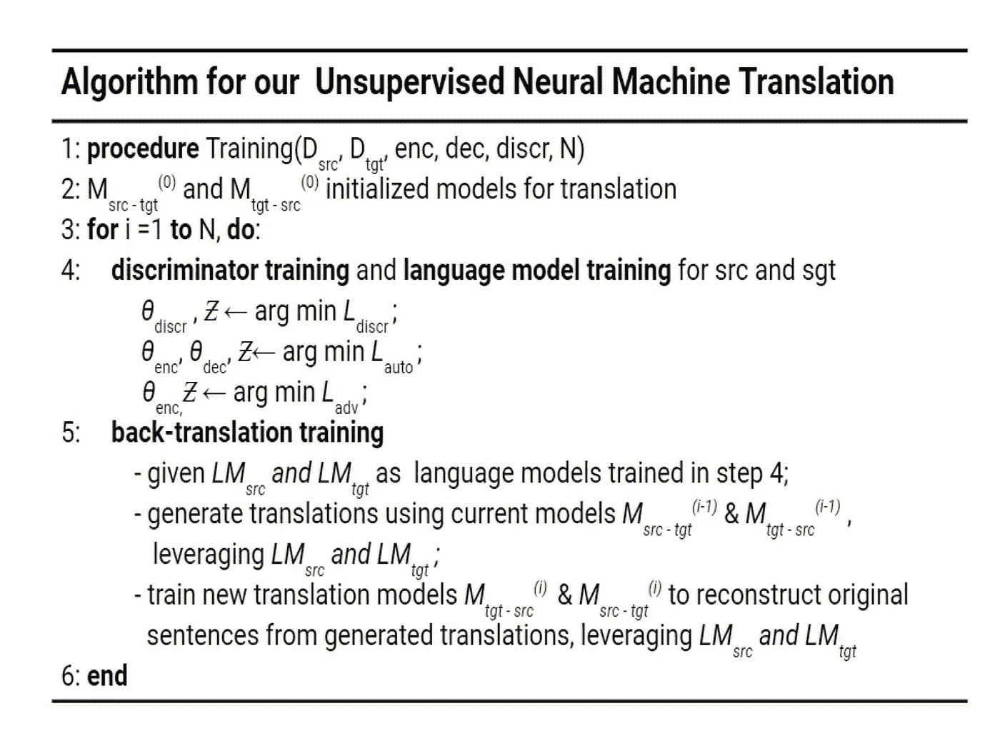
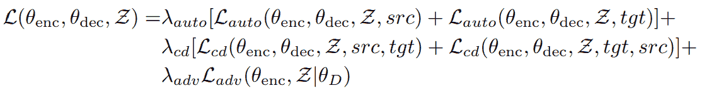
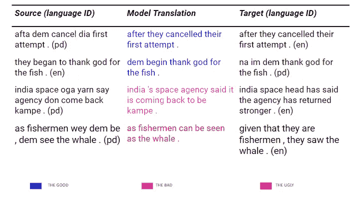

# 我们如何训练一个从西非洋泾浜语到英语的翻译模型，而没有一个平行的句子

> 原文：<https://towardsdatascience.com/how-we-trained-a-translation-model-from-west-african-pidgin-to-english-without-parallel-sentences-e54efa9f8353?source=collection_archive---------13----------------------->

## "每一次交流都是翻译的奇迹."
― **刘宇昆**

source — [https://unsplash.com/photos/I_LgQ8JZFGE](https://unsplash.com/photos/I_LgQ8JZFGE)

**TLDR:** 我们训练了一个模型，它可以将句子从西非洋泾浜语(克里奥尔语)翻译成英语，反之亦然，而不会向它显示一个平行句子(洋泾浜语句子及其英语等价物)来学习。您可以跳到文章末尾的结果部分，查看我们的模型的一些示例翻译和 github 上的代码链接。

## 介绍

翻译是人工智能研究的一个重要领域，最重要的是交流。许多机器翻译工作都集中在流行语言上，如英语、法语、德语、汉语等。然而，关于非洲语言的工作做得很少。

西非和中非有 1000 多种语言，其中 250 多种是尼日利亚语。尽管这些语言之间存在明显的差异，但有一种语言将它们显著地统一起来——洋泾浜英语。仅在尼日利亚就有超过 7500 万人使用这种语言，然而，目前还没有关于这种语言的自然语言处理工作。

这项研究解决的问题如下:

1.  **提供洋泾浜语语料库并训练洋泾浜语词向量**
2.  **洋泾浜语和英语的跨语言嵌入**
3.  **从洋泾浜语到英语的无监督机器翻译**

## **1。获取语料库和训练词向量**

总的来说，我们通过搜集洋泾浜新闻网站获得了一个由 **56048** 个句子和 **32925** 个独特词汇组成的语料库。以下是语料库中的句子示例:

这是我们今年为尼日利亚创作的第一首歌，但是随着他们的发行。

*二世。如果他们在校园内抓到任何有恐惧症的人，他们会说严重的种族歧视*

我们使用 Glove 初始化单词向量，并在语料库上使用 CBOW 模型进行微调，该模型使用 **8** 负样本、 **5** 的窗口大小、 **300** 的维度以及 **5** 时期的 **3000** 的批量大小来训练。

## **2。培训跨语言嵌入**

鉴于缺乏平行数据，我们进行了无监督翻译，这依赖于跨语言嵌入。由 **1097** 个单词对组成的字典被刮擦并被手动编辑用于监督对齐。方法评估在 **108** 对的验证集上进行。

使用 Procrustes 方法执行单词向量的对齐，在该方法中，学习正交权重矩阵以将源单词向量映射到目标单词向量(Conneau 等人，2018 年)，并使用以下检索标准(Joulin 等人，2018 年)。与前者的 0.0853 和基线 0.009(从 108 对的验证集中选择正确的最近邻的概率)相比，后者的方法优于前者，实现了 0.1282 的最近邻准确度。

给定一个单词，下面是对齐后其三个英语最近邻单词及其余弦相似性的一些示例:

*皮金—儿童(0.7461)，婴儿(0.5493)，儿童(0.5357)*

*总统——总统(0.9173)，副总统(0.6589)，总统(0.5875)*

*瓦哈拉——问题(0.7265)，问题(0.6983)，麻烦(0.6906)*

## **3。无人监管的 NMT**

为此，我们使用了带有 10 个注意力头的变压器。有 4 个编码器和 4 个解码器层，其中 3 个编码器和解码器层跨两种语言共享。

为了使解码器工作良好，其输入应该由训练它的编码器产生，或者应该来自与该编码器类似的分布。因此，我们确保编码器将源语言和目标语言的句子编码到相同的潜在空间。这确保了解码器可以翻译，而不管输入源语言。我们通过对抗训练(Lample 等人，2018a)来执行这种实施，其中我们约束编码器将两种语言映射到相同的特征空间。我们通过训练一个鉴别器来对源句子和目标句子的编码进行分类。编码器被训练来欺骗鉴别器，使得源或目标的潜在表示不可区分。

我们还确保相同的潜在空间用于语言建模和翻译，以便语言模型可以很好地转移到翻译任务。

在每个培训步骤中，我们执行以下操作:

1.  旨在预测编码句子的语言的鉴别器训练。
2.  对每种语言上的自动编码器训练进行去噪(这相当于训练语言模型，因为该模型学习用于重构的有用模式，并且变得对有噪声的输入句子免疫)
3.  即时反向翻译，使得用当前翻译模型 M 翻译给定的句子，然后我们尝试在利用上述步骤 2 中训练的语言模型的同时从翻译中重建该句子。

algorithm for our PidginUNMT

因此，我们的最终目标函数是:

objective function

鉴频器损耗以并联方式最小化。

我们在 V100 上训练了 8 个时期(大约 3 天)。为了选择最佳模型，我们对一组测试的平行句子进行了评估。

# 结果

性能最好的模型在 2101 个句子对的测试集上实现了从洋泾浜语到英语的 **7.93** 和从英语到洋泾浜语的 **5.18** 的 BLEU 分数。

下面是我们模型做的一些翻译。

注意:[pd —洋泾浜英语，en —英语]

translations from model

从这些结果中，我们可以看到语言模型有助于执行不一定是逐字翻译，但也是语法正确的翻译，如 translation 2。

代码、经过训练的翻译模型、对齐的洋泾浜词向量和模型的更多翻译可以在项目的 Github 知识库中看到—[https://github.com/keleog/PidginUNMT](https://github.com/keleog/PidginUNMT)

# 结论

已经有一些关于非洲语言的有趣的 NLP 工作，但是与更流行的语言相比，它仅仅触及皮毛。据我们所知，这是第一个在西非洋泾浜上表演的 NLP 作品。我们希望这项工作能刺激对非洲语言更多无人监管的研究的探索。

## 致谢

*   特别感谢我在 [Instadeep](https://www.instadeep.com/) 的同事们，感谢他们在整个项目过程中不断的支持和建设性的反馈。
*   感谢 Naijalingo.com 的[允许抓取他们的网站来创建一个洋泾浜英语词典。](http://naijalingo.com/)
*   感谢 [Deepquest AI](https://deepquestai.com/) 和 [AI 周六的拉各斯](https://aisaturdayslagos.github.io/)的计算支持。
*   测试集从 JW300 数据集[6]中获得，并由 [Masakhane](https://www.masakhane.io/) 组[进行预处理](https://github.com/masakhane-io/masakhane/tree/master/jw300_utils/test)

***参考文献***

1.米克尔·阿尔特塞、戈尔卡·拉巴卡和埃内科·阿吉雷。2017.在(几乎)没有双语数据的情况下学习双语单词嵌入。

2.Alexis Conneau、Guillaume Lample、Marc'Aurelio Ranzato、Ludovic Denoyer 和 Herv Jegou。2018.没有平行数据的单词翻译。在 ICLR

3.纪尧姆·兰普尔、亚历克西斯·康诺、卢多维克·德诺耶和马克·奥雷里奥·兰扎托。2018a。仅使用单语语料库的无监督机器翻译。在 ICLR。

4.纪尧姆·兰普尔、米勒·奥特、亚历克西斯·康诺、卢多维克·德诺耶和马克·奥雷利奥·兰扎托。2018 年 b。基于短语和神经的无监督机器翻译。在 EMNLP。

5.A. Joulin，P. Bojanowski，T. Mikolov，H. Jegou，E. Grave,《翻译中的损失:用检索标准学习双语单词映射》,载于 EMNLP。

6.eljko Agi，Ivan vuli:“jw 300:低资源语言的大范围平行语料库”，载于计算语言学协会第 57 届年会会议录，2019 年。

7.j . tie demann:“OPUS 中的并行数据、工具和接口”载于 2012 年第八届语言资源与评估国际会议论文集。

**更新:**编辑 2019 年 7 月 11 日在更多平行句子上对模型进行最终测试后得出的 BLEU 分数。